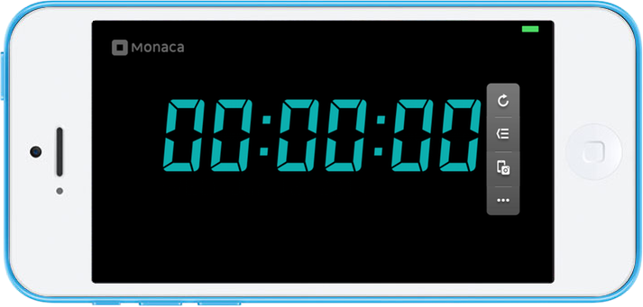
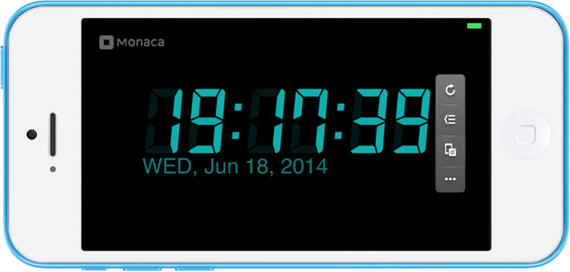

Clock App
=========

<div class="admonition note">

This sample application is reprinting of [Think IT
article](http://thinkit.co.jp/story/2013/03/11/3987) relaesed on
3/11/2013.

</div>

This sample app is a clock app displaying current Date and time.

  *Tested Environment*                                       Android 7.0                    iOS 10.1.1
  ---------------------------------------------------------- ------------------------------ -----------------------------------------------------------------------------------------------------
                                                                                            
  .. raw:: html                                                                             
  &lt;div class="iframe-sample                               s"&gt;                         
  &lt;iframe src="<https://mon>                              aca.github.io/project-templa   tes/21-clock-app/www/index.html" style="max-width: 150%;"&gt;&lt;/iframe&gt;
  &lt;/div&gt;                                                                              
                                                                                            
  File Components                                                                           
  \^\^\^\^\^\^\^\^\^\^\^\^\^\^\^\^\^\^\^\^\^\^\^\^\^\^\^\^                                  
  .. image:: images/clock/1.p                                ng                             
  :width: 200px                                                                             
                                                                                            
  ========================== =                               ============================   ===================================================================================================
  `index.html`                                               The Startup page               
  `js/app.js`                                                The JavaScript file handlin    g implementation in the project
  `css/style.css`                                            The style Sheet for the pro    ject
  `images/*.png`                                             All image files needed to u    se this template

HTML Explanation
----------------

### index.html

The following HTML body of index.html file is for displaying the current
Date and time (see screenshot below):

``` {.sourceCode .html}
<div id="wrapper">
    <div id="container">
        
        
        
        
        
        
        
        
        <div id="date"></div>
    </div>
    
</div>
```

{width="500px"}

JavaScript Explanation
----------------------

### js/app.js

When the application is loaded, the `clock()` function is called every 1
seconds (1000 ms) by this statement:

``` {.sourceCode .javascript}
setInterval(clock, 1000);
```

The `clock()` function is used to display the current date and time.
First, it gets the current time (hour, minute and second) and then
display the images (digit image) according to the time. Next, it gets
the current date (day, month and year) and then display it in the format
as defined in `renderDay()` and `renderMonth()` functions (see below
screenshot). Here is content of the `clock()` function:

``` {.sourceCode .javascript}
function clock() {
    // (3) Obtain "figure" class(image of the number)
    var figures = document.getElementsByClassName('figure');
    // (4) Obtain the "date" ID (Date display area)
    var date = document.getElementById('date');

    // (5) Obtain the current time
    var now = new Date();

    // (6) Set the digits for the hours
    figures[0].src = 'images/figure-' + tendigit(now.getHours()) + '.png';
    figures[1].src = 'images/figure-' + onedigit(now.getHours()) + '.png';

    // (7) Set the digits for the minutes
    figures[2].src = 'images/figure-' + tendigit(now.getMinutes()) + '.png';
    figures[3].src = 'images/figure-' + onedigit(now.getMinutes()) + '.png';

    // (7) Set the digits for the seconds
    figures[4].src = 'images/figure-' + tendigit(now.getSeconds()) + '.png';
    figures[5].src = 'images/figure-' + onedigit(now.getSeconds()) + '.png';

    // (8) Display the date
    date.textContent = renderDay(now.getDay()) + ", " + renderMonth(now.getMonth()) + " " + now.getDate() + ", " + now.getFullYear();
}
```

{width="500px"}
