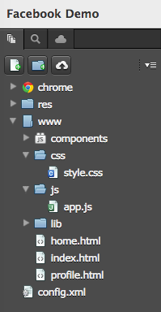
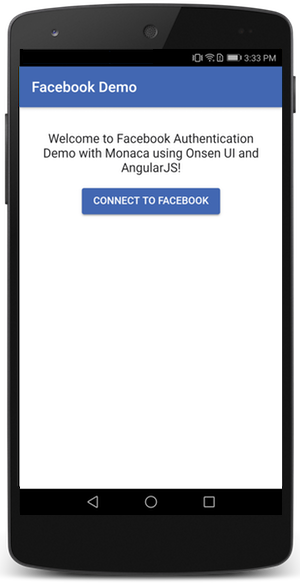
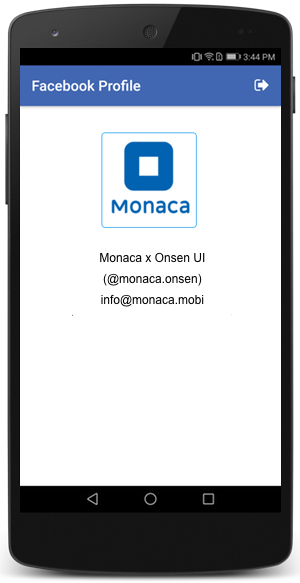
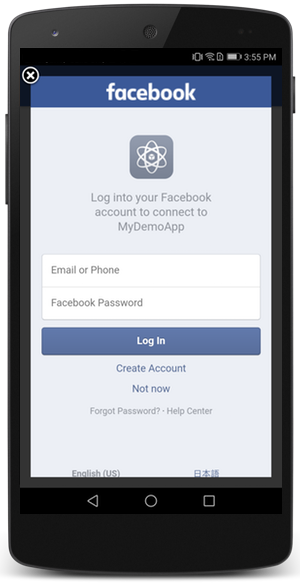
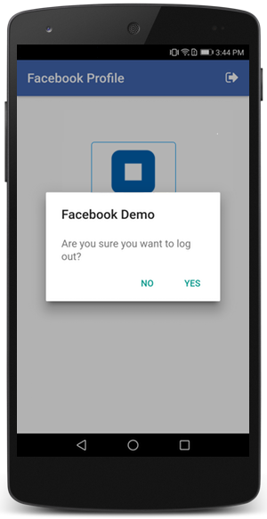

Facebook Single Sign-on App
===========================

In this page, you will learn how to use Facebook's Single Sign-On (SSO)
with Monaca Cloud IDE using Angular 1 and [Onsen UI](https://onsen.io/).
The authentication is done by
[cordova-plugin-facebook4](https://github.com/jeduan/cordova-plugin-facebook4).
This plugin will use the native Facebook app to perform Single Sign On
for the user; otherwise, the sign on will degrade gracefully using the
standard dialog based authentication.

  *Tested Environment*                                       Android 7.0                                      iOS 10.1.1
  ---------------------------------------------------------- ------------------------------------------------ -------------------------------------------------------------------------------------------------------------------------------------------------------------------------------------------------------------------------------------------------------
  .. image:: images/[facebook]()                             sso/cover.png                                    
  :width: 700px                                                                                               
  :align: center                                                                                              
  .. rst-class:: clear                                                                                        
  .. \_pre\_facebook\_sso:                                                                                    
  1\. Prerequisite                                                                                            
  \^\^\^\^\^\^\^\^\^\^\^\^\^\^\^\^\^\^\^\^\^\^\^\^\^\^\^\^                                                    
  `APP_ID` and `APP_NAME`                                    are required by the \`\`cordo                    va-plugin-facebook4\`\` plugin. These two values can be found in the Facebook for Developer console after registering your app. To do so, please proceed as follows:
  1\. Go to \`Facebook for Deve                              lopers &lt;<https://developers.f>                acebook.com/&gt;\`\_ and log in with your Facebook account.
  2\. Go to :menuselection:\`My                              Apps --&gt; Add a New App\`.                     
  .. figure:: images/facebo                                  ok\_sso/add\_new\_app.png                        
  :width: 700px                                                                                               
  :align: left                                                                                                
  .. rst-class:: clear                                                                                        
  3\. Input the necessary info                               rmation of your app and clic                     k Create App ID.
  .. figure:: images/facebo                                  ok\_sso/create\_id.png                           
  :width: 700px                                                                                               
  :align: left                                                                                                
  .. rst-class:: clear                                                                                        
  4\. From the Dashboard, go t                               o Settings and y                                 ou will be able to find the `APP_ID` (App ID) and `APP_NAME` (Display Name).
  5\. Now it's time to add the                               platform(s) of the devices                       which will run your app by clicking + Add Platform button.
  .. figure:: images/facebo                                  ok\_sso/add\_platform.png                        
  :width: 700px                                                                                               
  :align: left                                                                                                
  .. rst-class:: clear                                                                                        
  6\. If your app will run on                                Android, select *Android*.                       
  .. figure:: images/facebo                                  ok\_sso/android.png                              
  :width: 700px                                                                                               
  :align: left                                                                                                
  .. rst-class:: clear                                                                                        
  7\. Fill in the necessary in                               formation as shown below and                     click Save Changes.
  - Google Play Package Nam                                  e: is the Android's Package                      Name you configured in Monaca Cloud IDE for Android App Settings.
  - Key Hashes: is the SHA-1                                 fingerprint of the KeyStore                      you configured in Monaca Cloud IDE for Android KeyStore Settings. Please refer to faq05-020.
  - Enable :guilabel:\`Single                                Sign On\` option.                                
  .. figure:: images/facebo                                  ok\_sso/android\_setting.png                     
  :width: 700px                                                                                               
  :align: left                                                                                                
  .. rst-class:: clear                                                                                        
  8\. If your app will run on                                iOS as well, Click :guilabel                     :+ Add Platform and select *iOS*.
  9\. Fill in the necessary in                               formation as shown below and                     click Save Changes.
  - Bundle ID: is the iOS's                                  App ID you configured in Mo                      naca Cloud IDE for iOS App Settings.
  - Enable :guilabel:\`Single                                Sign On\` option.                                
  .. figure:: images/facebo                                  ok\_sso/ios\_setting.png                         
  :width: 700px                                                                                               
  :align: left                                                                                                
  .. rst-class:: clear                                                                                        
                                                                                                              
  2\. Importing the Project to                               Monaca Cloud IDE                                 
  \^\^\^\^\^\^\^\^\^\^\^\^\^\^\^\^\^\^\^\^\^\^\^\^\^\^\^\^   \^\^\^\^\^\^\^\^\^\^\^\^\^\^\^\^\^\^\^\^\^\^\^   
  .. rst-class:: direct-impor                                t                                                
  \`Import Facebook Single S                                 ign-on App to your Monaca Ac                     count &lt;<https://monaca.mobi/directimport?pid=591abc668034513c335e2ecf>&gt;\`\_
                                                                                                              
  3\. Configuring the Plugin                                                                                  
  \^\^\^\^\^\^\^\^\^\^\^\^\^\^\^\^\^\^\^\^\^\^\^\^\^\^\^\^   \^\^\^\^\^\^\^\^\^\^\^\^\^\^\^\^                 
  The authentication is done                                 by \`cordova-plugin-facebook4                    &lt;<https://github.com/jeduan/cordova-plugin-facebook4>&gt;\`\_. This plugin will use the native Facebook app to perform Single Sign-on for the user; otherwise, the sign on will degrade gracefully using the standard dialog based authentication.
  Before starting to use the                                 plugin, you are required to                      input the `APP_ID` and `APP_NAME` values within the plugin's configuration as follows:
  1\. From Monaca Cloud IDE me                               nu, go to :menuselection:\`Co                    nfig --&gt; Manage Cordova Plugins\`.
  2\. Under the \*Enabled Plugi                              ns\* section, hover over \`\`co                  rdova-plugin-facebook4\`\` and click Configure button.
  .. figure:: images/facebo                                  ok\_sso/plugin\_config.png                       
  :width: 700px                                                                                               
  :align: left                                                                                                
  .. rst-class:: clear                                                                                        
  3\. Input the `APP_ID` and                                 `APP_NAME` values you got                        in the pre\_facebook\_sso section. See the screenshot below as an example:
  .. figure:: images/facebo                                  ok\_sso/plugin\_params.png                       
  :width: 700px                                                                                               
  :align: left                                                                                                
  .. rst-class:: clear                                                                                        
  4\. Click OK to                                            complete the configuration.                      
                                                                                                              
  4\. Application Explanation                                                                                 
  \^\^\^\^\^\^\^\^\^\^\^\^\^\^\^\^\^\^\^\^\^\^\^\^\^\^\^\^   \^\^\^\^\^\^\^\^\^\^\^\^                         
  File Components                                                                                             

{width="199px"}

  ----------------- ---------------------------------------------------------
  `index.html`      The startup Page
  `home.html`       Login Page
  `profile.html`    User profile Page
  `css/style.css`   A stylesheet file for the application
  `js/app.js`       A JavaScript file for implementation of the application
  ----------------- ---------------------------------------------------------

HTML Explanation
----------------

**index.html**

``` {.sourceCode .html}
<!DOCTYPE HTML>
<html>
<head>
<meta charset="utf-8">
<meta name="viewport" content="width=device-width, initial-scale=1, maximum-scale=1, user-scalable=no">
<meta http-equiv="Content-Security-Policy" content="default-src * data:; style-src * 'unsafe-inline'; script-src * 'unsafe-inline' 'unsafe-eval'">
<script src="components/loader.js"></script>
<script src="lib/angular/angular.min.js"></script>
<script src="lib/onsenui/js/onsenui.min.js"></script>
<script src="lib/onsenui/js/angular-onsenui.min.js"></script>
<script src="js/app.js"></script>

<link rel="stylesheet" href="components/loader.css">
<link rel="stylesheet" href="lib/onsenui/css/onsenui.css">
<link rel="stylesheet" href="lib/onsenui/css/onsen-css-components.css">
<link rel="stylesheet" href="css/style.css">
</head>
<body>
  <body >
      <ons-navigator id="myNavigator" page="home.html"></ons-navigator>
  </body>
</body>
</html>
```

This file is the startup page of the application. As you can see within
the `<body>` tag, there is only one [&lt;ons-navigator&gt;
&lt;<https://onsen.io/v2/docs/angular1/ons-navigator.html>&gt;]()
component. It provides page stack management and navigation. The
attribute page is used to identify the first page in the stack.

**home.html**

``` {.sourceCode .html}
<ons-page ng-controller="HomeCtrl">
  <ons-toolbar>
      <div class="center">Facebook Demo</div>
  </ons-toolbar>
  <div class="page">
      <p class="center">
          Welcome to Facebook Authentication Demo with Monaca using Onsen UI and AngularJS!
      </p>
      <ons-button ng-click="Login()">
          Connect to Facebook
      </ons-button>
  </div>
</ons-page>
```

This page is a login page. If there is existing login information found
in the device, it will be automatically redirected to `profile.html`
page.

> {width="300px"}

**profile.html**

``` {.sourceCode .html}
<ons-page ng-controller="ProfileCtrl">
  <ons-toolbar>
      <div class="center">Facebook Profile</div>
      <div class="right">
          <ons-toolbar-button ng-click="Logout()">
              <ons-icon icon="fa-sign-out"></ons-icon>
          </ons-toolbar-button>
      </div>
  </ons-toolbar>
  <div class="page">
      <p class="center">
          
          <p>{{user.name}}</p>
          <p>(@{{user.id}})</p>
          <p>{{user.email}}</p>
      </p>
  </div>
</ons-page>
```

This page is a user's Facebook profile page.

> {width="300px"}

Stylesheet Explanation
----------------------

This file consists of the CSS style for the navigation bar and Facebook
profile image.

``` {.sourceCode .css}
div.page {
 padding: 5%;
 text-align: center;
}

p.center {
  text-align: center;
}

img.profile {
  width: 40%;
  border: solid 1px #1da1f2;
  border-radius: 5px;
}

.navigation-bar {
  background-color: #4267b2;
}

.button {
  background-color: #4267b2;
}
```

JavaScript Explanation
----------------------

``` {.sourceCode .javascript}
ons.bootstrap()
.service('StorageService', function() {
  var setLoginUser = function(user_info) {
      window.localStorage.login_user = JSON.stringify(user_info);
  };

  var getLoginUser = function(){
      return JSON.parse(window.localStorage.login_user || '{}');
  };

  return {
      getLoginUser: getLoginUser,
      setLoginUser: setLoginUser
  };
})

.controller('HomeCtrl', function($scope, StorageService, $http, $q) {
  var CheckLoginStatus = function(){
      window.facebookConnectPlugin.getLoginStatus(
          function(data){
              if(data.authResponse){
                  console.log('Login info is found!');
                  myNavigator.pushPage('profile.html');
              }else{
                  console.log('No login info is found!');
              }
          },
          function(e){
              LoginError(e);
          }
      );
  }

  ons.ready(function() {
      CheckLoginStatus();
  });

  var GetProfileInfo = function (authResponse) {
      var info = $q.defer();

      facebookConnectPlugin.api('/me?fields=email,name&access_token=' + authResponse.accessToken, null,
          function (response) {
              info.resolve(response);
          },
          function (response) {
              info.reject(response);
          }
      );
      return info.promise;
  };

  var LoginSuccess = function(response){
      var authResponse = response.authResponse;

      GetProfileInfo(authResponse).then(function(user) {
          StorageService.setLoginUser({
              name: user.name,
              id: user.id,
              email: user.email,
              profile_url: "http://graph.facebook.com/" + authResponse.userID + "/picture?type=large"
          });
          myNavigator.pushPage('profile.html');
      }, function(error){
          console.log('Error retrieving user profile' + JSON.stringify(error));
      });

  };

  var LoginError = function(error){
      console.log('Login Error: ' + JSON.stringify(error));
      // When "User cancelled dialog" error appears
      if (error.errorCode === "4201"){
          CheckLoginStatus();
      }
  };

  $scope.Login = function(){
      facebookConnectPlugin.login(['email', 'public_profile'], LoginSuccess, LoginError);
  }


})
.controller('ProfileCtrl', function($scope, StorageService, $http, $q) {
  $scope.user = StorageService.getLoginUser();

  var LogoutFromFacebook = function(){
      facebookConnectPlugin.logout(
          function() {
              console.log('Successful logout!');
              myNavigator.pushPage("home.html");
          },
          function(error) {
              console.log('Error logging out: ' + JSON.stringify(error));
          }
      );
  }

  $scope.Logout = function(){
      ons.notification.confirm({
          message: "Are you sure you want to log out?",
          title: 'Facebook Demo',
          buttonLabels: ["Yes", "No"],
          callback: function(idx) {
          switch (idx) {
              case 0:
                  LogoutFromFacebook();
              case 1:
                  break;
              break;
          }
        }
      });
  }
});
```

Inside this file, there is a service, called `StorageService`, to store
the login information of the user using the device's Local Storage.
There are also two controllers such as `HomeCtrl` and `ProfileCtrl`
which are the controllers for `home.html` and `profile.html` pages,
respectively.

`HomeCtrl` controller consists of several functions used within the
`home.html` page. Once, the page is loaded, the `CheckLoginStatus()`
function is triggered to check if there is any existing login
information. If the login information is found, the
`myNavigator.pushPage()` function is called to navigate to
`profile.html` page showing the user's Facebook profile as found in the
login information. When the user clicks on Connect to Facebook button,
the `Login()` function is triggered. In this function, the
`facebookConnectPlugin.login()` function is called to show the native
Facebook authentication dialog. If the login is successful, the login
information will be stored in the device's local storage via
`StorageService.setLoginUser()` function and then the
`myNavigator.pushPage()` function is called to navigate to
`profile.html` page.

<div class="admonition note">

If you have logged in with a Facebook app on your device, the
information of that account will be automatically grabbed and used in
this app. If you want to login with a different account, please go to
your Facebook app and change the account there.

</div>

However, if you do not have a Facebook app on your device or you have
not logged in the existing Facebook app on your device, the following
authentication screen will appear:

{width="300px"}

In the `ProfileCtrl` controller, there are 2 functions: `Logout()` and
`LogoutFromFacebook()`. The `Logout()` function is called when the user
clicks on the Logout icon on the top-right corner of the Profile page.
Inside the `Logout()` function, a confirmation dialog is shown. If the
user selects `Yes`, both `LogoutFromFacebook()` function
`StorageService` service are called to log the user out and remove the
login information from the device's local storage, respectively.

{width="300px"}
