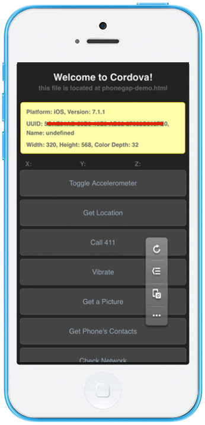
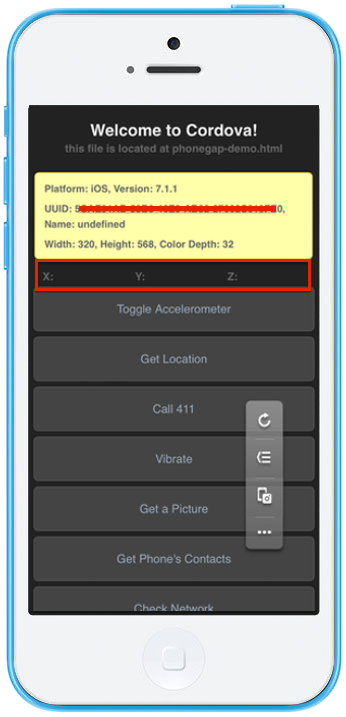
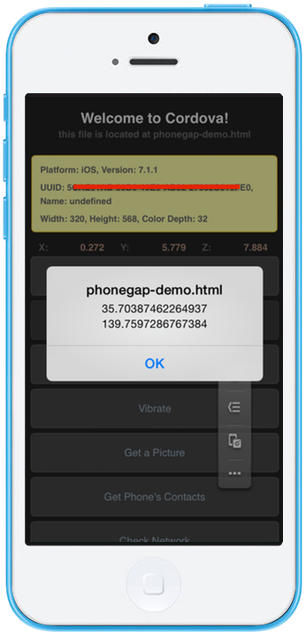
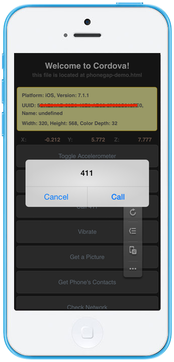
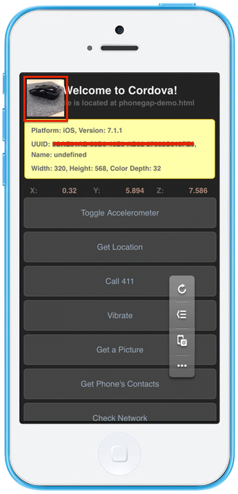
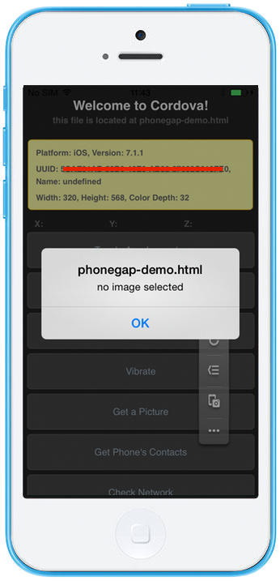
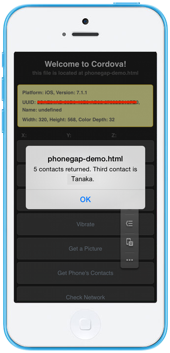
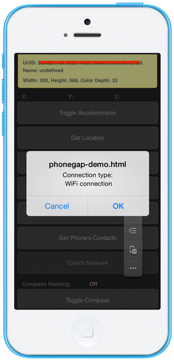
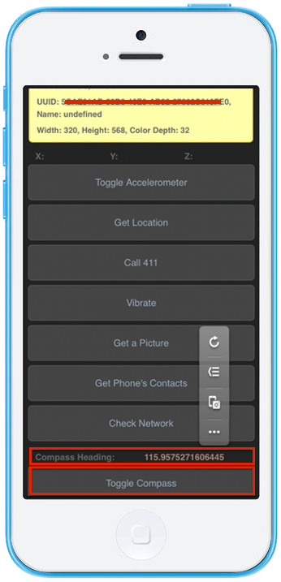
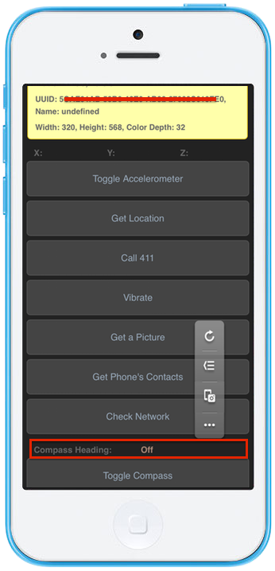

Hello World App
===============

This sample app is a Core Cordova Plugins Demo showing several device
functionalities such as camera, contacts, compass and so on.

  *Tested Environment*                                       Android 7.0                    iOS 10.1.1
  ---------------------------------------------------------- ------------------------------ -----------------------------------------------------------------------------------------------------
                                                                                            
  .. raw:: html                                                                             
  &lt;div class="iframe-sample                               s"&gt;                         
  &lt;iframe src="<https://mon>                              aca.github.io/project-templa   tes/0-helloworld/www/index.html"&gt;&lt;/iframe&gt;
  &lt;/div&gt;                                                                              
                                                                                            
  File Components                                                                           
  \^\^\^\^\^\^\^\^\^\^\^\^\^\^\^\^\^\^\^\^\^\^\^\^\^\^\^\^                                  
                                                                                            
  .. image:: images/hello\_worl                              d/hello\_3.png                 
  :width: 200px                                                                             
                                                                                            
  ============================                               ======================== ===   ===================================================================================================
  `index.html`                                               Th                             e Startup page
  `phonegap-demo.html`                                       T                              he Core Cordova Plugins Demo page
  \`phonegap-demo/master.css                                 \` T                           he style sheet for the Core Cordova Plugins Demo page
  `phonegap-demo/main.js`                                    T                              he JavaScript file handling implementation in the Core Cordova Plugins Demo page
  `css/style.css`                                            T                              he style Sheet for the whole application
  `img/icon/*.png`                                           A                              ll icon files needed to use this template

Required JS/CSS Components
--------------------------

  `jQuery`                                                     
  ------------------------------------------------------------ ------------------
                                                               
  HTML Explanation                                             
  \^\^\^\^\^\^\^\^\^\^\^\^\^\^\^\^\^\^\^\^\^\^\^\^\^\^\^\^\^   \^\^\^\^\^\^\^\^
  index.html                                                   

index.html is the Startup page.

``` {.sourceCode .html}
<body>
    <h1>HelloWorld!</h1>
    <a class="button--large" href="phonegap-demo.html">Start Demo</a>
</body>
```

The above html code inside the `<body>` tag is showing a `HelloWorld!`
phrase and a Start Demo button as shown below.

{width="250px"}

### phonegap-demo.html

phonegap-demo.html shows a Core Cordova Plugins Demo with the basic
phone information and a list of functions as below:

-   *Toggle Accelerometer*: Start or stop the measurement of the phone's
    movement.
-   *Get Location*: Get current location of the phone.
-   *Call 411*: Call `411`.
-   *Vibrate*: Vibrate the phone.
-   *Get a Picture*: Turn on the phone's camera.
-   *Get Phone's Contacts*: Get the total number of contacts in the
    phone and display the third contact name.
-   *Check Network*: Check the current type of network the phone is
    using.
-   *Toggle Compass*: Start or stop the phone compass.

{width="250px"}

The JavaScript code corresponds to these functions will be explained in
the next section.

JavaScript Explanation
----------------------

The main.js is a JavaScript file handling the implementation of the Core
Cordova Plugins Demo page. There are 8 main functions in this file:

### Toggle Accelerometer

Start or stop the measurement of the phone's movement. Below is the
JavaScript code of this function:

``` {.sourceCode .javascript}
...
var accelerationWatch = null;

function updateAcceleration(a) {
  document.getElementById('x').innerHTML = roundNumber(a.x);
  document.getElementById('y').innerHTML = roundNumber(a.y);
  document.getElementById('z').innerHTML = roundNumber(a.z);
}

var toggleAccel = function() {
  if (accelerationWatch !== null) {
    navigator.accelerometer.clearWatch(accelerationWatch);
    updateAcceleration({
        x : "",
        y : "",
        z : ""
    });
    accelerationWatch = null;
  } else {
    var options = {};
    options.frequency = 1000;
    accelerationWatch = navigator.accelerometer.watchAcceleration(
        updateAcceleration, function(ex) {
            alert("accel fail (" + ex.name + ": " + ex.message + ")");
        }, options);
  }
};
...
```

When click on the Toggle Accelerometer button, you can either start or
stop the measurement of the phone's movement. If it is started, the `X`,
`Y` & `Z` values change; otherwise, they will appear as `0`.

{width="250px"}

{width="250px"}

### Get Location

Get current location of the phone. Below is the JavaScript code of this
function:

``` {.sourceCode .javascript}
...
var getLocation = function() {
  var suc = function(p) {
      alert(p.coords.latitude + " " + p.coords.longitude);
  };
  var locFail = function() {
  };
  navigator.geolocation.getCurrentPosition(suc, locFail);
};
...
```

When click on the Get Location button, a message showing the current
location of phone will appear as below:

{width="250px"}

### Call 411

Call `411`. Below is the JavaScript code of this function:

``` {.sourceCode .html}
...
<a href="tel:411" class="btn large">Call 411</a>
...
```

<div class="admonition note">

In order to use the `href="tel:411"`, the following setting is needed in
config.xml file:

``` {.sourceCode .xml}
<allow-intent href="tel:*" />
```

</div>

When click on the Call 411 button, a confirmed message of the call is
appeared.

{width="250px"}

### Vibrate

Vibrate the phone. Below is the JavaScript code of this function:

``` {.sourceCode .javascript}
...
var vibrate = function() {
  navigator.notification.vibrate(0);
};
...
```

When click on the Vibrate button, you will notice that your phone
vibrates.

### Get a Picture

Turn on the phone's camera. Below is the JavaScript code of this
function:

``` {.sourceCode .javascript}
...
function dump_pic(data) {
  var viewport = document.getElementById('viewport');
  console.log(data);
  viewport.style.display = "";
  viewport.style.position = "absolute";
  viewport.style.top = "10px";
  viewport.style.left = "10px";
  document.getElementById("test_img").src = data;
}

function fail(msg) {
  alert(msg);
}

function show_pic() {
  navigator.camera.getPicture(dump_pic, fail, {
    quality : 50
  });
}
...
```

When click on the Get a Picture button, the phone camera is turned on.
If you take a picture and use it, it will be displayed in the page as
shown below otherwise a message will be displayed (see below):

{width="250px"}

{width="250px"}

### Get Phone's Contacts

Get the total number of contacts in the phone and display the third
contact name. Below is the JavaScript code of this function:

``` {.sourceCode .javascript}
...
function contacts_success(contacts) {
  alert(contacts.length
          + ' contacts returned.'
          + (contacts[2] && contacts[2].name ? (' Third contact is ' + contacts[2].name.formatted)
                  : ''));
}

function contacts_failed(msgObject){
  alert("Failed to access contact list:" + JSON.stringify(msgObject));
}

function get_contacts() {
  var obj = new ContactFindOptions();
  obj.filter = "";
  obj.multiple = true;
  navigator.contacts.find(
          [ "displayName", "name" ], contacts_success,
          contacts_failed, obj);
}
...
```

When click on the Get Phone's Contacts button, the total number of
contacts in the phone and the third contact name will be displayed as
follows:

{width="250px"}

### Check Network

Check the current type of network the phone is using. Below is the
JavaScript code of this function:

``` {.sourceCode .javascript}
...
function check_network() {
  var networkState = navigator.network.connection.type;

  var states = {};
  states[Connection.UNKNOWN]  = 'Unknown connection';
  states[Connection.ETHERNET] = 'Ethernet connection';
  states[Connection.WIFI]     = 'WiFi connection';
  states[Connection.CELL_2G]  = 'Cell 2G connection';
  states[Connection.CELL_3G]  = 'Cell 3G connection';
  states[Connection.CELL_4G]  = 'Cell 4G connection';
  states[Connection.NONE]     = 'No network connection';

  confirm('Connection type:\n ' + states[networkState]);
}
...
```

When click on the Check Network button, the current network type
information will be displayed.

{width="250px"}

### Toggle Compass

Start or stop the phone compass. Below is the JavaScript code of this
function:

``` {.sourceCode .javascript}
...
var watchID = null;

function updateHeading(h) {
  document.getElementById('h').innerHTML = h.magneticHeading;
}

function toggleCompass() {
  if (watchID !== null) {
    navigator.compass.clearWatch(watchID);
    watchID = null;
    updateHeading({ magneticHeading : "Off"});
  } else {
    var options = { frequency: 1000 };
    watchID = navigator.compass.watchHeading(updateHeading, function(e) {
      alert('Compass Error: ' + e.code);
    }, options);
  }
}
...
```

When click on the Toggle Compass button, you can either start or stop
the phone compass. If the compass is started, the value of the compass
heading changes; otherwise, it will appear as `off`. For example:

{width="250px"}

{width="250px"}
