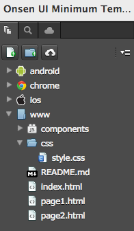
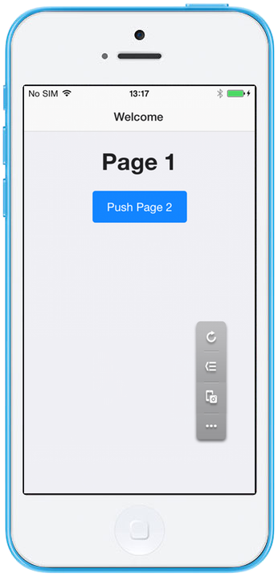
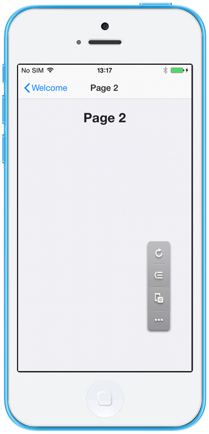

Onsen UI Minimum Template
=========================

This is a minimum template for [Onsen UI](https://onsen.io/)
application.

| *Tested Environments:* Android 4.2.2, iOS 7.1.1

  <iframe src="https://monaca.github.io/project-templates/7-ons-minimum/www/index.html" style="max-width: 150%;"></iframe>

File Components
---------------

{width="200px"}

  ------------------ ----------------------------------
  `index.html`       Home screen (Startup page)
  `page1.html`       Page 1
  `page2.html`       Page 2
  `styles/app.css`   Style sheet file of this project
  ------------------ ----------------------------------

Required JS/CSS Components
--------------------------

  `Onsen UI`                                       
  ------------------------------------------------ --
  HTML Explanation                                 
  \^\^\^\^\^\^\^\^\^\^\^\^\^\^\^\^\^\^\^\^\^\^\^   
  index.html                                       

index.html is the Startup page. It contains the page navigation
`<ons-navigator>` which is a page stack manager and transition animator.
The attribute `page="page1.html"` denotes that page1.html is the first
page of the stack, in other words, it is the first page loaded when the
app start.

Instead of using attibute `page` of `<ons-navigator>`, you can also use
&lt;ons-page&gt; component under &lt;ons-navigator&gt; to define the
first page of the stack. In case of both options are used, the attribute
`page` overwrites the `<ons-page>` component. In other words, the page
from the `page` attribute is the first page of the stack while the
`<ons-page>` component is ignored. For more information please refer to
[Onsen UI
Documentation](http://onsen.io/guide/overview.html#PageNavigation).

### page1.html

page1.html has a line of text (`Page 1`) and a Push Page 2 button. (See
the screenshot below)

{width="250px"}

When the Push Page 2 button is clicked, the Page 2 is shown horizontally
with a Welcome back button on top-left of the page. In other words, the
Page 2 is currently the second page in the page stack. When the Welcome
back button is clicked, it goes back to the previous page which, in this
case, is the Page 1.

### page2.html

page2.html has only a line of text (`Page 2`). (See the screenshot
below)

{width="250px"}
