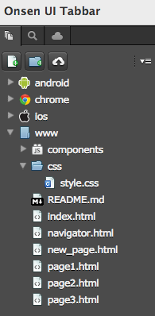
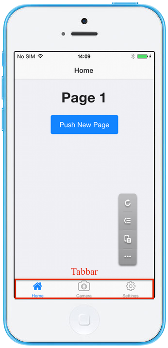
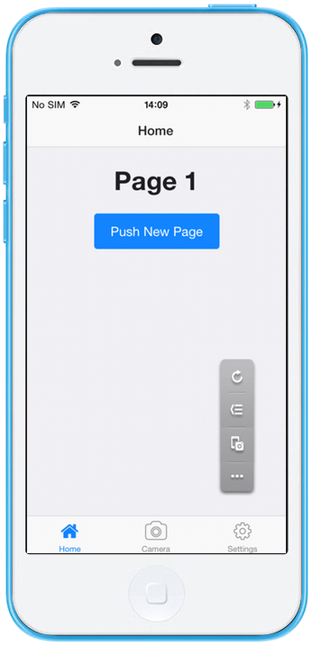
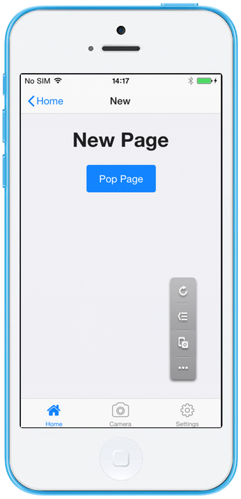
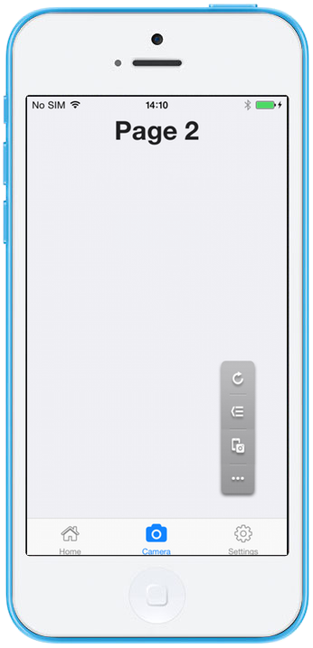
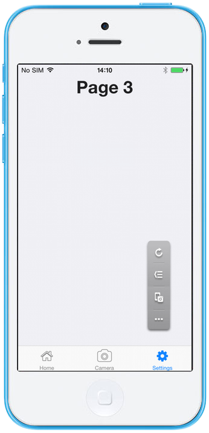

Onsen UI Tabbar Navigation
==========================

This is a template using [Onsen UI
tabbar](https://onsen.io/v2/api/js/ons-tabbar.html) and
[navigator](https://onsen.io/v2/api/js/ons-navigator.html).

| *Tested Environments:* Android 4.2.2, iOS 7.1.1

  <iframe src="https://monaca.github.io/project-templates/9-ons-tab-nav/www/index.html" style="max-width: 150%;"></iframe>

File Components
---------------

{width="200px"}

  ------------------ ----------------------------------
  `index.html`       Startup page (Home page)
  `navigator.html`   Navigator page for Page 1
  `page1.html`       Page 1
  `page2.html`       Page 2
  `page3.html`       Page 3
  `new_page.html`    New page
  `styles/app.css`   Style sheet file of this project
  ------------------ ----------------------------------

Required JS/CSS Components
--------------------------

  `Onsen UI`                                       
  ------------------------------------------------ --
                                                   
  HTML Explanation                                 
  \^\^\^\^\^\^\^\^\^\^\^\^\^\^\^\^\^\^\^\^\^\^\^   
  index.html                                       

index.html is the Startup page. It contains a `<ons-tabbar>` component
which consists of 3 tabs: Home (navigator1.html), Camera (page2.html)
and Settings (page3.html) tabs. (See the screenshot below)

{width="250px"}

### navigator.html

navigator.html stores a navigator element (`<ons-navigator>` tag) which
manages the page navigation backed by page stack, horizontally. As shown
in the navigator.html file, the page1.html is used in a navigator
element. In other words, the Page 1 is the first page in the page stack.

### page1.html

page1.html has a line of text (`Page 1`) and a Push New Page button.
(See the screenshot below)

{width="250px"}

When the Push New Page button is clicked, the New page is shown and
pushed into the page stack. In other words, it's the second page in the
page stack after the page 1.

### new\_page.html

new\_page.html has a line of text (`New Page`) and a Pop Page button.
(See the screenshot below)

{width="250px"}

Either when the Home back button on the top-left corner of the New Page
or the Pop Page button is clicked, it will go back to the previous page
found in the page stack which, in this case, is the Page 1.

### page2.html

page2.html has only a line of text (`Page 2`). (See the screenshot
below)

{width="250px"}

### page3.html

page3.html has only a line of text (`Page 3`). (See the screenshot
below)

{width="250px"}
