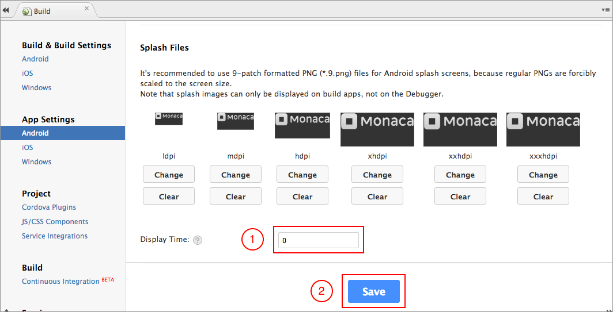
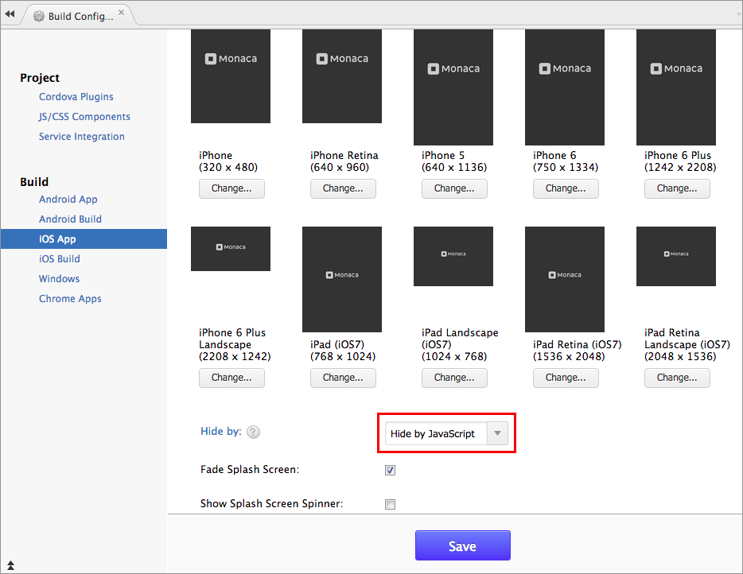

Control the Splash Screen
=========================

Splash screen is displayed while waiting for the index.html page to
load. You can manually hide the splash screen by using JavaScript code
`navigator.splashscreen.hide()` or by setting in Monaca Cloud IDE.

Here are how to hide the splash screen manually in Monaca Cloud IDE:

Settings for Android
--------------------

1.  From Monaca Cloud IDE menu, go to
    Config --&gt; Android App Settings.
2.  Scroll to Splash Files. In order to hide (disable) the splash
    screen, you can set the display time to `0`.
3.  Then, save your settings.

> width
>
> :   600px
>
Settings for iOS
----------------

1.  From Monaca Cloud IDE menu, go to Config --&gt; iOS App Settings.
2.  Scroll to Splash Screen. In order to hide the splash screen, you
    have two options here such as Hide Automatically and Hide by
    JavaScript. If you choose "Hide by JavaScript", you will need to use
    `navigator.splashscreen.hide()` function in your JavaScript file.
3.  Then, save your settings.

> width
>
> :   600px
>

