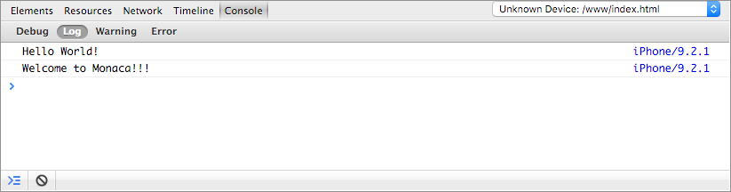

.. _debugging_monaca_app:

=================================================
使用例
=================================================

.. contents:: Table of Contents
   :local:
   :depth: 2

Monaca 提供の各種開発ツール ( Monaca クラウド IDE、Monaca Localkit、Monaca CLI、Monaca for Visual Studio ) と Monaca デバッガーの連携方法に関して、ここでは解説します。

- :ref:`by_debugger_ide`
- :ref:`debugger_with_local_tools`

.. note:: 最初に、端末またはエミュレーター上に、Monaca デバッガーをインストールします。詳細は、:ref:`Monaca デバッガーのインストール方法 <debugger_installation_index>` をご確認ください。

.. _by_debugger_ide:

Monaca クラウド IDE と Monaca デバッガーとの連携 ( Web 経由 )
=================================================

Monaca クラウド IDE および各ブラウザー標準のリモートデバッグ機能を使用した、Monaca アプリのデバッグ方法を紹介します。

- :ref:`debugger_debug_panel`: DOM の解析、Console を使用したデバッグ
- :ref:`by_debugger_usb`: DOM の解析、Console を使用したデバッグ、JavaScript のデバッグ

.. _debugger_debug_panel:

Monaca デバッグパネル
^^^^^^^^^^^^^^^^^^^^^^^^^^^^^^^^^^^^^^^^^^^^^^^^^^^^^^^

Monaca クラウド IDE の デバッグパネルには、Web アプリ向けのデバッグツールとして人気のある `Weinre ( WEb INspector REmote ) <https://people.apache.org/~pmuellr/weinre/docs/latest/>`_ が実装されています。このツールを使用して、Cosole を使用したデバッグと DOM の解析が行えます。

  Monaca クラウド IDE 上の デバッグパネル

.. rst-class:: clear

In order to start debugging your app by using Monaca クラウド IDE と Monaca デバッガーとの連携 ( Web 経由 ), please follow the following instruction:

1. Monaca クラウド IDE 上で、プロジェクトを開きます。

2. Monaca デバッガー上で、プロジェクトを実行します。

3. IDE と端末が接続されていることを確認します。デバッグパネル上に、端末情報が表示されていれば、接続されています ( 下のスクリーンショットを参照のこと )。表示されない場合、IDE またはデバッガーをいったんリフレッシュさせます。IDE と端末の接続後に、アプリのデバッグを IDE 上で行えます。

  .. figure:: images/debug/2.png
      :width: 600px
      :align: left

  .. rst-class:: clear

Console を使用したデバッグ
--------------------------------

Console API と JavaScript を併用して、Console ( コンソール ) 上に、メッセージを出力します。

Console API を、次に記します。

- ``console.log()`` : Console 上にメッセージを出力します。

- ``console.debug()`` : デバッグ用と通常のログを明示的に分けたい場合には、こちらを使用します。メッセージは、Debug タブ 上に表示されます。

- ``console.warn()`` : 黄色の警告マークと共に、メッセージが表示されます。

.. note:: Console API の詳細に関しては、 `Console API references ( Google Developers ) <https://developer.chrome.com/devtools/docs/console-api>`_ をご確認ください。

Console API を使用したサンプルコードを、次に記します。

1. 次のコードをコピーして、``index.html`` ファイルに貼り付けます。

  .. code-block:: html

      <!DOCTYPE HTML>
      <html>
          <head>
              <meta charset="utf-8">
              <meta name="viewport" content="width=device-width, height=device-height, initial-scale=1, maximum-scale=1, user-scalable=no">
              
              <link rel="stylesheet" href="components/loader.css">
              <link rel="stylesheet" href="css/style.css">
              
          </head>
          <body>
              <h1>Hello World!</h1>
          </body>
      </html>

2. ファイルを保存して、Monaca デバッガーと Monaca クラウド IDE を接続します。次に、Monaca クラウド IDE 上で、プロジェクトを実行します ( [ 実機デバッグ ] メニューをクリック )。次に、下の 2 つのスクリーンショットのようなメッセージが、Monaca クラウド IDE のデバッグパネル上および Monaca デバッガーのアプリログ上に、それぞれ表示されていることを確認します。

  .. figure:: images/debug/3.png
      :align: left
      :width: 600px

      Monaca クラウド IDE の デバッグパネル上

  .. figure:: images/debug/6.png
      :align: left
      :width: 250px

      Monaca デバッガーのアプリログ上

  .. rst-class:: clear

3. デバッグパネル上で、次のように、アプリのエラーログも確認できます。

  .. figure:: images/debug/4.png
      :align: left
      :width: 600px

  .. rst-class:: clear

DOM の解析
--------------------------------

DOM ( Document Object Model ) の解析ツールを使用して、次の処理ができます。

- 現在開いているページの DOM 構造が表示されます。
- 現在開いているページの DOM 構造と CSS を修正でき、ページ側にもリアルタイムで反映されます。

詳細に関しては、 `スタイルと DOM の修正 ( 英語サイト ) <https://developer.chrome.com/devtools/docs/dom-and-styles>`_ をご確認ください。

.. figure:: images/debug/5.png
  :align: center
  :width: 600px

  デバッグパネル上での DOM 解析

.. rst-class:: clear

.. _by_debugger_usb:

USB デバッグ
^^^^^^^^^^^^^^^^^^^^^^^^^^^^^^^^^^^^^^^^^^^^^^^^^^^^^^^

USB デバッグを有効化すると、次の操作を行えます。

- Console を使用したデバッグ : Console 上で、メッセージの出力とデバッグセッションを行えます。
- DOM の解析 : DOM の構造の確認と修正を行えます。また、リアルタイムで、更新を反映できます。
- JavaScript のデバッグ : JavaScript パフォーマンスの分析、分析ポイント ( ブレークポイント ) のセット、実行処理の制御を行えます。

USB デバッグ使用時に利用できるデバッグ方法は、次のとおりです。

1. iOS 端末を使用している場合には、:ref:`Safari のリモートデバッグ機能 <usb_debugging_ios>` を利用できます。
2. Android 端末を使用している場合には、:ref:`Chrome のリモートデバッグ機能 <usb_debugging_android>` を利用できます。

.. _usb_debugging_ios:

Safari のリモートデバッグ機能 ( iOS と Mac が対象 )
----------------------------------------------------------------

.. note:: USB デバッグを使用してデバッグをする場合、事前に行う設定がいくつかあります。詳細は、:ref:`pre_debug_app` をご確認ください。

1. USB ケーブルを使用して、iOS 端末と Mac を接続します。

2. カスタムビルド版 Monaca デバッガー上で、Monaca プロジェクトを実行します。

3. Safari を開いて、 :guilabel:`開発` メニューを選択します。表示されるリスト内に、開発者の iOS 端末名が表示されますので、選択します。表示されたサブメニューから、Monaca アプリ内で使用しているページを選択します。

  .. figure:: images/debug/9.png
      :width: 400px
      :align: left

  .. rst-class:: clear

4. Web インスペクタ画面が表示されます。ここでは、総合的にアプリを検証できます ( HTTP リクエストのタイムライン表示、JavaScript のプロファイリング、DOM ツリーの操作など )。Web インスペクタの使用方法に関しては、こちらの `Safari Web インスペクタの使用方法 ( 英語サイト ) <https://developer.apple.com/library/ios/documentation/AppleApplications/Conceptual/Safari_Developer_Guide/Introduction/Introduction.html#//apple_ref/doc/uid/TP40007874>`_ をご確認ください。

  .. figure:: images/debug/10.png
      :width: 700px
      :align: left

  .. rst-class:: clear

.. _usb_debugging_android:

Chrome のリモートデバッグ機能 ( Google Chrome ブラウザーを使用した Android アプリ開発が対象 )
------------------------------------------------------------------------------------------------

.. note:: You are required to do some setups before using USB debugging with Monaca. Please refer to :ref:`pre_debug_app`.

1. USB ケーブルを使用して、Android 端末と PC を接続します。

2. Monaca デバッガー上で、Monoca プロジェクトを実行します。

3. Chrome のアドレスバーに、 ``chrome://inspect/`` と入力します。

4. 「 Devices 」 ページが表示されます。次に、接続した Android 端末が表示されていることを確認して、端末情報の下に表示されている :guilabel:`inspect` をクリックします。

  .. figure:: images/debug/7.png
      :width: 600px
      :align: left

  .. rst-class:: clear

5. Chrome DevTools が起動します。ここまでの手順で、Monaca アプリをデバッグする準備が整いました。Chrome DevTools の使用方法は、`こちら ( 英語サイト ) <https://developer.chrome.com/devtools>`_ をご確認ください。

  .. figure:: images/debug/8.png
      :width: 600px
      :align: left

  .. rst-class:: clear

.. _debugger_with_local_tools:

Monaca 提供のローカル環境用の開発ツールと Monaca デバッガーとの連携
===========================================================

Monaca 提供のローカル環境用の開発ツールには、Monaca CLI、Monaca Localkit、Monaca for Visual Studio があります。

.. _pre_debug_app:

USB デバッグの事前準備
^^^^^^^^^^^^^^^^^^^^^^^^^^^^^^^^^^^^^^^^^^^^^^^^

.. rst-class:: wide-table

  +------------------+---------------------------------------------------------------+-----------------------------------------------------------------+
  |*プラットフォーム*        | iOS                                                           | Android                                                         |
  +------------------+---------------------------------------------------------------+-----------------------------------------------------------------+
  |*Monaca デバッガー* | :ref:`カスタムビルド版 Monaca デバッガーのみ <custom_debugger_ios>`| ストア版またはカスタムビルド版の :ref:`Monaca デバッガー<debugger_on_android>`                            |
  |                  |                                                               | :ref:`Monaca Debugger <debugger_on_android>`                    |
  +------------------+---------------------------------------------------------------+-----------------------------------------------------------------+
  |*ドライバーのインストール*  | For Windows, please install iTunes to install the             | For Windows, you need to check the device manufacturer to find  |
  |                  | driver for iOS devices. For Mac OS X, necessary drivers       | the appropriate driver for the device. For Mac OS X, the system |
  |                  | should be already installed.                                  | will automatically find the device without any installation.    |
  +------------------+---------------------------------------------------------------+-----------------------------------------------------------------+
  |*USB デバッグ の有効化*| iOS 端末上で、[ Web インスペクタ ] を有効化します。                         | Android 端末上で、[ USB デバッグ ( USB debugging ) ] を有効化します。                       |
  |                  |                                                               |                                                                 |
  |                  | 1. :menuselection:`設定 --> Safari` を選択します。                | 1. :menuselection:`設定 --> 端末情報 / タブレット情報` を選択して、ビルド番号を数回タップします。                    |
  |                  | 2. 下にスクロールして、 :guilabel:`詳細` を選択します。               | 2. :guilabel:`開発者向けオプション` を選択します。                        |
  |                  | 3. :guilabel:`Web インスペクタ` を ON にします。                       | 3. Tick :guilabel:`USB デバッグ`.                              |
  +------------------+---------------------------------------------------------------+-----------------------------------------------------------------+
  |*コネクションの信頼*| The connected device should display if you trust the          | The connected device should display if you trust the host       |
  |                  | host computer. Please trust the computer in order to          | computer. Please trust the computer in order to get connected.  |
  |                  | get connected.                                                |                                                                 |
  +------------------+---------------------------------------------------------------+-----------------------------------------------------------------+

Monaca 提供のローカル環境用の開発ツールと USB デバッグ
^^^^^^^^^^^^^^^^^^^^^^^^^^^^^^^^^^^^^^^^^^^^^^^^^^^^^^^^^^^^^^^^^^^^^^^^^^^^^^^^^^^^^^^^^^^^^^^^

デバッグの手順を、次に記します。

1. Monaca デバッガーとホスト PC をペアリングします。ホスト PC とは、Monaca 提供のローカル環境用の開発ツール ( Monaca Localkit、Monaca CLI、Monaca for Visual Studio ) を実行している PC を指します。各開発ツール上でのペアリング方法は、次のリンク先をご確認ください。

  - :ref:`Monaca Localkit 上でのペアリング方法 <localkit_pairing_debugging>`
  - :ref:`Monaca CLI 上でのペアリング方法 <cli_pairing>`
  - :ref:`Monaca for Visual Studio 上でのペアリング方法 <monaca_vs_pairing>`

2. 実行するプロジェクトを選択します。

3. 下のスクリーンショット内で、赤色で示された、デバッガーのメニューをクリックします。

  .. figure:: images/debug/11.png
    :width: 250px
    :align: left

  .. rst-class:: clear

4. [ インスペクタ ] ボタンをクリックして、USB デバッグを開始します。

  .. figure:: images/debug/12.png
    :width: 250px
    :align: left

  .. rst-class:: clear

5. Chrome DevTools または Safari の Web インスペクタがホスト PC 側で起動されているか確認します。起動されていない場合、:ref:`troubleshoot_inspector` をご確認ください。また、併せて、次のリンク先もご確認ください。

  - `Safari の Web インスペクタの使用方法 ( 外部サイト ) <https://developer.apple.com/library/safari/documentation/AppleApplications/Conceptual/Safari_Developer_Guide/Introduction/Introduction.html>`_
  - `Chrome DevTools の使用方法 ( 外部サイト ) <https://developer.chrome.com/devtools>`_

  .. figure:: images/debug/13.png
    :width: 600px
    :align: left

  .. rst-class:: clear

.. seealso::

  *参考ページ*

  - :ref:`monaca_debugger_features`
  - :ref:`debugger_installation_index`
