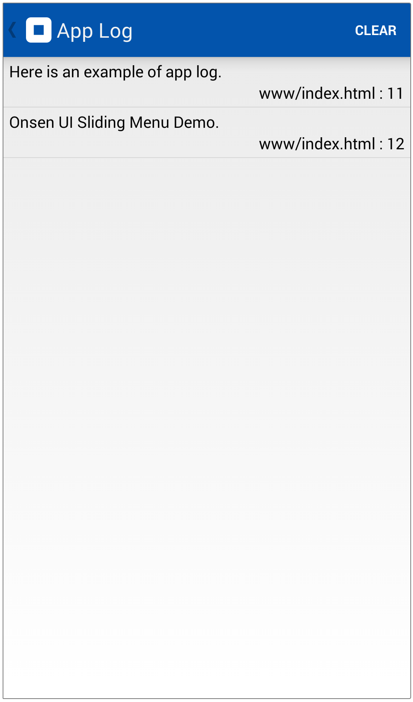
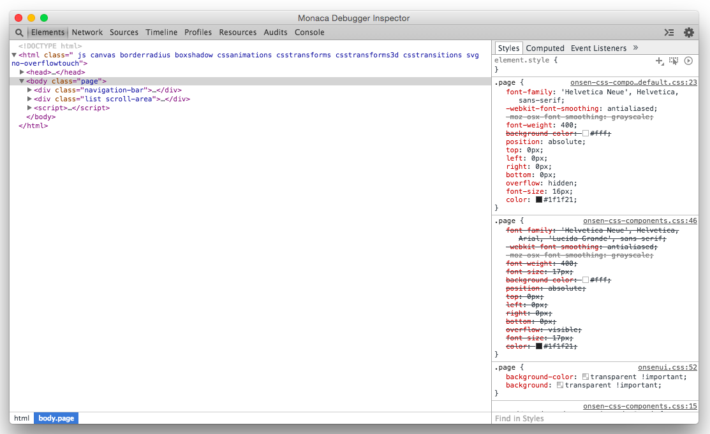
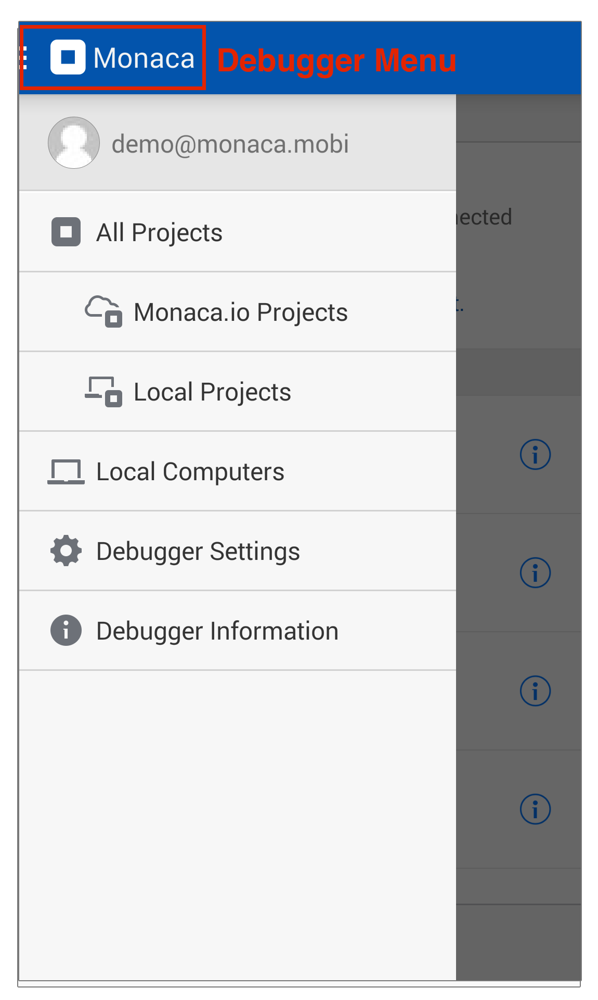
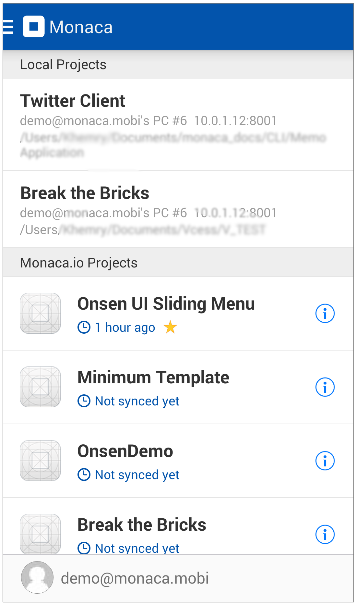
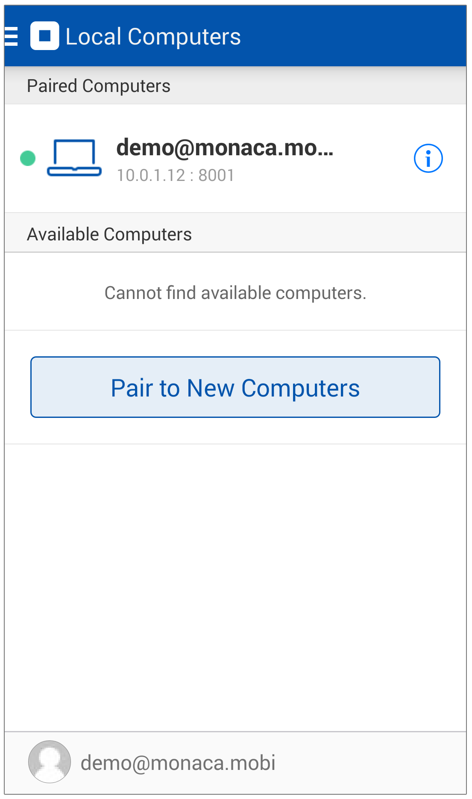
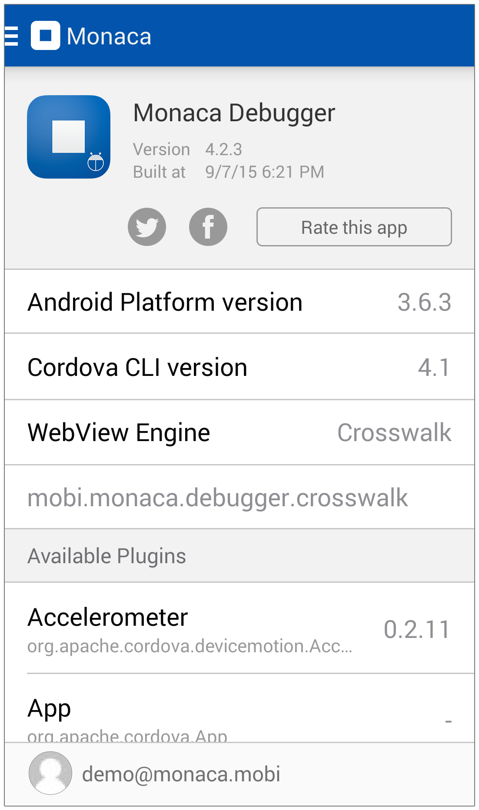

.. _monaca_debugger_features:

================================================
機能の概要
================================================

.. contents:: Table of Contents
   :local:
   :depth: 2

.. _debugger_functions:

デバッガーの機能
==========================

Monaca デバッガーでは、アプリの検証に役立つ、多彩な機能を提供しています。Monaca デバッガー上でプロジェクトを実行すると、画面の右下に [ デバッガーメニュー ] ボタンが表示されます。メニューボタンをクリックすると、次のようなメニュー画面が表示されます。現在使用できる機能は、次のとおりです。

  - 戻るボタン
  - 更新ボタン
  - :ref:`スクリーンショット ボタン <screenshot>`
  - :ref:`アプリログの表示ボタン <app_log>`
  - :ref:`インスぺタの実行ボタン <debugger_on_ios>`

  .. figure:: images/features/1.png
    :width: 250px
    :align: left

  .. figure:: images/features/2.png
    :width: 250px
    :align: left

  .. rst-class:: clear

.. _screenshot:

スクリーンショット機能
^^^^^^^^^^^^^^^^^^^^

Monaca デバッガーを使用することで、スクリーンショットを取得してデバイスのストレージに保存することもできます。 スクリーンショット画面では、次のことができます。

  - 編集 : スクリーンショットのキャプチャー、コメントの手書き入力
  - デバイスのストレージへ保存。

  .. figure:: images/features/4.png
    :width: 250px
    :align: left

  .. rst-class:: clear

.. _app_log:

アプリログ
^^^^^^^^^^^^^^^^^^^^^^^

Monaca デバッガー上で、アプリのログを確認できます。ログには、実行中のアプリのエラーと進行状況が出力されます。

.. rst-class:: clear

.. _debugger_inspector:

インスペクタ機能
^^^^^^^^^^^^^^^^^^^^^^^

インスペクタ機能を使用すると、`Chrome Dev Tools <https://developer.chrome.com/devtools/index>`_ を使用してプロジェクトをデバッグ・検査することができます。 インスペクタ機能を使用する前に、端末のUSBデバッグを有効にする必要があります。 詳細は、:ref:`USB デバッグの事前準備 <pre_debug_app>` をご確認ください。

.. rst-class:: clear

.. note:: :ref:`Monaca Localkit <monaca_cli_index>` または :ref:`Monaca CLI <monaca_cli_index>` の使用時のみ、このインスペクタ機能を利用できます。詳細は、:ref:`Monaca Localkit を使用して、アプリをデバッグする方法 ( USB デバッグの解説箇所 ) <localkit_debug_app>` または :ref:`Monaca CLI を使用して、アプリをデバッグする方法 ( USB デバッグの解説箇所 ) <cli_debug_app>` をご確認ください。

.. _debugger_menu:

デバッガーのメニュー
==========================

.. rst-class:: clear

Inside デバッガーのメニュー, there are:

すべてのプロジェクト
^^^^^^^^^^^^^^^^^^^^^^^^^^^^^^^^^^^^^^^^

Monaca デバッガー上で実行可能な Monaca プロジェクトの一覧を表示します。一覧上のプロジェクトには、2 つのサブカテゴリーがあります。

  * Monaca.io プロジェクト : Monaca クラウド IDE 上で作成されたプロジェクトの一覧を表示します。
  * ローカルプロジェクト : ローカル環境用の開発ツール ( :ref:`Monaca Localkit <monaca_localkit_index>` または :ref:`Monaca CLI <monaca_cli_index>` ) を使用して作成し、ローカルに保存されているプロジェクトの一覧です。なお、Monaca Localkit ( または Monaca CLI ) とデバッガーがペアリングされているときのみ、ローカルプロジェクトの一覧は表示されます。

.. rst-class:: clear

ローカルコンピュータ
^^^^^^^^^^^^^^^^^^^^^^^^^^^^^^^^^^^^^^^^

ペアリング済み、または、利用可能 ( 未接続 ) なコンピューターの一覧を表示します。ペアリング済みのコンピューターとは、Monaca Locakit または Monaca CLI がインストールされ、デバッガーに現在接続されているローカルのコンピューターです。各開発ツールとのペアリング方法は、次のリンクをご確認ください。

    * :ref:`Monaca Localkit と Monaca デバッガーのペアリング方法 <localkit_pairing_debugging>`
    * :ref:`Monaca CLI  と Monaca デバッガーのペアリング方法 <cli_pairing_debugging>`
    * :ref:`Monaca for Visual Studio と Monaca デバッガーのペアリング方法 <monaca_vs_testing_debugging>`

.. rst-class:: clear

デバッガーの設定
^^^^^^^^^^^^^^^^^^^^^^^^^^^^^^^^^^^^^^^^

デバッガー側の各種設定を行えます。設定可能な項目は、[ スリープを許可する ]、[ メモリー使用量表示 ]、[ スプラッシュ表示 ] ( Android のみ )、[ アプリの復帰時にプロジェクトを再実行 ]、[ ネットワーク再接続時にプロジェクトを再実行 ]、[ 同期データを削除する ]、[ Local Storage を削除する ] です。同期データとは、ローカル側と同期を行ったプロジェクトファイルを指します。また、Local Storage とは、端末のメモリー ( LocalStorage ) 上に、プロジェクト側で作成・保存したデータを指します。

  .. figure:: images/features/11.png
      :width: 250px
      :align: center

  .. rst-class:: clear

デバッガーについて
^^^^^^^^^^^^^^^^^^^^^^^^^^^^^^^^^^^^^^^^

デバッガーの詳細情報を表示します。表示する情報は、デバッガーのバージョン番号、プラットフォーム情報、CLI バージョン番号、WebView エンジン ( Android のみ )、利用可能なプラグインの一覧などです。

.. rst-class:: clear

.. _debugger_project_options:

プロジェクトオプション
==========================

Monaca デバッガー上のプロジェクト一覧の [ Monaca.io プロジェクト ] では、各プロジェクトの右側に [ プロジェクトオプション ] アイコンが表示されています。 [ プロジェクトオプション ]  では、次のことができます。

- スター : スター ( 星マーク ) を付けると、「 お気に入り 」 プロジェクトとして、Monaca クラウド IDE 上のプロジェクト一覧の最上位に表示されます。
- 実行する : デバッガー上で、プロジェクトを実行します。
- ネットワークインストール  : Monaca デバッガー経由で、ビルド済みアプリを、端末にインストールします。

  .. figure:: images/features/13.png
     :width: 250px
     :align: left

  .. figure:: images/features/14.png
     :width: 250px
     :align: left

  .. rst-class:: clear

.. note:: ネットワークインストールを行う前に、Monaca クラウド IDE 上で、プロジェクトをビルドして、デバッグビルド版のアプリを作成する必要があります。詳細は、:ref:`iOS 向けアプリのデバッグビルド <types_of_build_ios>` または :ref:`Android 向けアプリのデバッグビルド <types_of_build_android>` をご確認ください。

.. note:: ネットワークインストールは、iOS デバッガーでは、:ref:`カスタムビルド版デバッガー <custom_debugger_ios>` でのみ使用できます。App Store 版のデバッガーでは、ネットワークインストールは使用できません。

.. seealso::

  *参考ページ*

  - :ref:`debugger_installation_index`
  - :ref:`debugging_monaca_app`
