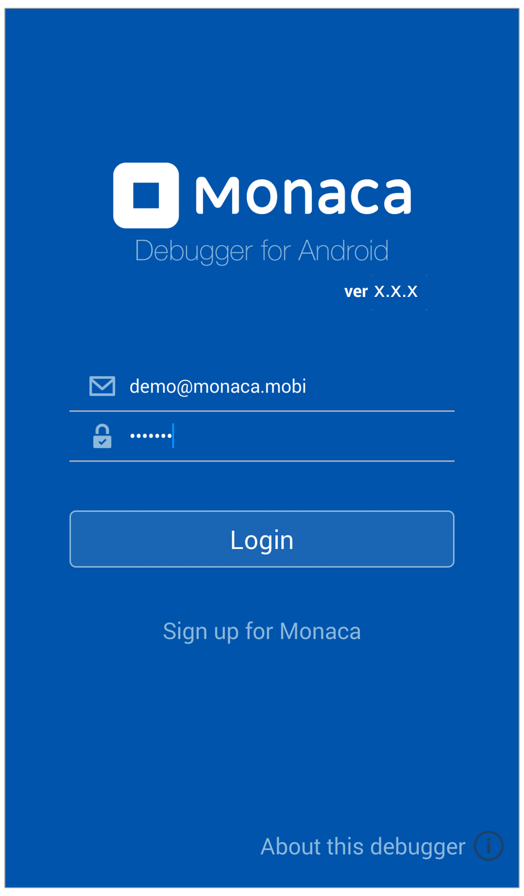
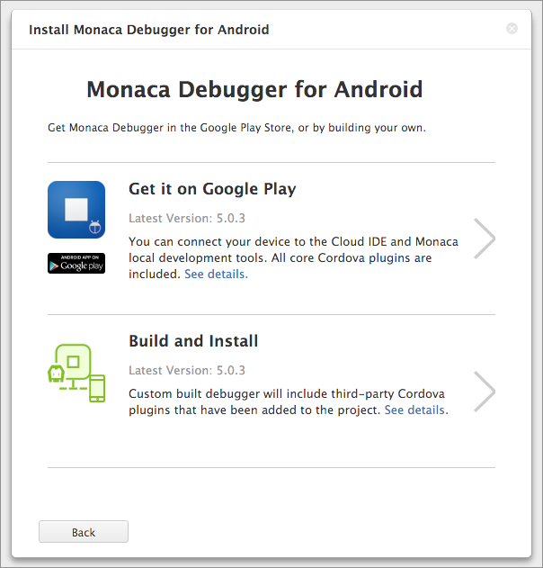
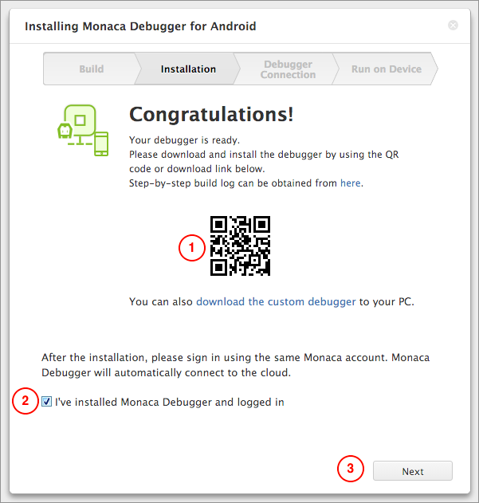
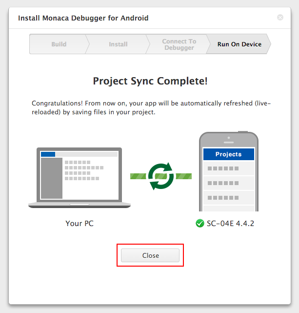

Android 向けの Monaca デバッガー
================================

> height
>
> :   250px
>
> align
>
> :   center
>
> Android 向けの Monaca デバッガー

Monacaバックエンドプラグインは、Monaca
Debugger（ストアバージョン）とカスタム版Monaca
Debuggerの両方ともに含まれていません。

Cordova 5.2 より前のバージョンを実装したプロジェクトを、Monaca
デバッガー 5
系上で実行する場合、不具合が生じることがあります。修復方法を次に記します。

1.  プロジェクトに実装されている
    Cordova のバージョンを更新 &lt;changing\_cordova\_version&gt;
2.  カスタムビルド版 Monaca デバッガー &lt;custom\_debugger\_and&gt;
    を使用 ( 旧バージョンの Cordova に対応するため )

Cordova プラグイン
------------------

Monaca デバッガーには、「 基本 Cordova プラグイン 」 および 「
サードパーティー製 Cordova プラグイン 」
が、あらかじめ実装されています。

基本 Cordova プラグインとは、バッテリー情報の取得 API、カメラ
API、住所録の取得 API、端末情報の取得 API
などを指します。詳細は、cordova\_core\_plugins をご確認ください。

また、DatePicker、BarcodeScanner など、サードパーティー製 ( 第三者提供 )
の Cordova プラグインも、Monaca に実装されています。詳細は、
third\_party\_cordova\_index をご確認ください。.

これ以外の第三者提供 ( 「 外部の Cordova プラグイン 」 )
または自作のプラグイン ( 「
ユーザー Cordova プラグイン &lt;custom\_cordova\_plugin&gt; 」 )
をプロジェクトに追加することもできます。ストア版の Monaca
デバッガーには、これらのプラグインはデフォルトでは実装されていないため、このデバッガー上でアプリをそのまま実行しても、正しく動作しません。そこで、ストア版のデバッガーの代わりに、カスタムビルド版の
Monaca デバッガーを使用します。カスタムビルド版も、ストア版も、どちらも
Monaca デバッガーですが、カスタムビルド版のデバッガーは、Monaca クラウド
IDE 上で 「 ビルド 」 して、端末にインストールします ( Monaca
デバッガーは、アプリです )。詳細は、custom\_debugger\_and
をご確認ください。

USB デバッグ
------------

Android 向けの Monaca デバッガーでは、USB
デバッグをサポートしており、Google Chrome
ブラウザーを使用したリモートデバッグが行えます。リモートデバッグで行える主な処理は、次のとおりです。

-   Console を使用したデバッグ : Console
    を使用して、各種メッセージを出力できます。
-   DOM の解析 : DOM
    の構造の確認と修正を行えます。また、リアルタイムで、更新を反映できます。
-   JavaScript のデバッグ : JavaScript
    パフォーマンスのプロファイリング、分析ポイント ( ブレークポイント )
    のセット、実行処理の制御を行います。

詳細は、Android 向けアプリのデバッグ方法 ( Monaca デバッガーと USB デバッグを使用 ) &lt;usb\_debugging\_android&gt;
をご確認ください。

Localkit のインスぺクタ機能
---------------------------

Windows と Mac OS の両方で、このインスペクタ機能を使用できます。

WebView
-------

Android 向けのデバッガーには、Stock と Crosswalk の両方の WebView
エンジンが実装されています。アプリ側で使用する WebView
の種類により、自動で、WebView が切り替わります。

ネットワーク インストール
-------------------------

Android 向けの Monaca
デバッガーでは、デバッガー経由で、ビルド済みのアプリ (
デバッグビルド版のみ ) を端末にインストールできます。詳細は、
ネットワーク インストール ( \[ インスト \] の解説  ) &lt;debugger\_project\_options&gt;
機能を、ご確認ください。

カスタムビルド版 Monaca デバッガーのビルドとインストール
--------------------------------------------------------

1.  Monaca クラウド IDE メニューから、
    デバッグ --&gt; デバッガーの説明とインストール を選択します。
2.  Android 向けデバッガーインストール --&gt; ビルドしてインストール
    を選択します。

> 
>
> > width
> >
> > :   400px
> >
> > align
> >
> > :   left
> >
3.  ビルドが完了するまで、数分かかる場合がありますので、しばらく待ちます。ビルドが完了すると、次の画面が表示されます。ビルドしたアプリは、QR
    コードを使用して、端末にインストールするか、または、ファイルを PC
    へダウンロードすることができます。

> 
>
> > width
> >
> > :   400px
> >
> > align
> >
> > :   left
> >
4.  デバッガーを端末へインストールした後、Monaca
    アカウントを使用して、デバッガーにログインします。次に、IDE
    の画面に戻り、Monaca デバッガーをインストールして、ログインしました。
    にチェックを入れ、次へ をクリックします。
5.  Monaca クラウド IDE
    とデバッガー間が接続されます。接続後、実機デバッグ
    をクリックすると、デバッガー上でアプリが同期・実行されます。

> 
>
> > width
> >
> > :   400px
> >
> > align
> >
> > :   left
> >
6.  デバッガー上でアプリが実行されていることを確認します。この状態で、アプリの検証を行えます。また、IDE
    に一度戻り、アプリを修正・保存してみましょう。修正箇所は、保存後、直ちにデバッガー側にも反映されます。

> 
>
> > width
> >
> > :   400px
> >
> > align
> >
> > :   left
> >

