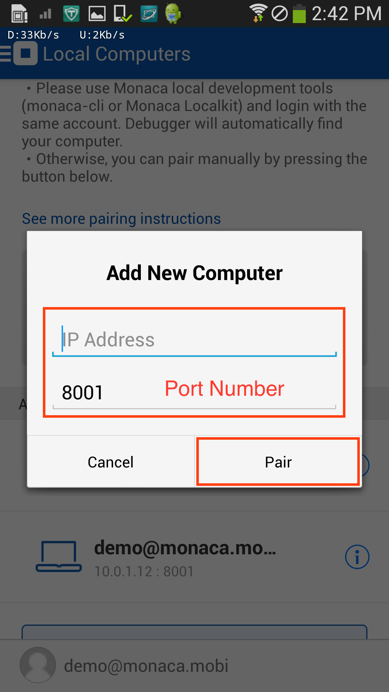
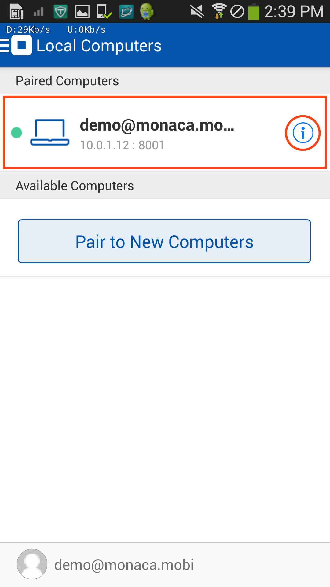

デバッガーのトラブルシューティング ガイド
=========================================

Monaca デバッガーとのペアリングが失敗する場合
---------------------------------------------

Monaca デバッガーと ホスト PC
のペアリングが失敗する場合、いくつかの理由が考えられます。

1.  Monaca デバッガー側は、ホスト PC
    を認識しているが、ペアリングが失敗する場合 : 多くの場合、ホスト PC
    側のファイアーウォールに起因します。なお、ホスト PC
    とデバッガー間の通信には、TCP
    接続を使用します。ポート番号は、\`8001\`
    です。待ち受けポートの変更方法に関しては、
    設定ダイアログ &lt;localkit\_preference&gt;
    をご確認ください。ポート番号またはファイアーウォール設定の変更後は、再度、ペアリングをする必要があります。
2.  Monaca デバッガーが ホスト PC を認識していない場合 : ホスト PC
    と端末が、同じネットワークに接続されているか確認します。同じネットワークに接続されているが、Monaca
    デバッガー側で、ホスト PC
    を検知できない場合には、次のように、手動でペアリングをします。

Monaca デバッガーと ホスト PC
を、次の手順に従い、手動でペアリングします。

1.  Monaca
    デバッガー画面の左上端に表示された切り替えメニューをタップして、次に、
    ローカルコンピュータ ボタンをタップします。

> 
>
> > width
> >
> > :   250px
> >
> > align
> >
> > :   left
> >
2.  コンピュータを手動で追加する ボタンをタップします。
3.  ホスト PC の IP アドレスとポート番号 &lt;ip\_port&gt; を入力して、
    ペアリング ボタンをタップします。

> 
>
> > width
> >
> > :   250px
> >
> > align
> >
> > :   left
> >
4.  ペアリング後、\[ ペアリング済み \] タブ下に、次のように、ホスト PC
    が表示されます。

> 
>
> > width
> >
> > :   250px
> >
> > align
> >
> > :   left
> >

公共の Wi-Fi
アクセスポイントでは、まれに、クライアント同士の接続を禁止しています。この場合、別のネットワーク環境を使用してください。

*IP アドレス と ポート番号*

Monaca デバッガーと ホスト PC を接続する場合、IP
アドレスとポート番号が必要です。IP アドレスは、ホスト PC
の識別に使用するもので、ポート番号 ( デフォルトでは、8001 ) は、Monaca
提供のローカル環境用の開発ツール ( Monaca CLI、Monaca Localkit、Monaca
for Visual Studio など )
側が通信に使用するものです。また、ポートは、未使用であること (
競合していないこと
)、開放されていることが必要です。これ以外の場合、通信は確立できません。

種類の異なる、Monaca 提供の開発ツールを、１台の PC
上で、複数起動させる場合、デフォルトのままでは、ポート番号が競合します。競合を避けるため、各ツールが使用するポート番号を適宜変更してください。

+---------+----------------------------------+-------------------------+
| *OS*    | Mac OS                           | > | Windows             |
+---------+----------------------------------+-------------------------+
| *IP     | | IP アドレスの確認方法          | > | IP                  |
| アドレス* |                                | >   アドレスの確認方法  |
|         | > 1.  ターミナルを開きます。 |   |                         |
|         | > 2.  `ifconfig`                 | 1.                      |
|         | >     と入力して、実行します。   |                         |
|         |                                  |     コマンドプロンプトを開きます。 |
|         |                                  |                         |
|         |                                  |                         |
|         |                                  |     :   | 2. `ipconfig` |
|         |                                  |           と入力して、実行します。 |
+---------+----------------------------------+-------------------------+
| *ポート番号* | ポート状態の確認方法 |      | 方法                    |
|         | ポート状態の確認                 |                         |
| |       |                                  | 1.                      |
|         | > 1.  ターミナルを開きます。 |   |                         |
|         | > 2.  `lsof -i :PORT_NUMBER`     |     コマンドプロンプトを開きます。 |
|         | >     と入力して、実行します。   |                         |
|         |                                  |                         |
|         |                                  |     :   | 2. `netstat`  |
|         |                                  |           と入力して、実行します。 |
+---------+----------------------------------+-------------------------+

インスペクタが起動しない場合
----------------------------

インスペクタが開かない場合は、次の点を確認します。

-   こちらの 手順 &lt;localkit\_debug\_app&gt;
    を参考にして、行っていない箇所がないか、再確認します。
-   デバッガー上でアプリが実行されているか確認します。
-   ケーブルを抜き差しして、コンピューターが端末を正しく認識するか確認します。
-   端末と ホスト PC 間が、USB ケーブルで接続されているか確認します。
-   指定された &lt;localkit\_debug\_app&gt; Monaca
    デバッガーを使用しているか確認します。
-   `adb` プロセスを終了 ( kill ) させます。複数の `adb`
    プロセスが実行されている場合、すべてを終了させます。
-   `iosWebKitDebugProxy` プロセスを終了 ( kill ) させます。複数の
    `iosWebKitDebugProxy`
    プロセスが実行されている場合、すべてを終了させます。
-   ホスト PC 側を再起動します。

