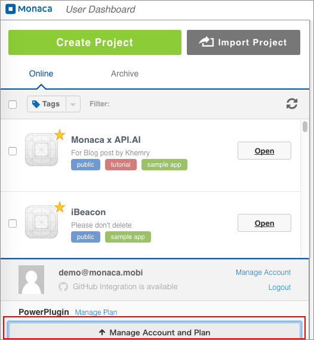
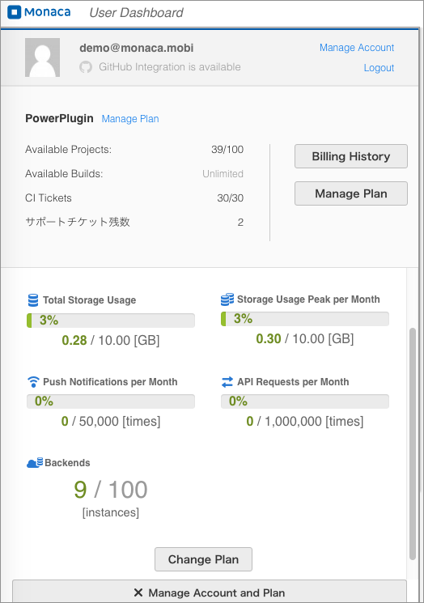

使用方法
========

Monaca を使用した、携帯端末向けアプリの開発手順を教えてください。
-----------------------------------------------------------------

どの開発工程からでも、また、どの開発環境でも、Monaca
を導入できるように、次の 4 つの開発ツールを提供しています。

-   monaca\_ide\_index
-   monaca\_localkit\_index
-   monaca\_cli\_index
-   monaca\_vs\_index

これらのツールを使用すれば、お好みのプラットフォーム上で、アプリ開発を進められます。次に、Monaca
を使用した開発手順の大まかな流れを記します。

-   [こちら](https://monaca.mobi/ja/register/start) から Monaca
    に登録します。
-   HTML5/CSS3/JavaScript でコードを記述します。
-   Monaca デバッガーを必要に応じて使用し、アプリの動作確認を行います。
-   対象のプラットフォーム向けのビルド設定を行い、アプリをビルドします。
-   ビルドされたアプリパッケージ （ .app または .apk ）
    をダウンロードし、端末にインストールします。

ビルドしたアプリを、iPhone または iPad にインストールする場合には、iOS
Developer Program に登録する必要があります。詳細、building\_for\_ios
をご確認ください。

プロジェクトのテンプレートを自作できますか？
--------------------------------------------

プロジェクトのテンプレート自作機能は提供していません。

Monaca クラウド IDE のコードエディター上で、カーソルがズレて表示されます。
--------------------------------------------------------------------------

ブラウザーの表示倍率が原因で、Monaca クラウド IDE
のコードエディターが正しく表示されていない可能性があります。ブラウザー上の表示倍率をデフォルトに戻して、Monaca
クラウド IDE をご利用ください ( ブラウザーの種別に関わらず、\[ Ctrl+0 \]
キーをタイプすれば、ほとんどの場合、標準倍率に戻ります )。

プログラムの書き方が分かりません。
----------------------------------

Monaca
を使用したアプリ開発の詳細を記した、チュートリアル、開発ガイド、サンプルアプリなどを豊富にご用意しています。具体的なコーディング方法、解説なども、併せて記述していますので、是非、ご確認ください
( 参考リンク : third\_party\_cordova\_index 、 ../sampleapp/index )。

サーバーを必要とするアプリを開発する場合、サーバーは自前で用意する方がいいですか？
----------------------------------------------------------------------------------

Monaca
を使用して、アプリを開発する場合、サーバーを自前で用意する必要はありません。バックエンドサービスなど、必要なサーバー機能は、Monaca
側で提供しています。詳細は、monaca\_backend\_index をご確認ください。

チームで開発を行う場合、どんなサポートを Monaca では提供していますか？
----------------------------------------------------------------------

Monaca クラウド IDE のチーム管理機能を使用して、Monaca
に登録されたメンバー間で、プロジェクトを共有できます。詳細に関しては、
team\_tab をご確認ください。

なお、ご契約されているプランにより、使用できる機能が異なります。

企業向けプランの場合は、チームでの開発時に、次の機能をご利用いただけます。

1.  チームの管理 :
    共有プロジェクトへ、メンバーを招待できます。また、共有プロジェクトから、メンバーを削除できます。
2.  複数の開発者と、ソースコードを共有できます (
    開発者には、権限として、「 開発者 」 が割り当てられていること
    )。以下に、共有時のシナリオを、ご参考までに紹介いたします。

> -   1 つ目の共有シナリオとして、Monaca に実装されている 「 共有 」
>     機能を使用した、プロジェクトの 「 共有 」
>     があります。この機能では、複数の開発者が、IDE
>     上で、同じプロジェクトを編集できます。編集内容が競合 ( conflict )
>     する場合には、前のバージョンが上書きされます ( 上書き後も、「
>     過去のバージョンを見る 」 機能で、ファイルの更新履歴を確認できます
>     )。
> -   2 つ目の共有シナリオとして、Monaca for Visual Studios を使用した
>     「 共有 」 があります。この場合、VS に実装されている 「 チーム
>     エクスプローラー 」
>     機能を使用して、ファイルを管理します。Git、TFS、Visual Studio
>     Online
>     など、サポートされているバージョン管理システムであれば併用できます。

3.  テスターによる検証 : Monaca に実装されている 「 共有 」
    機能では、プロジェクトにメンバーをテスターとして招待して ( 「
    テスター 」 権限の割り当て )、共に、検証を行えます。

However, if your usage plan is Basic or Personal, you can only join a
team as a Tester. For more information of the usage plan and its
limitation, please refer to [Monaca 使用方法
Plan](https://monaca.io/pricing.html).

開発に使用する資産などに関して、Monaca では、どのようにセキュリティー管理を行っていますか？
-------------------------------------------------------------------------------------------

特別なご要望がない限り、各ユーザーのリソースは、同一サーバー上で、アカウント別に保管されています。有料とはなりますが、リソースの保存場所の新規設置、アクセスできる
IP
アドレスの制限など、ご要望に応じて、セキュリティー強化を別途行うこともできます。詳細につきましては、
[こちら](https://ja.monaca.io/support/inquiry.html)
からお問い合わせください。

Monaca クラウド IDE 上で使える、キーボードのショートカットまたはキーバインドはありますか？
------------------------------------------------------------------------------------------

Monaca クラウド IDE で利用できるショートカットに関しては、
editor\_shortcuts をご確認ください。また、 *vim*
のようなキーバインドも、Monaca では使用できます。\[ ファイル \]
メニューの \[ エディター環境設定... \] で、キーバンド設定を行えます。

スプラッシュ画像を変更するには、どうしたらいいですか？
------------------------------------------------------

スプラッシュ画像の変更は、 config\_ios\_app\_monaca ( iOS の場合 )
または config\_android\_app ( Android の場合 ) の \[ スプラッシュ画像 \]
設定項目から、行うことができます。

ストレート使用量やバックエンド、APIリクエスト数、プッシュ通知利用数はどこで確認できますか？
-------------------------------------------------------------------------------------------

1.  Monaca にログインして、
    [ダッシュボード](https://monaca.mobi/ja/dashboard) を表示します。
2.  「アカウント・プラン詳細を見る」をクリック

> {width="500px"}

3.  下のように表示されます。

> {width="500px"}

Monaca Debugger にスプラッシュ画面が表示されません。
----------------------------------------------------

スプラッシュ画面につきましては、ビルドアプリでのみ正しく表示されます。
Monaca デバッガーでは正しく表示されない場合があります。
スプラッシュ画面につきましては、ビルドアプリで確認してください。

スプラッシュ画面に GIF 画像を使用できますか？
---------------------------------------------

現時点では、Monacaで対応しているスプラッシュ画像は、 PNG
ファイルのみになります。

Monaca Localkit のプロジェクト一覧が、正しく表示されません。
------------------------------------------------------------

Monaca Localkit
のプロジェクト一覧が正しく表示されない場合は、下記の手順で Monaca
Localkit のリセットをお試しください。

1.  Monaca Localkit をアンインストールします。
2.  ユーザーのホームディレクトリを開きます。例：

> -   Windows: C:¥Users¥user home directory
> -   Mac: /Users/user home directory

3.  .cordova フォルダー内の `localkit.db`
    ファイルの名前を変更します。(例: `localkit.db_bak`)
4.  PCを再起動します。
5.  Monaca Localkit 最新版をインストールします。
6.  Monaca Localkitを起動します。この時、新しい `localkit.db`
    が作成されます。

Monaca Localkit をリセットした場合、Monaca Localkit
にインポートされていたプロジェクトリストは、クリアされます。
そのため、プロジェクトを再度インポートする必要があります。

ストレージ使用情報が更新されません。
------------------------------------

Usually, it will take up to 24 hours for the storage usage information
to be updated.
