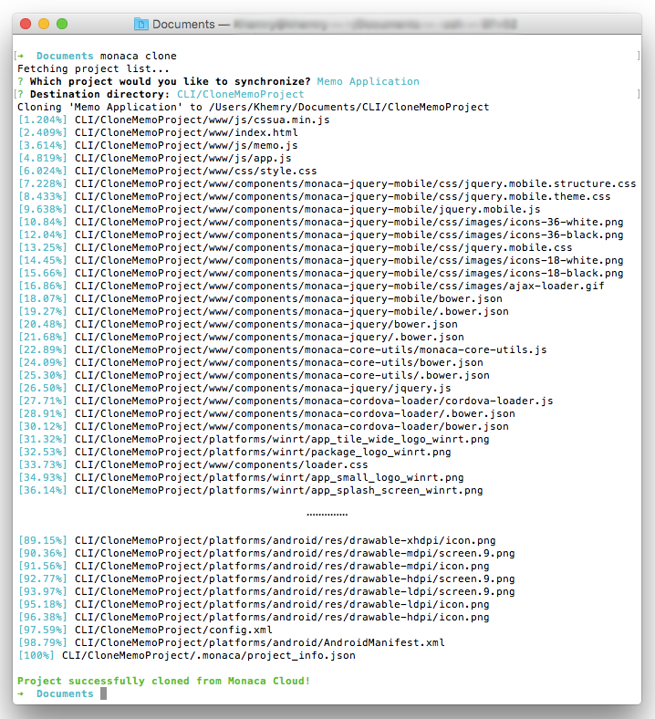
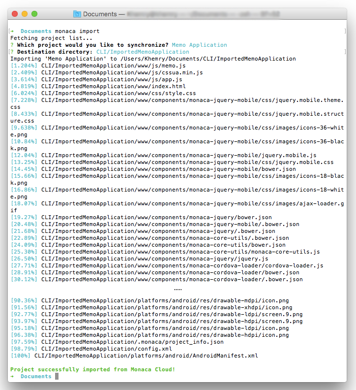
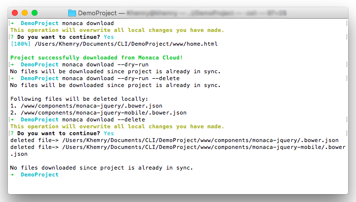
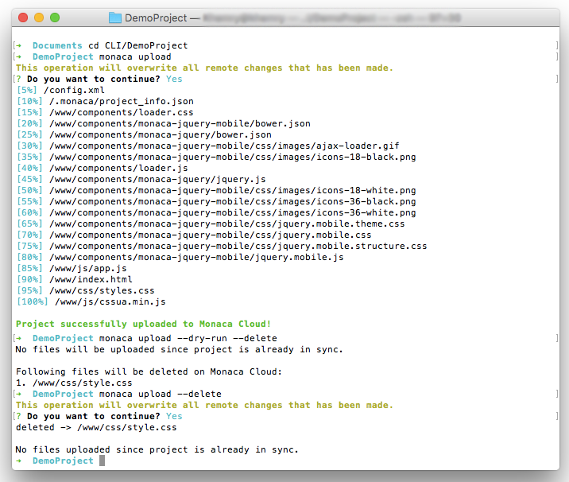
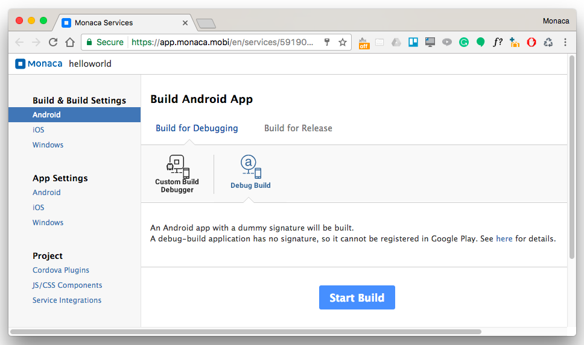
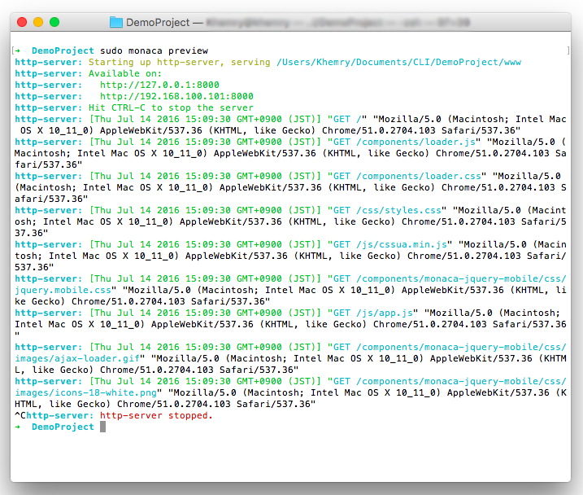
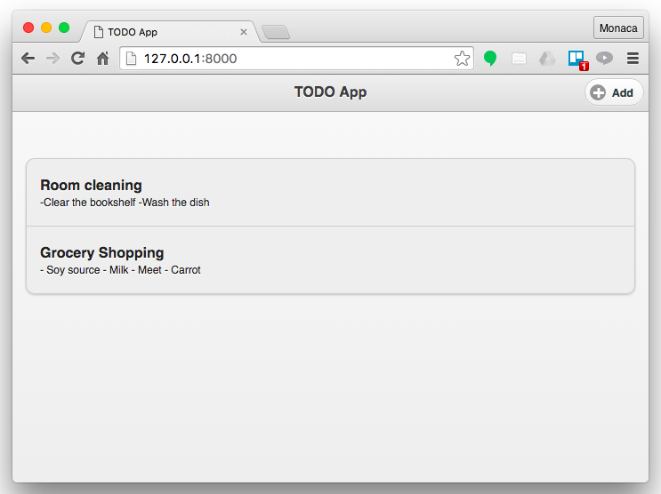
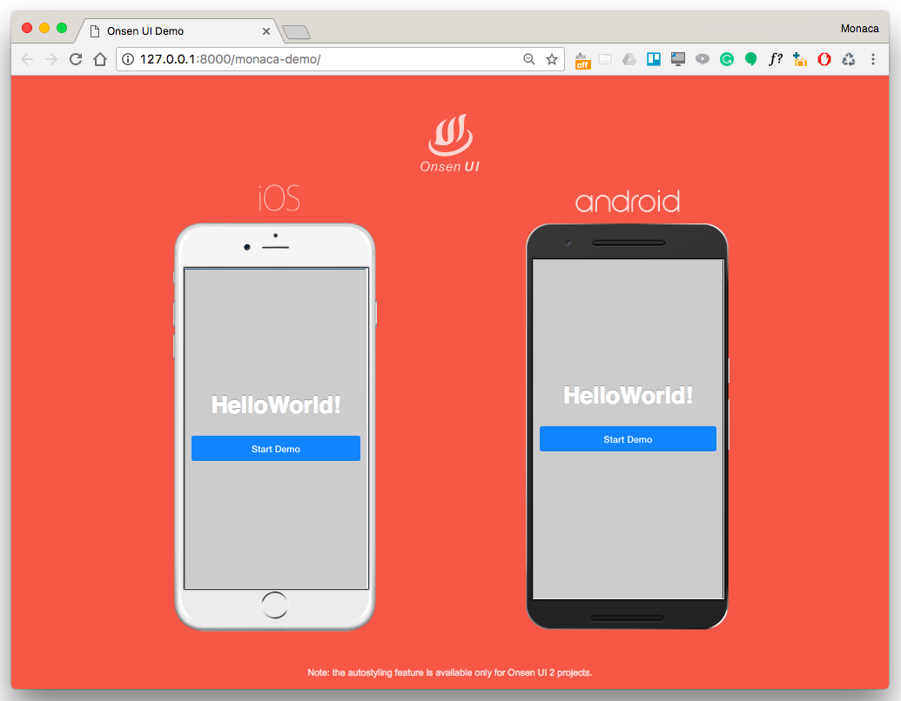
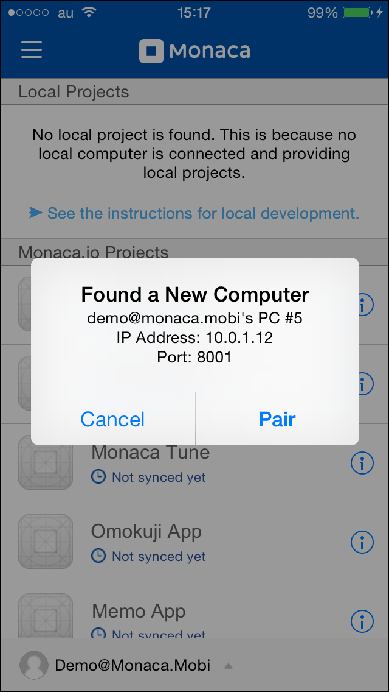
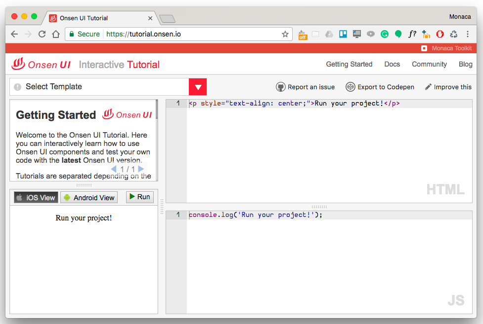

Monaca CLI コマンド
===================

> widths
>
> :   10 30
>
> header-rows
>
> :   1
>
> -   -   コマンド
>
>     - 説明
> -   -   monaca\_login
>
>     - Monaca へのサインインします。
> -   -   monaca\_logout
>
>     - Monaca からサインアウトします。
> -   -   monaca\_signup
>
>     - Monaca のアカウント登録を行います。
> -   -   monaca\_create
>
>     - テンプレートを使用して、ローカルに、Monaca
>     プロジェクトを新規作成します。
> -   -   monaca\_clone
>
>     - Monaca クラウドから、プロジェクトをクローン ( clone ) します。
> -   -   monaca\_import
>
>     - Monaca クラウドから、プロジェクトをインポートします。
> -   -   monaca\_download
>
>     - Monaca クラウドから、プロジェクトをダウンロードします。
> -   -   monaca\_upload
>
>     - Monaca クラウドへ、プロジェクトをアップロードします。
> -   -   monaca\_remote\_build
>
>     - Monaca クラウド上で、プロジェクトをリモートビルドします。
> -   -   monaca\_preview
>
>     - ローカル上で Web サーバーを起動させます。
> -   -   monaca\_demo
>
>     - ブラウザ上でiOSとAndroid用のプレビューを行います。
> -   -   monaca\_debug
>
>     - Monaca デバッガー上で、プロジェクトを実行します。
> -   -   monaca\_transpile
>
>     - ソースコードをコード変換 ( トランスパイル/Transpile ) します。
> -   -   monaca\_config
>
>     - Monaca CLIの設定内容を管理できます。
> -   -   monaca\_reconfigure
>
>     - 設定ファイルを再作成します。
> -   -   monaca\_plugin
>
>     - Cordova プラグインの管理
> -   -   monaca\_docs
>     -   Monaca CLI, Onsen UI, チュートリアルを表示します。
>
monaca login
------------

Monaca クラウドにサインインします。Monaca
アカウント登録時のユーザー名とパスワードを入力します。

\$ monaca login \[options\]

オプション

:   
    >
    > widths
    >
    > :   10 30
    >
    > -   -   `email`
    >     -   Monaca クラウドへログインするメールアドレス。
    >
【具体例】

:   Monaca CLI を使用して、Monaca
    クラウドへログインする例を、次に示します。

    ``` {.sourceCode .bash}
    $ monaca login
    $ monaca login me@monaca.io
    $ echo "mypass" | monaca login me@monaca.io
    ```

monaca logout
-------------

Monaca クラウドからサインアウトして、保持していたログイントークン (
login token ) を削除します。

\$ monaca logout

【具体例】

:   Monaca CLI を使用して、Monaca
    クラウドからログアウトする例を、次に記します。

    ``` {.sourceCode .bash}
    $ monaca logout
    Signing out from Monaca Cloud...
    You have been signed out.
    Removed Monaca Debugger pairing information.
    ```

monaca signup
-------------

Monaca Cloud にサインアップします。
ユーザーの資格情報を要求する画面が表示されます。

\$ monaca signup \[options\]

オプション

:   
    >
    > widths
    >
    > :   10 30
    >
    > -   -   `email`
    >     -   Monaca の登録に使用するメールアドレス
    >
【具体例】

:   コマンドの使用方法を、次に示します。

    ``` {.sourceCode .bash}
    $ monaca signup
    $ monaca signup me@monaca.io
    ```

monaca create
-------------

指定したパスのテンプレートから新しいローカル Monaca
プロジェクトを作成します。 Monaca
クラウドが提供しているテンプレートの中から、使用するテンプレートを選択します。
指定された保存場所に、選択されたテンプレートが置かれます。

\$ monaca create \[options\]

オプション

:   
    >
    > widths
    >
    > :   10 30
    >
    > -   -   `path`
    >
    >     - プロジェクトファイルの保存先
    > -   -   `--url`
    >     -   Monaca テンプレート zip ファイルの URL
    >
【具体例】

:   Monaca CLI を使用して、Monaca
    クラウドへログインする例を、次に示します。

    ``` {.sourceCode .bash}
    $ monaca create MyProject/Demo
    $ monaca create MyProject/Demo --url http://github.com/me/myproject/archive/master.zip
    ```

monaca clone
------------

Monaca クラウド上に置かれているプロジェクトを、ローカルへクローン (
Clone ) します。Monaca
クラウド上に置かれているプロジェクトの一覧が表示されます。プロジェクトを選択し、次に、保存先を指定します。

<div class="admonition note">

Monaca クラウドからローカル PC
にプロジェクトをクローンする場合には、クローンしたプロジェクトに関する
「 クラウド同期情報 」 が作成 ・ 保持されます。この情報が作成 ・
保持されている場合、プロジェクトをローカルで修正した後、Monaca
クラウドにアップロード ( monaca\_upload を使用 )
したときには、同一プロジェクト内の古いファイルが、上書きされます。

</div>

\$ monaca clone

【具体例】

:   次の例では、Monaca クラウド上のプロジェクト 「 `Memo Application` 」
    を、ローカルの "CloneMemoProject" フォルダーへクローンしています。

    {width="600px"}

monaca import
-------------

Monaca クラウド上に置かれているプロジェクトをインポート ( Import )
します。Monaca
クラウド上に置かれているプロジェクトの一覧が表示されます。プロジェクトを選択し、次に、保存先を指定します。

<div class="admonition note">

Monaca クラウドからローカル PC
にプロジェクトをインポートする場合には、インポートしたプロジェクトに関する
「 クラウド同期情報 」
は作成されません。この情報が作成されない場合、プロジェクトをローカルで修正した後、Monaca
クラウドにアップロード ( monaca\_upload を使用 )
したときには、アップロードしたプロジェクトは、新規のプロジェクトとして、取り扱われます。

</div>

\$ monaca import

【具体例】

:   次の例では、Monaca クラウド上のプロジェクト 「 `Memo Application` 」
    を、ローカルの "ImportedMemoApplication"
    フォルダーへインポートしています。

    {width="600px"}

monaca download
---------------

Monaca
クラウド上で同期対象のプロジェクトに対して行った更新・修正箇所をダウンロードします。

<div class="admonition note">

このコマンドを実行すると、ローカルのプロジェクトに、変更を反映できます。Monaca
クラウド上に存在するプロジェクトと同一のプロジェクトが、ローカルに存在しない場合、このコマンドは使用できません。

</div>

\$ monaca download \[options\]

オプション

:   
    >
    > widths
    >
    > :   10 30
    >
    > -   -   `--delete`
    >
    >     - Monaca クラウド上に存在しないローカルファイルを削除します。
    > -   -   `--force`
    >
    >     - 処理の実行時、ユーザー側に確認しません。
    > -   -   `--dry-run`
    >     -   ダウンロード処理をシュミレートします。出力として、ダウンロード対象のファイルを表示します。シュミレートのみで、実際のダウンロードは行われません。
    >
【具体例】

:   プロジェクトフォルダーに移動して、次に、さまざまなオプションを使用して
    `monaca download` コマンドを実行し、出力を確認してみましょう。

    {width="600px"}

monaca upload
-------------

ローカルのプロジェクトを Monaca クラウドへアップロードします (
プロジェクトが置かれたディレクトリーのルートへ移動して、コマンドを実行します
)。ローカルとクラウド間 ( 既存のファイルがクラウド上にあれば )
のファイルは比較され、新規ファイルまたは更新ファイルがあれば、そのファイルのみアップロードされます。アップロード処理は、プロジェクトの種類により異なりますので、その詳細を、次に記します。

1.  アップロード対象のプロジェクトが 「 新規プロジェクト」 または 「
    インポートしたプロジェクト 」 ( 上記コマンド )
    の場合、新規のプロジェクトとして、関連するファイルのすべてが Monaca
    クラウドへアップロードされます。
2.  アップロード対象のプロジェクトが 「 クローンしたプロジェクト 」 (
    上記コマンド ) の場合、Monaca
    クラウド上に置かれている、クローン元のプロジェクトが上書きされます (
    新規ファイルまたは更新ファイルのみ、アップロードされます )。

<div class="admonition note">

React.js プロジェクトと Angular2 プロジェクトに関しては、`monaca upload`
コマンドの実行時、アップロード処理が始まる前に、プロジェクトがコード変換
( トランスパイル/Transpile ) されます。

</div>

\$ monaca upload \[options\]

オプション

:   
    >
    > widths
    >
    > :   10 30
    >
    > -   -   `--delete`
    >
    >     - ローカルに存在しないファイルが、Monaca
    >     クラウド上に存在する場合、クラウド上のこれらのファイルを削除します。
    > -   -   `--force`
    >
    >     - 処理の実行時、ユーザー側に確認しません。
    > -   -   `--dry-run`
    >     -   アップロード処理をシュミレートします。出力として、アップロード対象のファイルを表示します。シュミレートのみで、実際のアップロードは行われません。
    >
【具体例】

:   プロジェクトフォルダーへ移動後、さまざまなオプションを組み合わせて、`monaca upload`
    コマンドを実行し、出力を確認してみましょう。

    {width="600px"}

monaca remote build
-------------------

Monaca クラウド上でプロジェクトをビルドします。Monaca
クラウド上に、対象のプロジェクトが存在しない場合、ビルドを開始する前に、対象のプロジェクトが自動的にアップロードされます。一方、Monaca
クラウド上に、対象のプロジェクトがすでに存在する場合には、ローカルで行った更新・修正は、ビルドを開始する前に、対象のプロジェクトに反映
( アップロード ) されます。

次の点に関する詳細は、build\_index をご確認ください。

-   各プラットフォーム向けのビルドの設定方法
-   ビルドの種類
-   各プラットフォーム向けアプリのビルド方法
-   ビルド済みアプリの入手方法・インストール方法

\$ monaca remote build &lt;platform&gt; \[options\]

オプション

:   
    >
    > widths
    >
    > :   10 30
    >
    > -   -   `platform`
    >
    >     - ビルド対象のプラットフォームを指定します。
    >     `ios`、`android`、`windows` のいずれかを指定します。
    > -   -   `--build-type`
    >
    >     -
    >     ビルドの種類を指定します。指定できるオプションを、次に記します。
    >
    >     > -   `debug` ( iOS、Android、Windows 向け)
    >     >     デフォルトオプション
    >     > -   `test` ( iOS 向け )
    >     > -   `release` ( iOS、Android 向け )
    >
    > -   -   `--output`
    >
    >     - ビルド済みファイルを保存するディレクトリーを指定します (
    >     ファイル名まで含む )。
    > -   -   `--android_webview`
    >
    >     - (Android のみ) Webview
    >     のタイプを選択します。`default`、`crosswalk`
    >     のいずれかを指定します。
    > -   -   `--android_arch`
    >
    >     - (Android のみ) `--android_webview` を `crosswalk`
    >     に指定した場合、こちらは必須オプションになります。値は、`x86`、`arm`
    >     のいずれかを指定します。
    > -   -   `--browser`
    >     -   ブラウザー上で \[ ビルド設定 \] 画面を開きます (
    >         下のスクリーンショットを参照のこと )。
    >
【具体例】

:   プロジェクトの保存先フォルダーへ移動し、さまざまなオプションを組み合わせて、このコマンドを実行してみましょう。

    ``` {.sourceCode .bash}
    $ monaca remote build ios
    $ monaca remote build ios --build-type=debug
    $ monaca remote build android --build-type=debug --android_webview=crosswalk --android_arch=arm
    $ monaca remote build --browser
    ```



> width
>
> :   700px
>
> align
>
> :   center
>
monaca preview
--------------

ローカル上で Web サーバーを起動後、ブラウザー上でアプリを起動させます (
`www` 下のアセットがブラウザー上で使用できる状態になります
)。このコマンドを実行すると、ファイルシステム上のファイルを監視し、ファイルが変更された場合には、ブラウザー上にも即反映させます。

<div class="admonition note">

React.js プロジェクトと Angular2
プロジェクトに関しては、`monaca preview`
コマンドの実行時、プレビュー画面の起動前に、メモリー上でプロジェクトがコード変換されます。また、プレビュー画面を起動させた状態で、プロジェクトファイルを修正したときにも、コード変換処理が行われ、修正されたファイルの内容がプレビュー画面上に反映されます。

</div>

\$ monaca preview \[options\]

オプション:

:   ---------------------- --------------------------------------------------------------------------
      `--port` または `-p`   HTTP の待ち受けポート番号 ( デフォルトは、8000 )
      `--no-open`            ローカル上で Web サーバーを起動させます ( ブラウザーは起動させません )。
      ---------------------- --------------------------------------------------------------------------

【具体例】

:   プロジェクトフォルダーへ移動して、`monaca preview`
    コマンドを実行します。実行後、ブラウザーが起動して、プロジェクトが実行されます。

    

    > width
    >
    > :   600px
    >
    > align
    >
    > :   left
    >
    

    > width
    >
    > :   600px
    >
    > align
    >
    > :   left
    >
    > プレビュー用のウィンドウ

    <div class="admonition note">

    `monaca preview` の処理を停止する場合には、Ctrl+c を押します。

    </div>

monaca demo
-----------

`www` 下のアセットを Android と iOS へ同時に提供するローカル Web
サーバーを開始します。ファイルシステムの変更が監視され、ファイルが変更された場合には、ブラウザー上にも即反映されます。

\$ monaca demo \[options\]

オプション

:   
    >
    > widths
    >
    > :   10 30
    >
    > -   -   `--port` または `-p`
    >     -   HTTP の待ち受けポート番号 ( デフォルトは、8000 )
    >
【具体例】

:   プロジェクトフォルダーへ移動して、`monaca demo`
    コマンドを実行します。実行後、ブラウザーが起動して、プロジェクトが実行されます。

    ``` {.sourceCode .bash}
    $ monaca demo
    $ monaca demo -p 8001
    ```



> width
>
> :   700px
>
> align
>
> :   center
>
monaca debug
------------

端末上でアプリをデバッグするためのコマンドです。ローカルで行った、ファイルへの変更は、デバッガー上にも即反映されます。このコマンドを実行すると、Web
サーバーが起動され、Monaca
デバッガーからの接続を待ち受けます。また、同時に、対象のローカルネットワーク上に接続されているデバッガーに対して、接続するか確認するメッセージが送信されます。

<div class="admonition note">

React.js プロジェクトと Angular2 プロジェクトに関しては、`monaca debug`
コマンドの実行時、Monaca
デバッガーへプロジェクトファイルが送信される前に、プロジェクトがコード変換
( トランスパイル/Transpile )
されます。また、デバッガーを実行している状態で、プロジェクトファイルを修正したときにも、コード変換処理が行われ、修正されたファイルの内容がデバッガー上に反映されます。

</div>

\$ monaca debug \[options\]

オプション:

:   ---------- -------------------------------------------------------------------
      `paths`    ディレクトリー ( 現在開いているディレクトリーの場合には、省略可 )
      `--port`   HTTP の待ち受けポート番号 ( デフォルトは、8001 )
      ---------- -------------------------------------------------------------------

【具体例】

:   プロジェクトフォルダーへ移動して、`monaca debug`
    コマンドを実行します。実行後、Monaca デバッガーの
    *ローカルプロジェクト*
    下に対象のプロジェクトが表示されていることを確認し、プロジェクトをタップして実行してみましょう。次に、プロジェクトに変更を加え、保存して、プロジェクトに変更点が即反映されることを確認してみましょう。

    ``` {.sourceCode .bash}
    $ cd MyProjectFolder/ImportRssProject
    $ monaca debug
    ```

    このコマンドの実行時、次のようなダイアログ ( 左 ) または通知 ( 右 )
    が表示されます。ダイアログには、ペアリングを行うか確認するメッセージが表示されます。また、通知には、ネットワーク接続の状態が表示されます。なにか問題がある場合には、
    troubleshoot\_pair をご確認ください。

    

    > width
    >
    > :   250px
    >
    > align
    >
    > :   left
    >
    > 接続確認用ダイアログ

    

    > width
    >
    > :   250px
    >
    > align
    >
    > :   left
    >
    > ネットワーク接続完了の通知

<div class="admonition note">

`monaca debug` の処理を停止する場合には、Ctrl+c を押します。

</div>

monaca transpile
----------------

プロジェクトをコード変換 ( トランスパイル/Transpile )
します。コード変換可能なプロジェクトには、たとえば、React.js
プロジェクト、Angular2
プロジェクトなどがあります。なお、コード変換可能なプロジェクトに関しては、各種コマンド
(
`monaca upload`、`monaca preview`、`monaca debug`、`monaca remote build`
) の実行時に、自動でコード変換が行われます。

\$ monaca transpile \[options\]

オプション

:   
    >
    > widths
    >
    > :   20 30
    >
    > -   -   `--generate-config`
    >
    >     -
    >     コード変換用の設定ファイルが存在しない場合、これらのファイルを作成します。
    > -   -   `--install-dependencies`
    >     -   コード変換時に必要となる依存関係をインストールします。
    >
【具体例】

:   対象のプロジェクトフォルダーへ移動して、`monaca transpile`
    コマンドを実行します ( コード変換が可能なプロジェクトであること
    )。実行後、コード変換が実行されます。

    ``` {.sourceCode .bash}
    $ monaca transpile

    Running Transpiler...
    Build completed in 71.835s

    ....
    ```

monaca config
-------------

プロキシおよび API エンドポイントの設定内容を管理できます。

`--url`

オプション

:   
    >
    > widths
    >
    > :   10 30
    >
    > -   -   `proxy <url>`
    >
    >     - &lt;url&gt;
    >     が設定されていない場合は、現在のプロキシサーバーが表示されます。
    > -   -   `endpoint <url>`
    >
    >     - &lt;url&gt; が設定されていない場合は、現在の API
    >     エンドポイントが表示されます。
    > -   -   `--help`
    >
    >     - ヘルプを表示します。
    > -   -   `--reset`
    >     -   デフォルト値にリセットします。
    >
【具体例】

:   使用方法は、次のとおりです。

    ``` {.sourceCode .bash}
    $ monaca config --help
    $ monaca config proxy
    $ monaca config proxy http://my.proxy.com:8080
    $ monaca config proxy --reset

    $ monaca config endpoint
    $ monaca config endpoint my.endpoint.com
    $ monaca config endpoint --reset
    ```

monaca reconfigure
------------------

設定ファイルを復旧 ( 再作成 )
します。オプションを指定しない場合、該当するファイルのすべてを復旧します。該当するファイルに関しては、下の
「 オプション 」 欄をご確認ください。

\$ monaca reconfigure \[options\]

オプション:

:   ------------------ ----------------------------------------------------------------------------------------------------------------------
      `--transpile`      コード変換用の設定ファイルを再作成/復旧します ( webpack.dev.config ファイルと webpack.prod.config ファイルが対象 )。
      `--dependencies`   依存関係のあるパッケージをインストールします。
      `--components`     `components` フォルダーを再作成/復旧します。
      ------------------ ----------------------------------------------------------------------------------------------------------------------

【具体例】

:   対象のプロジェクトフォルダーへ移動し、オプションを組み合わせて、`monaca reconfigure`
    コマンドを実行してみましょう (
    対象のプロジェクトは、コード変換が可能なプロジェクトであること )。

    ``` {.sourceCode .bash}
    $ monaca reconfigure
    $ monaca reconfigure --transpile --components
    ```

monaca plugin
-------------

プロジェクトで使用するプラグインを管理します。プラグインの新規追加、ならびに、既存プラグインの一覧化と削除を行えます。

\$ monaca plugin \[options\]

オプション

:   ------------------ ----------------------------------------------
      `add <plugin>`     プラグインを追加します。
      `rm <plugin>`      プラグインを削除します。
      `ls または list`   インストール済みのプラグインを一覧化します。
      `search <query>`   プラグイン ディレクトリーを検索します。
      ------------------ ----------------------------------------------

【具体例】

:   プロジェクトフォルダーに移動して、次のコマンドを実行します。

    ``` {.sourceCode .bash}
    $ monaca plugin add org.apache.cordova.camera
    $ monaca plugin rm org.apache.cordova.camera
    $ monaca plugin search keyboard
    $ monaca plugin ls
    ```

monaca docs
-----------

Monaca CLI 、Onsen UI 、チュートリアルのドキュメントを表示します。

\$ monaca docs \[options\]

オプション

:   
    >
    > widths
    >
    > :   10 30
    >
    > -   -   `onsen`
    >
    >     - ブラウザで Onsen UI ドキュメントを開きます。
    > -   -   `tutorial`
    >
    >     - ブラウザで Onsen UI チュートリアルを開きます。
    > -   -   `usage`
    >     -   ブラウザで Monaca CLI ドキュメントを開きます。
    >
【具体例】

:   使用方法は、次のとおりです。

    ``` {.sourceCode .bash}
    $ monaca docs onsen
    $ Monaca ドキュメントチュートリアル
    $ monaca docs usage
    ```



> width
>
> :   700px
>
> align
>
> :   center
>
> Monaca ドキュメントチュートリアル
