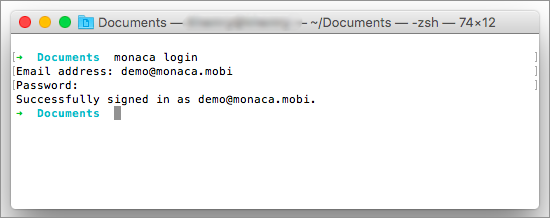
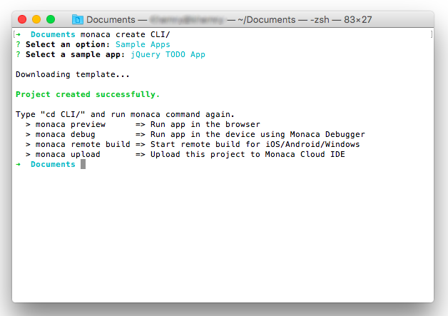
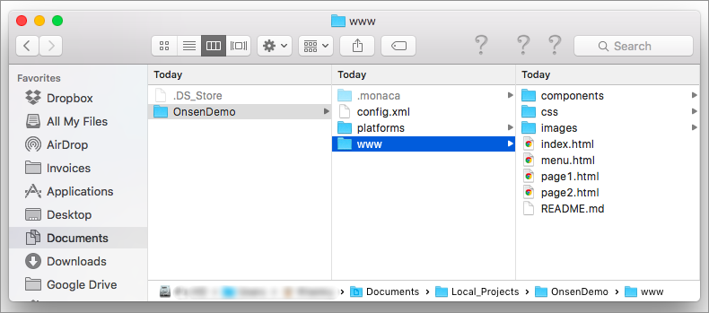

パート 1 : プロジェクトの作成
=============================

ステップ 1 : Monaca へのログイン
--------------------------------

1.  コマンドプロンプト ( Windows の場合 ) またはターミナル ( Mac の場合
    ) を開き、次のコマンドを実行します。

> ``` {.sourceCode .bash}
> $ monaca login
> ```

2.  次に、Monaca
    アカウントで使用している、電子メールとパスワードを入力します。

> {width="500px"}

<div class="admonition note">

Monaca に登録していない場合には、`monaca signup`
コマンドを使用して、登録から行ってください。

</div>

ステップ 2 : プロジェクトの新規作成
-----------------------------------

1.  次のコマンドを使用して、新規のプロジェクトを作成します。

> ``` {.sourceCode .bash}
> $ monaca create PROJECT_DIRECTORY
> ```

2.  次に、Monaca プロジェクトを新規作成します。いずれかのテンプレート
    または `Sample Apps` を選択します。ここでは、`Sample Apps`
    オプションを選択します。次に、`jQuery TODO App` を選択します。

> {width="600px"}

3.  プロジェクトを作成すると、プロジェクトフォルダーが PC
    上に作成されます。これ以後は、お好みのエディターを使用して、Monaca
    プロジェクトを開くことができます。

> {width="600px"}

<div class="admonition note">

上記では、サンプルアプリを使用したプロジェクトの作成方法を示しましたが、他にも、Monaca
CLI を使用して、Monaca クラウドから既存のプロジェクトを
インポート &lt;monaca\_import&gt; または クローン &lt;monaca\_clone&gt;
できます。

</div>
