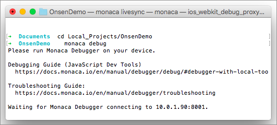
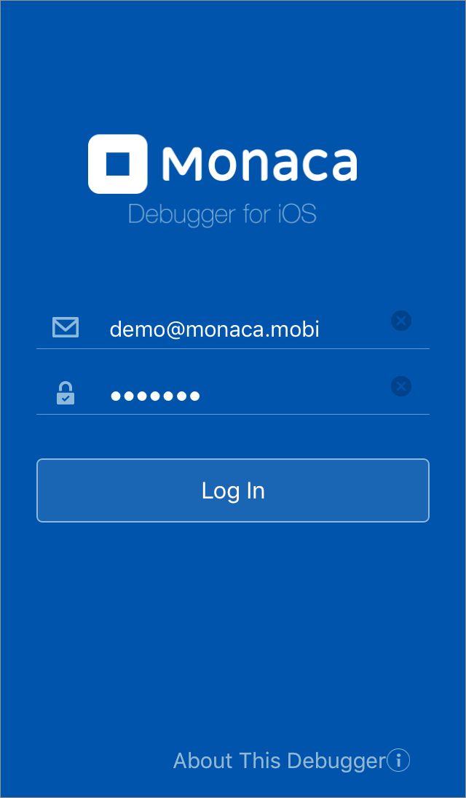
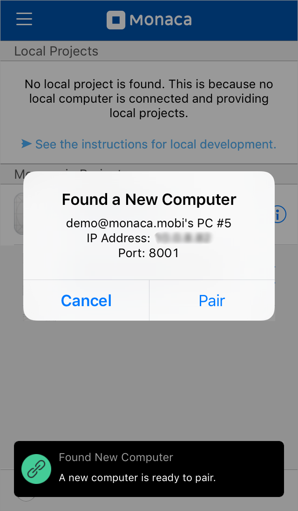
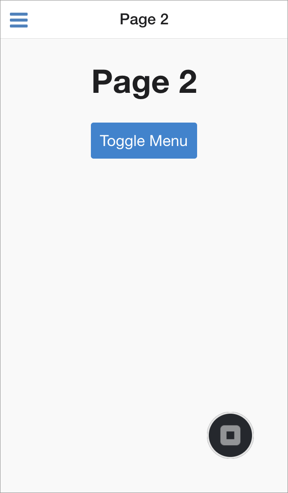

パート 2 : Monaca CLI と Monaca デバッガーとの連携
==================================================

Monaca デバッガー &lt;monaca\_debugger\_index&gt; は、Monaca
アプリの検証とデバッグを、端末上でリアルタイムに行うためのアプリです。

Monaca アプリの開発時、Monaca CLI ( ローカル PC 側 ) と Monaca
デバッガー ( 端末側 )
がペアリングされていれば、プロジェクトファイルに加えられた変更は、保存後、即座にデバッガー側に
「 プッシュ 」 されます。

事前準備
--------

Monaca デバッガーを端末にインストールします。

> {width="100px"}
>
> {width="100px"}

<div class="admonition note">

Monaca デバッガーのインストール方法 ( プラットフォーム別 )
は、こちら &lt;debugger\_installation\_index&gt; をご確認ください。

</div>

ステップ 1 : Monaca デバッガーとローカル PC のペアリング
--------------------------------------------------------

ローカル PC 上で作成した Monaca アプリを、Monaca
デバッガー上でデバッグ・検証をする場合には、ローカル PC と Monaca
デバッガーをペアリングする必要があります。

<div class="admonition note">

Monaca デバッガーとローカル PC を接続する前に、次の点をご確認ください。

1.  同じ WiFi または LAN ネットワーク上に、Monaca デバッガーとローカル
    PC が接続されていること。
2.  同じ Monaca アカウントを使用して、Monaca デバッガーとローカル PC
    にサインインしていること。
3.  ローカル PC 側のファイアーウォールを無効化していること。

</div>

1.  コマンドウィンドウ上で、プロジェクトのフォルダーまで移動し、
    monaca\_debug コマンドを実行して、Monaca
    デバッガーに接続します。実行すると、Monaca CLI
    側では、デバッガーからのリクエストの待ち受けを開始します。

> {width="500px"}

2.  Monaca デバッガーを起動し、Monaca
    アカウントを使用してログインします。ログインのユーザー名とパスワードは、Monaca
    CLI のログイン時に使用したものと同じものを使用します。

> {width="250px"}

3.  Monaca デバッガー上に、ポップアップメッセージが表示され、Monaca
    デバッガーとホスト PC をペアリングするか聞かれます。\[ ペアリング \]
    ボタンをタップします。

> {width="250px"}

4.  ペアリング後、Monaca デバッガーの `ローカルプロジェクト`
    欄に、ローカルに置かれているプロジェクト名が表示されます。ペアリングに失敗した場合には、troubleshoot\_pair
    をご確認ください。

> {width="250px"}

ステップ 2 : Monaca デバッガー上でのプロジェクトの実行
------------------------------------------------------

1.  Monaca デバッガーの \[ ローカルプロジェクト \]
    上に表示されたプロジェクト名をタップして、アプリを実行します。
2.  下のスクリーンショットのように、プロジェクトが実行されます。プロジェクト一覧へ戻る場合には、デバッガーのメニュー画面へいったん戻り、戻る
    ボタンをタップします。

> ![アプリ実行中の画面 ( 右下 : デバッガーメニューへの \[ 戻る \] ボタン
> )](images/testing_debugging/5.png){width="250px"}
>
> ![デバッガーのメニュー画面 ( 赤字 : プロジェクト一覧への \[ 戻る \]
> ボタン )](images/testing_debugging/6.png){width="250px"}

ステップ 3 : Monaca CLI と デバッガー間のリアルタイムでの同期
-------------------------------------------------------------

1.  Monaca デバッガー上で、プロジェクトを実行します。
2.  ファイル内のコードを変更してみましょう。たとえば、アプリの起動時に表示するページを
    「 Page 2 」
    に変更してみましょう。変更を行うには、最初に、`index.html`
    ファイルを開き、次に、`<ons-sliding-menu>` タグ内の `main-page`
    属性の値を、`page2.html`
    に変更・保存します。変更後のコードは、次のとおりです。

> ``` {.sourceCode .html}
> ...
>   <ons-sliding-menu
>       var="app.slidingMenu"
>       menu-page="menu.html"
>       main-page="page2.html"
>       side="left" type="overlay"
>       max-slide-distance="200px">
>   </ons-sliding-menu>
> ...
> ```

3.  If your PC is still connected to Monaca Debugger, it will
    automatically refresh the updates. Now your starting page should be
    Page 2.

> {width="250px"}
