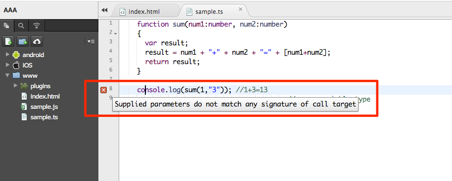
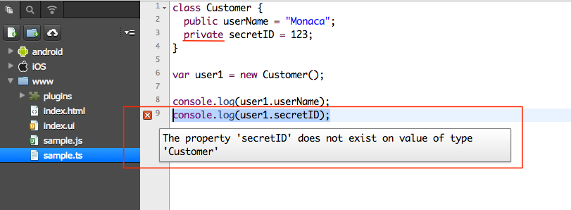

TypeScript
==========

TypeScript の概要
-----------------

[TypeScript](http://www.typescriptlang.org/) は、Microsoft
が開発した、無償のオープンソース プログラミング言語です。JavaScript
の文法を基に、機能拡張した、新しい言語であり、TypeScript
をコンパイルすると、JavaScript になります。TypeScript
の機能の一部を、次に解説します。大規模開発において、特に有用な言語です。

-   annotation
-   interface
-   arrow
-   modifier
-   inheritance

<div class="admonition note">

Monaca に実装されているコード補完機能は、TypeScript には適用されません。

</div>

.ts は、TypeScript ファイルの拡張子です。Monaca では、.ts
ファイルの保存時に、自動的にコンパイルを行い、同時に、同名の JavaScript
( .js ) ファイルを作成します。次のコードを使用して、Monaca クラウド IDE
上で、TypeScript ファイルを作成してみましょう。 ファイルは、 `www`
フォルダー下に置き、 test.ts と名付けましょう。

``` {.sourceCode .javascript}
document.body.innerHTML = "Hello World!";
```

test.ts の保存時に、 test.js が同じ階層に作成されることを確認します。

<div class="admonition warning">

TypeScript ファイルの保存時に、TypeScript
コンパイラーを実行します。JavaScript
ファイルは、コンパイル時に、自動的に上書きされるため、JavaScript
ファイルは、直接、編集してはいけません。

</div>

<div class="admonition warning">

.ts ファイルを保存する場合、対応する .js
ファイルがすでに作成され、開いているときは、これをいったん閉じてください。たとえば、
main.js ファイルを開いたまま、 main.ts ファイルを保存した場合、 main.js
には、更新した内容は反映されません。

</div>

型注釈 ( Type Annotation )
--------------------------

型注釈を使用すれば、開発者の意図どおりに、プログラムが記述されているか、コンパイル時に確認できます。型注釈は、関数の引数の定義時に適用します
( 関数に渡す値の型を指定します。静的型付けと呼ばれます
)。コンパイルエラーの内容を確認できるので、大規模なアプリ開発の場合には、型注釈は有用です。

test.ts ファイルに、関数を 1
つ作成して、動作を確認してみましょう。次のコードでは、 `num1` と `num2`
の引数を、数値とします。

``` {.sourceCode .javascript}
function sum(num1:number, num2:number)
{
  var result;
  result = num1 + "+" + num2 + "=" + [num1+num2];
  return result;
}

console.log (sum(1,3)); //1+3=4
```

次に、 test.js を index.html から呼び出します。

    <body>
      ...
      <script src="test.js"></script>
      ...
    </body>

<div class="admonition warning">

HTML の src 属性には、.ts ファイルではなく、.js ファイル ( .ts
ファイルからコンパイルされたファイル ) を指定してください。

</div>

アプリを実行すると、問題なく、結果が表示されます。今度は、 test.ts
ファイルの `sum` 関数に、バグを交ぜてみましょう。 test.ts
ファイルを、次のように変更します。

``` {.sourceCode .javascript}
function sum(num1:number, num2:number)
{
  var result;
  result = num1 + "+" + num2 + "=" + [num1+num2];
  return result;
}

console.log(sum(1,"3")); //wrong variable type
```

{width="600px"}

test.ts にバグがあると、ファイルの保存時に、警告アイコン ( X )
が左側に表示されます。警告アイコンにカーソルを当てると、エラーメッセージが表示されます。

    Supplied parameters do not match any signature of call target

バグが存在しても、 test.js
ファイルは作成され、アプリも実行できますが、実行結果には障害があります。

インターフェース ( Interface )
------------------------------

TypeScript
では、インターフェースを定義できるだけではなく、型注釈にも使用できます。次の例では、単純なインターフェースを作成して、オブジェクト型として使用します。
test.ts ファイルの内容を、次のコードに差し替えてください。

``` {.sourceCode .javascript}
interface People
{
   name: string;
   age: number;
}

function info(people : People) {
   var result = people.name + " is " + people.age + " years old.";
   return result;
}

console.log(info({name:"Monaca", age: 30}));
```

バグがないので、保存時に、エラーは表示されません。今度は、引数を 1
つ省いて、 `info` を呼び出し、エラーを発生させます。

``` {.sourceCode .javascript}
interface People
{
   name: string;
   age: number;
}

function info(people : People) {
   var result = people.name + " is " + people.age + " years old.";
   return result;
}

console.log( info({age: 30}) );
```

test.ts にバグがあると、ファイルの保存時に、警告アイコン ( X )
が左側に表示されます。警告アイコンにカーソルを当てると、エラーメッセージが表示されます。

    Supplied parameters do not match any signature of call target:
    Could not apply type 'People' to argument 1, which is of type '{ age: number; }'

バグが存在しても、 test.js
ファイルは作成され、アプリも実行できますが、実行結果には障害があります。

アロー関数式 ( Arrow Function Expression )
------------------------------------------

アロー関数式は、JavaScript の function
よりも、コンパクトです。アロー関数式では、 `this`
のスコープの取り扱いが、JavaScript
とは異なります。次のコードを使用します。

``` {.sourceCode .javascript}
var people =
{
  name: "Mr.Monaca",
  age: 30,
  popup: function()
  {
    setTimeout(function()
    {
      console.log('This inside setTimeout(): ' + this.name);
    }, 3000);
  }
};
people.popup();
```

保存して実行します。出力を確認すると、 `this.name`
の値が空になっています。 `this` の値を処理するためには、アロー ( 矢印 )
関数式を使います ( `=>` )。 `setTimeout` 関数内の `function()`
を、次のように、アロー関数式に置き換えます。

``` {.sourceCode .javascript}
var people =
{
  name: "Mr.Monaca",
  age: 30,
  popup: function()
  {
    setTimeout(() => // we replace "function(){}" by "()=>{}"
    {
      console.log('This inside setTimeout(): ' + this.name);
    }, 3000);
  }
};
people.popup();
```

保存して、アプリを再度実行します。 `this.name` が正しく表示されます。

アクセス修飾子 ( Access Modifier )
----------------------------------

TypeScript は、クラスとそのアクセス修飾子もサポートします。TypeScript
を使用すれば、JavaScript
のメンバーとクラスへのアクセスを、簡単に制御できます。クラスプロパティーへのアクセスに注目して、次のコードを検証します。

``` {.sourceCode .javascript}
class Customer {

  public userName = "Monaca";
  private secretID = 123;
}

var user1 = new Customer();

console.log(user1.userName);// no error => Monaca
console.log(user1.secretID);// error found => could not access user1.secretID!
```

{width="600px"}

最後の行は、上記のようなエラーになります。これは、 `Customer` クラスの
private な `secretID`
へのアクセスを試みているためです。エラーメッセージは、次の内容になります。

    The property 'firstName' does not exist on value of type 'People'

今度は、次のアクセス修飾子を使います。結果の違いを確認してみましょう。

``` {.sourceCode .javascript}
class Customer {

  public userName = "Monaca";
  public secretID = 123;
}

var user1 = new Customer();

console.log(user1.userName);// no error => Monaca
console.log(user1.secretID);// no error => 123
```

継承 ( Inheritance )
--------------------

`extends`
を使用して、既存クラスを拡張する、派生クラスを作成できます。使用例を次に記します。

``` {.sourceCode .javascript}
class People
{
  name: string;
  age: number;

  constructor(name:string, age: number)
  {
    this.name = name;
    this.age = age;
  }

  info()
  {
    return this.name + "-" + this.age;
  }
}

class Customer extends People
{
  userName: string;
  secretID: number;

  constructor(name: string, age:number, userName:string, secretID:number)
  {
    super(name, age); // call the constructor of the People class
    this.userName = userName;
    this.secretID = secretID;
  }

  info()  // override the info() class
  {
    return this.userName + "-" + this.secretID;
  }

  peopleInfo()
  {
    return super.peopleInfo();  //call info() of the People class
  }
}

var user1 = new Customer("Mr.Monaca", 30, "Monaca", 123);
console.log(user1.customerInfo());
console.log(user1.peopleInfo());
```

コードを解説します。ポイントが 3 つあります。

-   `Customer` クラスには、定義をしなくても、 `name` と `age`
    プロパティーがあります。このクラスが、 `People`
    クラスから派生しているためです。
-   `Customer` クラス内の constructor メソッドの `super`
    メソッドを使用して、 `People` クラスの contructor
    メソッドを呼び出しています。
-   `Customer` クラスの `info` メソッドを使用して、親クラス ( `People`
    クラス ) の `info` メソッドを、オーバーライド ( override )
    しています。また、 `peopleInfo()` メソッドを使用して、親クラスの
    `info` メソッドを、直接、呼び出しています。

