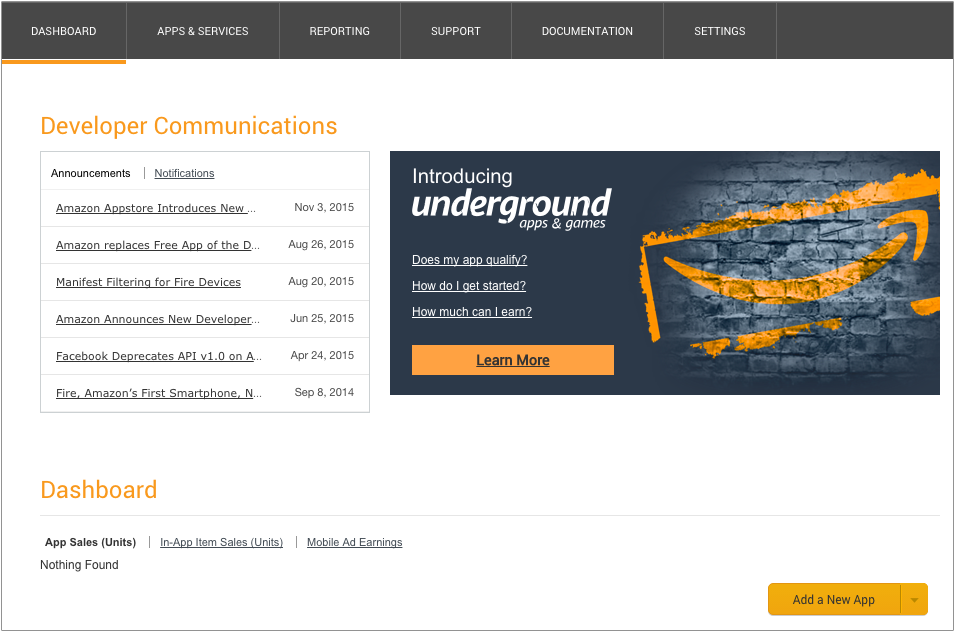
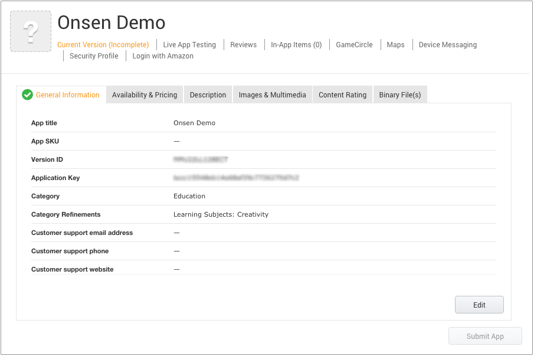
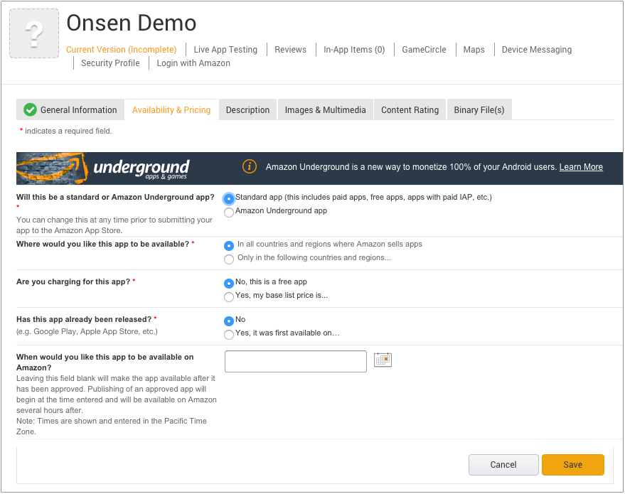

Amazon アプリストア での配布
============================

事前準備
--------

Amazon アプリストアで、Android 向けのアプリを公開する場合、[Amazon Apps
Developer Portal](https://developer.amazon.com/appsandservices)
で開発者アカウントを登録する必要があります。登録は無料です。

リリースビルドのアプリを作成
----------------------------

Monaca クラウド IDE のビルド機能を使用すれば、Amazon
アプリストアへアップロードできるリリースビルド版のアプリをビルドできます。building\_for\_android
に記載されている手順に従い、リリースビルド版のアプリをビルドします。次に、ビルドしたアプリ
( apk ファイル ) をダウンロードします。

Amazon アプリストアへのアプリの登録
-----------------------------------

1.  [Amazon
    開発者コンソール](https://developer.amazon.com/appsandservices)
    へ行き、Amazon 開発者アカウントを使用してログインします。
2.  ダッシュボード 上に表示されている 新規アプリを追加
    ボタンをクリックします。

> 
>
> > width
> >
> > :   600px
> >
> > align
> >
> > :   left
> >
3.  プラットフォームとして、Android を選択して、Next をクリックします。
4.  \[ 新規アプリ申請 \] ページが表示されます。必要な情報を入力します。

5.  保存 ボタンをクリックします。次の画面が表示されます。

> 
>
> > width
> >
> > :   600px
> >
> > align
> >
> > :   left
> >
6.  配信地域・価格等
    タブでは、アプリの種類を選択して、表示された質問に回答し、最後に、保存
    ボタンクリックします。

> 
>
> > width
> >
> > :   600px
> >
> > align
> >
> > :   left
> >
> 

>
> Amazon では、200
> ヶ国以上の中から、配信地域を選択できます。なお、アプリのリリースは、Amazon
> 側の承認後となります。
>
> 

7.  概要 タブでは、次の情報を入力して、保存 ボタンをクリックします。

8.  画像 & マルチメディア
    では、アイコンとスクリーンショットをアップロードします。アイコンは、小
    ( 114x114 の png ファイル ) と 大 ( 512x512 の png ファイル ) の 2
    種類です。アップロード後、保存 ボタンをクリックします。
9.  コンテンツ レーティング
    タブでは、アプリの内容に関する質問に回答します。回答後、 保存
    ボタンをクリックします。
10. バイナリファイル タブでは、次の情報を入力して、 保存
    ボタンをクリックします。

11. 設定後、保存
    ボタンをクリックします。ここまでの手順で、公開準備が整いました。

アプリのリリース
----------------

アプリを公開するためには、必要な情報をすべて入力する必要があります。入力後、アプリを申請
ボタンをクリックして、アプリをリリースします。なお、このボタンは、必要な情報がすべて入力されるまで、有効になりません。

申請後、Amazon
側で審査が行われます。アプリの安全性が特に重要な審査項目となります。審査には、1-2
日程度かかります。

Amazon の審査後、Android
アプリストアにて公開されます。公開日時を指定していない場合には、審査完了後、即時に公開され、それ以外の場合には、指定した日時に公開されます
( 日時の指定に関しては、register\_app\_in\_amazon のステップ 6
を参照のこと )。

> 
>
> > width
> >
> > :   600px
> >
> > align
> >
> > :   left
> >
お問い合わせ先
--------------

Amazon の Android
アプリストアに関するお問い合わせは、[こちら](https://developer.amazon.com/public/support/contact/contact-us)
から行えます。こちらの窓口では、アプリの申請、API
の使用法などに関する一般的な質問ができます。

Amazon Android アプリストアの商標とバッジ
-----------------------------------------

Amazon バッジを使用して、アプリの販売促進ができます。バッジは、[Amazon
商標とバッジ](https://developer.amazon.com/public/support/legal/tuabg)
から入手できます。
