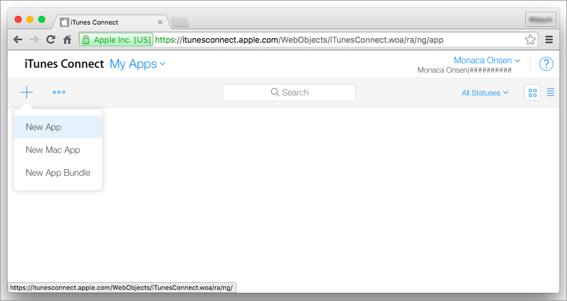
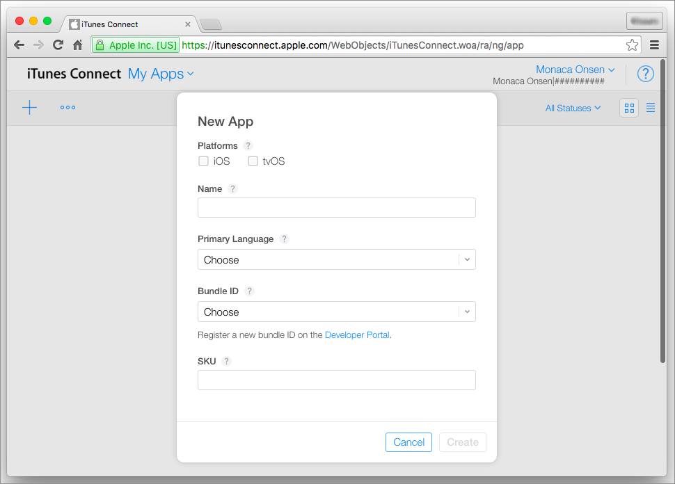
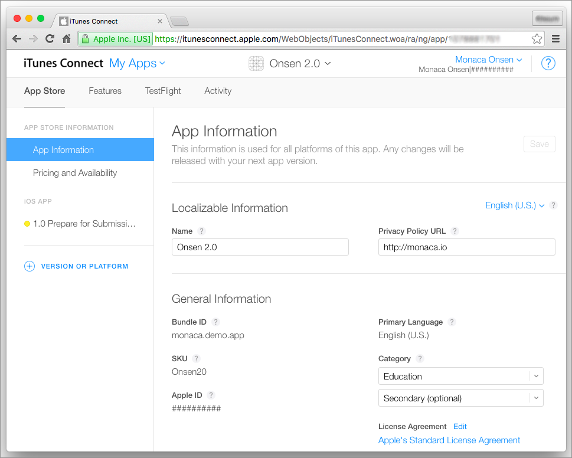
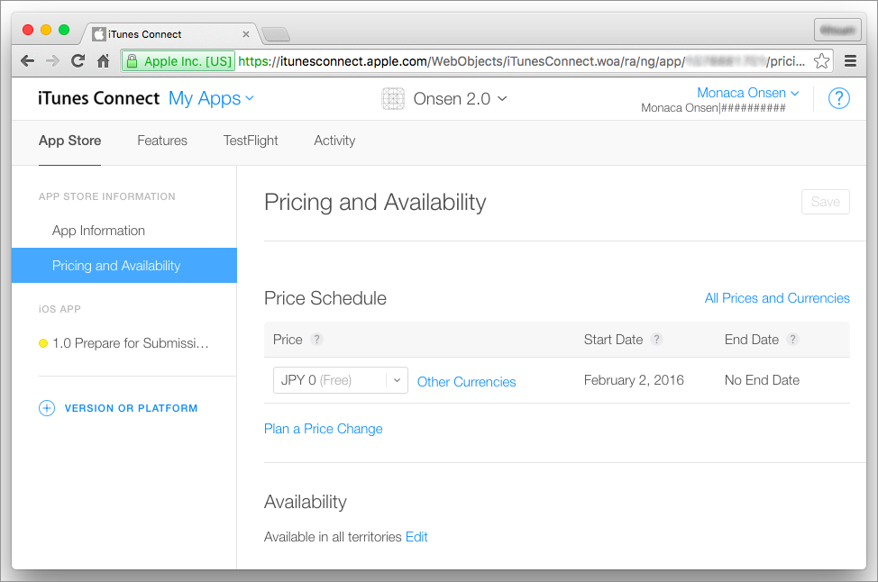
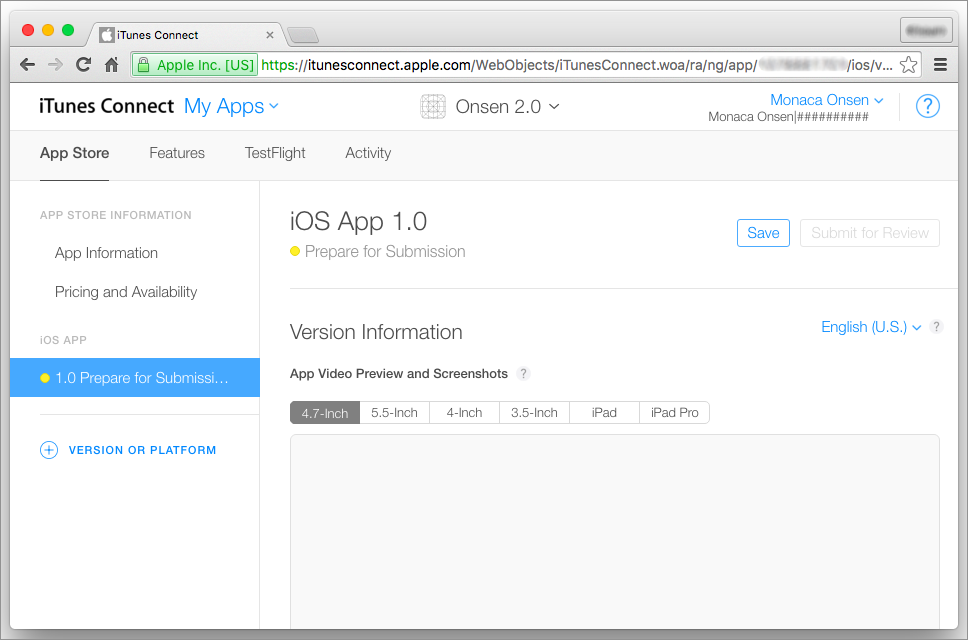
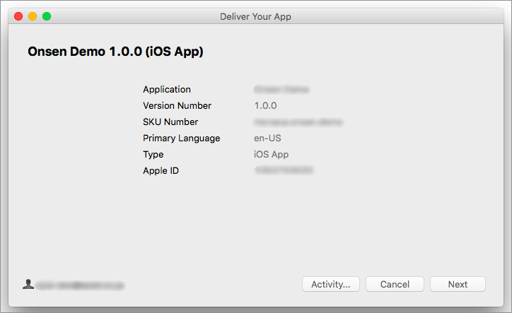

iTunes Connect ガイド
=====================

  
<b>Last Updated: </b> January 28th, 2016

   

App Store にアプリを提出する場合には、iTunes Connect
を使用します。ここでは、その使用方法を解説します。

事前準備
--------

[iOS Developer Program](https://developer.apple.com/) 上で、
[チームエージェント ( Team Agent ) の役割 ( Role
)](https://developer.apple.com/support/roles/)
を持つアカウントを用意します。

アプリの登録
------------

次に手順に従い、iTunes Connect へアプリを登録します。

1.  チームエージェントのアカウントを使用して、[iTunes
    Connect](https://itunesconnect.apple.com/) にログインします。
2.  マイ App を選択します。
3.  + --&gt; 新規 App を選択します。

> 
>
> > width
> >
> > :   600px
> >
> > align
> >
> > :   left
> >
4.  アプリ情報を入力します。

> 
>
> > width
> >
> > :   600px
> >
> > align
> >
> > :   left
> >
5.  作成 ボタンをクリックします。次に、\[ App 情報 \]
    ページに遷移します。
6.  \[ App 情報 \] ページ上で、アプリの \[ カテゴリ \]
    を適宜選択して、保存 ボタンをクリックします。

> 
>
> > width
> >
> > :   600px
> >
> > align
> >
> > :   left
> >
7.  価格および配信状況 ページに移動して、必要な情報 (
    価格表、配信地域、割引設定など ) を設定し、 Save
    ボタンをクリックします。

> 
>
> > width
> >
> > :   600px
> >
> > align
> >
> > :   left
> >
8.  提出準備中 へ移動して、次の情報を入力します。

> -   App ビデオプレビューとスクリーンショット ( 最低限 1
>     つ、スクリーンショットが必要 )
> -   説明
> -   キーワード
> -   サポート URL
> -   App アイコン
> -   Copyright
> -   連絡先情報
>
> 
>
> > width
> >
> > :   600px
> >
> > align
> >
> > :   left
> >
9.  設定後、 保存 ボタンをクリックします。

アプリのアップロード
--------------------

アプリのアップロード時、Mac
環境を必要としない時期も過去にはありましたが、2012年8月時点では、同環境が必須となっています。これは、iTunes
Connect へアプリをアップロードするとき、Application Uploader ( Mac 専用
) を使用することが要件に加わったためです。

この制約を取り除くため、Monaca では、Monaca クラウド IDE から iTunes
Connect
にアプリを直接アップロードできる機能をリリースしました。これにより、アプリのアップロードのために、Mac
環境をわざわざ用意する必要がなくなりました。

この機能の詳細は、upload\_via\_ide をご確認ください。

前述の Monaca 提供のアップロード機能とは別に、今までどおり Application
Loader も、次のように使用できます。

1.  リリースビルド版のアプリを Monaca
    上で作成して、ダウンロードします。詳細は、building\_for\_ios
    をご確認ください。
2.  iTunes Connect から Application Uploader
    をダウンロードして、インストールします。

> 
>
> > width
> >
> > :   600px
> >
> > align
> >
> > :   left
> >
3.  Application Uploader を開き、Apple のアカウントでログインします。
4.  App をデリバリ を選択して、選択... をクリックします。

> 
>
> > width
> >
> > :   500px
> >
> > align
> >
> > :   left
> >
5.  次の画面が表示されるので、リリースビルドしたアプリのファイルを選択します。次に、送信
    ボタンをクリックして、アプリをアップロードします。

> 
>
> > width
> >
> > :   500px
> >
> > align
> >
> > :   left
> >
6.  アップロード後、次へ ボタンをクリックして、次に、終了
    ボタンをクリックします。iTunes Connect
    上にアプリが表示されていることを確認します (
    しばらく時間がかかる場合があります )。

> 

>
> バージョンが異なる同一アプリをアップロードする場合、ファイル内のバージョン情報を、対応するバージョンに変更しておく必要があります。それ以外の場合、アップロードが失敗します。
>
> 

アップロード後に行うアプリの設定
--------------------------------

iTunes Connect へアプリをアップロードした後、App Store へ提出する 「
ビルド 」 を選択します。次の手順に従います。

1.  iTunes Connect 上の 提出準備中 へ移動して、\[ ビルド \]
    項目へ行き、+ をクリックします。

> 
>
> > width
> >
> > :   600px
> >
> > align
> >
> > :   left
> >
2.  対象のビルドを選択して、終了 ボタンをクリックします。

> 
>
> > width
> >
> > :   600px
> >
> > align
> >
> > :   left
> >
3.  保存する ボタンをクリックします。

アプリの提出
------------

ここまでの手順で、申請に必要な設定が完了しました。次は、申請に向け、アプリを実際に提出します。

1.  iTune Connect 上の 提出準備中 へ移動します。
2.  レビュー審査のために送信 をクリックします。

アプリの登録申請後、Apple による審査が行われます。この過程では、App
Store での配布基準に適合しているかが審査されます。レビューには、2
週間ほど、通常かかります。

アプリの配布
------------

審査の通過後、App Store 上にて、アプリの配布が開始されます。

大きいサイズのアプリ用アイコンは、以前は必要ありませんでしたが、現在は、申請要件の
1
つとなっています。また、周知のとおり、申請に必要な要件は随時更新されています。申請がうまくいかない場合には、最新の要件を確認して、適切に対応する必要があります。

