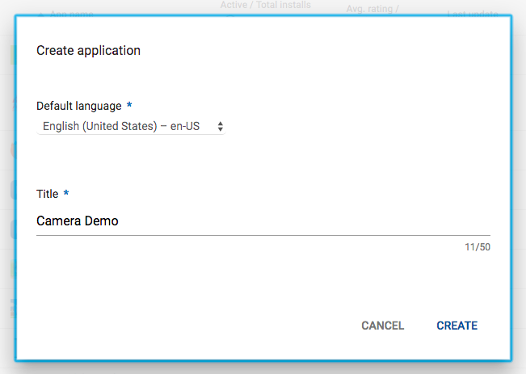
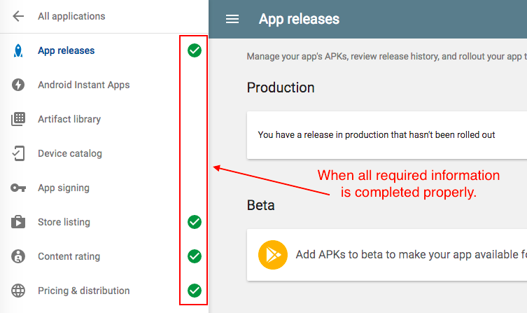

Google Play での配布
====================

事前準備
--------

Google Play ストアでアプリを配布するためには、 *Google Play Developer
Console*
アカウントに登録しておく必要があります。ディベロッパー登録料は、
`25 ドル` です ( 定期的な更新はありません )。
登録処理が完了するまで、`2` 日ほど要します。登録は、
[ディベロッパー登録画面](https://play.google.com/apps/publish/)
から行えます。

有料アプリを配布する場合は、Google Payments Merchant Center
アカウントにも登録します。登録に関しては、
[こちらのリンク](https://support.google.com/googleplay/android-developer/answer/answer.py?hl=en&answer=2972701)
をご確認ください。

リリースビルドのアプリを作成
----------------------------

Monaca クラウド IDE のビルド機能を使用すれば、Google Play
へアップロードできるリリースビルド版のアプリをビルドできます。

リリースビルド版のアプリをビルドする場合、 building\_for\_android
の手順に従います。ビルドの完了後、アプリ ( apk ファイル )
をダウンロードします。

Google Play へのアプリの登録
----------------------------

1.  [Google Play Developer
    Console](https://play.google.com/apps/publish/)
    へ行き、ログインします。
2.  アプリの作成 ボタンをクリックします。
3.  デフォルトの言語を選択し、アプリのタイトルを入力します。次に、 作成
    をクリックします。 その後、 *ストアの掲載情報* ページへ移動します。

> 
>
> > width
> >
> > :   600px
> >
> > align
> >
> > :   left
> >
4.  このページでは、以下の必要な情報を入力し、 未公開版を保存
    をクリックする必要があります。

5.  Go to *コンテンツ レーティング* section and click CONTINUE.
6.  メールアドレスを入力し、アプリカテゴリを選択してください。
    次に、選択したアプリカテゴリに関連する質問に答えるように求められます。
7.  アンケートを保存 と レーティングを算定 をクリックします。
8.  評価情報を確認し、 レーティングを適用 クリックします。
9.  *価格と販売 / 配布地域* に移動します。
    このページでは、アプリの価格と在庫状況に関するさまざまな質問を完了するように求められます。
    この時点で、アプリのリリース準備のために必要な情報が整います。

アプリのリリース
----------------

このセクションでは、APK ファイルのアップロードを開始し、Play
ストアに送信する前にアプリのリリース情報を設定します。

1.  *アプリのリリース* に移動します。 このページでは、テスト用の APK
    ファイル ( ベータ版とアルファ版 ) と製品版をアップロードできます。
    *製品版* 項目で、 製品版を管理 をクリックします。 次に、
    リリースを作成 をクリックします。
2.  次に、以下が必要になります。

> -   *Google Play App Signing ( アプリの署名 )* を完了します。
> -   APK ファイルを追加します。
> -   リリース名（リリースバージョン）を設定します。
> -   このリリースの新機能を記載します。

3.  保存 と 確認 をクリックします。
4.  アプリのリリース情報を確認し、 製品版として公開を開始
    ボタンをクリックしてアプリを Play ストアに送信します。
    アプリの設定に問題がある場合は、アプリを送信することはできませんのでご注意ください。
    必要な設定が完了していない場合は、 製品版として公開を開始
    ボタンをクリックすることはできません。

> 
>
> > width
> >
> > :   600px
> >
> > align
> >
> > :   left
> >

