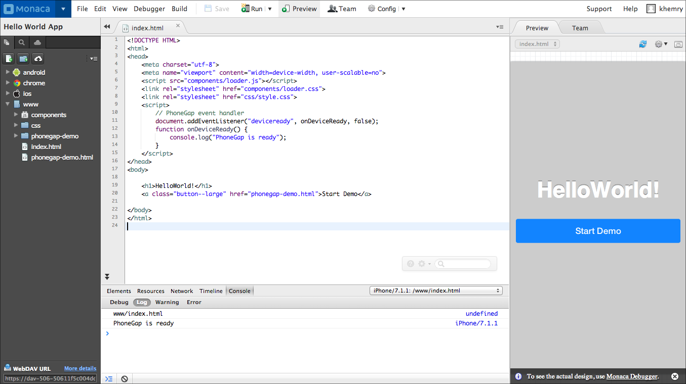

マニュアル
==========

> width
>
> :   500px
>
> class
>
> :   center
>
Monaca クラウド IDE
では、プロジェクトの開発からビルドまでを、総合的にサポートするインターフェースを提供しています。ここでは、Monaca
クラウド IDE
の画面構成、エディターの機能、プロジェクトファイルの管理方法について解説します。

> glob
>
> :   
>
> maxdepth
>
> :   2
>
> overview changes code\_editor/index dependencies/index
> version\_control/index monaca\_ci/index build/index deploy/index
