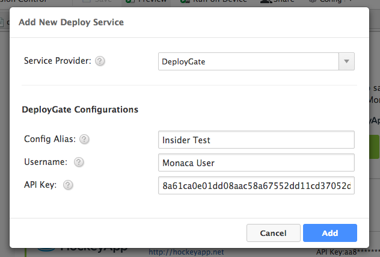
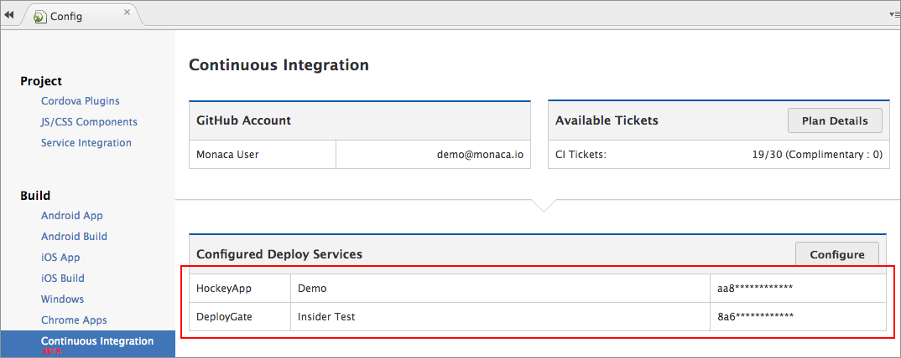
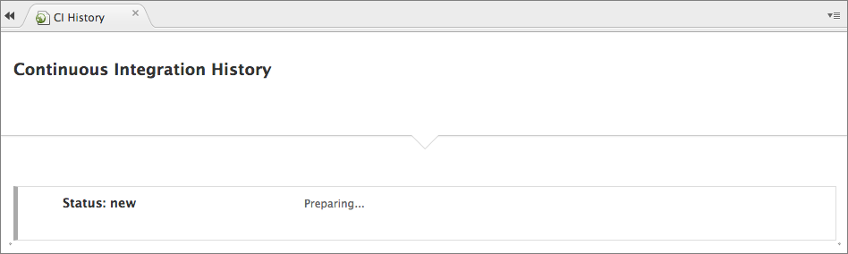
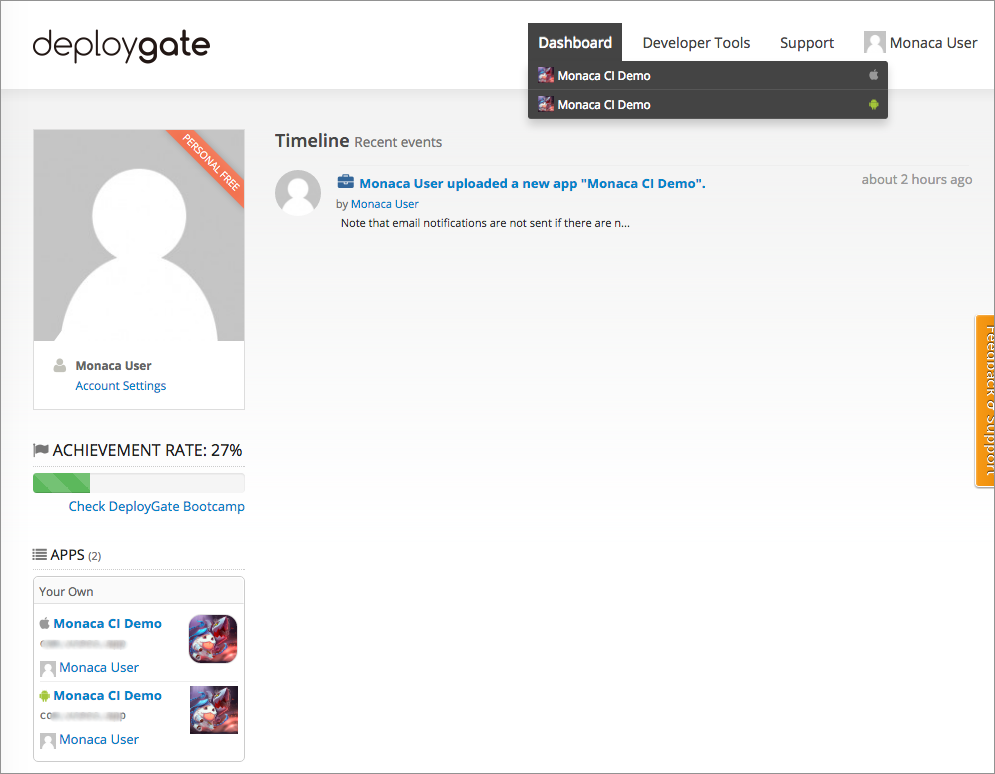
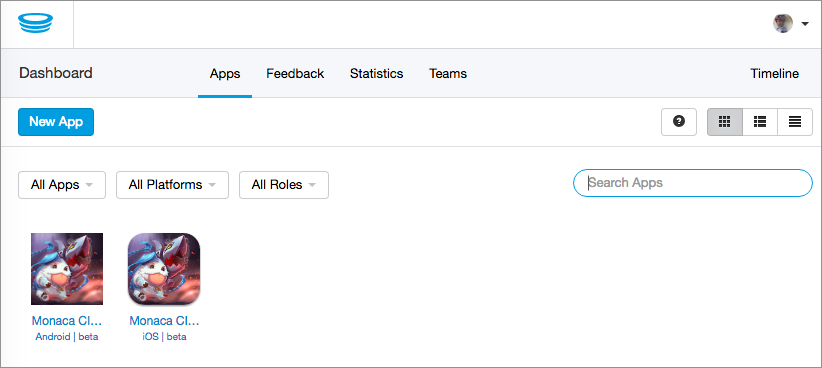

概要
====

概要
----

Monaca CI は、Monaca の開発環境に新しく組み込まれた、CI ( Continuous
Integration/継続的インテグレーション )
を実現するためのサービスです。このサービスを使用すると、プロジェクトのビルド処理の自動化、検証版アプリの配信/配布処理の自動化を行えるため、開発を大幅に効率化できます。自動化処理の基礎には、Webhook
を使用しています。Webhook を使用することにより、GitHub または Git
系のサービスと容易に連携することができます ( Webhook
経由で、コードのコミット、ブランチ/タグの作成など、特定のイベントを処理できます
)。Monaca CI
の処理を、ここで簡単に解説します。最初に、ユーザーがプロジェクトを
GitHub にプッシュすると、GitHub 側から Monaca サーバー側へ HTTP POST
リクエストが発行されます。このリクエスト内容が Monaca CI
側で保持している設定と一致する場合には、前述の処理 (
ビルド処理、および、指定されていれば配信/配布処理 ) が実行されます。

Monaca CI
を使用することにより、ビルド処理・検証処理・配信/配布処理をはじめとする、手間のかかる処理から開発者は解放され、アプリの内容・性能に注力して、開発が行えるようになります。

事前準備
--------

Monaca CI を使用する前に、Monaca アカウントと GitHub
を連携させる必要があります。連携手順は、次のとおりです。

1.  Monaca アカウントと GitHub
    を連携させます。詳細は、github\_integration をご確認ください。
2.  GitHub
    レポジトリとプロジェクトを接続させます。詳細は、version\_control\_configuration
    をご確認ください。

<div class="admonition note">

Monaca CI のご利用には、Cordova の 6.2 以上が必要です。

</div>

Monaca CI の使用方法
--------------------

次の手順に従い、Monaca CI を使用します。GitHub
レポジトリとプロジェクトとの接続が完了していることを前提に、ここでは解説をします。

1.  Monaca クラウド IDE
    のメニューから、設定 --&gt; 継続的インテグレーション を選択します。
2.  \[ JSON 設定 \]
    項目では、次のような設定がデフォルトで記述されています (
    詳細は、JSON 設定 &lt;monaca\_ci\_json&gt; を参照のこと
    )。これらのパラメーターを使用して、Monaca CI
    の挙動を設定します。次のような設定の場合、GitHub ブランチ/タグ
    へプロジェクトコードをプッシュ ( push )
    するたびに、デバッグビルドとリリースビルド版 iOS
    アプリのビルドを行うよう、Monaca CI は Monaca
    サーバー側へ命令します。ビルド完了後は、\[ ビルド一覧 \]
    パネル上で、ビルド済みのファイルをダウンロードすることができます (
    ビルド --&gt; ビルド履歴一覧 )。

> ``` {.sourceCode .javascript}
> [
>         {
>             "task_name": "Default",
>             "branch": "/master/",
>             "platform": [
>                 "android",
>                 "ios"
>             ],
>             "build": [
>                 "debug",
>                 "release"
>             ],
>             "deploy": []
>         }
>     ]
> ```

3.  デフォルトでは、Monaca CI
    は無効にされています。有効にするためには、有効にする
    をクリックして、次に 保存する をクリックします。これで、Monaca CI
    を使用する準備が完了し、JSON 設定内で指定している GitHub
    のブランチ/タグへ、プロジェクトをプッシュ ( push )
    することができます。プッシュ後は、\[ ビルド一覧 \]
    パネルからビルド済みのファイルをダウンロードできます。なお、ビルド処理には、数分かかるときがあります。

> {width="600px"}

<div class="admonition warning">

リリースビルド版アプリ ( iOS および Android 向け ) の場合、「 初回 」
のビルドは、IDE
上で、手動で、行う必要があります。初回のビルド以降は、Monaca CI
を使用して、自動でビルドを行えます (
リリースビルド版を初めてビルドする場合、Android
では、有効なキーストアの入力が必要になり、iOS
では、有効なプロビジョニングプロファイルのアップロードが必要になるためです
)。

</div>

デプロイサービス ( 配信/配布支援サービス ) の組み込み
-----------------------------------------------------

Monaca CI
を使用すれば、アプリの配信/配布処理を自動化することもできます。自動化の方法は、次のとおりです。

1.  Monaca クラウド IDE のメニューから、設定 --&gt; デプロイサービス
    を選択します。
2.  新しく追加する をクリックします。
3.  デプロイサービスを選択して、詳細設定を入力します。入力後、追加
    をクリックします。詳細設定で入力する項目は、次のとおりです。

> -   エイリアス名 :
>     各サービスの管理に使用する、一意の識別子を入力します。
> -   ユーザー名 ( DeployGate 専用 ) :
>     アプリ所有者のユーザー名または組織名を入力します。
> -   API キー ( DeployGate の場合 ) または API トークン ( HockeyApp
>     の場合 ) : API キー ( または API トークン )
>     は、デプロイサービスのプロバイダーから入手できます。入手方法に関しては、DeployGate からの API キーの入手方法 &lt;api\_key\_deploygate&gt;
>     または
>     HockeyApp からの API トークンの入手方法 &lt;api\_key\_hockeyapp&gt;
>     をご確認ください。
>
> 
>
> > width
> >
> > :   600px
> >
> > align
> >
> > :   left
> >
> > DeployGate
>
> 
>
> > width
> >
> > :   600px
> >
> > align
> >
> > :   left
> >
> > HockeyApp

4.  \[ 継続的インテグレーション \] パネルへ行き、\[ デプロイサービス一覧
    \] 上に、追加したサービスが表示されていることを確認します。

> 
>
> > width
> >
> > :   700px
> >
> > align
> >
> > :   left
> >
5.  \[ JSON 設定 \] 内に、デプロイサービス側の設定を追記します。次の
    JSON の記述では、GitHub のブランチ 「 `\"release\"` 」
    にプロジェクトをプッシュ ( push ) して、デバッグビルド版の iOS と
    Android
    アプリをビルドします。そして、ビルドしたアプリの配信/配布には、`DeployGate`
    サービスを使用します。付随するオプション設定 ( DeployGate
    サービス側で提供しているオプション機能 )
    も行います。ここでは、リリースノートの作成は行いますが、email
    でのリリース通知 ( iOS 端末専用のオプション ) は無効にしています。

> ``` {.sourceCode .javascript}
> [
>     {
>         "task_name": "Beta Test",
>         "branch": "/release/",
>         "platform": [
>             "ios",
>             "android"
>         ],
>         "build": [
>             "debug"
>         ],
>         "deploy": [
>             {
>                 "type": "DeployGate",
>                 "alias": "Insider Test",
>                 "default": {
>                     "release_note": "This is a beta test for insider testing."
>                 },
>                 "ios": {
>                     "disable_notify": "yes"
>                 }
>             }
>         ]
>     }
> ]
> ```

6.  設定後、保存する をクリックします。

<div class="admonition note">

Monaca CI では、複数のデプロイサービス (
検証版アプリの配信/配布支援サービス )
を組み込むことができます。また、各デプロイサービスには、単数・複数のエイリアス
( alias ) を割り当てることもできます。サポートしているデプロイサービス (
またはサポート予定 ) に関しては、supported\_services をご確認ください。

</div>

JSON 設定
---------

Monaca CI では、JSON のレシピ ( アプリの設定に使用する、JSON
のフィールドとその値の集合体 )
を使用して、処理を自動化しています。よって、行う処理は、JSON
形式で指定します。

### パラメーター

レシピで使用するパラメーターは、次のとおりです。

+--------+-------------------------------------------------------------+
| パラメーター | | 説明                                                |
+========+=============================================================+
| `task_ | > ビルド処理に付ける名前を指定します。                      |
| name`  |                                                             |
+--------+-------------------------------------------------------------+
| `branc | > プロジェクトをビルドするときに使用する、GitHub            |
| h`     | > のブランチを指定します。JSON の正しい記法を使用します。   |
+--------+-------------------------------------------------------------+
| `tag`  | > プロジェクトをビルドするときに使用する、GitHub            |
|        | > タグを指定します。                                        |
+--------+-------------------------------------------------------------+
| `platf | > ビルドを行うプラットフォームを指定します。設定できる値は、`ios`、`android`、`winrt` |
| orm`   |                                                             |
|        | > です。                                                    |
+--------+-------------------------------------------------------------+
| `build | > ビルドの種類を指定します。設定できる値は、`debug`、`release` |
| `      |                                                             |
|        | > です。                                                    |
+--------+-------------------------------------------------------------+
| `deplo | > アプリの配信/配布に使用するデプロイサービス ( 複数設定可  |
| y`     | > )                                                         |
|        | >                                                           |
|        | > -   `type`: デプロイサービス名を指定します (              |
|        | >     大文字・小文字を区別 )。                              |
|        | > -   `alias`:                                              |
|        | >     デプロイサービスのエイリアス名/連携名を指定します (   |
|        | >     大文字・小文字を区別 )。                              |
|        | > -   `default`: 各種オプション (                           |
|        | >     デプロイサービス提供の機能 ) を設定するブロックです。 |
|        | > -   `ios`: iOS 向けのオプション設定 (                     |
|        | >     デプロイサービス提供の機能 ) 用のブロックです。       |
|        | > -   `android`: Android 向けのオプション設定 (             |
|        | >     デプロイサービス提供の機能 ) 用のブロックです。       |
|        | >                                                           |
|        | > デプロイサービスごとのオプション設定は、こちら &lt;supported\_services&gt; |
|        |                                                             |
|        | > をご確認ください。                                        |
+--------+-------------------------------------------------------------+

### 例

複数のデプロイサービスの組み込み方法、および、1
つのデプロイサービスに複数のエイリアスを割り当てる方法を、次に記します。

``` {.sourceCode .javascript}
[
    {
        "task_name": "test",
        "branch": "/master/",
        "platform": [
            "ios",
            "android"
        ],
        "build": [
            "debug",
            "release"
        ],
        "deploy": [
            {
                "type": "DeployGate",
                "alias": "Internal-Focus-Group",
                "default": {
                  "release_note": "This is a beta test for insider testing."
                },
                "ios": {
                  "disable_notify": "yes"
                }
            },
            {
                "type": "DeployGate",
                "alias": "External-Focus-Group",
                "default": {
                  "release_note": "This is a beta test for outsider testing."
                },
                "ios": {
                  "disable_notify": "yes"
                }
            },
            {
                "type": "HockeyApp",
                "alias": "Demo",
                "default": {
                  "notes": "This is a beta test for demo."
                }
            }
        ]
    }
]
```

Monaca CI 側の処理
------------------

ここでは、Monaca CI を使用して、iOS 向け および Android
向けのリリースビルド版アプリをビルドする例を紹介します。プロジェクトコードのプッシュ
( push ) 先には、`master` ブランチを指定しています。また、Monaca CI
を使用して、DeployGate と HockeyAPP の 2
つのデプロイサービス上へ、ビルド済みファイルを送ります。JSON
レシピは、次のようになります。

``` {.sourceCode .javascript}
[
  {
    "task_name": "Default",
    "branch": "/master/",
    "platform": [
      "ios",
      "android"
    ],
    "build": [
      "release"
    ],
    "deploy": [
      {
        "type": "DeployGate",
        "alias": "Insider Test",
        "default": {
          "release_note": "This is a beta test for insider testing."
        },
        "ios": {
          "disable_notify": "yes"
        }
      },
      {
        "type": "HockeyApp",
        "alias": "Demo",
        "default": {
          "notes": "This is a beta test for demo."
        }
      }
    ]
  }
]
```

上記の JSON 設定を実行した場合、Monaca CI
側では、次の処理が実行されます。

1.  GitHub へコードをプッシュ ( Push ) します。
2.  GitHub 上のブランチ/タグ ( JSON レシピ内で指定されたブランチ/タグ )
    へコードがプッシュされた後、Monaca
    サーバー側では、プロジェクトのビルドを開始します。ビルドの進捗状況を確認する場合には、IDE
    上の ビルド --&gt; 継続的インテグレーション結果一覧
    をご確認ください。また、ビルド済みのファイルを確認・ダウンロードする場合には、ビルド --&gt; ビルド履歴一覧
    をご確認ください。

> {width="700px"}
>
> {width="700px"}
>
> {width="700px"}

3.  ビルド処理の完了後、Monaca
    サーバー側から、指定されたデプロイサービス側へ、ビルド済みファイルを送ります。

> {width="700px"}
>
> {width="700px"}
