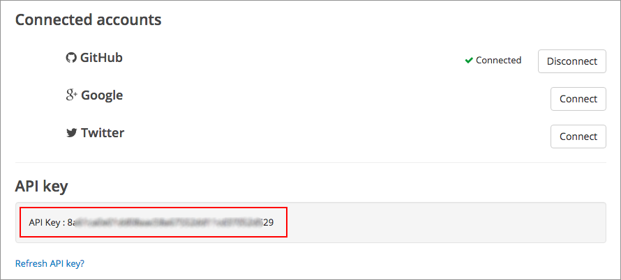
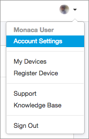
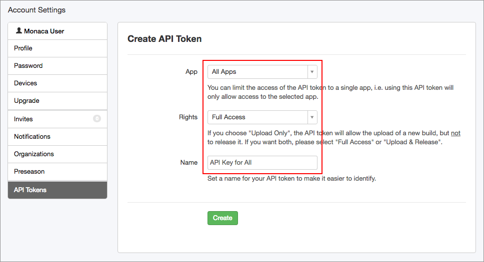
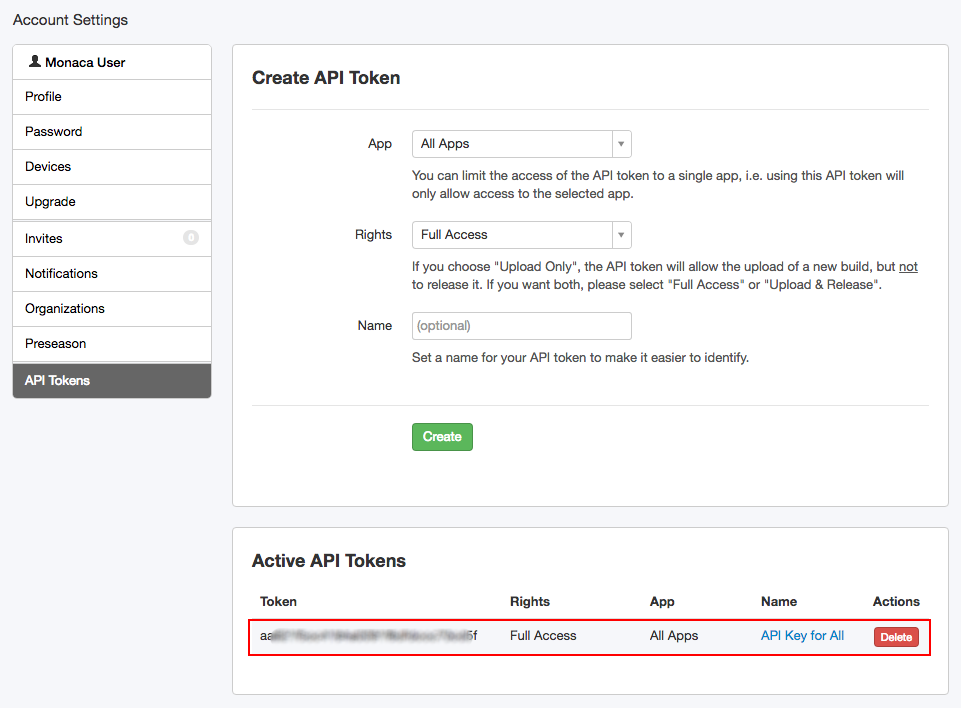

検証版アプリなどの配信/配布支援サービス ( デプロイサービス )
============================================================

サポートしている支援サービス
----------------------------

### DeployGate

[DeployGate](https://deploygate.com/) を使用すれば、開発中の iOS と
Android
アプリを、参加メンバー間で簡単に共有できます。また、このサービスを使用すれば、さまざまな段階
( プロトタイプ、開発、検証、マーケティングなど )
におけるアプリの配信作業を、滞りなく行えます。

Monaca CI では、次のパラメーターをサポートしています ( JSON 形式
)。詳細は、[DeployGate API ドキュメント ( 日本語サイト
)](https://deploygate.com/docs/api) をご確認ください。

+----------+-----------------------------------------+----------------+
| パラメーター | | 説明                              | 備考           |
+==========+=========================================+================+
| `token`  | > 「 API キー 」                        | れている API   |
|          | > を指定します。グループでの利用の場合には、グループのページに表示さ | キー |
|          |                                         | を使用します。これにより、メ |
|          |                                         | ンバーの種類   |
|          |                                         | ( 役割/権限 )  |
|          |                                         | とは関わりなく、アプリをアッ |
|          |                                         | プロードすることができます。 |
|          |                                         |                |
|          |                                         | |              |
|          |                                         | このキーは、自動的に生成され |
|          |                                         | ます。DeplyGate |
|          |                                         |                |
|          |                                         | サイトの \[    |
|          |                                         | 配信支援サービス設定 |
|          |                                         |                |
|          |                                         | \]、または、Monaca |
|          |                                         |                |
|          |                                         | クラウド IDE   |
|          |                                         | の \[          |
|          |                                         | デプロイサービス一覧 |
|          |                                         |                |
|          |                                         | \] 上で、API   |
|          |                                         | キーを確認できます。 |
+----------+-----------------------------------------+----------------+
| `file`   | 対象アプリのバイナリ―ファイルを設定します。 | > | 自動で生成されます。 |
+----------+-----------------------------------------+----------------+
| `message | \[ 任意 \]                              | > |            |
| `        | プッシュ時に表示する通知メッセージを設定します。 |       |
+----------+-----------------------------------------+----------------+
| `distrib | \[ 任意 \] 配布キー ( Distribution Key  | 示す URL       |
| ution_ke | )                                       | に使用されている |
| y`       | を設定します。配布キーとは、配布ページを指し |           |
|          |                                         | hash 値です (  |
|          |                                         | たとえば、https://d |
|          |                                         | eploygate.com/ |
|          |                                         | distributions/ |
|          |                                         | \[             |
|          |                                         | 配布キー \]    |
|          |                                         | )。また、配布ページとは、配 |
|          |                                         | 布対象者向けに作成された、ア |
|          |                                         | プリのダウンロード用のページ |
|          |                                         | です。配布ページの作成は、D |
|          |                                         | eployGate      |
|          |                                         | のサイト上から行えます。 |
|          |                                         |                |
|          |                                         | |              |
+----------+-----------------------------------------+----------------+
| `release | \[ 任意 \] 配布ページ (                 | するメッセージ |
| _note`   | ダウンロード用ページ )                  | |              |
|          | からアプリをダウンロードするときに表示  |                |
+----------+-----------------------------------------+----------------+
| `disable | \[ 任意 \] (`iOS 専用`) yes             |                |
| _notify` | を設定した場合、email                   |                |
|          | での通知を行いません。 |                |                |
+----------+-----------------------------------------+----------------+
| `visibil | > \[ 任意 \]                            | ) または       |
| ity`     | > アップロードするアプリのセキュリティー設定です。`private` | `public` |
|          |                                         | を指定します。個人開発者向け |
|          | > ( デフォルト                          | の無料プラン   |
|          |                                         | ( Personal     |
|          |                                         | Free )         |
|          |                                         | を利用している場合、`pub |
|          |                                         | lic`           |
|          |                                         | に設定します。無料プランの場 |
|          |                                         | 合、プライベート |
|          |                                         |                |
|          |                                         | ( 非公開 )     |
|          |                                         | 設定は利用できません。また、 |
|          |                                         | private        |
|          |                                         | に指定しても、無視されます。 |
|          |                                         |                |
|          |                                         | |              |
+----------+-----------------------------------------+----------------+

#### API キー または API トークンの取得方法

1.  [DeployGate](https://deploygate.com/) にログインします。
2.  アカウント設定/Account Settings を選択します。

> {width="238px"}

3.  \[ プロフィール \]
    画面が表示されます。ページの最下部まで移動して、\[ API key \]
    を確認します。

> {width="700px"}

### HockeyApp

[HockeyApp](https://hockeyapp.net/) では、モバイルアプリ開発の DevOps
に役立つ、さまざまな機能 (
ベータ版アプリの配信、クラッシュレポート、ユーザーの監視、ユーザーからのフィードバック、ユーザーの監視、他のシステムとの連携
) が提供されています。

Monaca CI では、次のパラメーターをサポートしています ( JSON 形式
)。詳細は、[HockeyApp API ドキュメント ( 英語サイト
)](https://support.hockeyapp.net/kb/api/api-apps) をご確認ください。

+----------+-----------------------------------------+----------------+
| パラメーター | | 説明                              | 備考           |
+==========+=========================================+================+
| `ipa`    | > `.ipa` ( iOS の場合 )、`.app.zip` (   | の場合 )       |
|          | > OS X の場合 )、または、`.apk` (       | を指定します。 |
|          | > Android                               | |              |
|          |                                         | 自動で生成されます。 |
+----------+-----------------------------------------+----------------+
| `dsym`   | \[ 任意 \] `.dSYM.zip` ファイル (       | oid の場合 )   |
|          | iOS・OS X の場合 ) または `mapping.txt` | を指定します。iOS・OS |
|          | ( Andr                                  |                |
|          |                                         | X              |
|          |                                         | の場合、拡張子は |
|          |                                         |                |
|          |                                         | `.dsym.zip`    |
|          |                                         | となります (   |
|          |                                         | 大文字・小文字を区別します |
|          |                                         |                |
|          |                                         | )。Andorid     |
|          |                                         | の場合には、ファイル名は |
|          |                                         |                |
|          |                                         | `mapping.txt`  |
|          |                                         | となります。 | |
+----------+-----------------------------------------+----------------+
| `notes`  | > \[ 任意 \]                            | えるサイズの場合、超えた分の |
|          | > リリースノートの形式を指定します (    | 文字は省略されます |
|          | > Textile または Markdown 形式。5k を超 |                |
|          |                                         | )。 |          |
+----------+-----------------------------------------+----------------+
| `notes_t | \[ 任意 \]                              | > |            |
| ype`     | リリースノートの形式を指定します。      | >              |
|          |                                         | > > ##### |    |
|          | > -   Textile 形式の場合、`0`           |                |
|          | >     を設定します。                    |                |
|          | > -   Markdown 形式の場合、`1`          |                |
|          | >     を設定します。                    |                |
+----------+-----------------------------------------+----------------+
| `notify` | \[ 任意 \] テスターへ通知します。「     | となります。Full-Acc |
|          | Full-Access トークン 」                 | ess            |
|          | を設定した場合だけ、有効                | トークン       |
|          |                                         | に関しては、HockeyAP |
|          | > -   テスターに通知しない場合には、`0` | P              |
|          | >     を指定します。                    | サイトの \[    |
|          | > -   アプリのインストールを許可するテスターだけに通知する場合には、`1 | API Token \] |
|          | `                                       | 項目をご確認ください。 |
|          | >     を指定しま                        |                |
|          | > -   すべてのテスターに通知する場合には、`2` | |        |
|          |                                         |                |
|          | >     を指定します。                    | > |            |
|          |                                         |                |
|          |                                         | す。 |         |
|          |                                         |                |
|          |                                         | :   |          |
+----------+-----------------------------------------+----------------+
| `status` | \[ 任意 \]                              | を設定した場合だけ、有効とな |
|          | ダウンロードに関するパーミッションを設定します。「 | ります。Full-Acces |
|          |                                         | s              |
|          | Full-Access トークン 」                 | トークン       |
|          |                                         | に関しては、HockeyAP |
|          | > -   対象バージョンのダウンロードを禁止する場合には、`1` | P |
|          |                                         | サイトの API   |
|          | >     を指定します。                    | 解説 「 API:   |
|          | > -   対象バージョンのダウンロードを許可する場合には、`2` | Basics and |
|          |                                         | Authentication |
|          | >     を指定します。                    | 」             |
|          |                                         | をご確認ください。 |
|          |                                         |                |
|          |                                         | |              |
|          |                                         |                |
|          |                                         | > ##### |      |
+----------+-----------------------------------------+----------------+
| `tags`   | \[ 任意 \]                              | 。Tags         |
|          | ダウンロードを行えるユーザーを絞り込みます | を複数指定する場合は、カンマ |
|          |                                         | で区切ります   |
|          | \[ Tags ( 文字列 ) を指定します         | \]。 \[        |
|          |                                         | 翻訳者メモ :   |
|          |                                         | Tags           |
|          |                                         | とは、開発者が自由に設定でき |
|          |                                         | るユーザーカテゴリーを指しま |
|          |                                         | す             |
|          |                                         | \] |           |
+----------+-----------------------------------------+----------------+
| `teams`  | \[ 任意 \]                              | を複数指定する場合は、カンマ |
|          | ダウンロードを行えるチームを絞り込みます | で区切ります  |
|          |                                         | )。 |          |
|          | ( Team ID を指定します。Team ID         |                |
|          |                                         |                |
|          | > -   たとえば、`teams=12,23,42`        |                |
|          | >     のように指定します。数値は、Team  |                |
|          | >     ID です。 |                       |                |
+----------+-----------------------------------------+----------------+
| `users`  | \[ 任意 \]                              | D              |
|          | ダウンロードを行えるユーザーを絞り込みます | を複数指定する場合は、カンマ |
|          |                                         | で区切ります   |
|          | ( User ID を指定します。User I          | )。 |          |
|          |                                         |                |
|          | > -   たとえば、`users=1224,5678`       |                |
|          | >     のように指定します。数値は、User  |                |
|          | >     ID です。 |                       |                |
+----------+-----------------------------------------+----------------+
| `mandato | \[ 任意 \]                              | > |            |
| ry`      | 対象バージョンのインストールを、必須または任意にするか指定します。 |  |
|          |                                         | > |            |
|          |                                         | >              |
|          | > -   任意の場合、`0` を設定します。    | > :   |        |
|          | > -   必須の場合、`1` を設定します。    |                |
+----------+-----------------------------------------+----------------+
| `release | \[ 任意 \]                              | > |            |
| _type`   | リリースの種類に応じて、値を設定しています。 | >         |
|          |                                         | > > |          |
|          |                                         | > >            |
|          | > -   アルファ版の場合、`2`             | > > :   |      |
|          | >     を設定します。                    | > >            |
|          | > -   ベータ版の場合、`0` を設定します  | > > |          |
|          | >     ( デフォルト )。                  | > >            |
|          | > -   ストア版の場合、`1`               | > > :   |      |
|          | >     を設定します。                    |                |
|          | > -   エンタープライズ版の場合、`3`     |                |
|          | >     を設定します。                    |                |
+----------+-----------------------------------------+----------------+

#### API キー または API トークンの取得方法

1.  [HockeyApp](https://hockeyapp.net/) にログインします。
2.  アカウント設定/Account Settings を選択します。

> {width="183px"}

3.  \[ Account Settings \] 画面の左側に表示された一覧から、API Tokens
    を選択します。次に表示される画面上では、既存の API トークン
    の確認、および、API
    トークンの新規作成を行えます。ここでは、既存のトークンが存在しないことを前提に解説します。次の赤枠で囲まれた項目を指定して、トークンを作成します。

> {width="700px"}

4.  API
    トークンの作成後、画面の最下部まで移動して、作成されたトークンが表示されていることを確認します。

> {width="700px"}

Upcoming Supported 検証版アプリなどの配信/配布支援サービス (
デプロイサービス ) =========================================

上述のサービス以外にも、今後、次の配信/配布支援サービス (
デプロイサービス ) を追加していく予定です。

-   [Test Flight](https://developer.apple.com/testflight/)
-   [Appetize.io](https://appetize.io/)

