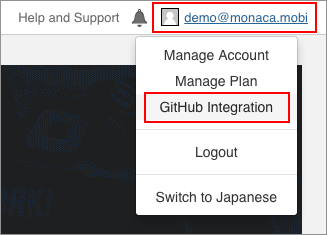
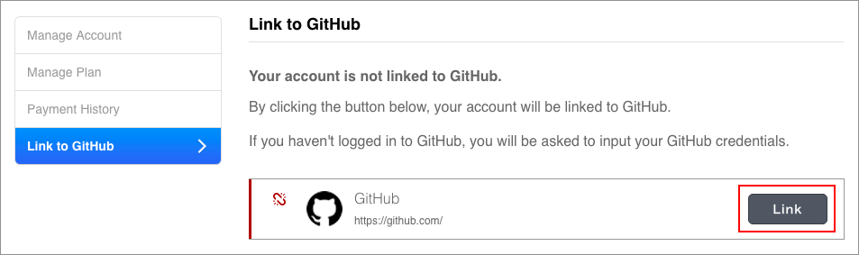
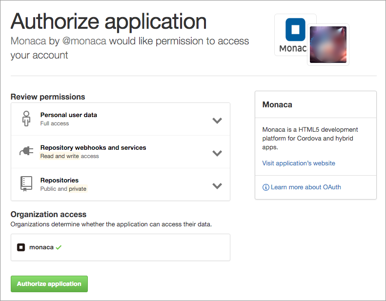
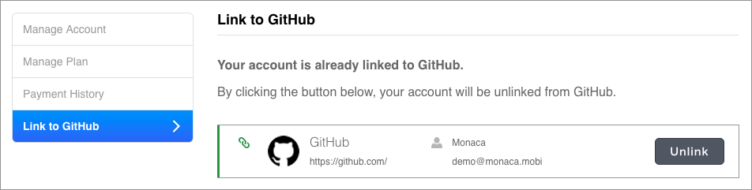
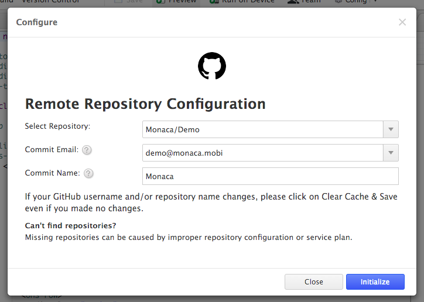
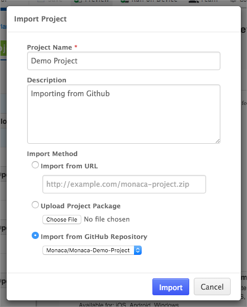
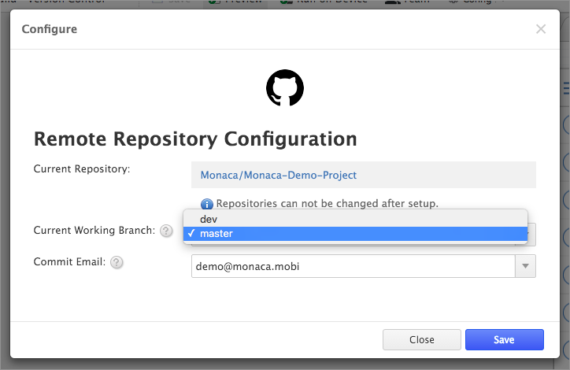
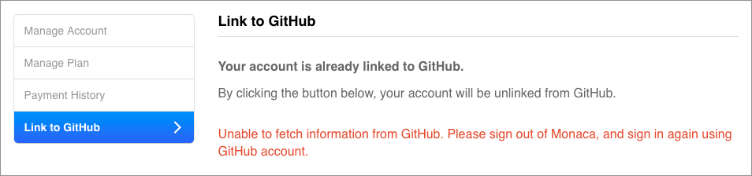
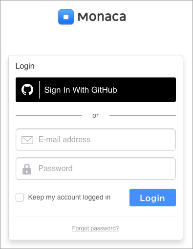

GitHub との連携
===============

ここでは、Public 指定されたレポジトリを対象として解説を進めます。Private
指定のレポジトリに接続する場合には、対応する Monaca
プランに加入する必要があります。詳細は、[料金プラン](https://ja.monaca.io/pricing.html)
をご確認ください。

事前準備
--------

Monaca クラウド IDE
のバージョン管理機能を使用する場合、次のアカウントが必要となります。

-   [GitHub](https://github.com/join) アカウント
-   [Monaca](https://monaca.mobi/en/register/start) アカウント

セットアップ
------------

この項目では、Monaca アカウントと GitHub
アカウントをリンクする方法を解説します。

1.  Monaca アカウントを使用して、[Monaca クラウド
    IDE](https://monaca.mobi/ja/login) にログインします。
2.  Go to Your profile name --&gt; GitHub との連携.

> 
>
> > width
> >
> > :   320px
> >
> > align
> >
> > :   left
> >
3.  連携する ボタンをクリックします。GitHub
    にログインする必要があります。ログイン後またはログイン済みであれば、GitHub
    の \[ Authorize application \] ページが表示されます。

> 
>
> > width
> >
> > :   600px
> >
> > align
> >
> > :   left
> >
4.  \[ Authorize application \] ページでは、Monaca と GitHub
    の連携に必要となる認証手続きを行います。Authorize application (
    アプリケーションの認証 ) をクリックして、先に進みます。

> 
>
> > width
> >
> > :   600px
> >
> > align
> >
> > :   left
> >
5.  ここまでの手順で、Monaca アカウントと GitHub
    アカウントの連携が完了しました。

> 
>
> > width
> >
> > :   600px
> >
> > align
> >
> > :   left
> >

1 つの GitHub アカウントに対して、1 つの Monaca
アカウントのみ、連携を行えます。「 一対多数 」
の設定はできません。設定した場合、エラーになります。

既存の Monaca プロジェクトを新しい GitHub レポジトリに接続する
--------------------------------------------------------------

### ステップ 1: 新しい空のレポジトリを作成する

GitHub アカウントに移動し、新しい空のレポジトリを作成します（Readme
ファイルなし）。

### ステップ 2: レポジトリと Monaca プロジェクトの接続

連携完了後、次に、レポジトリとプロジェクトを接続させるため、Monaca
クラウド IDE 側で行う設定があります。なお、ここでは、Monaca と GitHub
間の連携が完了していることを前提に解説します。

次の手順に従い、設定を行います。

1.  Monaca Dashboard から、レポジトリに接続するプロジェクトを開きます。
2.  Monaca クラウド IDE のメニューから、バージョン管理 --&gt; 設定
    を選択します。
3.  リモートの空のレポジトリを選択します。 次に 設定する
    ボタンをクリックして設定を保存します。

> 

>
> 設定後に別のレポジトリに変更することはできませんのでご注意ください。
>
> 

>
> 
>
> > width
> >
> > :   600px
> >
> > align
> >
> > :   left
> >
5.  クリックすると、GitHub
    上の新規のレポジトリにプロジェクトがアップロードされます。使用できるブランチは、デフォルトでは、master
    となります。他のブランチに切り替える場合には、\[ バージョン管理設定
    \] ページへ移動します ( バージョン管理 --&gt; 設定... を選択
    )。なお、ブランチはあらかじめ作成しておく必要があります。

既存プロジェクトを GitHub レポジトリから Monaca にインポートする
----------------------------------------------------------------

Monaca と GitHub の連携後、GitHub
レポジトリ―に置かれているプロジェクトを、Monaca クラウド IDE
にインポートすることもできます。

1.  Monaca アカウントを使用して、[Monaca クラウド
    IDE](https://monaca.mobi/ja/login) にログインします。
2.  ダッシュボード上で、インポート を選択します。
3.  \[ プロジェクトのインポート \]
    ダイアログが表示されます。必要な情報の入力後、`GitHubのレポジトリからインポート`
    を選択します。次に、対象のレポジトリを選択して、 インポート
    ボタンをクリックします。

> 
>
> > width
> >
> > :   500px
> >
> > align
> >
> > :   left
> >
4.  インポートの完了後、Monaca
    ダッシュボード上で対象のプロジェクトが表示されていることを確認します。デフォルトでは、master
    ブランチのコンテンツがインポート対象となります。ブランチは、\[
    バージョン管理設定 \] ページ上で切り替えることができます (
    バージョン管理 --&gt; 設定... )。

リモートレポジトリを使用した作業
--------------------------------

レポジトリとプロジェクト間の接続完了後は、チームメンバーと同じプロジェクトで作業を開始し、Monaca
クラウド IDE から最新のアップデートと同期させることができます。

Monaca クラウド IDE
では、ユーザーフレンドリーなバージョン管理用のインターフェイスを提供しています。このインターフェイスを使用すれば、Git
のコマンドの詳細を意識せずに、基本的な操作を一通り行うことができます。

### ブランチの切り替え ( Git コマンドの checkout )

複数のブランチを使用したプロジェクトで、ブランチの切り替えを行う場合は、次の手順に従います。

1.  Monaca クラウド IDE のメニューから、バージョン管理 --&gt; 設定
    を選択します。
2.  \[ ブランチ \] 項目でブランチを切り替え、アップデート
    ボタンをクリックします。

> 
>
> > width
> >
> > :   600px
> >
> > align
> >
> > :   left
> >

現在のブランチで行った変更をコミットせずに、ブランチの切り替えを行う場合、エラーが表示されます。ブランチを切り替える場合には、最初に、作業内容をコミット
( 場合によっては、リモートにプッシュまで ) してください。

### リモートレポジトリから最新の内容を取得

Git
コマンドでは、リモートレポジトリから最新の情報を取得/ダウンロードする場合、`git pull`
( git プル ) コマンドを使用します。Monaca クラウド IDE
では、リモートレポジトリから最新の情報を取得する場合、Monaca クラウド
IDE のメニューから、バージョン管理 --&gt; プル
を選択します。リモートレポジトリ側の内容が更新されている場合、その内容がダウンロードされ、対応するブランチ側に反映されます。

IDE
上でプロジェクトを作成した場合、開発者側が自由に作業できるファイルのほとんどは、www
フォルダー内に置かれています。これ以外にも、IDE
上には表示されないシステム側のファイルもありますが、リモートレポジトリとの同期時には、これらのファイルも一緒にアップロード・ダウンロードされています。

### 変更箇所のコミットとリモートレポジトリへの反映

現在作業をしているブランチで行った変更を、リモートレポジトリ側に反映させます。最初に、次の手順に従い、コミットを行い、リモートレポジトリ側へプッシュします
( コミット前に、ファイルを保存する必要があります )。

1.  Monaca クラウド IDE のメニューから、バージョン管理 --&gt; コミット
    を選択します。
2.  コミットメッセージを入力して、コミット対象のファイルにチェックを入れます。次に、コミット
    ボタンをクリックします。
3.  ここまでの手順で、リモートレポジトリに更新を反映させる準備ができました。次に、バージョン管理 --&gt; プッシュ
    を選択します。コミット後、リモートレポジトリ側が更新されているか確認します。

### リモートレポジトリ側のコミット履歴の表示 ( GitHub 側の履歴ページ )

リモートレポジトリ側 ( GitHub 側 )
のコミット履歴を確認する場合、バージョン管理 --&gt; リモートのコミット履歴
を選択します。現在作業しているブランチのコミット履歴が表示された、GitHub
側のサイト ( 外部ページ ) にリダイレクトされます。

### ローカルコミットの履歴表示 ( Monaca クラウド IDE 側の履歴ページ )

ローカルコミットとは、Monaca クラウド IDE
上で行ったコミットを指します。バージョン管理 --&gt; コミット履歴
を選択すれば、ローカルコミットの履歴を表示できます。各コミットの内容を確認する場合には、コミットメッセージ横の
ID をクリックします。

Monaca アカウントと GitHub アカウントとの連携の解除
---------------------------------------------------

Monaca アカウントと GitHub アカウントとの連携を解除する場合、\[ GitHub
アカウント連携 \] ページ上で 連携を解除する ボタンをクリックします。

> width
>
> :   600px
>
> align
>
> :   center
>
GitHub との再度の連携時にエラーが発生した場合
---------------------------------------------

Monaca と GitHub の連携をいったん解除して、再び、上記の
link\_monaca\_to\_github
に従い、連携を行ったところ、次のようなエラーが表示される場合があります。

> width
>
> :   600px
>
> align
>
> :   center
>
この場合、次の手順に従います。

1.  Monaca Cloud IDE から、いったんログアウトします。
2.  [Monaca ログイン](https://monaca.mobi/ja/login)
    ページに移動して、Sign In With GitHub をクリックします。

> 
>
> > width
> >
> > :   395px
> >
> > align
> >
> > :   left
> >
3.  GitHub のアカウント情報を入力します。
4.  GitHub の \[ Authorize application \]
    ページにリダイレクトされます。Authorize application
    ボタンをクリックして、先に進みます。

> 
>
> > width
> >
> > :   600px
> >
> > align
> >
> > :   left
> >
5.  ここまでの手順を行えば、Monaca と GitHub が再び連携されています。\[
    GitHub アカウント連携 \]
    ページに移動して、次のような画面が表示されていることを確認します。

> 
>
> > width
> >
> > :   600px
> >
> > align
> >
> > :   left
> >

