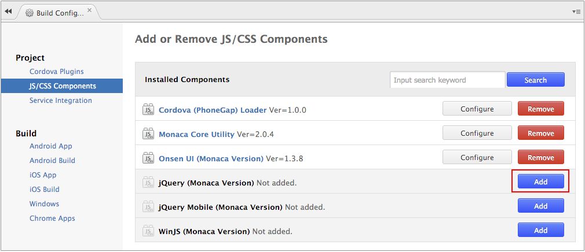
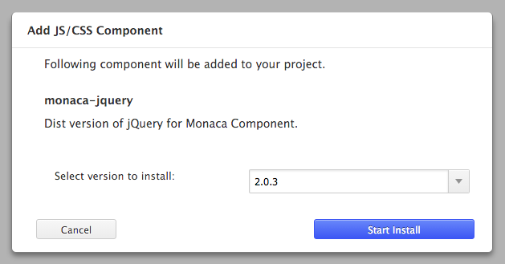
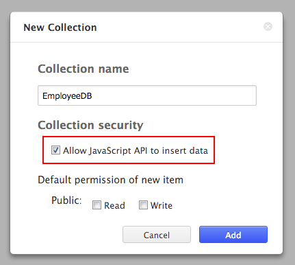

パート 3 : Monaca バックエンドのセットアップ
============================================

ステップ 1 : Monaca バックエンドで使用するプラグインの有効化
------------------------------------------------------------

Monaca バックエンドを使用する場合、[jQuery
ライブラリー](https://jquery.com/)
をプロジェクトに追加します。追加する場合には、次の手順に従います。

1.  Monaca クラウド IDE
    メニューから、設定 --&gt; JS/CSS コンポーネントの追加と削除...
    を選択します。
2.  \[ JS/CSS コンポーネントの追加と削除 \]
    ページが表示されるので、jQuery ( Monaca Version ) の 追加
    ボタンをクリックします。

> {width="600px"}

3.  次のダイアログが表示されます。使用する jQuery
    ライブラリーのバージョンを選択して、インストール開始
    ボタンをクリックします。次に、OK ボタンをクリックします。

> {width="400px"}

ステップ 2 : バックエンドとプロジェクトの紐付け
-----------------------------------------------

1.  Monaca クラウド IDE
    のメニュー上で、左側のツリーメニューの上部に表示された クラウド ( 雲
    ) アイコンをクリックして、バックエンド管理画面へ行きます。次に、
    バックエンドを利用する ボタンをクリックします。

> {width="250px"}

2.  次のダイアログが表示されます。バックエンドの新規作成、または、既存バックエンド
    ( 他のプロジェクトで使用中 )
    の再利用のどちらかを選択できます。次に、 適用
    をクリックして、バックエンドとプロジェクトの紐付け処理を行います。

> {width="400px"}

3.  バックエンドの紐付けが完了すると、バックエンド管理画面が次のようになります。

> {width="250px"}

ステップ 3 : コレクションの新規作成
-----------------------------------

コレクションとは、バックエンドの使用時に、データの格納を行う、汎用的なストレージのことを指します。

1.  バックエンド管理画面上で、 オプションメニュー
    アイコンをクリックして、 コレクションの作成... を選択します。

> {width="350px"}

2.  コレクションの作成ダイアログが表示されます。コレクション名を入力して、
    追加する ボタンをクリックします。

> {width="400px"}
>
> 

>
> データの追加をアプリから行う場合、
> JavaScript からのアイテム追加を許可する
> にチェックを入れます。コレクション管理の詳細に関しては、
> backend\_control\_panel\_collection\_management をご確認ください。
>
> 

ここまでの手順を行うことで、Monaca
バックエンドを使用したアプリを作成できるようになります。
backend\_database\_memo では、アプリから Monaca
バックエンドを操作する方法を段階的に解説しています。こちらも参考にして、Monaca
バックエンドを使用したアプリのコーディングをお試しください。
