Monaca Localkit の概要
======================

概要
----

Monaca Localkit は、Monaca
アプリ向けのローカル環境用の開発ツールです。ソースコード管理システム (
バージョン管理システム )・タスク実行ツール ( Task Runner
)・エディターなど、多岐にわたる開発ツールと併用できます。Monaca Localkit
を使用すれば、オフラインでの開発も行え、また、Monaca
デバッガーとのスピーディーな同期も行えます。

Monaca Localkit
では、次のような、開発効率の向上に役立つ、複数のサポート機能を提供しています。

-   Cordova プロジェクトの作成とインポート : Monaca
    が提供するテンプレートを使用して、プロジェクトを新規作成できます。または、既存の
    Monaca プロジェクト ( Monaca クラウド IDE 上 ) と 既存の Cordova
    プロジェクトをインポートできます。
-   プロジェクトのライブリロード : Monaca
    デバッガーとペアリングすれば、端末上で、プロジェクトを即実行できます。また、ソースコードに対して行った変更も、保存後、端末側に即反映されます。
-   Chrome DevTools との連携 : 端末 ( Monaca デバッガー側 ) とホスト PC
    ( Monaca Localkit 側 ) を USB 接続し、Chrome DevTools
    を使用して、アプリをデバッグできます。また、DevTools
    では、ブレークポイントを設定して、JavaScript
    のデバッグ、アプリの検証などを行えます。
-   リモートビルド : Monaca Localkit を使用すれば、Monaca
    サーバーのサポートを介して、複数のプラットフォーム向けのアプリをビルドできます。

Monaca クラウド IDE&lt;monaca\_ide\_index&gt; と Monaca Localkit
間では、プロジェクトの同期は行われず、それぞれのツールに置かれているプロジェクトは、独立しています。ただし、
Monaca クラウド IDE から Monaca Localkit へ、プロジェクトをインポート &lt;localkit\_import&gt;
できます。

30 日間のトライアル期間 ( 初回ログイン時から起算 )
を設けておりますが、Monaca Localkit
を長期でご利用になる場合には、対応するプランへの加入が必要です。詳細は、
[各プランの解説](https://monaca.mobi/ja/pricing?type=2)
をご確認ください。

Monaca Localkit では、バックエンド機能 &lt;monaca\_backend\_index&gt; と
push\_notification\_index は現在ご利用できません。

インストールと設定
------------------

事前準備として、Monaca Localkit ( PC 上 ) と monaca\_debugger\_index (
端末上 ) をインストールします。

使用例
------

### Monaca Localkit の起動

1.  Monaca Localkit を開き、Monaca
    アカウントを使用してサインインします。

> 
>
> > width
> >
> > :   700px
> >
> > align
> >
> > :   left
> >
2.  ログイン後、Monaca Localkit のダッシュボードが表示されます。

> 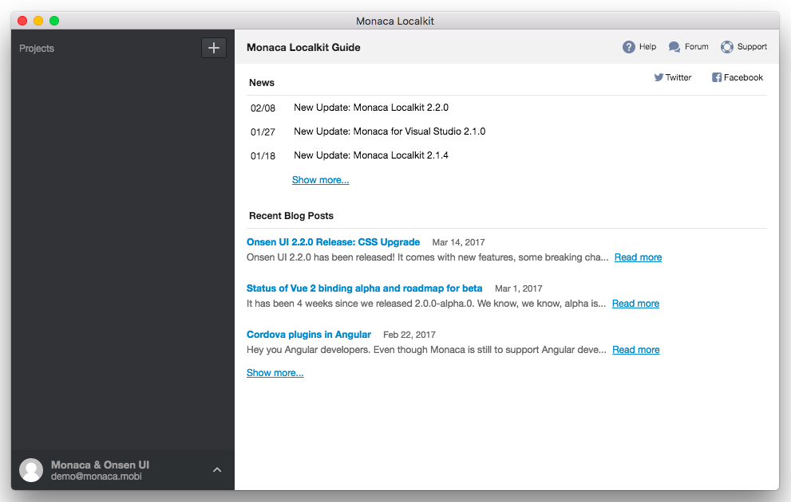
>
> > width
> >
> > :   700px
> >
> > align
> >
> > :   left
> >
### プロジェクトの新規作成

プロジェクトを新規作成します。ここでは、Monaca
が提供するテンプレートを使用します。

1.  Monaca Localkit のダッシュボードの + アイコンをクリックして、 作成
    を選択します。

> 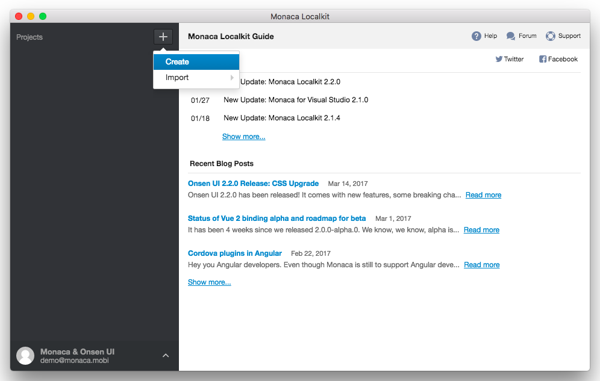
>
> > width
> >
> > :   700px
> >
> > align
> >
> > :   left
> >
2.  必要な情報を入力します。

> -   プロジェクト名 : プロジェクト一覧に表示される、プロジェクトの名前
> -   作業ディレクトリ :
>     プロジェクトファイルの保存先となるディレクトリー
> -   カテゴリを選択 :
>     プロジェクトに使用するテンプレートの種類を選択します。
> -   テンプレートを選択 : プロジェクトで使用するテンプレート。
>     プレビュー
>     ボタンをクリックすると、選択されているテンプレートを確認できます。
>
> 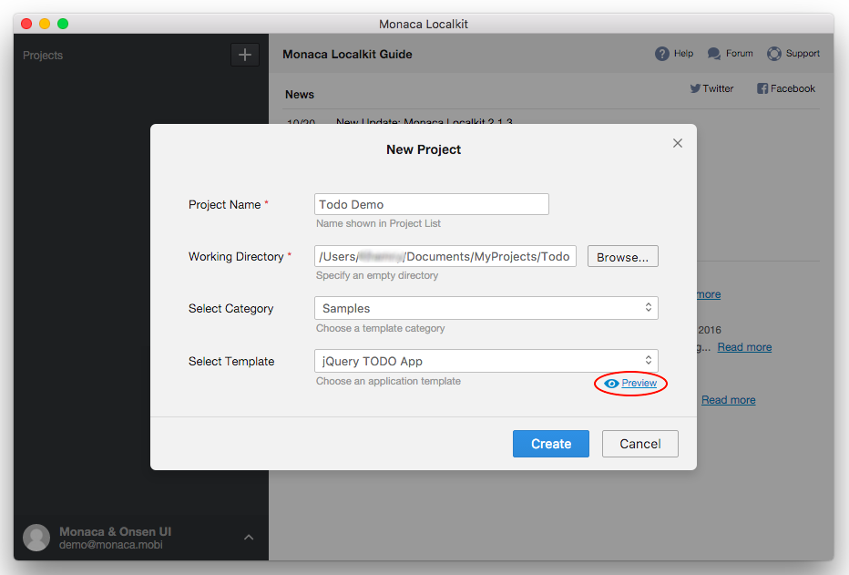
>
> > width
> >
> > :   700px
> >
> > align
> >
> > :   left
> >
3.  プロジェクトの作成後、プロジェクト一覧上に、作成したプロジェクトが表示されていることを確認します。

### プロジェクトのインポート

次のいずれかの方法で、プロジェクトをインポートできます。

1.  クラウド IDE からインポート : Monaca クラウド IDE
    上に、既存のプロジェクトがある場合に選択できます。
2.  Cordova プロジェクトをインポート : PC 上に保存している Cordova
    プロジェクトをインポートする場合に選択できます。Cordova
    プロジェクトのインポートには、次のような制限があります。

> -   アプリのアイコンとスプラッシュ画像が、インポートされない場合があります。この場合、「
>     設定 」 画面上で、再び設定します。
> -   hooks ディレクトリー内のスクリプトは無視されます。
> -   Cordova
>     を含め、各プラットフォーム固有のソースコードは、インポートの対象外となります。Monaca
>     では、Monaca 側にあらかじめ実装されている、Cordova
>     プラグインと他の関連ライブラリーが使用されます。

3.  Zip ファイルからインポート : zip ファイルをインポートします (
    有効な形式のプロジェクトを圧縮した Zip ファイルであること )。

Monaca Localkit へプロジェクトをインポートします。次の手順に従います。

1.  Monaca Localkit ダッシュボードの左パネルの上部に表示された +
    ボタンをクリックします。表示されたメニューから インポート
    を選択します。次に、表示されたサブメニューから、お好みのインポートオプションを選択します。
2.  クラウド IDE からインポート
    を選択した場合には、次の情報を入力して、\[ インポート \]
    ボタンをクリックします。

> -   プロジェクトを選択 : Monaca クラウド IDE
>     上に保存されているプロジェクトから、1 つ選択します。
> -   作業ディレクトリ :
>     プロジェクトファイルの保存先となるディレクトリー
>
> 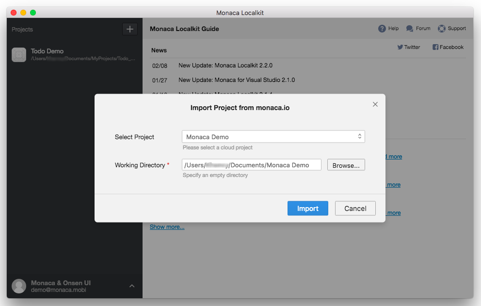
>
> > width
> >
> > :   700px
> >
> > align
> >
> > :   left
> >
3.  Cordova プロジェクトをインポート
    を選択した場合には、次の情報を入力して、\[ インポート \]
    ボタンをクリックします。

> -   作業ディレクトリ :
>     プロジェクトファイルの保存先となるディレクトリー
> -   プロジェクト名 : プロジェクト一覧に表示される、プロジェクトの名前
>
> 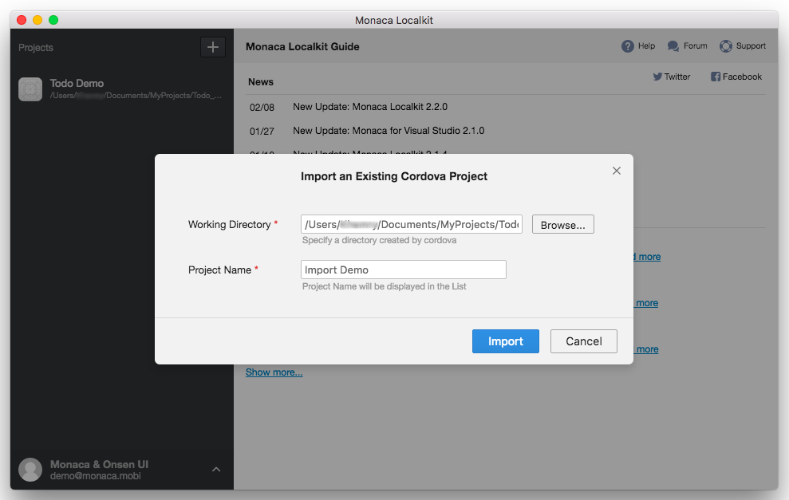
>
> > width
> >
> > :   700px
> >
> > align
> >
> > :   left
> >
3.  Zip ファイルからインポート
    を選択した場合には、次の情報を入力して、\[ インポート \]
    ボタンをクリックします。

> -   Zip ファイル : 対象の zip ファイルを選択します。
> -   プロジェクト名 : プロジェクト一覧に表示される、プロジェクトの名前
> -   作業ディレクトリ :
>     プロジェクトファイルの保存先となるディレクトリー
>
> 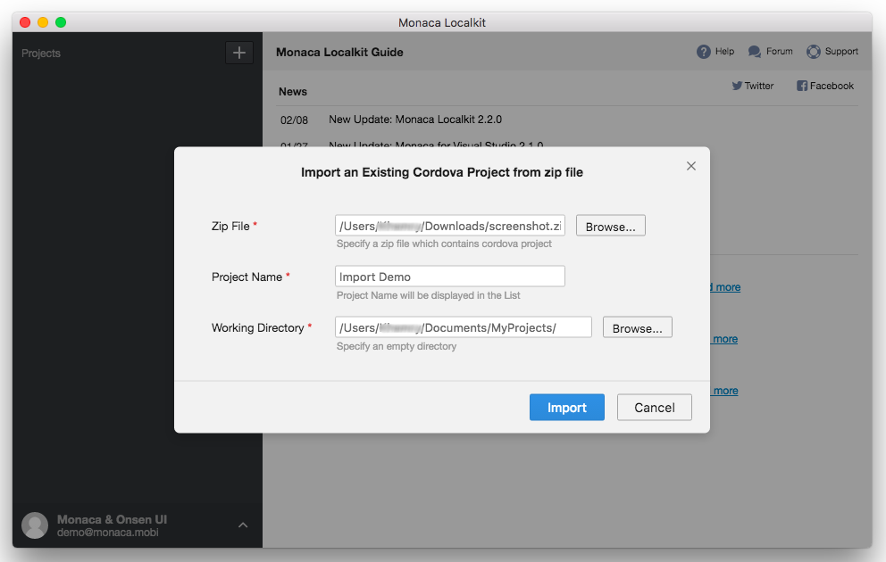
>
> > width
> >
> > :   700px
> >
> > align
> >
> > :   left
> >
4.  プロジェクト一覧上に、作成したプロジェクトが表示されていることを確認します。

### ローカルプロジェクトの編集用エディターの追加

次に、Localkit の \[ 開く \] メニューを解説します。Monaca Localkit
では、「 次の方法で開く 」 ( Open In )
機能を提供しており、プロジェクトフォルダーを開く方法を選択・カスタマイズできます。

-   Finder / ファイルエクスプローラ : Finder ( Mac の場合 ) または
    ファイルエクスプローラ ( Windows の場合 )
    を使用して、対象プロジェクトのフォルダーを開きます。
-   ターミナル / コマンドプロンプト : ターミナル ( Mac の場合 ) または
    コマンドプロンプト ( Windows の場合 )
    を使用して、対象プロジェクトのフォルダーを開きます。
-   プログラムを追加 ... :
    お好みのエディターを追加して、ローカルのプロジェクトファイルを
    Monaca Localkit から開くことができます。

Monaca Localkit へエディターを追加する場合、次の手順に従います。

1.  Monaca Localkit 上で、プロジェクトを選択します。
2.  開く... ボタンをクリックして、 プログラムを追加... を選択します。

> 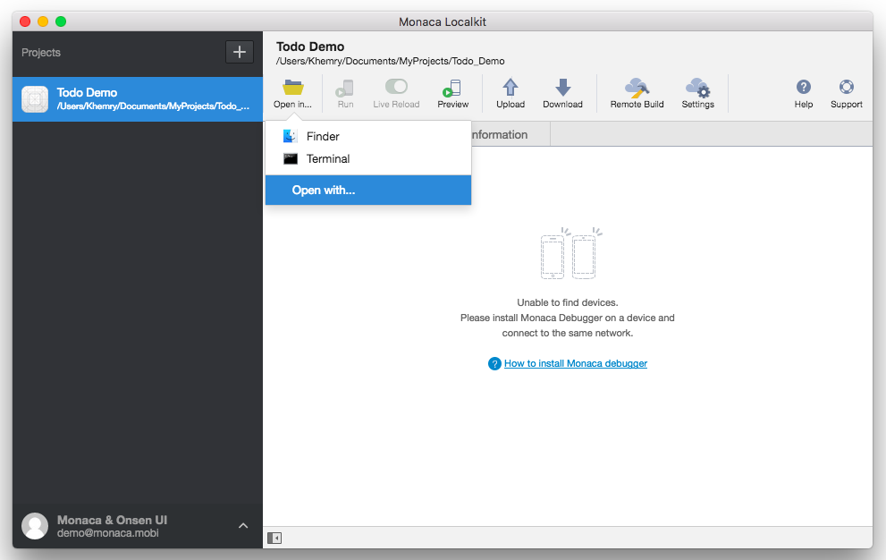
>
> > width
> >
> > :   700px
> >
> > align
> >
> > :   left
> >
3.  \[ エディターの追加 \]
    ダイアログが表示されます。エディタープログラムに関する、次の情報を入力します。

> -   アプリケーションのパス : エディターの実行ファイルを指定します (
>     Mac の場合 `.app` ファイル、Windows の場合 `.exe` ファイル )。
> -   アプリケーション名 :
>     エディターの表示名を指定します。この表示名は、\[ 開く... \]
>     メニューを選択したときに、一覧上に表示されます。
> -   コマンドライン引数 :
>     追加するエディターに適用する引数を設定できます。現時点では、`%d` (
>     プロジェクトファイルへのパス ) と `%p` ( プロジェクト名 )
>     を使用できます。
>
>     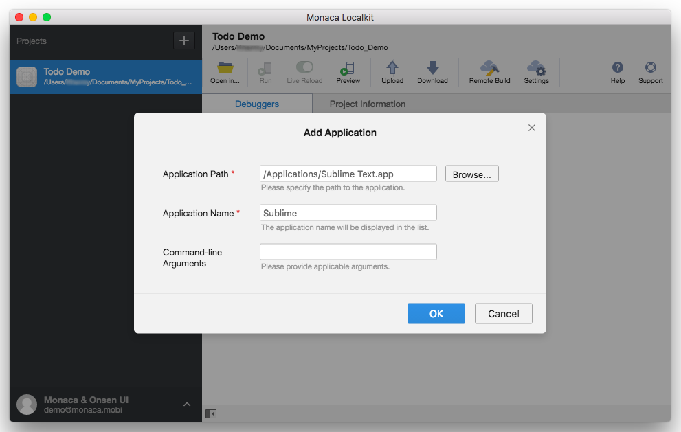
>
>     > width
>     >
>     > :   700px
>     >
>     > align
>     >
>     > :   left
>     >
4.  OK をクリックします。\[ 開く... \]
    メニューを選択したときに、追加したエディターが一覧上に表示されていることを確認します。

> 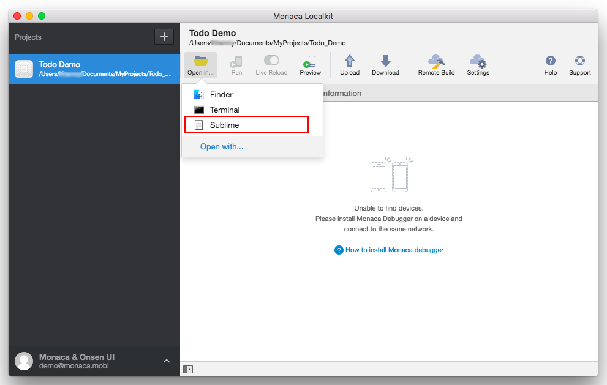
>
> > width
> >
> > :   700px
> >
> > align
> >
> > :   left
> >
### トランスパイル処理の管理

最新のJSフレームワークの中には、JSXなどとのやり取りを行うために独自の言語を作成したものや、ネイティブJavaScriptで利用できない拡張機能（TypeScriptなど）を統合したものがあります。トランスパイル処理では、これらの言語で書かれたコードを最新のブラウザ/
WebViewで実行可能なネイティブJavaScriptコードに変換します。トラインスパイル処理は、WebPackを利用して実行しています。

Localkit
上での変換処理は、プロジェクトの内容が変更されるたびに実行され、いままではユーザー側で制御することができませんでした。

ハードウェアのスペックによっては問題が生じるため、自動変換を行うかどうかをユーザー側で設定できるようにしました。自動で変換を行わない場合には、\[
トランスパイラー \] タブ上の 自動トランスパイルを有効にする
オプションを切り替えます。設定はプロジェクト毎に変更でき、変更後はその設定が適用され続けます。また、変換の状態は、トランスパイラー
タブ上で確認できます。

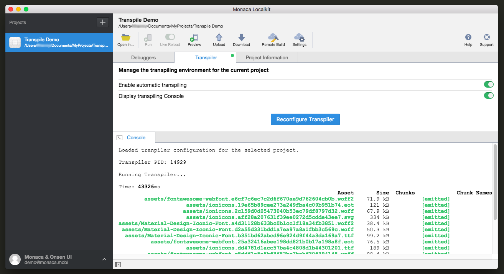{width="700px"}

Monaca
クラウド上へプロジェクトをアップロードするときには、強制的に、コード変換処理が行われます。これは、コンテンツの整合性を維持するための措置です。

Transpiler Console

変換処理の進捗・内容をリアルタイムで監視することができます。以前は、別ウィンドウ上のログに出力していましたが、ユーザー側で各種設定を行う必要がありました。そこで、LocalKit
にコンソールを移植して、LocalKit 上でもログを確認できるようにしました。

表示される情報は次のとおりです。

-   コード変換の状態
-   割り振られた PID ( プロセス ID ) とその ID に紐づけされている処理 (
    当該 ID 下で行われた一連の処理内容 )
-   処理終了の通知 ( Kill )
-   処理時に使用する設定の通知など

また、コンソールの大きさは、必要に応じて適宜調整または非表示にすることもできます。

トランスパイル処理の再構成

新しいオプション「トラインスパイラーの再構成」が実装されました。トランスパイル処理に必要となるグローバルの依存関係が何らかの理由で削除されることがよくあります。そのため、できるだけ簡単に再構成するオプションを提供することにしました。

これからは、グローバルな依存関係が存在しないことが理由でトランスパイル処理が失敗した場合、再構成ボタンを押すだけで、Localkitが正常に動作するようになります。

### 設定ダイアログ

1.  Monaca Localkit メニュー上で、 設定 ( Mac の場合 ) または
    ファイル --&gt; 設定 ( Windows の場合 ) を選択します。

> 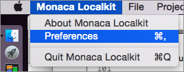
>
> > width
> >
> > :   268px
> >
> > align
> >
> > :   left
> >
2.  \[ 設定 \] ダイアログでは、次の項目を設定できます。

> -   作業ディレクトリ : プロジェクトの保存先を指定します ( ローカル )。
> -   待ち受けポート番号 : Monaca Localkit と Monaca
>     デバッガーをペアリングするときに使用するポート番号を指定します。
> -   プロキシーサーバー : プロキシサーバーを指定します。
> -   ログ出力 : ログの出力先となるファイルを指定します。
>
> 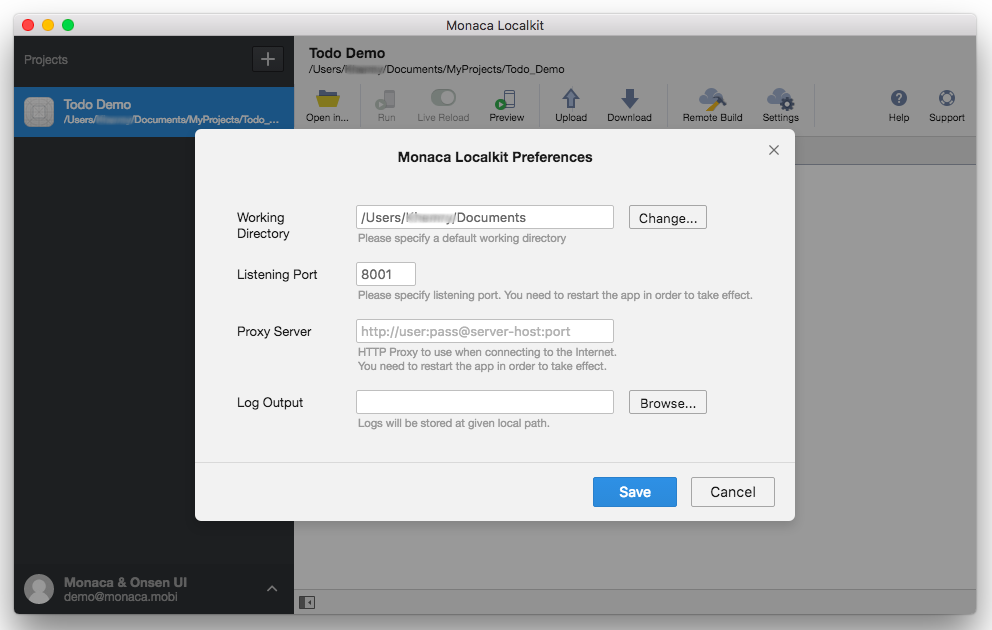
>
> > width
> >
> > :   700px
> >
> > align
> >
> > :   left
> >
3.  設定を保存します。

