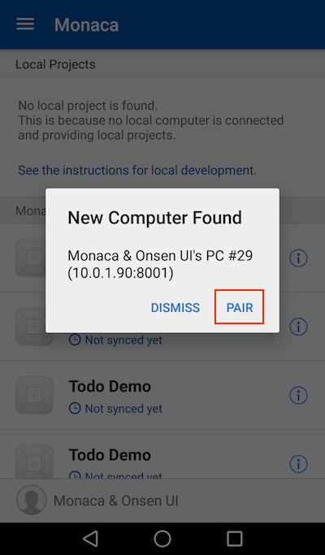
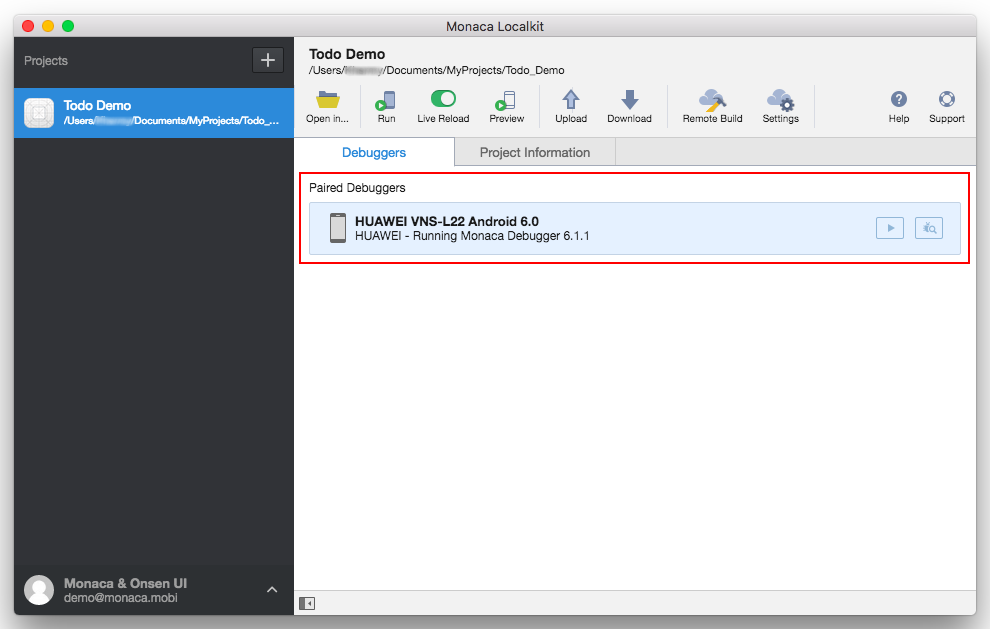
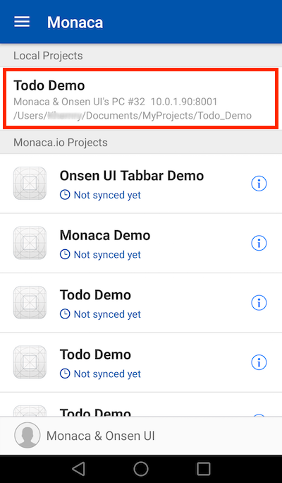
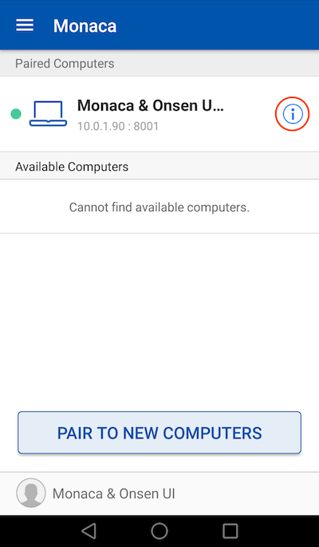
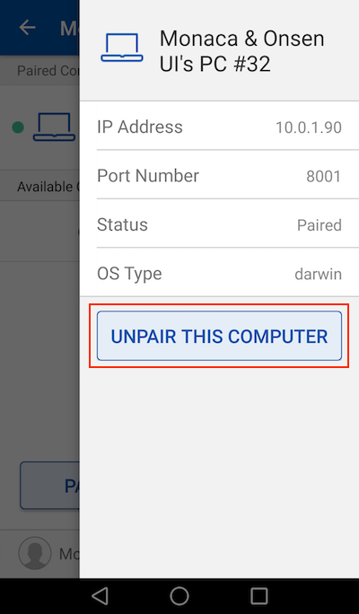

ペアリングとデバッグ
====================

Monaca Localkit を使用して、Monaca アプリをデバッグする場合、ホスト PC (
Monaca Localkit が実行中であること ) と端末 ( Monaca
デバッガーが実行中であること ) のペアリングを最初に行います。

ホスト PC と携帯端末が、同じネットワーク ( LAN または Wi-Fi )
に接続されていることを確認してください。公共のネットワークなどでは、クライアント同士の通信が許可されていないことがあり、その場合、ペアリングはできません。

ペアリングの設定
----------------

1.  Monaca Localkit ( ホスト PC ) にログインします。
2.  Monaca デバッガー ( 携帯端末 ) にログインします。Monaca Localkit
    のログイン時と、同じアカウントを使用します。
3.  ログイン後、次のように、Monaca デバッガーがホスト PC
    を認識しているか確認します。次に、 ペアリング
    をクリックして、ペアリングします。Monaca デバッガーがホスト PC
    を自動認識していない場合には、
    ペアリング方法 &lt;troubleshoot\_pair&gt; をご確認ください。

> 
>
> > width
> >
> > :   250px
> >
> > align
> >
> > :   left
> >
4.  ペアリング後、Monaca Localkit の \[ デバッガー \]
    タブ上に、ペアリングされたデバッガーが表示されます。

> 
>
> > width
> >
> > :   700px
> >
> > align
> >
> > :   left
> >
5.  デバッガーと Monaca Localkit
    を接続すると、ローカルに存在するプロジェクトの一覧が、Monaca
    デバッガー上に、次のように表示されます。

> 
>
> > width
> >
> > :   250px
> >
> > align
> >
> > :   left
> >
ペアリングの解除
----------------

1.  Monaca
    デバッガー画面の左上端に表示された切り替えメニューをクリックして、
    ローカルコンピュータ を選択します。
2.  接続されている PC が表示されます。PC
    の横に表示されているインフォーメーション アイコンをクリックします (
    下のスクリーンショットを参照のこと )。

> 
>
> > width
> >
> > :   250px
> >
> > align
> >
> > :   left
> >
3.  接続されている PC の情報が表示されます。 この PC を解除する
    をクリックして、ペアリングを解除します。解除後は、ローカルに保存されている
    Monaca
    プロジェクトは、デバッガー上で、デバッグできません。デバッグを再度行う場合には、ペアリングをします。

> 
>
> > width
> >
> > :   250px
> >
> > align
> >
> > :   left
> >
Monaca Localkit を使用した、Monaca アプリのデバッグ
---------------------------------------------------

debugger\_with\_local\_tools をご確認ください。
