パート 3 : Monaca アプリのビルド
================================

このパートでは、iOS 向けと Android 向けの Monaca
アプリのビルド方法を解説します。

1.  localkit\_building\_for\_ios
2.  localkit\_building\_for\_android

他のプラットフォーム向けの Monaca アプリのビルドに関しては、build\_index
をご確認ください。

iOS 向け Monaca アプリのビルド
------------------------------

端末にインストールできる、デバッグビルド版 iOS
アプリの作成方法を解説します。ビルドの種類に関する詳細は、types\_of\_build\_ios
をご確認ください。

*事前準備*

1.  [Apple Developer Program](https://developer.apple.com/programs/)
    への登録 ( 必須 )
2.  Apple Developer Program に登録後、次のアイテムを作成します (
    デバッグビルド版の作成時、Monaca 上で必要となるアイテムです )。

-   `App ID` ( App ID の登録方法 &lt;register\_appID&gt; を参照のこと )
-   `開発用証明書` ( 証明書の発行方法 &lt;create\_cer&gt;
    を参照のこと、「 デベロッパー証明書 」 と呼ばれる場合もあります )
-   `開発用プロビジョニングプロファイル` (
    プロビジョニングプロファイル の作成方法 &lt;register\_provisioning&gt;
    を参照のこと )

### ステップ 1 : iOS アプリの設定

1.  Monaca Localkit
    のプロジェクト一覧から、ビルド対象のプロジェクトを選択して、設定
    ボタンをクリックします。

> 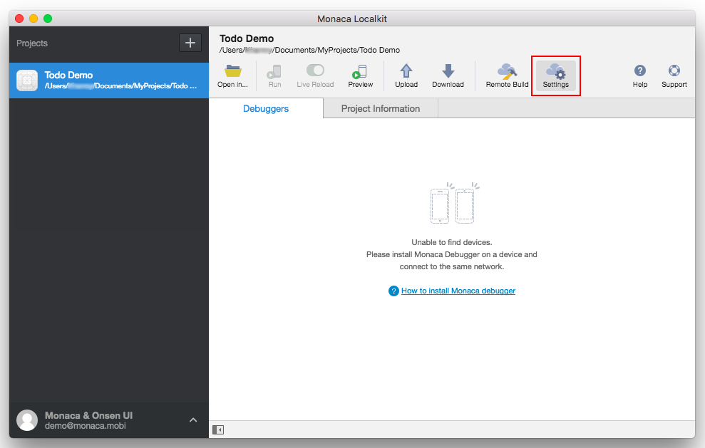{width="700px"}

2.  表示された画面左の アプリの設定 メニューから、iOS を選択します。
3.  必要なアプリ情報を入力します。

> -   アプリケーション名 : マーケット上で公開されるアプリ名です。
> -   App ID : アプリを識別する一意の ID です。App ID
>     には、逆ドメイン形式 ( 例 : mobi.monaca.appname )
>     を推奨します。英数字とピリオドのみ使用できます (
>     ピリオドは、最低限、1 つ使用 )。各レベルのドメイン ( 各節 )
>     は、ピリオドで区切られ、英字から始まります。
> -   バージョン : iTune Connect 経由で、アプリをアップロード (
>     配布のため )
>     するときに必要となる、アプリのバージョン番号です。ドットで区切った、3
>     つの数字 ( 例 : 1.10.2 ) を使用します。各数字は、\[0-99\]
>     の範囲にします。
> -   他の設定項目は、任意です。こちらの設定画面では、アイコン、スプラッシュ画像なども設定できます。
>
>     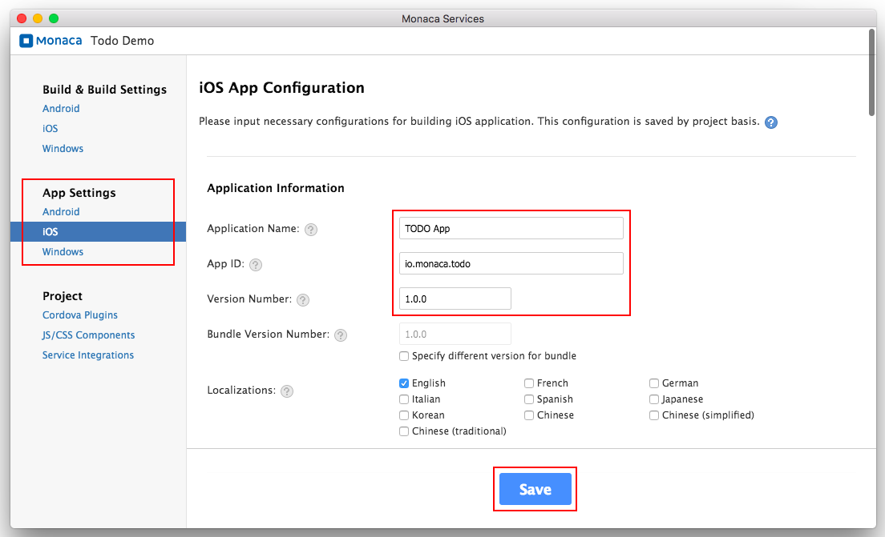{width="700px"}
>
> 

>
> Monaca のビルド設定で使用する App ID には、iOS Provisioning Portal
> で登録した App ID と同じ ID を使用します。なお、Monaca
> のビルド設定で使用する App ID には、アスタリスク ( `*` )
> は使用できません。使用した場合、ビルドが失敗します。
>
> 

4.  設定後、 保存する ボタンをクリックします。

### ステップ 2 : iOS ビルドの設定

1.  Monaca Localkit
    のプロジェクト一覧から、ビルド対象のプロジェクトを選択して、リモートビルド
    ボタンをクリックします。

> {width="700px"}

2.  表示された画面左の ビルド/ビルド設定 メニューから、iOS
    を選択します。次に表示された画面上で、ビルド設定の管理
    ボタンをクリックします。

> 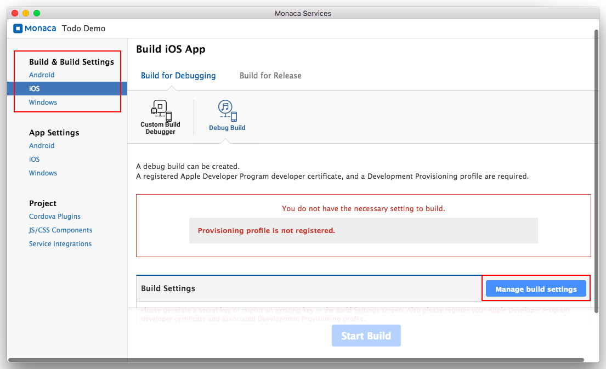{width="700px"}

3.  秘密鍵と CSR の生成 ボタンをクリックします。Apple ID
    の登録時に使用したユーザー名およびメールアドレス、ならびに、国コードを入力して、秘密鍵と CSR の生成
    ボタンをクリックします。ダイアログが表示されるので、CSR
    ファイルをダウンロードします。既存の秘密鍵がある場合には、こちら &lt;import\_into\_monaca&gt;
    の内容に従い、インポートもできます。

> 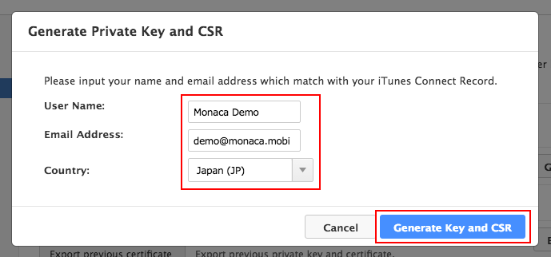{width="600px"}

既存の秘密鍵をインポートする場合、インポートする秘密鍵を使用して発行した証明書が必要になります。また、秘密鍵と
CRS ファイルを新規作成する場合、新規作成した CRS
ファイルを使用して、証明書を新規発行する必要があります。

### パート 3 : アプリのビルド

1.  Monaca Localkit
    のプロジェクト一覧から、ビルド対象のプロジェクトを選択して、リモートビルド
    ボタンをクリックします。
2.  「 ビルド設定 」 画面左の ビルド/ビルド設定 メニューから、iOS
    を選択します。次に、\[ デバッグ向けビルド \] の デバッグビルド
    オプションを選択し、加えて、対応するプロビジョニング
    プロファイルを選択します。次に、ビルドを開始する
    ボタンをクリックします。

> 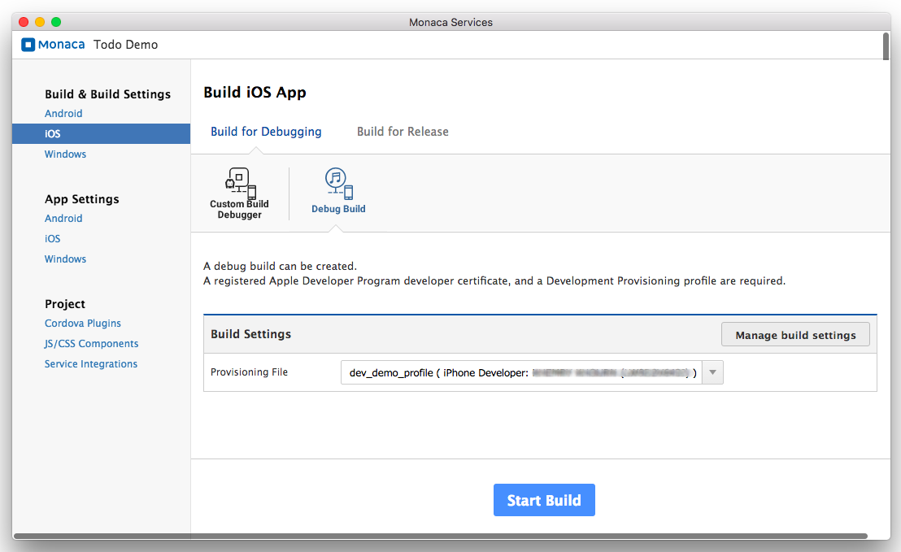{width="700px"}

3.  ビルドが完了するまで数分かかる場合もありますので、しばらく待ちます。ビルドが完了すると、次の画面が表示されます。

> 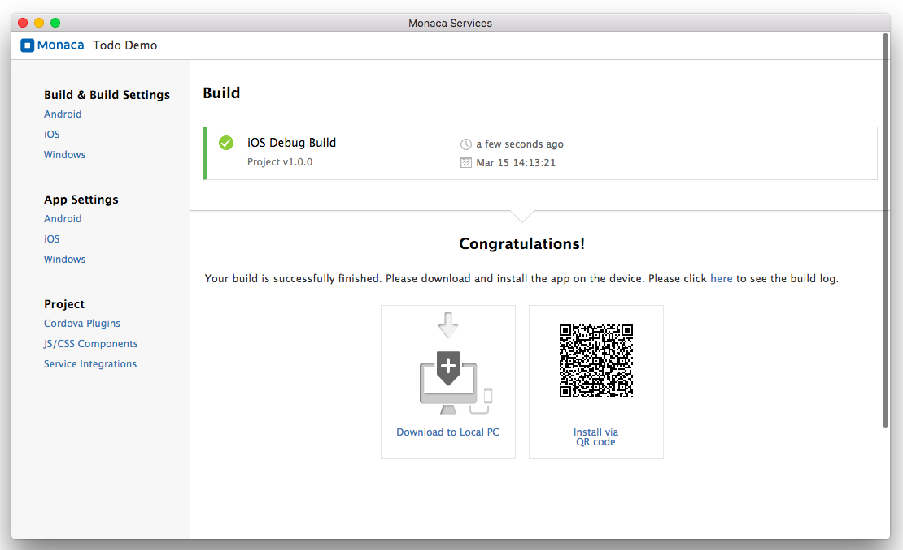{width="700px"}

### ステップ 4 : ビルドしたアプリのインストール

次のいずれかの方法を使用すれば、デバッグビルド版アプリをインストールできます。

> 1.  ビルド済みアプリをダウンロードし、iTunes を使用して、iOS
>     端末にインストールします。
> 2.  QR コードを使用して、インストールします。
> 3.  配信/配布支援サービス ( デプロイサービス ) &lt;supported\_services&gt;
>     経由でインストールします ( 各種設定が必要です )。

Android 向け Monaca アプリのビルド
----------------------------------

デバッグビルド版 Android
アプリの作成方法を解説します。ビルドの種類に関する詳細は、types\_of\_build\_android
をご確認ください。

### ステップ 1 : Android アプリの設定

1.  Monaca Localkit
    のプロジェクト一覧から、ビルド対象のプロジェクトを選択して、設定
    ボタンをクリックします。

> {width="700px"}

2.  表示された画面左の アプリの設定 メニューから、Android を選択します。
3.  必要なアプリ情報を入力します。

> -   アプリケーション名 : マーケット上で公開されるアプリ名です。
> -   パッケージ名 : アプリを識別する一意の ID です。ID
>     には、逆ドメイン形式 ( 例 : mobi.monaca.appname )
>     の使用を推奨します。英数字とピリオドのみ使用できます (
>     ピリオドは、最低限、1 つ使用 )。各レベルのドメイン ( 各節 )
>     は、ピリオドで区切られ、英字から始まります。
> -   バージョン : アプリのバージョン番号です。ドットで区切った、3
>     つの数字 ( 例 : 1.10.2 ) を使用します。各数字は、\[0-99\]
>     の範囲にします。
> -   ビルド種別ごとにパッケージ名を分ける :
>     チェックをした場合、デバッグビルド版アプリのパッケージ名とカスタムビルド版デバッガーのパッケージ名は、異なる名になります。デバッグビルド版アプリのパッケージ名の拡張子は
>     `.debug` となり、プロジェクトのデバッガーのパッケージ名の拡張子は
>     `.debugger`
>     となります。ただし、デフォルトでは、このオプションは無効になっています。常時有効にしてしまうと、決まったパッケージ名
>     ( In-App Purchase など )
>     に紐付けされているプラグインが存在する場合、デバッグができなくなるためです。
> -   他の設定項目は、任意です。こちらの設定画面では、アイコン、スプラッシュ画像なども設定できます。
>
>     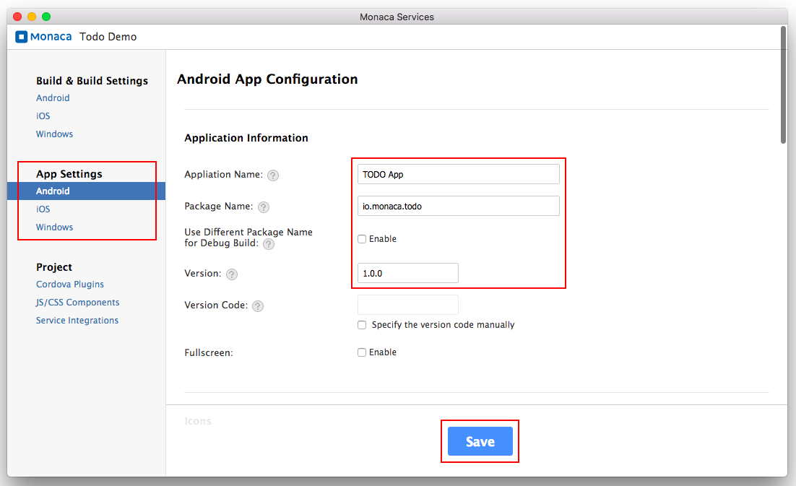{width="700px"}
>
4.  設定後、 保存する ボタンをクリックします。

### ステップ 2 : Android キーストア ( Keystore ) の設定

Android キーストアを使用して、パッケージの署名に必要な鍵 ( エイリアス )
を格納します。キーストアを紛失した場合、または、別のキーストアで上書きした場合は、既に署名されているパッケージは、同じ鍵では再署名できません。また、1
つのキーストアには、複数のエイリアスを格納できますが、アプリのコード署名
( Code Sign ) 時には、エイリアスを 1 つのみ、使用します。

リリースビルド版アプリを作成する場合には、Android
キーストアが必須となります。一方、デバッグビルド版アプリの場合には、キーストアは任意となります。

Android キーストアを Monaca 上で作成する手順を、次に記します。

1.  Monaca Localkit
    のプロジェクト一覧から、ビルド対象のプロジェクトを選択して、リモートビルド
    ボタンをクリックします。

> {width="700px"}

2.  表示された画面左の ビルド/ビルド設定 メニューから、Android
    を選択します。表示された画面上で、\[ リリース向けビルド \] の
    リリースビルド オプションを選択し、キーストアとエイリアスを管理する
    ボタンをクリックします。

> 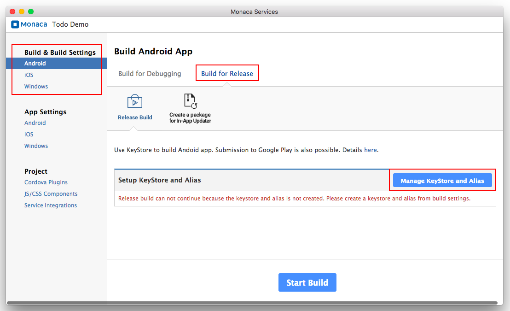{width="700px"}

3.  キーストアは、新規に作成するか、または、既存のキーストアがあれば、インポートもできます。このチュートリアルでは、キーストアの新規作成を前提とするので、
    クリアして新規作成 ボタンをクリックして、次の画面を表示させます。

> 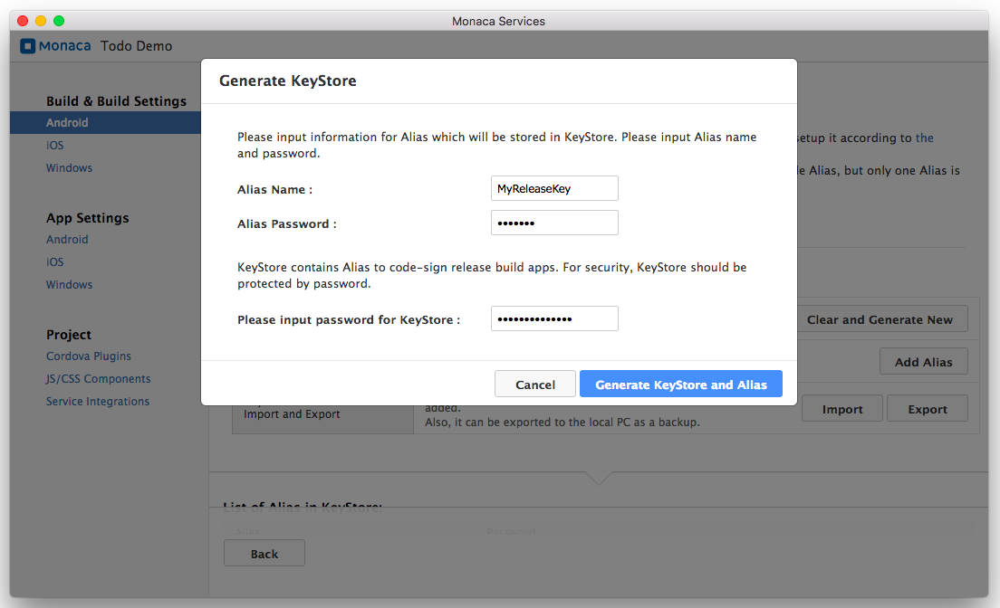{width="700px"}

4.  キーストアに関する情報を入力します。

> -   エイリアス :
>     キーストアに格納された鍵情報を指します。パッケージの署名時に使用します。
> -   エイリアスのパスワード : エイリアス用のパスワードです。
> -   キーストアのパスワード : 新規のキーストア用のパスワードです。

5.  キーストアとエイリアスを作成する ボタンをクリックします。

### パート 3 : アプリのビルド

1.  Monaca Localkit
    のプロジェクト一覧から、ビルド対象のプロジェクトを選択して、リモートビルド
    ボタンをクリックします。

> {width="700px"}

2.  表示された画面左の ビルド/ビルド設定 メニューから、Android
    を選択します。表示された画面上で、\[ デバッグ向けビルド \] の
    デバッグビルド オプションを選択して、ビルドを開始する
    ボタンをクリックします。

> 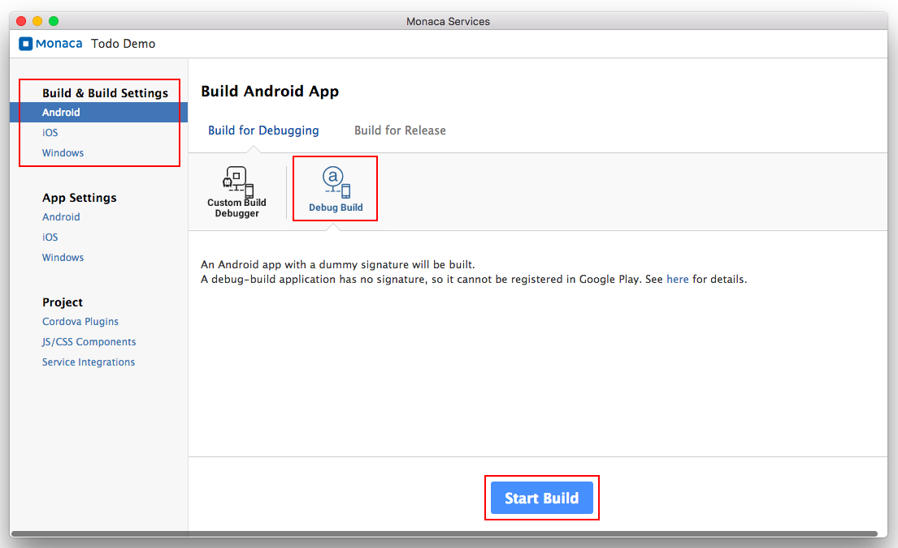{width="700px"}

3.  ビルドが完了するまで数分かかる場合もありますので、しばらく待ちます。ビルドが完了すると、次の画面が表示されます。

> 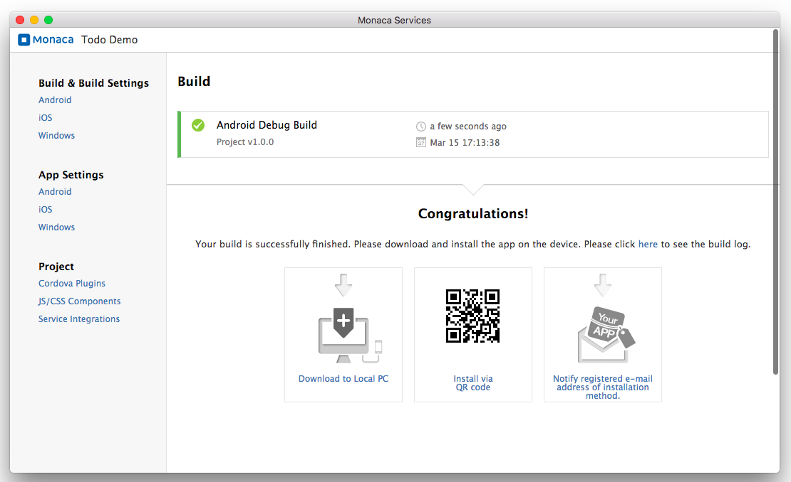{width="700px"}

### ステップ 4 : ビルドしたアプリのインストール

次のいずれかの方法を使用すれば、ビルドしたアプリをインストールできます。

1.  network\_and.
2.  QR コードを使用して、インストールします。
3.  ビルド済みアプリをコンピューターに直接ダウンロードし、USB
    ケーブル経由でインストールします。
4.  ビルド済みアプリのダウンロード元 ( URL )
    が記載されたメールを、Monaca
    に登録されているメールアドレスに送信します。
5.  配信/配布支援サービス ( デプロイサービス ) &lt;supported\_services&gt;
    経由でインストールします ( 各種設定が必要です )。

