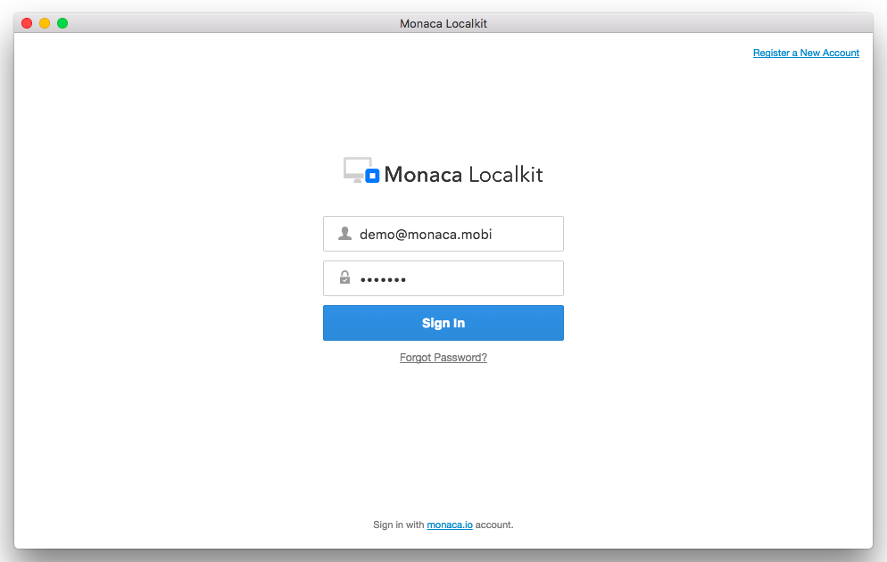
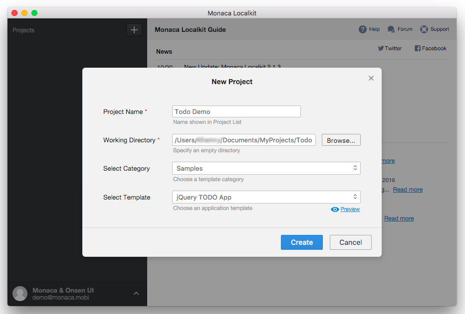
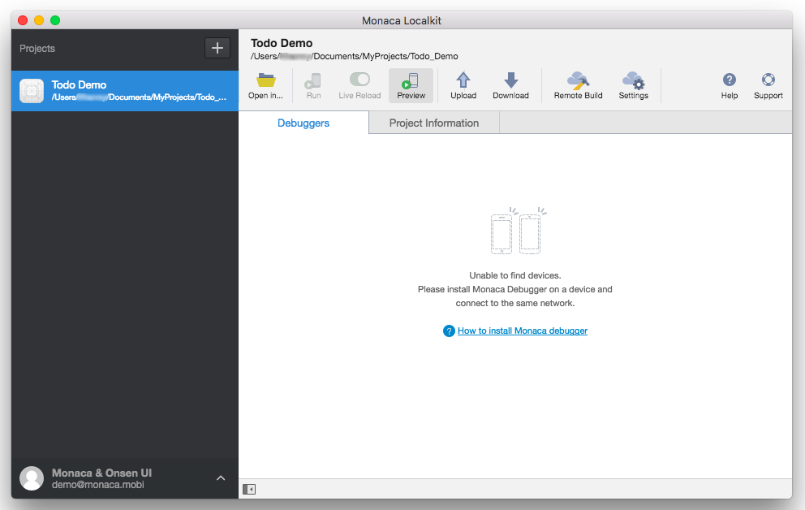
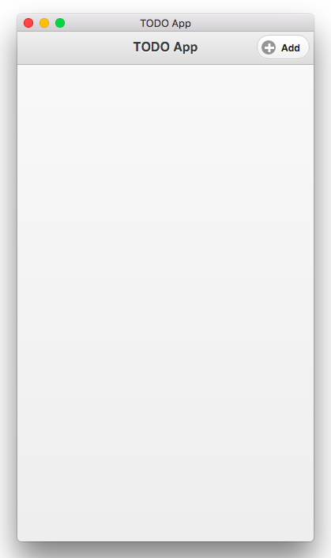
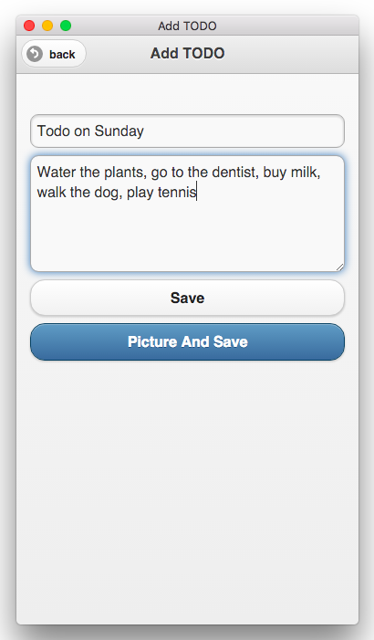
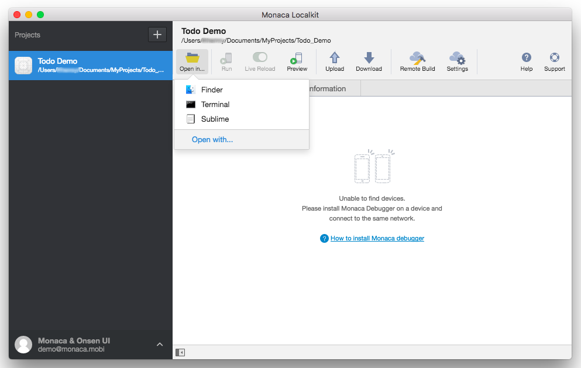

パート 1 : プロジェクトの作成
=============================

このパートで学習する内容は、次のとおりです。

-   Monaca
    提供のテンプレートを使用して、新規プロジェクトをローカルに作成します。この方法以外にも、Monaca
    クラウド IDE に保存されているプロジェクトを、または、既存の Cordova
    プロジェクトを、Monaca Localkit
    にインポートすることもできます。詳細は、localkit\_import
    をご確認ください。
-   Monaca Localkit
    上でプロジェクトをプレビューします。端末は必要ありません。
-   プロジェクトファイルを編集して、プレビュー上に変更点が反映されることを確認します。

ステップ 1 : Monaca Localkit へのログイン
-----------------------------------------

Monaca Localkit を起動し、Monaca アカウントを使用してログインします。

> {width="700px"}

ステップ 2 : プロジェクトの新規作成
-----------------------------------

ログイン後、初めての Monaca
プロジェクトを、ローカルに作ってみましょう。次の手順に従います。

1.  Monaca Localkit のダッシュボード上で、 + --&gt; 作成 を選択します。

> {width="700px"}

2.  必要な情報を入力します。

> -   プロジェクト名 : プロジェクト一覧に表示される、プロジェクトの名前
> -   作業ディレクトリ :
>     プロジェクトファイルの保存先となるディレクトリー
> -   カテゴリを選択 :
>     プロジェクトに使用するテンプレートの種類を選択します。
> -   テンプレートを選択 : プロジェクトで使用するテンプレート。
>     プレビュー
>     ボタンをクリックすると、選択されているテンプレートを確認できます。
>
> {width="700px"}

3.  プロジェクトの作成後、プロジェクト一覧上に、作成したプロジェクトが表示されていることを確認します。

ステップ 3 : プロジェクトのプレビュー
-------------------------------------

Monaca Localkit
では、端末を用意しなくても、アプリの外観と動作を検証できるように、ライブプレビュー機能を提供しています。ただし、ライブプレビューを使用して、実際に検証できる機能には、制限があります。詳細は、
ライブプレビューの機能と制限 &lt;preview\_tab&gt; をご確認ください。

プロジェクトをプレビューする場合には、次の手順に従います。

1.  Monaca Localkit
    のダッシュボード上で、先ほど作成したプロジェクトをクリックします。
2.  プレビュー ボタンをクリックします。

> {width="700px"}

3.  次のようなプレビューウィンドウが表示されます。

> {width="250px"}

4.  プレビューウィンドウ上で、アプリの動作を検証してみましょう。

> {width="250px"}

ステップ 4 : プロジェクトファイルの編集
---------------------------------------

1.  Monaca Localkit
    ダッシュボード上から、プロジェクトを保存しているディレクトリーを参照できます。参照する場合、プロジェクト一覧上で、対象プロジェクトの選択後
    ( ここでは、メモ帳アプリのプロジェクト )、メニューアイコンの 開く
    ボタンをクリックするか、または、プロジェクトを右クリックをして、開く
    を選択します ( 下のスクリーンショットを参照のこと )。

> {width="700px"}

2.  新しいウィンドウが開き、プロジェクトファイルの保存先とそのコンテンツが表示されます。
    `www` フォルダー内のプロジェクトファイルが、編集対象のファイルです。
    `components` フォルダーには、jQuery Mobile
    など、プロジェクトで必要なファイルが保存されているため、編集はできません。他の
    JavaScript、CSS、HTML
    ファイルは、お好みのエディターを使用して、自由に編集できます。

> {width="614px"}

3.  試しに、`index.html`
    ファイルを編集してみましょう。お好きな箇所を変更して、保存してみましょう。
4.  プレビュー機能を使用して、変更点が反映されているか確認してみましょう。プレビューウィンドウがすでに開いている場合には、変更点の保存後、即時に、画面が更新されます。

