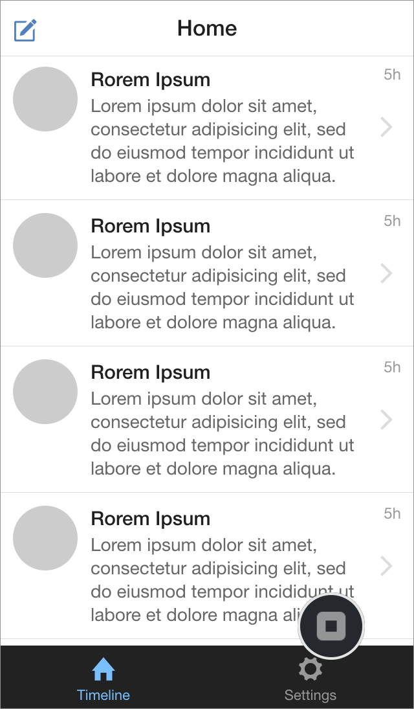
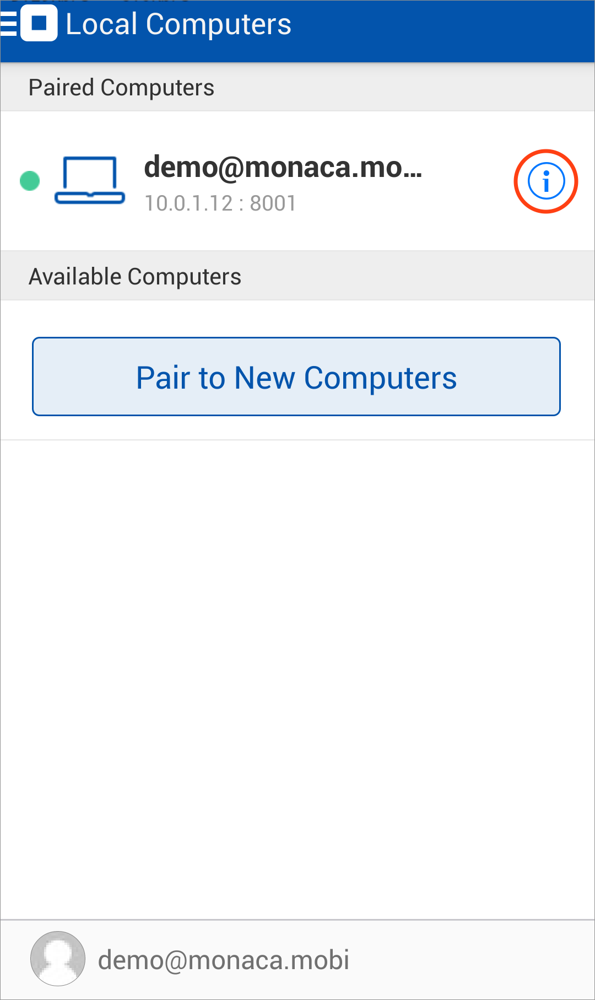

ペアリングとデバッグ
====================

Monaca for Visual Studio を使用して、Monaca
アプリをデバッグする場合、ホスト PC ( Monaca for Visual Studio
が実行中であること ) と端末 ( Monaca デバッガーが実行中であること )
のペアリングを最初に行います。

ホスト PC と携帯端末が、同じネットワーク ( LAN または Wi-Fi )
に接続されていることを確認してください。公共のネットワークなどでは、クライアント同士の通信が許可されていないことがあり、その場合、ペアリングはできません。

ペアリングの設定
----------------

1.  Monaca デバッガーを起動し、Monaca
    アカウントを使用してログインします。ログインのユーザー名とパスワードは、Visual
    Studio IDE の Monaca メニューで入力したものと同じものを使用します。

> 
>
> > width
> >
> > :   250px
> >
> > align
> >
> > :   left
> >
2.  Monaca デバッガーと ホスト PC ( Monaca for Visual Studio を起動中の
    PC ) をペアリングします。Monaca デバッガーおよび Monaca for Visual
    Studio の両方に、同一の Monaca
    アカウントでログインしていれば、Monaca デバッガー側で、ホスト PC
    を自動的に検知します ( 下のスクリーンショットを参照のこと
    )。次に、ペアリング ボタンをタップします。

> 
>
> > width
> >
> > :   250px
> >
> > align
> >
> > :   left
> >
3.  ペアリング後、Monaca
    デバッガー上には、プロジェクトの一覧が表示され、一方、Monaca
    パネル上 ( Visual Studio ) には、接続されたデバッガーが表示されます
    ( 下のスクリーンショットを参照のこと )。Monaca デバッガーがホスト PC
    側を自動で検知できない場合には、ペアリングのトラブルシューティング &lt;troubleshoot\_pair&gt;
    をご確認ください。

> {width="250px"}
>
> {width="232px"}

4.  Monaca
    デバッガー上でプロジェクトを実行する場合、デバッガー上に表示されたプロジェクト名をタップするか、または、Visual
    Studio の Monaca パネル上で デバイス上で実行
    ボタンをクリックします。次に、デバッガー上でプロジェクトが実行されていることを確認します。

> {width="250px"}

ペアリングの解除
----------------

1.  Monaca
    デバッガー画面の左上端に表示された切り替えメニューをタップして、
    ローカルコンピュータ を選択します。
2.  接続されている PC が表示されます。PC
    の横に表示されているインフォーメーション アイコンをタップします (
    下のスクリーンショットを参照のこと )。

> 
>
> > width
> >
> > :   250px
> >
> > align
> >
> > :   left
> >
3.  接続されている PC の情報が表示されます。 この PC を解除する
    をタップして、ペアリングを解除します。解除後は、ローカルに保存されている
    Monaca
    プロジェクトは、デバッガー上でデバッグできません。デバッグを再度行う場合には、ペアリングをします。

Monaca for Visual Studio を使用した、Monaca アプリのデバッグ
------------------------------------------------------------

debugger\_with\_local\_tools をご確認ください。
