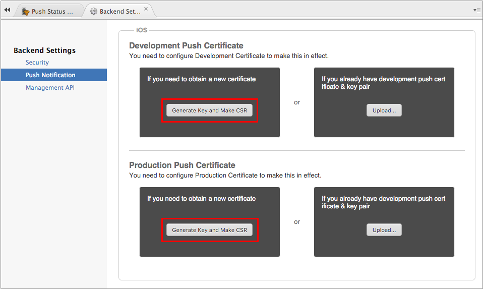
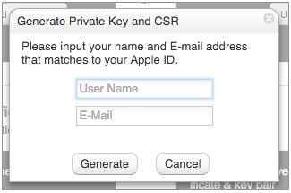
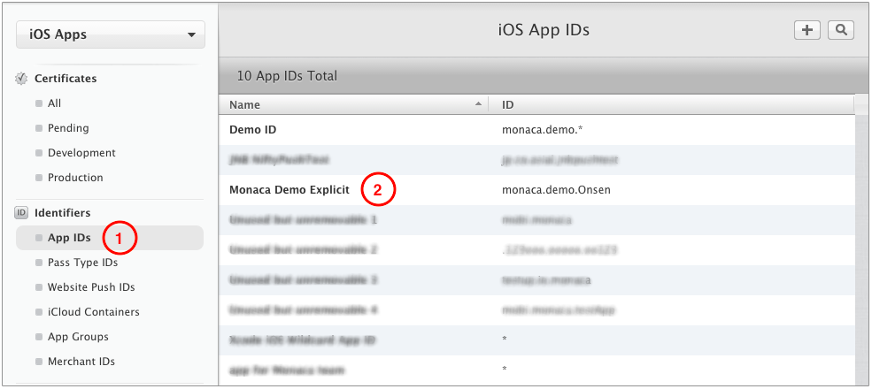
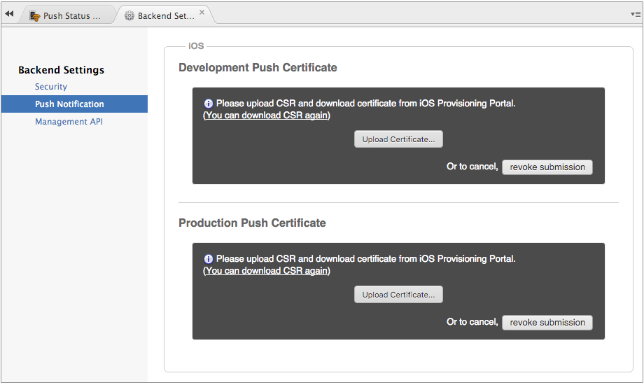

iOS アプリへのプッシュ通知設定
==============================

APNs ( Apple Push Notification Service ) とは、Apple 社が提供する、iOS
アプリ向けのプッシュ通知のためのメカニズムです。ここでは、iOS
アプリ向けにプッシュ通知を行うための手順を解説します。

iOS アプリのビルドとプッシュ通知には、[iOS Developer
Program](https://developer.apple.com/programs/) への登録が必要です。

ステップ 1 : CSR ファイルの作成 ( Monaca クラウド IDE 上 )
----------------------------------------------------------

1.  Monaca クラウド IDE
    のバックエンド管理パネルから、プッシュ通知 ( 左側のメニュー ) --&gt; 詳細メニュー ( 画面右上のアイコン )  --&gt; プッシュ通知設定 ( ドロップダウンリスト上 )
    を選択します。

> 
>
> > width
> >
> > :   600px
> >
> > align
> >
> > :   left
> >
2.  \[ iOS \] 項目上で、用途に応じて、\[ 開発用プッシュ証明書 \] または
    \[ 配布用プッシュ証明書 \] 下のいずれかの 秘密鍵の生成と CSR の発行
    ボタンをクリックします。

> 
>
> > width
> >
> > :   600px
> >
> > align
> >
> > :   left
> >
3.  ユーザー名 ( キー用 ) とメールアドレス ( iOS Dev Center で登録した
    Apple ID ) を入力して、 生成する をクリックします。

> 
>
> > width
> >
> > :   300px
> >
> > align
> >
> > :   left
> >
4.  生成後、その CSR ファイルをダウンロードします。

ステップ 2 : プッシュ証明書の作成 ( iOS Dev Center 上 )
-------------------------------------------------------

iOS Dev Center では、2 種類のプッシュ証明書を発行できます。

-   開発用の SSL 証明書 : デバッグビルドの場合、こちらを使用します。
-   配布用の SSL 証明書 : Ad Hoc
    またはリリースビルドの場合、こちらを使用します。

プッシュ証明書の発行方法は次のとおりです。

1.  [Apple Developer のページ](https://developer.apple.com/)
    へ行き、Member Center をクリックします。
2.  iOS Developer Program に登録した、Apple ID
    とパスワードを使用して、サインインします。このプログラムに未登録の場合には、[こちら](https://developer.apple.com/programs/ios/)
    で登録します。
3.  Certificates, Identifiers & Profiles
    へ行きます。次のページが表示されます。

> 
>
> > width
> >
> > :   600px
> >
> > align
> >
> > :   left
> >
4.  App ID を Explicit App ID
    として登録し、プッシュ通知サービスを有効化します。register\_appID
    も併せてご確認ください。

> 

>
> \[ Wildcard App ID \] タイプに App ID を
> 設定している場合、または、プッシュ通知サービスを無効にしている場合には、プッシュ通知は使用できません。
>
> 

5.  App ID の一覧から対象の Explicit App ID を選択して、 Edit
    をクリックします。

> 
>
> > width
> >
> > :   600px
> >
> > align
> >
> > :   left
> >
6.  作成する証明書の種類に応じて、いずれかの項目下の Create Certificate
    ボタンをクリックします。次に、 Continue をクリックします。

> 
>
> > width
> >
> > :   600px
> >
> > align
> >
> > :   left
> >
7.  Monaca クラウド IDE から先ほどダウンロードした CSR
    ファイルを参照して、 Generate をクリックします。
8.  発行後、その証明書をダウンロードします。このファイルは、後ほど、Monaca
    クラウド IDE へアップロードして使用します。

ステップ 3 : プッシュ証明書のアップロード ( Monaca クラウド IDE 上 )
--------------------------------------------------------------------

1.  Monaca クラウド IDE
    のバックエンド管理パネルから、プッシュ通知 ( 左側のメニュー ) --&gt; 詳細メニュー ( 画面右上のアイコン )  --&gt; プッシュ通知設定 ( ドロップダウンリスト上 )
    を選択します。

> 
>
> > width
> >
> > :   600px
> >
> > align
> >
> > :   left
> >
2.  \[ iOS \] 項目上で、用途に応じて、\[ 開発用プッシュ証明書 \] または
    \[ 配布用プッシュ証明書 \] 下のいずれかの アップロード
    をクリックします。ここまでの手順で、iOS
    アプリ向けのプッシュ通知設定が完了しました。

> 
>
> > width
> >
> > :   600px
> >
> > align
> >
> > :   left
> >

