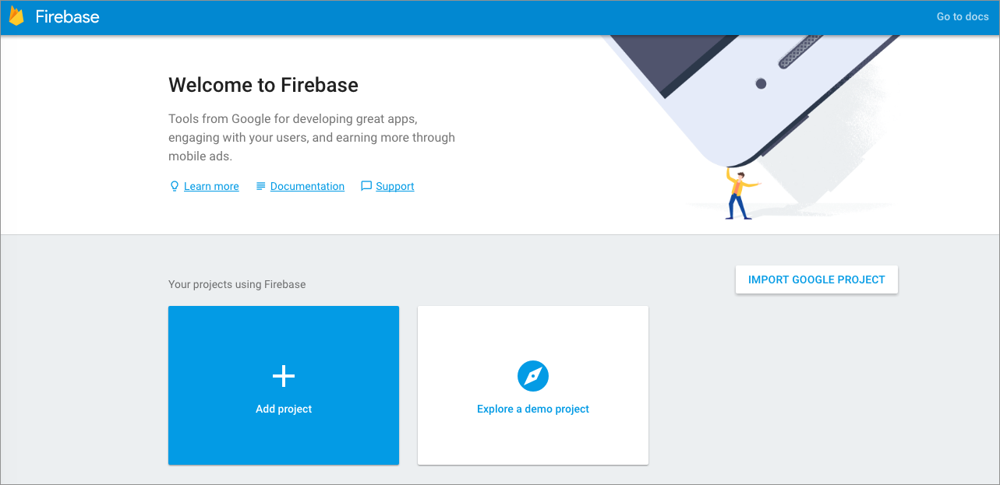
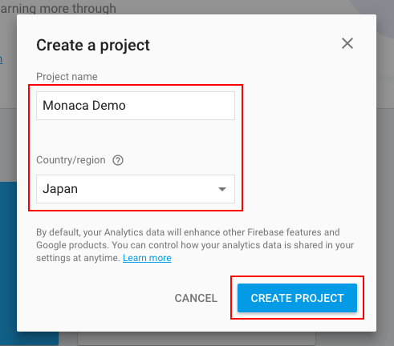
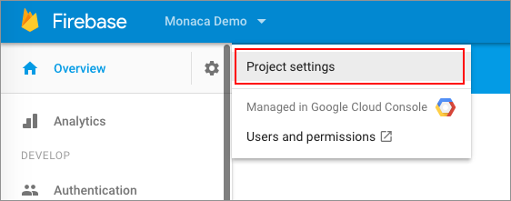
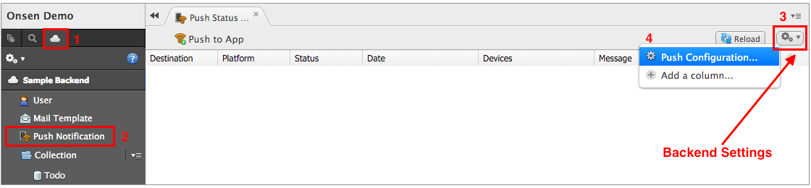
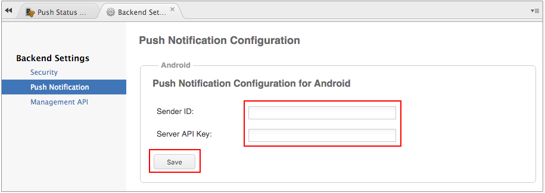

Android アプリへのプッシュ通知設定
==================================

Monaca では、FCM ( Firebase Cloud Messaging )
経由でプッシュ通知を行っています。FCM とは、Google 社が提供する Firebase
( MBaas の一種 )
を基盤とした、クロスプラットフォーム向けのメッセージング
サービスです。このサービスを使用すれば、費用をかけずに、通知タイプ (
プッシュ通知、案内メールなど ) およびデータ転送タイプ (
ペイロードサイズの上限は 4 KB )
のメッセージを、クライアント側アプリに対して配信できます (
通知とデータを併せて使用することもできます )。

ここでは、Android アプリ向けにプッシュ通知を行うための手順を解説します。

ここでは、Google アカウントを使用します。

ステップ 1 : API Key の取得 ( Firebase Console 上 )
---------------------------------------------------

Firebase Console ページ上で `サーバーキー` と `送信者 ID`
を確認します。FCM と Monaca
を連携させるため、これらの値が必要となります。確認手順は次のとおりです。

1.  [Firebase Console](https://console.firebase.google.com/)
    へ行き、Google アカウントを使用してサインインします。
2.  + プロジェクトを追加 をクリックします。

> 
>
> > width
> >
> > :   700px
> >
> > align
> >
> > :   left
> >
3.  \[ プロジェクト名 \] と \[ 国/地域 \] を入力して、プロジェクトを作成
    をクリックします。

> 
>
> > width
> >
> > :   450px
> >
> > align
> >
> > :   left
> >
4.  プロジェクトの作成後、表示されたダッシュボード上の左メニューから、\[
    Settings/歯車 \] のアイコンをクリックし、プロジェクトの設定
    を選択します。

> 
>
> > width
> >
> > :   550px
> >
> > align
> >
> > :   left
> >
5.  設定画面上で、クラウドメッセージング タブを選択します。
    `サーバーキー` and `送信者 ID` をメモします。これらの値は、後ほど
    Monaca クラウド IDE 上のプッシュ通知設定で使用します。
    `サーバーキー` は、Monaca 側の Server API Key に使用します。
    `送信者 ID` は、Monaca 側の Sender ID に使用します。

> 
>
> > width
> >
> > :   700px
> >
> > align
> >
> > :   left
> >
ステップ 2 : FCM 関連のパラメーター設定 ( Monaca 上 )
-----------------------------------------------------

1.  Monaca クラウド IDE
    のバックエンド管理パネルから、プッシュ通知 ( 左側のメニュー ) --&gt; 詳細メニュー ( 画面右上のアイコン )  --&gt; プッシュ通知設定 ( ドロップダウンリスト上 )
    を選択します。

> 
>
> > width
> >
> > :   700px
> >
> > align
> >
> > :   left
> >
2.  \[ Android \] 項目上の Sender ID と Server API Key に、先ほどの
    `送信者 ID` と `サーバーキー` を、それぞれ入力して、保存する
    ボタンをクリックします。ここまでの手順で、Andori
    向けプッシュ通知の準備が整いました。

> 
>
> > width
> >
> > :   700px
> >
> > align
> >
> > :   left
> >

