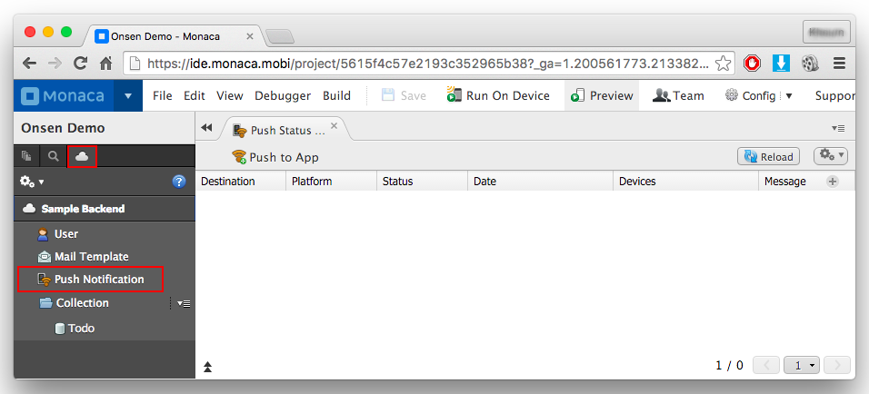
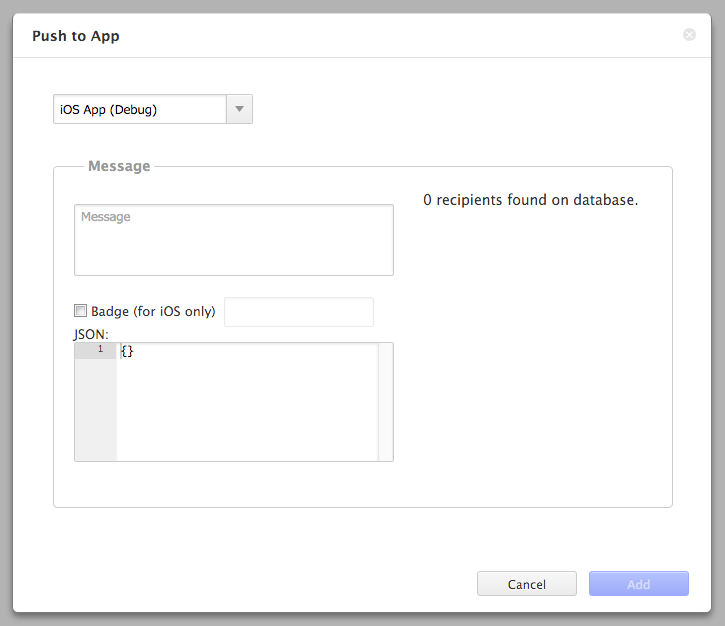

プッシュ通知
============

<div class="admonition note">

Cordova6.2プロジェクトでアドホックビルドしたアプリに対しては、リリースを選択する必要があります。

</div>

プッシュ通知とは
----------------

プッシュ通知とは、ユーザー側からのリクエストの有無に関わらず、アプリ側から端末側へ情報を発信するときに使用される機能です。

1.  *Text* ( テキスト ) : テキストメッセージです。
2.  *バッジ* ( バッジ ) : アプリのアイコンの右上に表示される数字です。
3.  *Sound* ( サウンド ) : 新しい通知が到着したときに鳴る音です。
4.  *JSON データ*: アプリ側で使用する、JSON 形式のデータです。

<div class="admonition note">

サウンドは、Monaca では現在使用できません。

</div>

プッシュ通知を受信したときの挙動は、アプリの状態 ( 起動中か否か ) と OS
の種類により異なります。Android
端末では、画面上部の通知用のバーに、テキストメッセージが表示されます。iOS
端末では、ポップアップ ダイアログ上に、メッセージが表示されます。

このページでは、MonacaのクラウドIDEからプッシュ通知を送る方法を説明します。

<div class="admonition note">

他のサーバーからMonacaのプッシュ通知を送ることもできます。 詳細は
backend\_management\_api\_index を参照して下さい。

</div>

事前準備
--------

Monaca クラウド IDE からプッシュ通知を行うには、Monaca
バックエンドを事前に準備しておく必要があります。Monaca
バックエンドの作成方法に関しては、
Monaca バックエンドのセットアップ &lt;cloud\_ide\_adding\_backend&gt;
または backend\_control\_panel\_getting\_started をご確認ください。

プッシュ通知の設定 ( Monaca 上での処理 )
----------------------------------------

プッシュ通知を実際に使用する前に、対象のプラットフォームに応じた設定を
\[ プッシュ通知設定 \]
上で行う必要があります。次のリンク先をご確認ください。

-   ios\_app\_push\_settings
-   android\_app\_push\_settings

<div class="admonition note">

Monaca
デバッガー上では、プッシュ通知は受け取れません。プッシュ通知の検証時には、アプリを実際にビルドする必要があります。

</div>

プッシュ通知の送信 ( Monaca 上での処理 )
----------------------------------------

Monaca クラウド IDE からプッシュ通知を行うときは、次の手順に従います。

1.  Monaca クラウド IDE 上で、 クラウド ( 雲 )
    アイコンを選択して、次に、プッシュ通知 を選択します。
2.  \[ プッシュ通知履歴 \] タブが表示されます。

> {width="600px"}

3.  \[ プッシュ通知履歴 \] タブ下の アプリ宛に作成
    をクリックして、次の画面を表示します。

> {width="400px"}

4.  送信先の OS を選択します
5.  次のプッシュ通知情報を入力します。

> +--------+-------------------------------------------------------------+
> | パラメーター | | 説明                                                |
> +========+=============================================================+
> | 件名 | | \[ Android 専用 \] 通知のタイトルです。                     |
> +--------+-------------------------------------------------------------+
> | メッセージ | > | 通知の本文です。                                    |
> +--------+-------------------------------------------------------------+
> | バッジ | | \[iOS only\] If you enable this option and set its value  |
> |        |   to an Integer of 1 or greater, the number will be         |
> |        |   displayed on the top right corner of the app icon.        |
> +--------+-------------------------------------------------------------+
> | JSON   | | \[Optional\] Once the user opens the notification, the    |
> | データ | application will receive the JSON data. Please refer to     |
> |        | receive\_json\_data.                                        |
> +--------+-------------------------------------------------------------+
>
6.  追加する
    ボタンをクリックして、プッシュ通知を送信します。通知は、キューに置かれたあとに送信されます。プッシュ通知を行うサーバー側に負荷
    ( 大きなトラフィック量 )
    がかかっている場合には、送信までに時間がかかります。プッシュ通知の送信状況に関しては、次の解説をご確認ください。

配信状況の監視
--------------

プッシュ通知画面では、通知の送信状況を確認できます。次の情報が表示されます。

+--------+-------------------------------------------------------------+
| プラットフォ | ム | 配信先のプラットフォーム                         |
| ー     |                                                             |
+--------+-------------------------------------------------------------+
| ステータス | > |      配信状況                                       |
+--------+-------------------------------------------------------------+
| 日時   | > 配信したときの日付                                        |
+--------+-------------------------------------------------------------+
| 配信端末 | | the number of successfully sent notifications. It is    |
|        |   formatted as                                              |
|        |   `Successful Distribution Number/Total Number of Distribut |
|        | ion`                                                        |
|        |   in which Successful Distribution represents the number of |
|        |   successfully sent notification while the Total Number of  |
|        |   Distribution is the total number of sent notifications    |
|        |   (see the screenshot below as an example).                 |
+--------+-------------------------------------------------------------+
| メッセージ | > |      通知の内容                                     |
+--------+-------------------------------------------------------------+

> {width="700px"}

How to Receive JSON データ
--------------------------

プッシュ通知とともに、JSON データも送信できます。 JSON
データは、`monaca.cloud.Push.setHandler`
関数を使用して処理できます。JSON データは、`data`
変数に代入されコールバック側へ渡されます。処理の例は次のとおりです。

``` {.sourceCode .javascript}
monaca.cloud.Push.setHandler(function(data) {
  // JSON data within push notification
  console.log(data);
  console.log(data.item)
});
```

<div class="admonition note">

コールバック関数は、ページが読み込まれた後に呼び出されます。呼び出しには、多少の時間がかかるため、この点を留意ください。

</div>
