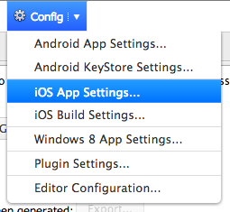
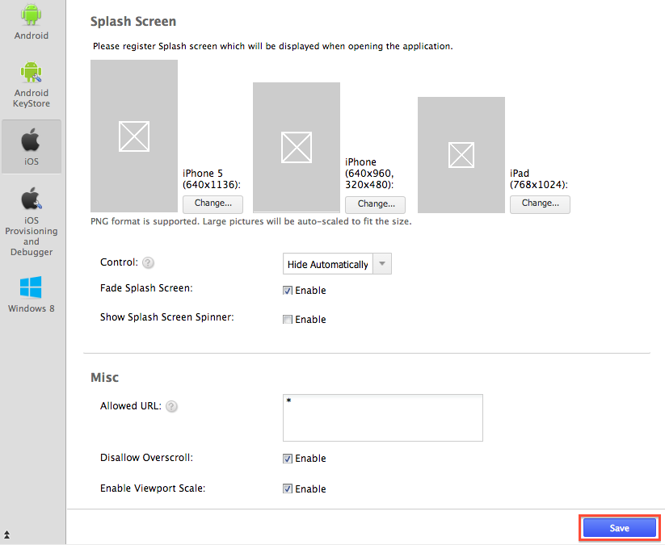
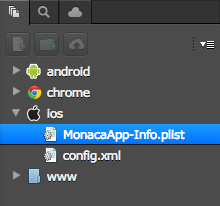
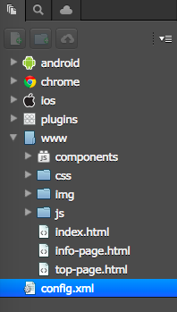

iOS の設定
==========

iOS アプリの設定には、2 通りの方法があります。

1.  Monaca クラウド IDE 経由で設定する方法 &lt;ios\_config\_ide&gt;
2.  設定ファイルを編集する方法 &lt;ios\_config\_files&gt;

Monaca クラウド IDE 経由で設定する方法
--------------------------------------

### iOS アプリの設定画面

iOS アプリの設定画面では、iOS
アプリに適用するパラメーターを設定できます。次の手順に従い、Monaca
クラウド IDE の iOS アプリの設定画面を表示します。

1.  Monaca クラウド IDE メニュー上で、 設定 --&gt; iOS アプリ設定
    を選択します。

> {width="250px"}

2.  *iOS アプリ設定*
    画面が、次のように表示されます。こちらの画面で設定を行います。

> {width="600px"}

3.  設定後、 保存する ボタンをクリックします。

### 設定できるパラメーター

iOS
アプリの設定画面で行えることは、アプリ情報の設定、アイコン、スプラッシュファイルの設定、パーミッション
( 権限 )
の設定など、多岐にわたります。画面上で設定できるパラメーターの一覧を、次に記します。

-   *許可する外部 URL* : アプリから接続できる URL
    を指定します。デフォルトでは `*`
    に設定され、全てのドメインへの接続を許可しています。
-   *オーバースクロールを無効* : WebView
    上でバウンスを無効にしたい場合には、有効にします。デフォルトは有効です。
-   *ビューポート制御を有効* :
    デフォルトは有効です。無効にした場合、アプリ内に設定された、viewport
    の meta タグを無視します。
-   *スプラッシュ画像をフェードアウト* :
    デフォルトでは、有効化されています。
-   *スプラッシュにスピナーを表示* : アプリの起動時に、スプラッシュ画面
    ( スピナー ) を表示します。

設定ファイルの編集
------------------

iOS アプリのパラメーターは、次のファイル内に記述されています。

> -   info\_plist
> -   config\_xml\_ios

iOS
アプリの挙動に関する設定が、上記のファイル内に記述されています。誤って設定した場合、アプリが動作しなくなる恐れがあります。編集する場合には、細心の注意が必要です。

### MonacaApp-Info.plist

iOS アプリの設定を行うには、 MonacaApp-Info.plist ファイルを編集します。
`plist` ファイルの情報に関しては、 [Information Property List Files (
Apple
)](http://developer.apple.com/library/ios/documentation/general/Reference/InfoPlistKeyReference/Articles/AboutInformationPropertyListFiles.html)
をご確認ください。このファイルは、次のように、Monaca プロジェクトの
`ios` フォルダー下に置かれています。

{width="250px"}

Cordova 6.2 以降をサポートする Monaca
フレームワークでは、`MonacaApp-Info.plist`
ファイルを使用しないように、仕様が変更されました。よって、iOS
アプリの設定をカスタマイズする場合には、custom\_config\_plugin
を使用する必要があります。

MonacaApp-Info.plist ( 抜粋 )

    <?xml version="1.0" encoding="UTF-8"?>
    <!DOCTYPE plist PUBLIC "-//Apple//DTD PLIST 1.0//EN" "http://www.apple.com/DTDs/PropertyList-1.0.dtd">

    <plist>
      <dict>
        <key>key</key>
        <value-type>value</value-type>
          ...
        <key>key</key>
        <array>
          <value-type>value</value-type>
          <value-type>value</value-type>
        </array>
        ...
      </dict>
    </plist>

MonacaApp-Info.plist ファイル内には、3 つの主な要素があります。

-   *&lt;key&gt;*: value ( plistObject )
    とアプリの設定情報間の紐付けをします。
-   *&lt;array&gt;*: 配列を使用して、value ( plistObject )
    を格納できます。
-   *&lt;dict&gt;*: key と value ( plistObject )
    の組み合わせを、&lt;dict&gt; 内に置きます。

例 :

    <plist>
      <dict>
        ...
        <key>XXX</key>
          <文字列>The value(plistObject) corresponding to key(XXX)</sting>
          ...
        <key>YYY</key>
          <array>
            <文字列>The 1st value(plistObject) corresponding to key(YYY)</文字列>
            <文字列>The 2nd value(plistObject) corresponding to key(YYY)</文字列>
            <文字列>The 3rd value(plistObject) corresponding to key(YYY)</文字列>
            <文字列>The 4th value(plistObject) corresponding to key(YYY)</文字列>
          </array>
        ...
      </dict>
    </plist>

*Value ( plistObject ) の型の一覧*

  型 解           説
  --------------- ----------------------
  文字列 文字列   
  date            日付および時刻を表示
  integer         integer number
  real            浮動小数点データ
  data            データ
  true            true 真偽値
  false           false 真偽値

*Key の一覧*

iOS アプリで設定すべき Key と Value を、次に記します。

#### *UISupportedInterfaceOrientations*

画面の方向を指定します。

-   iPhone の場合

<!-- -->

    ...
      <key>UISupportedInterfaceOrientations</key>
        <array>
          <文字列>UIInterfaceOrientationLandscapeLeft</文字列>
          <文字列>UIInterfaceOrientationLandscapeRight</文字列>
          <文字列>UIInterfaceOrientationPortraitUpsideDown</文字列>
          <文字列>UIInterfaceOrientationPortrait</文字列>
        </array>
    ...

-   iPad の場合

<!-- -->

    ...
      <key>UISupportedInterfaceOrientations~ipad</key>
        <array>
          <文字列>UIInterfaceOrientationLandscapeLeft</文字列>
          <文字列>UIInterfaceOrientationLandscapeRight</文字列>
          <文字列>UIInterfaceOrientationPortraitUpsideDown</文字列>
          <文字列>UIInterfaceOrientationPortrait</文字列>
        </array>
    ...

*画面方向に関する設定値 ( Value )*

  Value                                      解説
  ------------------------------------------ ----------------------------------------------------------------------------------
  UIInterfaceOrientationLandscapeLeft        ホームボタンを左側にして、横向き表示
  UIInterfaceOrientationLandscapeRight       ホームボタンを右側にして、横向き表示
  UIInterfaceOrientationPortraitUpsideDown   縦向き表示
  UIInterfaceOrientationPortrait             縦向き表示 in opposite direction from the normal portrait orientation.

表示方向の設定に関するサンプルを、こちらからダウンロードできます。

サンプルファイル &lt;download/UISupportedInterfaceOrientations.zip&gt;

#### ステータスバーの設定

### config.xml

config.xml 設定ファイルを使用して、Cordova
のさまざまな設定を管理します。

{width="250px"}

設定可能な要素と preference を次に記します。必要に応じて設定します。

#### *Content*

  ---------------------- --------------------------------------------------------------------------------------------------------------------------------------------------------------------------------------------------------------
  *型* 文字              列
  *デフォルト* \`        indext.html\`
  *解説* \`\`&lt;conte   nt&gt;`要素では、アプリ起動時のページを指定します ( 通常、Web アセットを置いた、最上位のディレクトリーにこのページは置かれます )。`src\`\` 属性の値に、他の URL を指定すれば、起動時のページを変更できます。
  ---------------------- --------------------------------------------------------------------------------------------------------------------------------------------------------------------------------------------------------------

    <?xml version="1.0" encoding="UTF-8"?>
    <widget xmlns="http://www.w3.org/ns/widgets" id="com.example.helloworld" version="1.0.0">
      ...
      <content src="https://monaca.io/" />
    </widget>

#### *DisallowOverScroll*

  --------------- -----------------------------------------------------------------------------------------
  *型* 真         偽値
  *デフォルト*    `false`
  *解説* \`true   \` に指定した場合、ラバーバンド スクロール ( rubber-band scrolling ) が無効になります。
  --------------- -----------------------------------------------------------------------------------------

    ...
    <preference name="DisallowOverscroll" value="false" />
    ...

#### *EnableViewportScale*

  --------------- ---------------------------------------------------------------------------------
  *型* 真         偽値
  *デフォルト*    `false`
  *解説* \`true   \` に指定した場合、ビューポートのスケール方法を指定した meta タグを無視します。
  --------------- ---------------------------------------------------------------------------------

    ...
    <preference name="EnableViewportScale" value="false" />
    ...

#### *AutoHideSplashScreen*

  ----------------- ----------------------------------------------------------------------------------
  *型* 真偽         値
  *デフォルト* \`   true\`
  *解説* \`false    \` に指定した場合、JavaScript API を使用して、スプラッシュ画像の制御を行えます。
  ----------------- ----------------------------------------------------------------------------------

    ...
    <preference name="AutoHideSplashScreen" value="true" />
    ...

#### *BackupWebStorage*

  ------------------------- --------------------------------------------------------------------------
  *型* 文字                 列
  *デフォルト* \`           cloud\`
  *解説* 次のいずれかの値   を設定できます。
                            - `none` : バックアップを無効にします。
                            - `cloud` : iCloud へのバックアップを許可します。
                            - `local` : ローカルへのバックアップ ( iTunes Sync 経由 ) を許可します。
  ------------------------- --------------------------------------------------------------------------

    ...
    <preference name="BackupWebStorage" value="cloud" />
    ...

#### *UIWebViewDecelerationSpeed*

  ------------------------- ------------------------------------------------------
  *型* 文字                 列
  *デフォルト* \`           normal\`
  *解説* 慣性スクロールの   減速度を指定します。2 つのオプションがあります。
                            - `normal`: デフォルトでは、こちらを選択します。
                            - `fast`: Mobile Safari の場合、こちらを選択します。
  ------------------------- ------------------------------------------------------

    ...
    <preference name="UIWebViewDecelerationSpeed" value="normal" />
    ...

#### *access origin*

  ------------------------- -----------------------------------------------------------------------------------------------------
  *型* 文字                 列
  *デフォルト* \`           \*\`
  *解説* アクセスできるネ   ットワークドメインを指定します。 `*` に指定した場合、どのドメインにも、アプリからアクセスできます。
  ------------------------- -----------------------------------------------------------------------------------------------------

    ...
    <access origin="*" />
    ...

#### *ScreenOrientation* ( Cordova 5.2 以上 )

  ------------------------- ----------------------------------------------------------------------------------------------------------
  *型* 文字                 列
  *デフォルト* \`           default\`
  *解説* 画面のオリエンテ   ーションを設定します。次の 4 つの値を設定できます。
                            - `all`: この設定では、portrait と landscape の両方を使用できます ( プラットフォーム毎の設定時に使用 )。
                            - `default`: システム側のデフォルトのオリエンテーションを使用します。
                            - `landscape`: landscape ( 横向き ) のオリエンテーションを使用します。
                            - `portrait`: portrait ( 縦向き ) のオリエンテーションを使用します。
  ------------------------- ----------------------------------------------------------------------------------------------------------

    <widget>
          ...
          <platform name="ios">
            <preference name="Orientation" value="all"/>
          </platform>
         ...

> &lt;/widget&gt;

全端末に適用される、グローバルな設定 ( Global Preference )
も使用できますが、設定できる値は、default、landscape、portrait
のみです。all は、グローバルな設定には使用できません。

    <widget>
          ...
    <preference name="Orientation" value="portrait" />
         ...

> &lt;/widget&gt;

> "default" を設定した場合、Android と Windows
> ではすべてのオリエンテーションが使用でき、iOS では portrait
> のみ適用されます。
