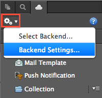
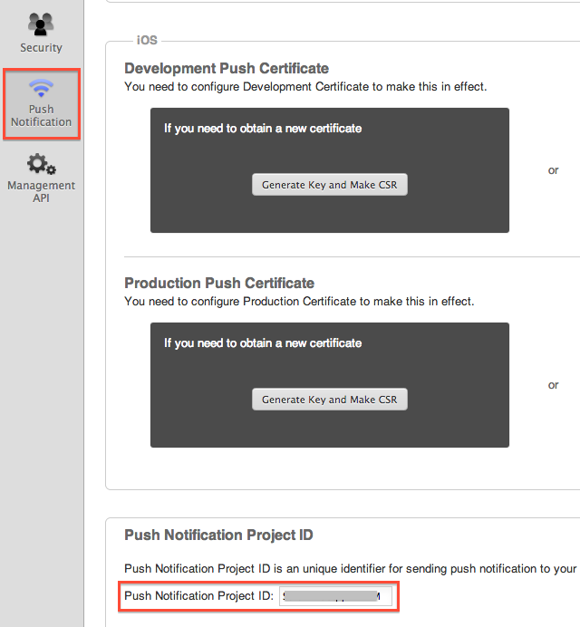

プッシュ通知機能
================

Cordova6.2プロジェクトでアドホックビルドしたアプリに対しては、リリースを選択する必要があります。

プッシュ通知に使用する Monaca バックエンド マネジメント API
を、次に記します。

  メソッド 解                     説
  ------------------------------- ----------------------------------------
  Push.send()&lt;p.send&gt;       プッシュ通知を送信します。
  Push.status()&lt;p.status&gt;   プッシュ通知のステータスを取得します。

Push.send - プッシュ通知の送信
------------------------------

アプリに、プッシュ通知を送信します。

Push.send

パラメーター

:   ----------------------- ------------------------- --------------------------------------------------------------------------------------------------------------------------------------------------------
      `pushProjectId`         文字列 :r                 ef:push\_project\_id
      `platform`              文字列 通知               先となるプラットフォームです。 `\"android\"` または `\"ios\"` になります。
      `target`                文字列 エン               ドユーザーの種類です。`\"app\"` になります。
      `buildType`             文字列 アプ               リのビルドの種類です。 `\"debug\"` 、 `\"release\"` 、 `\"adhoc\"` のいずれかを選択します。
      `title`                 文字列 タイ               トルです ( Android のみ )。
      `message`               文字列 送信               されるメッセージです。
      `badge`                                           バッジ ( iOS のみ ) です。
      `extra_json`            json                      JSON データです。
      `userOidList`           配列 of 文字列 ユーザー   ID を使用して、対象となるユーザーを絞り込みます ( 任意 )。
                                                        \* Javascript 側では、これらの ID の値は、 monaca.cloud.User.oid&lt;u.\_oid&gt; となります。
                                                        \* ../cloud\_management/ に記載されているように、これらの ID は、 User.list()&lt;u\_list&gt; 関数で取得した各データの `\"_id\"` プロパティーの値です。
      `userQuery`             文字列 ユ                 ーザーのプロパティーと MonaQL&lt;MonaQL&gt; クエリーを使用して、対象となるユーザを絞り込みます ( 任意 )。
                                                        **例** 'country == "US" && age &gt; 20'
      `userQueryBindParams`   配列 u                    serQuery 内にプレースホルダーがある場合には、値に置き換えます ( 任意 )。
                                                        **例** userQuery が 'country == ? && age &gt; ?' の場合、\["US", 20\] になります。
      `deviceIdList`          配列 of 文字列 デバイス   ID を使用して、対象となる端末を絞り込みます ( 任意 )。
                                                        \* Javascript 側では、これらの ID は monaca.getDeviceId()&lt;getDeviceId&gt; の戻り値です。
      ----------------------- ------------------------- --------------------------------------------------------------------------------------------------------------------------------------------------------

    

    `deviceIdList` 、 `userOidList` 、 `userQuery`
    は、同時に使用できません。

    

戻り値

:   --------------- ---------------------------------------------------
      `queueIdList`   プッシュキュー ID ( push queue id ) の一覧です。"
      --------------- ---------------------------------------------------

エラーコード

:   ../cloud/error オブジェクト形式で、エラーが返ってきます。

      ---------- --------------------------
      `-32602`   不正なパラメーターです。
      ---------- --------------------------

Push.status - プッシュ通知のステータスの取得
--------------------------------------------

プッシュ通知のステータスを取得します。

Push.status

パラメーター

:   ----------------- -------- --------------------------------------------------------------
      `pushProjectId`   文字列   push\_project\_id
      `queueId`         文字列   プッシュキュー ID ( Push queue ID / `queueIdList` から取得 )
      ----------------- -------- --------------------------------------------------------------

戻り値

:   ------------------ ---------------------------------------------
      `status`           ステータス ( `完了` など ) です。
      `numTarget`        対象となる受信者の数です。
      `numPushed`        受信が成功した数です。
      `numFailed`        受信が失敗した数です。
      `createdAt`        作成日時です。
      `pushStartedAt`    開始日時です。
      `pushFinishedAt`   完了日時です ( 成功または失敗に関わらず )。
      ------------------ ---------------------------------------------

エラーコード

:   ../cloud/error オブジェクト形式で、エラーが返ってきます。

      ---------- --------------------------
      `-32602`   不正なパラメーターです。
      ---------- --------------------------

プッシュ通知 プロジェクト ID
----------------------------

プッシュ通知 プロジェクト ID とは、プッシュ通知毎の ID
です。次の手順で確認できます。

1.  Monaca クラウド IDE 上の 雲 アイコンをクリックして、 *Monaca
    バックエンド* の管理画面を開きます。
2.  歯車 のアイコンをクリックして、 バックエンド設定...
    を開きます。下のスクリーンショットをご確認ください。

> 
>
> > width
> >
> > :   200px
> >
3.  Backend Settings 画面が表示されます ( 中央の左側 )。次に、
    プッシュ通知 の項目をクリックします。スクロールで下に行き、 アプリの
    「 プッシュ通知プロジェクト ID 」 を確認します (
    下のスクリーンショットを参照のこと )。

> 
>
> > width
> >
> > :   500px
> >

