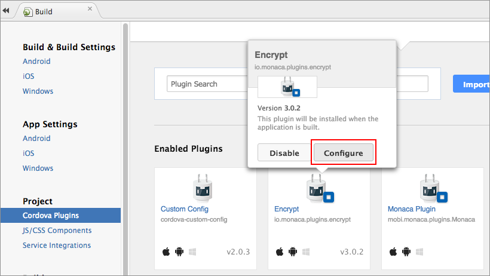
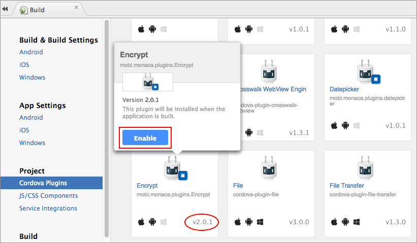
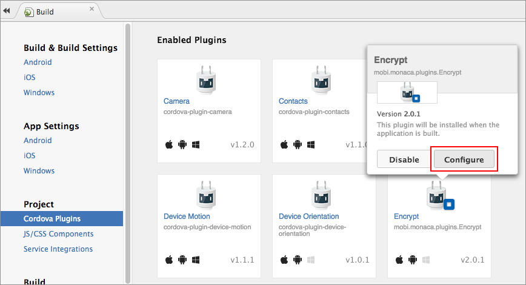
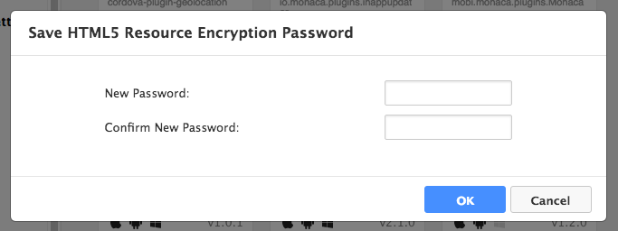

アプリロジック暗号化 プラグイン
===============================

このプラグイン ( Monaca HTML5 Resource Encryption )
を使用して、アプリに組み込まれている HTML5 アセットを、暗号化 (
アプリのビルド時 )・復号化 ( アプリの実行時 ) します。

<div class="admonition note">

このプラグインを使用するためには、対応するプランへの加入が必要となります。詳細は、[料金プラン](https://ja.monaca.io/pricing.html)
をご確認ください。

</div>

プロジェクトで使用する Cordova
のバージョンによって、このプラグインは使用できる機能が異なります。

-   cordova\_6\_2\_projects
-   cordova\_5\_2\_and\_lower\_projects

Cordova 6.2 向けのプロジェクトで使用する場合
--------------------------------------------

Cordova 6.2
向けのプロジェクトで、このプラグインを使用する場合、次の機能が追加されます。

1.  暗号化の対象として、www
    配下のディレクトリーを、細かく指定することができます。たとえば、
    “www/data”、”www/js” などと指定できます。
2.  復号化を 「 手動 」
    で行うことができます。復号化用の関数を実行するまで、暗号化されたフォルダーを読み込むことができません。

### サポート対象のプラットフォーム

-   Cordova 6.2
-   iOS 7 以降
-   Android 4.0 以上

### 暗号化方式

  ---------------- ---
  暗号化方式 AES   
  鍵長 256 bi      t
  ---------------- ---

### プラグインの追加方法

1.  Monaca クラウド IDE メニュー上で、
    ファイル --&gt; Cordova プラグインの管理... または
    設定 --&gt; Cordova プラグインの管理... を選択します。
2.  `Encrypt` プラグインの 有効 ボタンをクリックします。

> {width="700px"}

3.  次に、\*有効なプラグイン\*
    欄へ行き、先ほど追加したプラグイン上に、マウスポインターを持っていきます。表示された画面上で、設定
    ボタンをクリックします。

> {width="700px"}

4.  プラグインの設定に必要なパラメーターを入力します。入力後、OK
    ボタンをクリックします。入力できるパラメーターは、次のとおりです。

> +---------+------------------------------------------------------------+
> | パラメーター | | 解説                                                |
> +=========+============================================================+
> | SECRET  | \[ 必須 \] ( 文字列 ) 暗号化に必要なパスワード ( SECRET )  |
> |         | を入力します。                                             |
> +---------+------------------------------------------------------------+
> | TARGETS | \[ 任意 \] ( 文字列 )                                      |
> |         | 暗号化対象のファイルが格納されているフォルダーを指定します。デフォルトは、`www` |
> |         |                                                            |
> |         | です。                                                     |
> +---------+------------------------------------------------------------+
> | AUTO\_D | \[ 任意 \] ( 真偽値 ) 「 自動復号化 」                     |
> | ECRYPT  | 機能を有効・無効にします。                                 |
> |         |                                                            |
> |         | > -   `1`: ( デフォルト ) 自動復号化機能を有効にします。   |
> |         | > -   `0`: 自動復号化機能を無効にします。                  |
> +---------+------------------------------------------------------------+
>
> {width="600px"}

### 手動での復号化

上記の 「 自動復号化 」
機能を使用する以外にも、手動でも、フォルダーの復号化を行えます。この場合、`monaca.Encrypt.setDecryptHash()`
を実行するまで、対象のフォルダー ( 暗号化されているフォルダー )
は、読み込むことができません。つまり、index.html ファイル上で、script
タグを使用しても、対象のファイルを読み込むことができません。

手動で復号化を行う場合には、次の手順に従います。

#### ステップ 1 : 手動での復号化を有効にする

手動での復号化を有効にする場合、上記の手順 ( 「 プラグインの追加方法 」
の 4 番目の手順 ) で解説した `AUTO_DECRYPT` を、`0` に設定します。

#### ステップ 2 : ハッシュ値を取得する

`monaca.Encrypt.setDecryptHash()` 関数 ( フォルダーの復号化用 )
を呼ぶときには、次のハッシュ値が必要となります。ハッシュ値は、次のようにして、ビルドログ上で確認できます。

1.  プロジェクトをビルドします ( iOS または Android )。
2.  ビルド完了後、次のような画面が表示されます。表示された画面上で、こちらをクリック
    をクリックして、ビルドログを表示させます。

> {width="700px"}

5.  お好きなテキストエディターを開き、ビルドログの内容をコピー&ペーストして、ハッシュ値を検索します。次の箇所が、ハッシュ値となります。

> ``` {.sourceCode .javascript}
> ...
> Hash : [4c716d***************************************************ae9f720d]
> ...
> ```

#### ステップ 3 : 復号化用の関数を実行する

ここまでの手順で、復号化用の関数を使用する準備ができました。なお、この関数は、次のように、`deviceready`
イベント内で、実行する必要があります。

``` {.sourceCode .javascript}
document.addEventListener("deviceready", onDeviceReady, false);
function onDeviceReady() {
    monaca.Encrypt.setDecryptHash(
        function() {alert('SUCESS');},
        function() {alert('FAIL');},
    "4c716d***************************************************ae9f720d"); // Hash code for decryption
}
```

<div class="admonition note">

上記の例では、ハッシュ値を、直接、関数内に記述しています。セキュリティーを強化する場合には、適宜、処理を工夫する必要があります
(
サーバー側からこの値を取得し、なんらかのパラメーターに代入し、隠してから使用するなど
)。

</div>

### App Store への提出に際して

このプラグインでは、iOS SDK
の暗号化ライブラリーが使用されています。よって、このプラグインを組み込んだ、ビルド済みアプリを
App Store
へ提出して審査を受ける場合、アップロード時に特別な設定が必要となります。Export
Compliance 上の 2 つの質問に対して、次のように、「 Yes 」 で答えます。


> width
>
> :   630px
>
> align
>
> :   center
>
Cordova 5.2 向け、または、それ以前のバージョンを使用したプロジェクトで使用する場合
----------------------------------------------------------------------------------

### サポート対象のプラットフォーム

-   Cordova 5.2 以前
-   iOS 7 以降
-   Android 4.0 以上

### 暗号化方式

  ---------------- ---
  暗号化方式 AES   
  鍵長 256 bi      t
  ---------------- ---

### プラグインの追加方法 ( Monaca クラウド IDE 上での処理 )

1.  Monaca クラウド IDE メニュー上で、
    ファイル --&gt; Cordova プラグインの管理... または
    設定 --&gt; Cordova プラグインの管理... を選択します。
2.  `Encrypt` プラグインの 有効 ボタンをクリックします。

> {width="700px"}

3.  暗号化用のパスワードを設定します。\*有効なプラグイン\*
    欄へ行き、先ほど追加したプラグイン上に、マウスポインターを持っていきます。表示された画面上で、設定
    ボタンをクリックします。

> {width="700px"}

4.  暗号用パスワードを入力して、 OK ボタンをクリックします。

> {width="400px"}

### App Store への提出に際して

このプラグインでは、iOS SDK
の暗号化ライブラリーが使用されています。よって、このプラグインを組み込んだ、ビルド済みアプリを
App Store
へ提出して審査を受ける場合、アップロード時に特別な設定が必要となります。Export
Compliance 上の 2 つの質問に対して、次のように、「 Yes 」 で答えます。


> width
>
> :   630px
>
> align
>
> :   center
>

