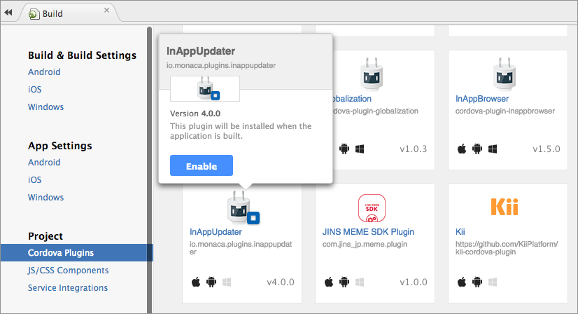
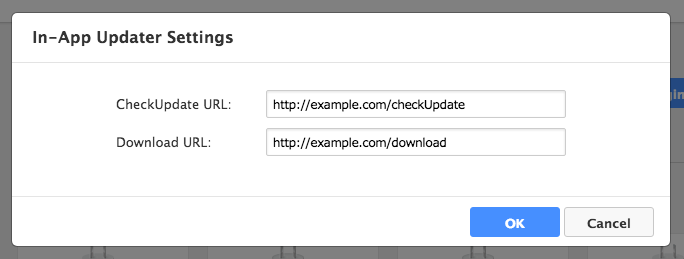
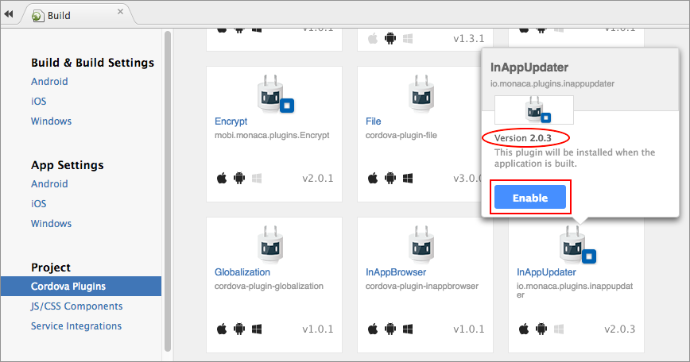
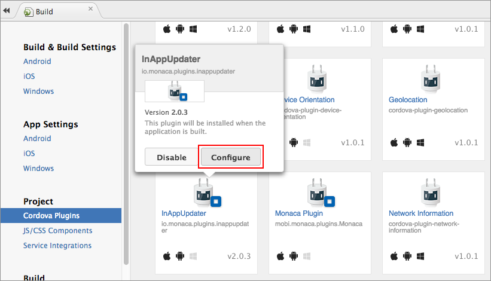
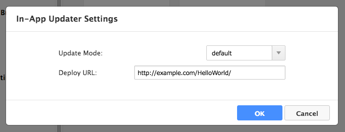
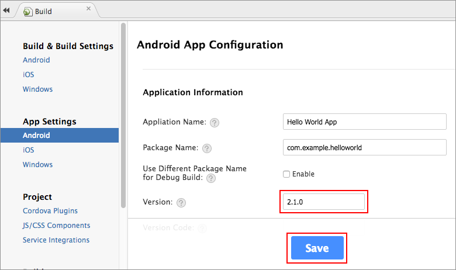
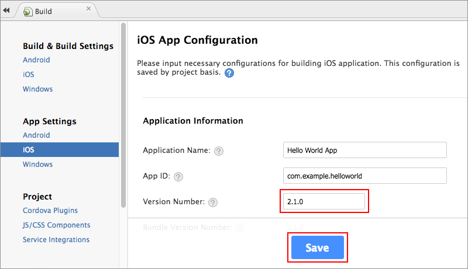
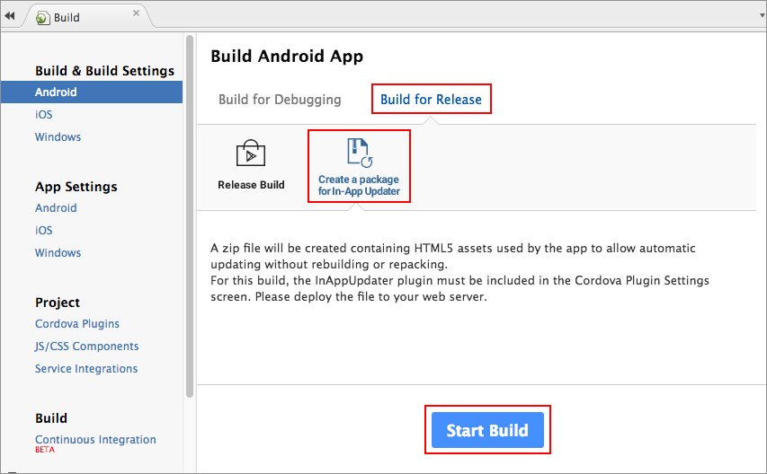
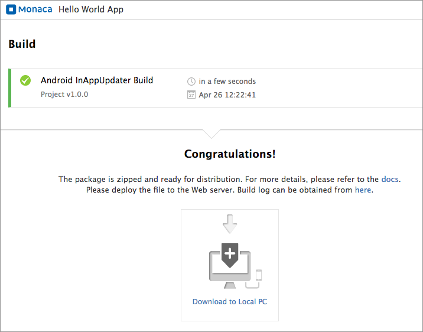

In-App アップデーター プラグイン
================================

アプリの再ビルド・再パッケージ化を行わずに、アプリで使用している HTML5
アセットを更新するためのプラグイン ( Monaca In-App Updater )
です。なお、更新ファイルをホストする Web
サーバーが、別途、必要になります (
アプリから、これらのファイルへアクセスできること )。

<div class="admonition note">

このプラグインを使用するためには、対応するプランへの加入が必要となります。詳細は、[料金プラン](https://ja.monaca.io/pricing.html)
をご確認ください。

</div>

プロジェクトで使用する Cordova
のバージョンによって、このプラグインは使用できる機能が異なります。

-   inapp\_update\_6\_2
-   inapp\_update\_5\_2\_and\_lower

Cordova 6.2 向けのプロジェクトで使用する場合
--------------------------------------------

### サポート対象のプラットフォーム

-   iOS 8 以上
-   Android 4 以降

### プラグインの追加方法

1.  Monaca クラウド IDE メニュー上で、
    ファイル --&gt; Cordova プラグインの管理... または
    設定 --&gt; Cordova プラグインの管理... を選択します。
2.  `Monaca In-App Updater ( version 4.0.0 )` の 有効
    ボタンをクリックして、プロジェクトへ追加します。

> {width="700px"}

3.  プラグインの設定を行います。\*有効なプラグイン\*
    欄へ行き、先ほど追加したプラグイン上に、マウスポインターを持っていきます。表示された画面上で、設定
    ボタンをクリックします。

> {width="700px"}

4.  CheckUpdate URL &lt;checkUpdate\_api&gt; と
    Download URL &lt;download\_api&gt; 欄を適宜入力して、OK
    ボタンをクリックします。

> {width="600px"}

### プラグインの設定

本プラグインを利用するためには、「/checkUpdate」&lt;checkUpdate\_api&gt;
と 「/download」&lt;download\_api&gt; の二つのWeb
API（URL）が必要となります。

#### /checkUpdate

サーバーにある更新バージョンを確認します

*Request パラメーターs*

> widths
>
> :   10 10 30
>
> header-rows
>
> :   1
>
> -   -   パラメーター
>     -   型
>
>     - 解説
> -   -   `project_id`
>     -   文字列
>
>     - プロジェクトの一意の ID
> -   -   `my_update_number`
>     -   文字列
>
>     - \[ 任意 \] アプリの現在の更新番号
> -   -   `os`
>     -   文字列
>
>     - \[ 任意 \] 更新対象となる OS の種類
> -   -   `build_type`
>     -   文字列
>
>     - \[ 任意 \] ビルドの種類
> -   -   `app_version`
>     -   文字列
>
>     - \[ 任意 \] アプリのバージョン
> -   -   `plugin_version`
>     -   文字列
>     -   \[ 任意 \] In-App-Updater プラグインのバージョン
>
*Response パラメーターs*

成功時のレスポンス例

``` {.sourceCode .javascript}
{
  "ios": {
    "2.1.0": {　// app version
      "1": { // update number
        "date": 20170113,
        "url": "https://hogehoge.com/app/ios-v2.1.0.zip" // This parameter is optional.
      }
    }
  }
}
```

静的ファイルを使用する場合、すべてのバージョンを次のように列挙しておきます。

``` {.sourceCode .javascript}
{
  "ios": {
    "2.1.0": {　// app version
      "1": { // update number
        "date": 20170113,
        "url": "https://hogehoge.com/app/1/ios-v2.1.0.zip" //  This parameter is optional.
      },
      "2": { // update number
        "date": 20170113,
        "url": "https://hogehoge.com/app/2/ios-v2.1.0.zip" //  This parameter is optional.
      }
    },
    "2.2.0": {　// app version
      "1": { // update number
        "date": 20170210,
        "url": "https://hogehoge.com/app/1/ios-v2.2.0.zip" //  This parameter is optional.
      }
    }
  }
}
```

上の例に示すように、更新番号の値は「日付」「URL」などの更新情報で構成されるJSONオブジェクトです。これは、
getserverversion メソッドのPromiseによって返されるJSONオブジェクトの
`updateInfo` パラメータによって取得できます。

#### /download

更新用のパッケージファイル(ZIP形式)をダウンロードします。

<div class="admonition note">

 download でダウンロードURLを設定すると、この設定を省略できます。

</div>

*Request パラメーターs*

> widths
>
> :   10 10 30
>
> header-rows
>
> :   1
>
> -   -   パラメーター
>     -   型
>
>     - 解説
> -   -   `update_number`
>     -   文字列
>
>     - ダウンロードするバージョンの番号 ( 更新バージョン番号 )
> -   -   `project_id`
>     -   文字列
>
>     - プロジェクトの一意の ID
> -   -   `my_update_number`
>     -   文字列
>
>     - \[ 任意 \] アプリの現在の更新番号
> -   -   `os`
>     -   文字列
>
>     - \[ 任意 \] 更新対象となる OS の種類
> -   -   `build_type`
>     -   文字列
>
>     - \[ 任意 \] ビルドの種類
> -   -   `app_version`
>     -   文字列
>
>     - \[ 任意 \] アプリのバージョン
> -   -   `plugin_version`
>     -   文字列
>     -   \[ 任意 \] In-App-Updater プラグインのバージョン
>
*Response パラメーターs*

成功時のレスポンスには、処理結果 ( Zip 形式 ) が入っています。

### メソッド

このプラグインの最もシンプルな使用方法は、autoUpdate
を使用して、更新ファイルのダウンロード ( updater\_configuration
を参照のこと ) とアプリの更新を自動で行うことです。

getServerVersion、download、updateAndRestart
などのメソッドを組わせて使用すれば、更新処理をカスタマイズすることもできます。

このプラグインが提供しているメソッドは次のとおりです。

  メソッド 解                 説
  --------------------------- --------------------------------------------------------------------------------------------------------
  getServerVersion            更新ファイルの情報をサーバー側から取得します。
  forceStopGetServerVersion   getServerVersion の処理を中断させます。
  getLocalVersion             現在のアプリの更新番号を確認します。
  download                    更新用ファイルをダウンロードします。
  forceStopDownload           download の処理を中断させます。
  updateAndRestart            ダウンロードした更新用ファイルを展開しマウントします。次に、アプリを再起動させます。
  status                      プラグインの状態を確認します。
  showAlertDialog             ダイアログ ( タイトルとメッセージ ) を表示します。ダイアログは、一度に一個のみ表示できます。
  dismissAlertDialog          警告 ( Alert ) ダイアログを閉じます。
  showProgressDialog          進捗表示 ( Progress ) 用ダイアログを表示します。こちらのダイアログでは、更新の進捗状況が表示されます。
  changeProgressDialog        進捗表示 ( Progress ) 用ダイアログを更新します。
  dismissProgressDialog       進捗表示 ( Progress ) 用ダイアログを閉じます。
  networkStatus               ネットワークの状態 ( Wifi、3G/LTE、接続なし など ) を確認します。
  terminateApp                アプリを強制終了させます。
  autoUpdate                  必要であれば、getServerVersion、download などのメソッドを使用して、自動的にアップデートを行います。

#### getServerVersion()

更新ファイルの情報をサーバー側から取得します。

monaca.InAppUpdater.getServerVersion(\[args: JSON object\]): Promise

パラメーター: JSON オブジェクト

:   +--------------+------+------------------------------------------------+
    | 名前         | 型 | |                                                |
    |              | 解説 |                                                |
    +==============+======+================================================+
    | `connectDela | inte | サーバー接続を開始するまでの待機時間 (         |
    | y`           | ger  | ミリ秒単位 )                                   |
    +--------------+------+------------------------------------------------+
    | `connectTime | inte | ( Android 専用 )                               |
    | out`         | ger  | サーバー接続時に適用するタイムアウト時間 (     |
    |              |      | ミリ秒単位 )                                   |
    +--------------+------+------------------------------------------------+
    | `readTimeout | inte | ( Android 専用 )                               |
    | `            | ger  | サーバーからのレスポンス受信時に適用するタイムアウト時間 |
    |              |      |                                                |
    |              |      | (                                              |
    |              |      | すべてのレスポンスを受け取るまでの時間、ミリ秒単位 |
    |              |      |                                                |
    |              |      | )                                              |
    +--------------+------+------------------------------------------------+
    | `timeoutForR | inte | ( iOS 専用 )                                   |
    | equest`      | ger  | サーバーへのリクエスト送信時に適用するタイムアウト時間。タイムアウトが発生した場合でも、リク |
    |              |      | エストは自動的に再送信されます。エラーは出力されません。 |
    +--------------+------+------------------------------------------------+
    | `timeoutForR | > in | ( iOS 専用 )                                   |
    | esponse`     | tege | サーバーからのレスポンス受信時に適用するタイムアウト時間 |
    |              | r    |                                                |
    |              |      | (                                              |
    |              |      | すべてのレスポンスを受け取るまでの時間、ミリ秒単位 |
    |              |      |                                                |
    |              |      | )                                              |
    +--------------+------+------------------------------------------------+

戻り値: Promise

:   -   成功時のコールバックには、次のような内容の JSON
        オブジェクトが渡されます。

        > widths
        >
        > :   15 5 25
        >
        > header-rows
        >
        > :   1
        >
        > -   -   名前
        >     -   型
        >
        >     - 解説
        > -   -   `needsUpdate`
        >     -   真偽値
        >
        >     - アプリのバージョンを更新する必要があるかを示します。
        > -   -   `updatable`
        >     -   真偽値
        >
        >     - 更新用のファイルがサーバー側に置かれているかを示します。
        > -   -   `latestVersion`
        >     -   文字列
        >
        >     - アプリの最新バージョン
        > -   -   `myVersion`
        >     -   文字列
        >
        >     - アプリの現バージョン
        > -   -   `latestUpdateNumber`
        >     -   文字列
        >
        >     - アプリの現バージョンに適用できる最新の更新番号
        > -   -   `myUpdateNumber`
        >     -   文字列
        >
        >     - アプリの現バージョンが使用している現在の更新番号
        > -   -   `updateInfo`
        >     -   JSON オブジェクト
        >     -   サーバー側にて更新番号の次に記載した内容となります。たとえば、サーバー側の応答が次のようになっているとします。
        >
        >         > ``` {.sourceCode .javascript}
        >         > {
        >         >   "ios": {
        >         >     "2.1.0": {　// app version
        >         >       "1": { // update number
        >         >         "date": 20170113,
        >         >         "url": "https://hogehoge.com/app/ios-v2.1.0.zip" // This parameter is optional.
        >         >       }
        >         >     }
        >         >   }
        >         > }
        >         > ```
        >
        >         その場合、`updateInfo` は以下の内容となります。
        >
        >         > ``` {.sourceCode .javascript}
        >         > updateInfo = {
        >         >   "date": 20170113,
        >         >   "url": "https://hogehoge.com/app/ios-v2.1.0.zip"
        >         > }
        >         > ```
        >
    -   失敗時のコールバックには、エラーを示す JSON
        オブジェクトが渡されます。

例

:   ``` {.sourceCode .javascript}
    monaca.InAppUpdater.getServerVersion().then(
        function(json) {
            alert( JSON.stringify(json) );
            targetVersion = json.myVersion;
            targetUpdateNumber = json.latestUpdateNumber;
            url = json.updateInfo.url;
            alert( targetVersion );
            alert( targetUpdateNumber );
            alert( url );
        } ,
        function(fail) { alert( JSON.stringify(fail) ); }
    );
    ```

#### forceStopGetServerVersion()

`getServerVersion()` の処理を中断させます。

monaca.InAppUpdater.forceStopGetServerVersion(): Promise

パラメーター

:   このメソッドには引数は必要ありません。

戻り値: Promise

:   -   成功時のコールバックには、結果を格納した JSON
        オブジェクトが渡されます。
    -   失敗時のコールバックには、エラーを示す JSON
        オブジェクトが渡されます。

例

:   ``` {.sourceCode .javascript}
    monaca.InAppUpdater.forceStopGetServerVersion().then(
        function(str) { alert("stop success"); } ,
        function(fail) { alert( JSON.stringify(fail) ); }
    );
    ```

#### getLocalVersion()

現在のアプリの更新番号を確認します。

monaca.InAppUpdater.getLocalVersion(): Promise

パラメーター

:   このメソッドには引数は必要ありません。

戻り値: Promise

:   -   成功時のコールバックには、結果を格納した JSON
        オブジェクトが渡されます。
    -   失敗時のコールバックには、エラーを示す JSON
        オブジェクトが渡されます。

例

:   ``` {.sourceCode .javascript}
    monaca.InAppUpdater.getLocalVersion().then(
        function(json) { alert( JSON.stringify(json) ); } ,
        function(fail) { alert( JSON.stringify(fail) ); }
    );
    ```

#### download()

更新用ファイルをダウンロードします。

monaca.InAppUpdater.download(args: JSON object): Promise

パラメーター: JSON オブジェクト

:   +--------------+------+------------------------------------------------+
    | 名前         | 型 | |                                                |
    |              | 解説 |                                                |
    +==============+======+================================================+
    | `updateNumbe | inte | 更新番号                                       |
    | r`           | ger  |                                                |
    +--------------+------+------------------------------------------------+
    | `bufferSize` | inte | ( Android 専用 ) バッファーサイズ ( バイト単位 |
    |              | ger  | )。デフォルト値は `8192` です。                |
    +--------------+------+------------------------------------------------+
    | `url`        | 文字列 | こちらに設定された URL から Zip              |
    |              |      | ファイルをダウンロードします。この値を設定しない場合には、`config.xml` |
    |              |      |                                                |
    |              |      | 内の `monaca:updater_DownloadUrl`              |
    |              |      | 値が代わりに使用されます                       |
    +--------------+------+------------------------------------------------+
    | `connectDela | inte | サーバー接続を開始するまでの待機時間 (         |
    | y`           | ger  | ミリ秒単位 )                                   |
    +--------------+------+------------------------------------------------+
    | `connectTime | > in | ( Android 専用 )                               |
    | out`         | tege | サーバー接続時に適用するタイムアウト時間 (     |
    |              | r    | ミリ秒単位 )                                   |
    +--------------+------+------------------------------------------------+
    | `readTimeout | inte | ( Android 専用 )                               |
    | `            | ger  | サーバーからのレスポンス受信時に適用するタイムアウト時間 |
    |              |      |                                                |
    |              |      | (                                              |
    |              |      | すべてのレスポンスを受け取るまでの時間、ミリ秒単位 |
    |              |      |                                                |
    |              |      | )                                              |
    +--------------+------+------------------------------------------------+
    | `timeoutForR | inte | ( iOS 専用 )                                   |
    | equest`      | ger  | サーバーへのリクエスト送信時に適用するタイムアウト時間。タイムアウトが発生した場合でも、リク |
    |              |      | エストは自動的に再送信されます。エラーは出力されません。 |
    +--------------+------+------------------------------------------------+
    | `timeoutForR | > in | ( iOS 専用 )                                   |
    | esponse`     | tege | サーバーからのレスポンス受信時に適用するタイムアウト時間 |
    |              | r    |                                                |
    |              |      | (                                              |
    |              |      | すべてのレスポンスを受け取るまでの時間、ミリ秒単位 |
    |              |      |                                                |
    |              |      | )                                              |
    +--------------+------+------------------------------------------------+

戻り値: Promise

:   -   成功時のコールバックには、結果を格納した JSON
        オブジェクトが渡されます。
    -   失敗時のコールバックには、エラーを示す JSON
        オブジェクトが渡されます。
    -   進捗表示コールバックには、ダウンロードの進捗状況を示す、次のような
        JSON オブジェクトが渡されます。

      名前                                                                                            型 | 解説                                      
      ----------------------------------------------------------------------------------------------- ---------------------------------------------- ----------------------------------------------------------------------------------------------------------------------------------------------------------------------------------------------------------------------------------------------------------------------------------------------------------------------
      `count`                                                                                         integer                                        これまでにダウンロードされたファイルのサイズ
      `total`                                                                                         integer                                        ダウンロードされるファイルの予想サイズ

例

:   ``` {.sourceCode .javascript}
    monaca.InAppUpdater.download( { version : targetVersion, buildNumber : targetBuildNumber, url : url } ).then(
        function(json) { alert( JSON.stringify(json) ); } ,
        function(fail) { alert( JSON.stringify(fail) ); } ,
        function(json) { console.log( json.count + "/" + json.total + " are done." ); }
    );
    ```

#### forceStopDownload()

`download()` の処理を中断させます。

monaca.InAppUpdater.forceStopDownload(): Promise

パラメーター

:   このメソッドには引数は必要ありません。

戻り値: Promise

:   -   成功時のコールバックには、結果を格納した JSON
        オブジェクトが渡されます。
    -   失敗時のコールバックには、エラーを示す JSON
        オブジェクトが渡されます。

例

:   ``` {.sourceCode .javascript}
    monaca.InAppUpdater.forceStopDownload().then(
        function(str) { alert("stop success"); } ,
        function(fail) { alert( JSON.stringify(fail) ); }
    );
    ```

#### updateAndRestart()

ダウンロードした更新用ファイルを展開しマウントします。次に、アプリを再起動させます。

monaca.InAppUpdater.updateAndRestart(): Promise

パラメーター

:   このメソッドには引数は必要ありません。

戻り値: Promise

:   -   成功時のコールバックには、結果を格納した JSON
        オブジェクトが渡されます。
    -   失敗時のコールバックには、エラーを示す JSON
        オブジェクトが渡されます。
    -   進捗表示コールバックには、展開処理の進捗状況を示す、次のような
        JSON オブジェクトが渡されます。

      名前                                                                                                     型 | 解説                                          
      -------------------------------------------------------------------------------------------------------- -------------------------------------------------- -------------------------------------------------------------------------------------------------------------------------------------------------------------------------------------------------------------------------------------------------------------------------------------------------------------------------------------------------
      `count`                                                                                                  integer                                            Zip ファイルを展開して得られた、現在までのファイル数
      `total`                                                                                                  integer                                            展開予定の更新ファイル数

例

:   ``` {.sourceCode .javascript}
    monaca.InAppUpdater.updateAndRestart().then(
        function() { },
        function(fail) { alert( JSON.stringify(fail) ); },
        function(json) { console.log( json.count + "/" + json.total + " are done." ); }
    );
    ```

#### status()

プラグインの状態を確認します。

monaca.InAppUpdater.status(): Promise

パラメーター

:   このメソッドには引数は必要ありません。

戻り値: Promise

:   -   成功時のコールバックには、次のような内容の JSON
        オブジェクトが渡されます。

      名前                                                                            型 | 解説                              
      ------------------------------------------------------------------------------- -------------------------------------- ----------------------------------------------------------------------------------------------------------------------------------------------------------------------------------------------------------------------------------------------------------------
      `running`                                                                       真偽値 |                               プラグインが処理中の場合、`true` を返します。
      `status`                                                                        文字列                                 処理に関する情報が格納されています。

    -   失敗時のコールバックには、エラーを示す JSON
        オブジェクトが渡されます。

例

:   ``` {.sourceCode .javascript}
    monaca.InAppUpdater.status().then(
        function(json) { alert( JSON.stringify(json) ); },
        function(fail) { alert( JSON.stringify(fail) ); }
    );
    ```

#### showAlertDialog()

ダイアログ ( タイトルとメッセージ )
を表示します。ダイアログは、一度に一個のみ表示できます。

monaca.InAppUpdater.showAlertDialog(args: JSON object): Promise

パラメーター: JSON オブジェクト

:   +-------------+-------+------------------------------------------------+
    | 名前        | 型 |  |                                                |
    |             | 解説  |                                                |
    +=============+=======+================================================+
    | `title`     | 文字列 | ダイアログのタイトル                          |
    +-------------+-------+------------------------------------------------+
    | `message`   | 文字列 | メッセージ本文                                |
    +-------------+-------+------------------------------------------------+
    | `button`    | JSON  | クト | ボタンは、次の 2                        |
    |             | オブジェ | つの要素で構成されます。                    |
    |             |       |                                                |
    |             |       | > -   `label`: \[ 文字列 \] ボタンのラベル     |
    |             |       | > -   `handler`:                               |
    |             |       | >     ボタンがクリックされたときに呼ばれる関数 |
    |             |       | >                                              |
    |             |       | > 例 :                                         |
    |             |       | >                                              |
    |             |       | > ``` {.sourceCode .javascript}                |
    |             |       | > {                                            |
    |             |       | >     label : "OK",                            |
    |             |       | >     handler : function() { alert("OK is clic |
    |             |       | ked"); }                                       |
    |             |       | > }                                            |
    |             |       | > ```                                          |
    +-------------+-------+------------------------------------------------+
    | `cancel`    | JSON  | クト | キャンセルボタンは、次の 2              |
    |             | オブジェ | つの要素で構成されます。                    |
    |             |       |                                                |
    |             |       | > -   `label`: \[ 文字列 \]                    |
    |             |       | >     キャンセルボタンのラベル                 |
    |             |       | > -   `handler`:                               |
    |             |       | >     キャンセルボタンがクリックされたときに呼ばれる関数 |
    |             |       |                                                |
    |             |       | >                                              |
    |             |       | > 例 :                                         |
    |             |       | >                                              |
    |             |       | > ``` {.sourceCode .javascript}                |
    |             |       | > {                                            |
    |             |       | >     label : "Close",                         |
    |             |       | >     handler : function() { alert("Close is c |
    |             |       | licked"); }                                    |
    |             |       | > }                                            |
    |             |       | > ```                                          |
    +-------------+-------+------------------------------------------------+

戻り値: Promise

:   -   成功時のコールバックには、結果を格納した JSON
        オブジェクトが渡されます。
    -   失敗時のコールバックには、エラーを示す JSON
        オブジェクトが渡されます。

例

:   ``` {.sourceCode .javascript}
    monaca.InAppUpdater.showAlertDialog({
      title : "Title" ,
      message : "Message" ,
      button : { label : "OK" , handler : function() { alert( "OK is clicked"); } },
      cancel : { label : "Cancel" , handler : function() { alert( "Cancel is clicked"); } },
      dismiss : function() { alert("Dismissed!"); }
    } ).then(
        function(btnLabel) { alert( "open" ); },
        function(fail) { alert( JSON.stringify(fail) ); }
    );
    ```

#### dismissAlertDialog()

警告 ( Alert ) ダイアログを閉じます。

monaca.InAppUpdater.dismissAlertDialog(): Promise

パラメーター

:   このメソッドには引数は必要ありません。

戻り値: Promise

:   -   成功時のコールバックには、結果を格納した JSON
        オブジェクトが渡されます。
    -   失敗時のコールバックには、エラーを示す JSON
        オブジェクトが渡されます。

例

:   ``` {.sourceCode .javascript}
    setTimeout( function() {
      monaca.InAppUpdater.dismissAlertDialog().then(
          function(json) { alert( "OK auto close" ); },
          function(fail) { alert( JSON.stringify(fail) ); }
      );
    } , 1000 );
    ```

#### showProgressDialog()

進捗表示 ( Progress )
用ダイアログを表示します。こちらのダイアログでは、更新の進捗状況が表示されます。

monaca.InAppUpdater.showProgressDialog(args: JSON object): Promise

パラメーター: JSON オブジェクト

:   +-------------+-------+------------------------------------------------+
    | 名前        | 型 |  |                                                |
    |             | 解説  |                                                |
    +=============+=======+================================================+
    | `title`     | 文字列 | ダイアログのタイトル                          |
    +-------------+-------+------------------------------------------------+
    | `message`   | 文字列 | メッセージ本文                                |
    +-------------+-------+------------------------------------------------+
    | `max`       | integ | カウンターの最大値です。ファイルをダウンロードする場合には、ファイル総数となります。 |
    |             | er    |                                                |
    +-------------+-------+------------------------------------------------+
    | `progress`  | integ | 進捗を示す値です。ファイルをダウンロードする場合には、ダウンロード済みのファイル総数となりま |
    |             | er    | す。                                           |
    +-------------+-------+------------------------------------------------+
    | `cancel`    | JSON  | クト | キャンセルボタンは、次の 2              |
    |             | オブジェ | つの要素で構成されます。                    |
    |             |       |                                                |
    |             |       | > -   `label`: \[ 文字列 \]                    |
    |             |       | >     キャンセルボタンのラベル                 |
    |             |       | > -   `handler`:                               |
    |             |       | >     キャンセルボタンがクリックされたときに呼ばれる関数 |
    |             |       |                                                |
    |             |       | >                                              |
    |             |       | > 例 :                                         |
    |             |       | >                                              |
    |             |       | > ``` {.sourceCode .javascript}                |
    |             |       | > {                                            |
    |             |       | >     label : "Close",                         |
    |             |       | >     handler : function() { alert("Close is c |
    |             |       | licked"); }                                    |
    |             |       | > }                                            |
    |             |       | > ```                                          |
    +-------------+-------+------------------------------------------------+
    | `dismiss`   | コールバッ | 数 |                                      |
    |             | ク関  | ダイアログを閉じたときに呼ばれる関数です。     |
    +-------------+-------+------------------------------------------------+

戻り値: Promise

:   -   成功時のコールバックには、結果を格納した JSON
        オブジェクトが渡されます。
    -   失敗時のコールバックには、エラーを示す JSON
        オブジェクトが渡されます。

例

:   ``` {.sourceCode .javascript}
    monaca.InAppUpdater.showProgressDialog(
      { title : "Title" ,
        message : "Message" ,
        max : 100 ,
        progress : 50 ,
        cancel : { label : "Cancel" , handler : function() { log("cancel handler"); } } ,
        dismiss : function() { log("dismissed."); }
      } ).then(
      function(json) {
        alert(JSON.stringify(json));
      },
      function(fail) {
        alert( JSON.stringify(fail));
      }
    );
    ```

#### changeProgressDialog()

進捗表示 ( Progress ) 用ダイアログを更新します。

monaca.InAppUpdater.changeProgressDialog(args: JSON object): Promise

パラメーター: JSON オブジェクト

:   
      名前                                                                             型 | 解説                                         
      -------------------------------------------------------------------------------- ------------------------------------------------- -------------------------------------------------------------------------------------------------------------------------------------------------------------------------------------------------------------------------------------------------------------------------------------------
      `progress`                                                                       integer                                           進捗を示す値です。こちらの値を更新/変更します。

戻り値: Promise

:   -   成功時にも引数は渡しません。
    -   失敗時のコールバックはありません。

例

:   ``` {.sourceCode .javascript}
    monaca.InAppUpdater.changeProgressDialog( { progress: progress } ).then(
      function() {
        if (progress < 100) {
          setTimeout( function() { changeProgressDialog(progress+10); } , 500 );
        } else {
          monaca.InAppUpdater.dismissProgressDialog().then(
            function(json) { log("complete"); } ,
            function(error) { alert( JSON.stringify(error) ); }
          );
        }
      }
    )
    ```

#### dismissProgressDialog()

進捗表示 ( Progress ) 用ダイアログを閉じます。

monaca.InAppUpdater.dismissProgressDialog(): Promise

パラメーター

:   このメソッドには引数は必要ありません。

戻り値: Promise

:   -   成功時のコールバックには、結果を格納した JSON
        オブジェクトが渡されます。
    -   失敗時のコールバックには、エラーを示す JSON
        オブジェクトが渡されます。

例

:   ``` {.sourceCode .javascript}
    setTimeout( function() {
      monaca.InAppUpdater.dismissProgressDialog().then(
        function(json) { alert(JSON.stringify(json)); } ,
        function(error) { alert( JSON.stringify(error) ); }
      );
    } , 1000 );
    ```

#### networkStatus()

ネットワークの状態 ( Wifi、3G/LTE、接続なし など ) を確認します。

monaca.InAppUpdater.dismissAlertDialog(): Promise

パラメーター

:   このメソッドには引数は必要ありません。

戻り値: Promise

:   -   成功時のコールバックには、次のような内容の JSON
        オブジェクトが渡されます。

      名前                                                                                                             型 | 解説                                              
      ---------------------------------------------------------------------------------------------------------------- ------------------------------------------------------ ----------------------------------------------------------------------------------------------------------------------------------------------------------------------------------------------------------------------------------------------------------------------------------------------------------------------------------------------------------------------------
      `network`                                                                                                        真偽値 |                                               通信事業者のネットワークが利用できる場合には、`true` を返します。
      `wifi`                                                                                                           真偽値 |                                               WiFi が利用できる場合には、`true` を返します。
      `mobile`                                                                                                         真偽値 |                                               ネットワーク接続 ( 通信事業者のネットワークまたは WiFi ) を利用できる場合には `true` を返します。利用できない場合には、 `false` を返します。

    -   失敗時のコールバックには、エラーを示す JSON
        オブジェクトが渡されます。

例

:   ``` {.sourceCode .javascript}
    monaca.InAppUpdater.networkStatus().then(
        function(json) { alert( JSON.stringify(json) ); },
        function(fail) { alert( JSON.stringify(fail) ); }
    );
    ```

#### terminateApp()

アプリを強制終了させます。

<div class="admonition note">

このメソッドは、旧 `InAppUpdater` ( Cordova 5 向けの v2.0.4 )
との互換性を維持するために提供されているメソッドです。

</div>

<div class="admonition warning">

こちらはクラッシュに相当するので、iOS での使用は推奨しません。Apple
側から申請をリジェクトされる可能性があります。

</div>

monaca.InAppUpdater.terminateApp()

パラメーター

:   このメソッドには引数は必要ありません。

戻り値:

:   戻り値はありません。

例

:   ``` {.sourceCode .javascript}
    monaca.InAppUpdater.terminateApp();
    ```

#### autoUpdate()

更新ファイルのダウンロードとアプリの更新を自動的に行います。

monaca.InAppUpdater.autoUpdate(options: JSON object): Promise

パラメーター: JSON オブジェクト

:   
    >
    > widths
    >
    > :   15 10 30
    >
    > header-rows
    >
    > :   1
    >
    > -   -   名前
    >     -   型
    >
    >     - 解説
    > -   -   `connectDelay`
    >     -   integer
    >
    >     - サーバー接続を開始するまでの待機時間 ( ミリ秒単位 )
    > -   -   `dialogMessages`
    >     -   JSON オブジェクト
    >     -   アプリの更新時に表示されるダイアログ。次の変数が使用できます。
    >
    >         -   `confirm3G`: \[ 文字列 \]
    >             更新ファイルのダウンロード時に、WiFi
    >             の代わりに通信事業者のネットワークを使用している場合に表示されるテキストです。
    >         -   `prepare`: \[ JSON オブジェクト \] 2
    >             つの変数を格納したオブジェクトです。変数は、`title` と
    >             `message` です。更新ファイルのダウンロードを開始 (
    >             準備 ) するときに表示されます。
    >         -   `download`: \[ JSON オブジェクト \] 2
    >             つの変数を格納したオブジェクトです。変数は、`title` と
    >             `message`
    >             です。更新ファイルをダウンロードしているときに表示されます。
    >
    >         例 :
    >
    >         :   ``` {.sourceCode .javascript}
    >             {
    >                 confirm3G : 'These updates will be downloaded with your mobile data.',
    >                 prepare : {
    >                     title : 'Preparing to Dowload the Updates',
    >                     message : 'Now checking the server version ...'},
    >                 download : {
    >                     title : 'Dowloading the Updates',
    >                     message : 'Now downloading ...'}
    >             }
    >             ```
    >
    > -   -   `nextTask`
    >     -   コールバック関数
    >
    >     - 更新成功時に呼ばれる関数
    > -   -   `failTask`
    >     -   コールバック関数
    >     -   更新失敗時に呼ばれる関数
    >
戻り値:

:   戻り値はありません。

例

:   ``` {.sourceCode .javascript}
    monaca.InAppUpdater.autoUpdate( {
      connectDelay : 0000,
      connectTimeout : 30000,
      readTimeout: 300000,
      nextTask : function(res) {
        if (res.requireRestart) {
          monaca.InAppUpdater.updateAndRestart().then(
            function() { },
            function(fail) { alert( JSON.stringify(fail) ); }
          );
        } else {
          alert("App is started!");
        }
      },
      failTask : function(res) {
        monaca.InAppUpdater.showAlertDialog(
          { title : "Error Code "+res.error.code ,
            message : res.error.message ,
            button : { label : "OK" , handler : function() { } }
          } ).then(
          function(json) {  },
          function(fail) { }
        );
      }
    });
    ```

Cordova 5.2 向け、または、それ以前のバージョンを使用したプロジェクトで使用する場合
----------------------------------------------------------------------------------

### サポート対象のプラットフォーム

-   iOS 7 以降
-   Android 4.0 以降

### プラグインの追加方法

1.  Monaca クラウド IDE メニュー上で、
    ファイル --&gt; Cordova プラグインの管理... または
    設定 --&gt; Cordova プラグインの管理... を選択します。
2.  Click Enable button of the
    `In-App アップデーター プラグイン (Version 2.x.x)` to add it into
    your project.

> {width="700px"}

3.  プラグインの設定を行います。\*有効なプラグイン\*
    欄へ行き、先ほど追加したプラグイン上に、マウスポインターを持っていきます。表示された画面上で、設定
    ボタンをクリックします。

> {width="700px"}

4.  update\_mode
    を適宜選択して、アクセス先の URL ( Deploy URL ) &lt;files\_placement&gt;
    を入力します。アクセス先の URL
    には、パッケージファイルの更新分が置かれている場所を指定します (
    詳細は、config\_in\_app\_updater の内容をご確認ください )。次に、OK
    ボタンをクリックします。

> {width="600px"}

### プラグインの設定

#### 更新方法 ( Update 方法 )

更新用の差分が存在する場合、指定した更新方法に基づき、アプリ側で更新を行います。

  方法 解           説
  ----------------- --------------------------------------------------------------------------------------------------------------
  デフォルト値      更新処理をしなくても、アプリを実行できます。
  Severe ( 厳格 )   更新処理ができない場合、アプリは実行できません。たとえば、ネットワーク接続できない場合、アプリは終了します。

config.xml ファイル内に、次の設定を記述します。

``` {.sourceCode .javascript}
<preference name="monaca:Update方法" value="default"/>
<preference name="monaca:UpdateUrl" value="DEPLOY_URL"/>
```

### 更新用パッケージファイルの作成

更新用のパッケージファイルは、次のような形式・構成で作成します。

-   update.json :
    各プラットフォームに適用する、更新用ファイルのバージョン番号が記述された設定ファイルです。
-   android-vX.X.X.zip : Android 向けの更新ファイルです ( Monaca
    側で作成 )
-   ios-vX.X.X.zip: iOS 向けの更新ファイルです ( Monaca 側で作成 )

<div class="admonition note">

更新対象のプラットフォーム ( iOS または Android )
は、必要に応じて、選択できます。

</div>

#### 1. update.json ファイルの作成

上述のように、update.json
は、更新用ファイルのバージョン情報を記述した設定ファイルです。次の例示の形式に従い、このファイルを作成します。

``` {.sourceCode .javascript}
{
  "ios": { "version": "2.0.0" },
  "android": { "version": "2.1.0" }
}
```

記述内容を解説します。「 `\"ios\": { \"version\": \"2.0.0\" }` 」
と記述した場合、iOS 向けの更新 ( ダウンロードの対象 )
には、`ios-v2.0.0.zip` ファイルが使用されます。

#### 2. Android または iOS 向けの更新用ファイルの作成

更新用ファイルのファイル名には、バージョン番号が含まれます。このバージョン番号には、更新用ファイルが作成されたときの、Android
アプリ または iOS アプリのバージョン番号が使用されています。

更新用ファイルのバージョン番号は、次の手順で変更できます。

1.  Monaca クラウド IDE メニュー上で、 設定 --&gt; iOS アプリ設定 ( iOS
    の場合 )、または、 設定 --&gt; Android アプリ設定 ( Android の場合 )
    を、選択します。
2.  バージョン番号を入力して、 保存する ボタンをクリックします。

{width="700px"}

{width="700px"}

<div class="admonition note">

Android と iOS
のバージョン番号には、それぞれ、異なる番号を設定できます。

</div>

アプリ情報の設定後、プラットフォーム別に、パッケージファイルのビルドを行います。次の手順に従います。

1.  「 iOS アプリのビルド 」 画面、または、「 Android アプリのビルド 」
    画面に行きます。
2.  リリース向けビルド/リリースビルド --&gt; In-App Updater用更新ファイル
    を選択します。

> {width="700px"}

3.  ビルドを開始する
    ボタンをクリックして、パッケージの作成を開始します。作成には、しばらくかかる場合があります。
4.  ビルド完了後、更新用のパッケージファイルをダウンロードします。

> {width="700px"}

### 更新用パッケージファイルのアップロード先

パッケージファイル ( update.json、ならびに、android-vX.X.X.zip
または/および ios-vX.X.X.zip )
の作成後、これらのファイルをサーバーにアップロードします。ファイルは、必ず、同じ階層に置きます。たとえば、\[
アクセス先の URL ( Deploy URL ) \]
として、`http://example.com/HelloWorld/`
を指定した場合、更新用ファイルの置き場所は、次のようになります。

``` {.sourceCode .javascript}
http://example.com/HelloWorld/update.json
http://example.com/HelloWorld/ios-v2.0.0.zip
http://example.com/HelloWorld/android-v2.1.0.zip
```

<div class="admonition note">

こちらのプラグインを使用したことにより、App Store
へのアプリ申請が却下される場合があります。なお、現時点では、そのような報告が寄せられたことはありません。

</div>
