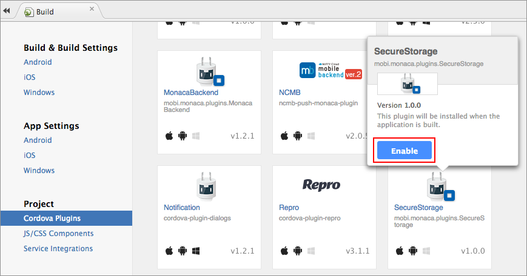

セキュア ストレージ プラグイン
==============================

ストレージ内のデータの暗号化を行うプラグイン ( Monaca Secure Storage )
です。このプラグインを組み込んだアプリをアンインストールするときには、保存されたデータも、共に消去されます。

このプラグインを使用するためには、対応するプランへの加入が必要となります。詳細は、[料金プラン](https://ja.monaca.io/pricing.html)
をご確認ください。

サポート対象のプラットフォーム
------------------------------

-   Cordova 4.1 以降
-   iOS
-   Android

暗号化方式
----------

  ---------------- ---
  暗号化方式 AES   
  鍵長 256 bi      t
  ---------------- ---

プラグインの追加方法
--------------------

1.  Monaca クラウド IDE メニュー上で、
    ファイル --&gt; Cordova プラグインの管理... または
    設定 --&gt; Cordova プラグインの管理... を選択します。
2.  `Monaca Secure Storage` の 有効
    ボタンをクリックして、プロジェクトへ追加します。

> {width="700px"}

メソッド
--------

  --------------------------------- -------------------------------------------------------------------------------------------------------------------------------------------------------------------------------
  データの保存用メソッド            `key` と `value` を使用して、ストレージにデータを保存します。コールバック ( 戻り値 : boolean ) を使用して、保存が完了したか ( `True` )、失敗したか ( `false` ) を確認します。
                                    .. code-block:: javascript
                                    plugins.secureStorage.setItem(key, value, function(result) {
                                    // result: true=success, false=error
                                    });
                                    
  データの取得用メソッド            指定された key を使用して、データを取得します。key と一致したデータがあれば、コールバックを使用して、そのデータを返します。一致するデータがなければ場合、null を返します。
                                    .. code-block:: javascript
                                    plugins.secureStorage.getItem(key, function(value) {
                                    // value: null = no such a value
                                    });
                                    
  データの削除用メソッド ( 1件 )    指定された key を使用して、データを削除します。コールバック ( 戻り値 : boolean ) を使用して、データの削除が成功したか ( `True` )、失敗したか ( `false` ) を確認します。
                                    .. code-block:: javascript
                                    plugins.secureStorage.removeItem(key, function(result) {
                                    // result: true=success, false=error
                                    });
                                    
  データの削除用メソッド ( 全件 )   ストレージ内のすべてのデータを削除します。コールバック ( 戻り値 : boolean ) を使用して、データの削除が成功したか ( `True` )、失敗したか ( `false` ) を確認します。
                                    .. code-block:: javascript
                                    plugins.secureStorage.clear(function(result) {
                                    // result: true=success, false=error
                                    });
  --------------------------------- -------------------------------------------------------------------------------------------------------------------------------------------------------------------------------

App Store への提出に際して
--------------------------

このプラグインでは、iOS SDK
の暗号化ライブラリーを使用しています。よって、このプラグインを組み込んだ、ビルド済みアプリを
App Store
へ提出して審査を受ける場合、アップロード時には特別な設定が必要となります。Export
Compliance 上の 2 つの質問に対して、次のように、「 Yes 」 で答えます。

> width
>
> :   600px
>
> align
>
> :   center
>

