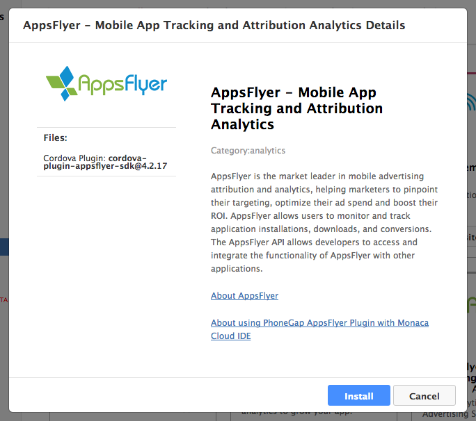

AppsFlyer
=========

<div class="admonition note">

使用する Cordova のバージョンにより、AppsFlyer
の使用方法が異なります。バージョン別の使用方法がこのページに記載されていますので、サービスをご利用になる前に、内容をご確認ください。

</div>

[AppsFlyer](https://www.appsflyer.com/overview/)
は、モバイル広告に関する宣伝効果の測定 ( アトリビューション )
および収集したデータの分析 ( アナリティクス )
において、業界における標準のツールになりつつあります。AppsFlyer
が提供する正確な測定・分析結果に基づき、広告の提供元は、広告のターゲットの絞り込み、投資額の見直しなどを行え、よって、投資対効果
( ROI ) を最適化できます。

AppsFlyer
を使用すれば、アプリのインストール状況、ダウンロード状況、コンバージョン情報
( conversion/目的達成の成否 ) などを監視・追跡できます。また、AppsFlyer
提供の API
を使用すれば、他のアプリ/プラットフォームと連携することができます。

このページでは、次の内容に関して記述しています。

-   pre\_appsflyer
-   add\_appsflyer
-   appsflyer\_cordova\_6\_higher
-   appsflyer\_cordova\_lower\_than\_6
-   remove\_appsflyer

事前準備
--------

AppsFlyer を使用した監視・追跡を行う前に、次の情報が必要となります。

1.  `devKey`: AppsFlyer 提供の devKey です。
2.  `appId`: ( iOS の場合 ) App Store で使用する App ID です。

Monaca プロジェクトに AppsFlyer を追加する方法
----------------------------------------------

1.  Monaca クラウド IDE から設定する場合、 設定 --&gt; 外部サービス連携
    を選択するか、または、Monaca Localkit から設定する場合、
    ビルド設定 --&gt; 外部サービス連携 ( 左パネル ) を選択します。
2.  AppsFlyer サービスの 詳細を見る ボタンをクリックします。
3.  インストール ボタンをクリックします。

> {width="600px"}

4.  インストールを継続するか確認する画面が表示されます。 OK
    をクリックして、インストールを開始します。

AppsFlyer の使用方法 ( Cordova バージョン 6 以降の場合 )
--------------------------------------------------------

### 設定

次の記述を追加します。devKey ( および appID )
を渡して、監視・追跡処理を初期化します。

> ``` {.sourceCode .javascript}
> document.addEventListener("deviceready", function(){
>
>     var options = {
>         devKey:  'xxXXXXXxXxXXXXxXXxxxx8'  // your AppsFlyer devKey
>     };
>
>     var userAgent = window.navigator.userAgent.toLowerCase();
>
>     if (/iphone|ipad|ipod/.test(userAgent)) {
>         options.appId = "123456789";       // your ios app id in app store
>     }
>
>     window.plugins.appsFlyer.initSdk(options);
>
> }, false);
> ```

### API 提供のメソッド

#### initSdk()

SDK を初期化します。

initSdk(options, onSuccess, onError): void

パラメーター

:   +-------+-------------+------------------------------------------------+
    | 名前  | 型 | 解     | 説                                             |
    +=======+=============+================================================+
    | `opti | オブジェクト | > | SDK の設定を行います (                    |
    | ons`  |             | >   設定値に関しては、下の 「 オプション 」    |
    |       |             | >   表をご確認ください )。                     |
    +-------+-------------+------------------------------------------------+
    | `onSu | (message:   | 成功時のコールバック : SDK                     |
    | ccess | string)     | の初期化が成功したときに呼ばれます ( 任意 )。  |
    | `     | =&gt; void  |                                                |
    +-------+-------------+------------------------------------------------+
    | `onEr | (message:   | 失敗時のコールバック : SDK                     |
    | ror`  | string)     | の初期化時に、エラーが発生した場合に呼ばれます |
    |       | =&gt; void  | ( 任意 )。                                     |
    +-------+-------------+------------------------------------------------+

オプション

:   +------------------+----+----+----------------------------------------+
    | 名前             | 型 | フォ | | 解説                               |
    |                  | |  | ルト |                                      |
    |                  | デ | 値 |                                        |
    +==================+====+====+========================================+
    | `devKey`         | 文字 |  | [Dev key の解説 ( AppsFlyer のサイト   |
    |                  | 列 |    | )](https://support.appsflyer.com/hc/ja |
    |                  |    |    | /articles/208164153-AppsFlyer-SDK%E5%A |
    |                  |    |    | E%9F%E8%A3%85%E3%82%AC%E3%82%A4%E3%83% |
    |                  |    |    | 89-Android)                            |
    +------------------+----+----+----------------------------------------+
    | `appId`          | 文字 |  | ( iOS の場合 ) [App Store で使用する   |
    |                  | 列 |    | App                                    |
    |                  |    |    | ID](https://support.appsflyer.com/hc/j |
    |                  |    |    | a/articles/207478863-AppsFlyer-SDK-%E5 |
    |                  |    |    | %AE%9F%E8%A3%85%E3%82%AC%E3%82%A4%E3%8 |
    |                  |    |    | 3%89-iOS)                              |
    |                  |    |    | です。                                 |
    +------------------+----+----+----------------------------------------+
    | `isDebug`        | 真偽 | fa | デバッグモード ( 任意 )              |
    |                  | 値 | ls |                                        |
    |                  | |  | e  |                                        |
    |                  |    | |  |                                        |
    +------------------+----+----+----------------------------------------+
    | `onInstallConver | 真偽 | fa | アトリビューション/コンバージョン    |
    | sionDataListener | 値 | ls | データに、SDK 経由でアクセスします (   |
    | `                | |  | e  | ディファード ディープリンク/Deferred   |
    |                  |    | |  | DeepLinking )。AppsFlyer               |
    |                  |    |    | プラグインでは、アトリビューション     |
    |                  |    |    | データを、onSuccess                    |
    |                  |    |    | コールバックに返します。詳細は、次のリンク先をご確認ください。 |
    |                  |    |    |                                        |
    |                  |    |    |                                        |
    |                  |    |    | > -   [ディファード ディープリンク (   |
    |                  |    |    | >     Android の場合                   |
    |                  |    |    | >     )](https://support.appsflyer.com |
    |                  |    |    | /hc/ja/articles/212736766-SDK%E3%82%92 |
    |                  |    |    | %E5%88%A9%E7%94%A8%E3%81%97%E3%81%9FAp |
    |                  |    |    | psFlyer%E3%82%A2%E3%83%88%E3%83%AA%E3% |
    |                  |    |    | 83%93%E3%83%A5%E3%83%BC%E3%82%B7%E3%83 |
    |                  |    |    | %A7%E3%83%B3-%E3%82%B3%E3%83%B3%E3%83% |
    |                  |    |    | 90%E3%83%BC%E3%82%B8%E3%83%A7%E3%83%B3 |
    |                  |    |    | %E3%83%87%E3%83%BC%E3%82%BF-Android-%E |
    |                  |    |    | 5%8F%96%E5%BE%97%E6%96%B9%E6%B3%95-Acc |
    |                  |    |    | essing-AF-Attribution)                 |
    |                  |    |    | > -   [ディファード ディープリンク (   |
    |                  |    |    | >     iOS の場合                       |
    |                  |    |    | >     )](https://support.appsflyer.com |
    |                  |    |    | /hc/ja/articles/209621766-SDK%E3%82%92 |
    |                  |    |    | %E5%88%A9%E7%94%A8%E3%81%97%E3%81%9FAp |
    |                  |    |    | psFlyer%E3%82%A2%E3%83%88%E3%83%AA%E3% |
    |                  |    |    | 83%93%E3%83%A5%E3%83%BC%E3%82%B7%E3%83 |
    |                  |    |    | %A7%E3%83%B3-%E3%82%B3%E3%83%B3%E3%83% |
    |                  |    |    | 90%E3%83%BC%E3%82%B8%E3%83%A7%E3%83%B3 |
    |                  |    |    | %E3%83%87%E3%83%BC%E3%82%BF-iOS-%E5%8F |
    |                  |    |    | %96%E5%BE%97%E6%96%B9%E6%B3%95-Accessi |
    |                  |    |    | ng-AF-Attribution)                     |
    +------------------+----+----+----------------------------------------+

例

:   `initSdk()` 関数の使用例を、次に記します。

    ``` {.sourceCode .javascript}
    var onSuccess = function(result) {
        //handle result
    };

    function onError(err) {
        // handle error
    }

    var options = {
       devKey:  'd3Ac9qPardVYZxfWmCspwL',
       appId: '123456789',
       isDebug: false,
       onInstallConversionDataListener: true
    };

    window.plugins.appsFlyer.initSdk(options, onSuccess, onError);
    ```

#### trackEvent()

`trackEvent` メソッドを使用して、AppsFlyer の分析メカニズム ( AppsFlyer
analytics )
側に、アプリ内イベントの収集データを渡します。また、このメソッドを使用すれば、監視対象のイベントを、コードに直接追加して、動的に追加できるようになります。アプリ内イベントを使用すると、ユーザーの動向を分析できます。また、各種キャンペーンおよびメディアソースへの関連付けもできます
(
ユーザーの操作と、そのきっかけとなったキャンペーンなどを対応付けできます
)。ROI ( 投資対効果 ) と LTV ( 顧客生涯価値 )
の計算に必要となる、データ収集対象のイベントに関しては、慎重に選択する必要があります。

trackEvent(event名前, eventValues): void (optional)

パラメーター

:   +-------+------------+------------------------------------------------+
    | 名前  | 型 | 解    | 説                                             |
    +=======+============+================================================+
    | `even | 文字列     | イベント名 ( カスタム可能                      |
    | t名前` |           | )。ダッシュボード上に表示されます。            |
    +-------+------------+------------------------------------------------+
    | `even | オブジェクト | > | イベントの詳細                           |
    | tValu |            |                                                |
    | e`    |            |                                                |
    +-------+------------+------------------------------------------------+

例

:   `trackEvent()` 関数の使用例を、次に記します。

    ``` {.sourceCode .javascript}
    var event名前 = "af_add_to_cart";

    var eventValues = {
        "af_content_id": "id123",
        "af_currency":"USD",
        "af_revenue": "2"
    };

    window.plugins.appsFlyer.trackEvent(eventName, eventValues);
    ```

#### setCurrencyCode()

通貨コードを変更できます。

setCurrencyCode(currencyId): void

パラメーター

:   
      名前                                                                                                                                                        型 | デ                                   フォルト値                                | 解説
      ----------------------------------------------------------------------------------------------------------------------------------------------------------- ----------------------------------------- ----------------------------------------- ----------------------------------------------------------------------------------------------------------------------------------------------------------------------------------------------------------------------------------------------------------------------------------------------------------------------------------------
      `currencyId`                                                                                                                                                文字列                                    `USD`                                     使用できる通貨コードに関しては、[こちら ( ISO 4217 )]() をご確認ください。

例

:   `setCurrencyCode()` 関数の使用例を、次に記します。

    ``` {.sourceCode .javascript}
    window.plugins.appsFlyer.setCurrencyCode("USD");
    window.plugins.appsFlyer.setCurrencyCode("GBP"); // British Pound
    ```

#### setAppUserId()

カスタム ID をセットします。AppsFlyer 提供の ID 群 ( 端末 ID、ユーザー
ID など ) と、このカスタム ID を紐づけすれば、各種情報を、カスタム ID
下に集約できるようになります。このカスタム ID ( AppsFlyer
側とユーザー側で使用している ID の紐づけに使用 ) は、AppsFlyer
が提供する CSV レポートを出力時、および、PostBack 系の API
の使用時にも使用できます。

<div class="admonition note">

この ID の設定は、アプリを初めて起動するときに行う必要があります ( SDK
の初期化時 )。実装方法としては、deviceready イベントの処理時に、この API
を呼び出すことを推奨します。

</div>

setAppUserId(customerUserId): void

パラメーター

:   
      名前               型 | 解            説
      ------------------ ------------------ ----------------------------------------------------------------------------------
      `customerUserId`   文字列             独自のカスタム ID

例

:   `setAppUserId()` 関数の使用例を、次に記します。

    ``` {.sourceCode .javascript}
    window.plugins.appsFlyer.setAppUserId(userId);
    ```

#### setGCMProjectID()

GCM
のプロジェクト番号をセットします。この番号を使用して、アプリのアンインストールを監視・追跡します
( Android プラットフォーム向け )。

setGCMProjectID(GCMProjectNumber): void

パラメーター

:   
      名前                                                                                                                                                                                                                                                      型 | 解                                                                                                                                                                                                        説
      --------------------------------------------------------------------------------------------------------------------------------------------------------------------------------------------------------------------------------------------------------- -------------------------------------------------------------------------------------------------------------------------------------------------------------------------------------------------------------- ------------------------------------------------------------------------------------------------------------------------------------------------------------------------------------------------------------------------------------------------------------------------------------------------------------------------------------------------------------------------------------------------------------------------------------------------------------------------------------------------------------------------------------------------------------------------------------------------------------------------------------------------------------------------------------------------------------------------------------------------------------------------------------------------------------------------------------------------------------------------------------------------------------------------------------------------------------------------------------------------------------------------------------------------------------------------------------------------------
      `GCMProjectNumber`                                                                                                                                                                                                                                        文字列                                                                                                                                                                                                         GCM のプロジェクト番号。Google Developer Console 上で確認できます。詳細は、[Android アンインストール トラッキング](https://support.appsflyer.com/hc/ja/articles/209621846-Android-%E3%82%A2%E3%83%B3%E3%82%A4%E3%83%B3%E3%82%B9%E3%83%88%E3%83%BC%E3%83%AB%E3%83%88%E3%83%A9%E3%83%83%E3%82%AD%E3%83%B3%E3%82%B0) ページをご確認ください。

#### registerUninstall()

アプリのアンインストールを監視・追跡するため、iOS
のデバイストークンをセットします ( iOS プラットフォーム向け )。

registerUninstall(token): void

パラメーター

:   
      名前                                                                                                                                                                                                                                                 型 | 解                                                                                                                                                                                                                        説
      ---------------------------------------------------------------------------------------------------------------------------------------------------------------------------------------------------------------------------------------------------- ------------------------------------------------------------------------------------------------------------------------------------------------------------------------------------------------------------------------------ -----------------------------------------------------------------------------------------------------------------------------------------------------------------------------------------------------------------------------------------------------------------------------------------------------------------------------------------------------------------------------------------------------------------------------------------------------------------------------------------------------------------------------------------------------------------------------------------------------------------------------------------------------------------------------------------------------------------------------------------------------------------------------------------------------------------------------------------------------------------------------------------------------------------------------------------------------------------------------------------------------------------------------------------------------------
      `token`                                                                                                                                                                                                                                              文字列                                                                                                                                                                                                                         iOS のデバイストークン。`UnityEngine.iOS.NotificationServices.deviceToken` を使用すれば、デバイストークンを取得できます。詳細は、[Unity の解説](https://support.appsflyer.com/hc/en-us/articles/213766183-Unity)、および、[iOS アンインストールトラッキングの解説](https://support.appsflyer.com/hc/ja/articles/213838823-iOS%E3%82%A2%E3%83%B3%E3%82%A4%E3%83%B3%E3%82%B9%E3%83%88%E3%83%BC%E3%83%AB%E3%83%88%E3%83%A9%E3%83%83%E3%82%AD%E3%83%B3%E3%82%B0) をご確認ください。

#### getAppsFlyerUID()

この API を使用すれば、AppsFlyer 側で独自に割り振っている端末 ID
を取得できます。この端末 ID は、各種レポートの出力時、および、各種 API
で使用されます。

getAppsFlyerUID(getUserIdCallbackFn): void

パラメーター

:   
      名前                                型 | 解                 説
      ----------------------------------- ----------------------- ---------------------------------------------------------------------------------------------------------------------------------
      `getUserIdCallbackFn`               () =&gt; void           成功時のコールバック

例

:   `getAppsFlyerUID()` 関数の使用例を、次に記します。

    ``` {.sourceCode .javascript}
    var getUserIdCallbackFn = function(id) {
        alert('received id is: ' + id);
    }
    window.plugins.appsFlyer.getAppsFlyerUID(getUserIdCallbackFn);
    ```

#### handleOpenurl()

AppsFlyer のアトリビューション
データを使用して、ディープリンクを追跡します。

<div class="admonition note">

Android バージョン 4.2.5 以降では、ディープリンク関連のメタデータ (
scheme、host ) は 、自動的に送付されます。

</div>

handleOpenurl(url): void

パラメーター

:   
      名前          型 | 解  説
      ------------- -------- -------------------------------------------------
      `url`         文字列   url

例

:   The following snippet shows how to use `handleOpenurl()` function:

    ``` {.sourceCode .javascript}
    var handleOpenURL = function(url) {
        window.plugins.appsFlyer.handleOpenurl(url);
    }
    ```

AppsFlyer の使用方法 ( Cordova バージョン 5 系以前の場合 )
----------------------------------------------------------

### AppsFlyer の設定方法 ( Monaca 上での処理 )

Monaca プロジェクトへ AppsFlyer
を追加したあと、実際にプラグインを使用する前に、いくつかの設定を行う必要があります。次の手順に従います。

1.  プロジェクトの `www` フォルダーのルートディレクトリー下の config.xml
    へ、次の記述を追加します ( Monaca 上での処理 )。

> ``` {.sourceCode .xml}
> <!-- for iOS -->
> <feature name="AppsFlyerPlugin">
>     <param name="ios-package" value="AppsFlyerPlugin" />
> </feature>
> ```
>
> ``` {.sourceCode .xml}
> <!-- for Android -->
> <feature name="AppsFlyerPlugin">
>     <param name="android-package" value="com.appsflyer.cordova.plugin.AppsFlyerPlugin" />
> </feature>
> ```

2.  Android の場合には、AndroidManifest.xml へ、次の記述を追加します (
    Monaca 上での処理 )。

> ``` {.sourceCode .xml}
> <uses-permission android:name="android.permission.INTERNET" />
> <uses-permission android:name="android.permission.ACCESS_NETWORK_STATE" />
> <uses-permission android:name="android.permission.READ_PHONE_STATE" />
> ```

3.  AppsFlyer へログインして、アプリを登録します ( AppsFlyer 上での処理
    )。アプリの登録時に入力する情報とマニフェストに登録する (
    または、登録している ) 情報は、一致する必要があります。App
    Store/Google Play ストア/Microsoft ストアを経由しない Android
    アプリのインストールの監視・追跡に関しては、[こちら](https://support.appsflyer.com/hc/en-us/articles/207447023-Tracking-Installs-for-Out-Of-Store-Applications)
    をご確認ください。\[ 翻訳者メモ ：
    上記ストアを経由しないでインストールするアプリを、AppsFlyer では、
    Out of Store アプリと呼称しています \]
4.  次の記述を、コードに追加します ( Monaca 上での処理
    )。実際の使用時には、適当な DEV KEY
    を渡して、監視・追跡処理を初期化します。

> ``` {.sourceCode .javascript}
> document.addEventListener("deviceready", function(){
>     var args = [];
>     var devKey = "xxXXXXXxXxXXXXxXXxxxx8";   // your AppsFlyer devKey
>     args.push(devKey);
>     var userAgent = window.navigator.userAgent.toLowerCase();
>
>     if (/iphone|ipad|ipod/.test( userAgent )) {
>         var appId = "123456789";            // your ios app id in app store
>         args.push(appId);
>     }
>     window.plugins.appsFlyer.initSdk(args);
> }, false);
> ```

5.  Google Play/App Store
    に提出する前に、[Android](https://support.appsflyer.com/hc/en-us/articles/207032136-Testing-AppsFlyer-Android-SDK-Integration-Before-Submitting-to-Google-Play)/[iOS](https://support.appsflyer.com/hc/en-us/articles/207032046-Testing-AppsFlyer-iOS-SDK-Integration-Before-Submitting-to-the-App-Store-)
    端末で、アプリを検証することを推奨します。

<div class="admonition note">

AppsFlyer の使用に関する詳細は、[AppsFlyer ドキュメント ( 日本語あり
)](https://support.appsflyer.com/hc/ja) をご確認ください。

</div>

### 設定

ここまでの手順で、プラグインの準備が整いました。ここからは、AppsFly
が提供する API をいくつか紹介します。

#### 顧客 ID ( Customer User ID ) の設定 ( 上級者向け )

カスタム ID をセットします。AppsFlyer 提供の ID 群 ( 端末 ID、ユーザー
ID など ) と、このカスタム ID を紐づけすれば、各種情報を、カスタム ID
下に集約できるようになります。このカスタム ID ( AppsFlyer
側とユーザー側で使用している ID の対応付けに使用 ) は、AppsFlyer
が提供する CSV レポートを出力時、および、PostBack 系の API
の使用時にも使用できます。

``` {.sourceCode .javascript}
window.plugins.appsFlyer.setAppUserId(userId);
```

<div class="admonition note">

この ID の設定は、アプリを初めて起動するときに行う必要があります ( SDK
の初期化時 )。実装方法としては、deviceready イベントの処理時に、この API
を呼び出すことを推奨します。

</div>

#### 通貨コード ( Currency Code ) の設定 ( 任意 )

デフォルトでは、通貨コード ( Currency Code ) は、`USD` ( 米ドル )
に設定されています。設定は、次のようにすれば変更できます。

``` {.sourceCode .javascript}
//For example, you want to change to British Pound
window.plugins.appsFlyer.setCurrencyCode("GBP");
```

<div class="admonition note">

使用可能な通貨コードに関しては、[ISO 4217 Currency
Codes](http://www.xe.com/iso4217.php) をご確認ください。

</div>

#### アプリ内イベントの計測 API ( 任意 )

アプリ内イベントを使用すると、ユーザーの動向を分析できます。また、特定のキャンペーンまたはメディアソースへの関連付けもできます
(
ユーザーの操作と、そのきっかけとなったキャンペーンなどを対応付けできます
)。ROI ( 投資対効果 ) と LTV ( 顧客生涯価値 )
の計算に必要となる、データ収集対象のイベントに関しては、慎重に選択する必要があります。

`trackEvent` メソッドを使用して、AppsFlyer の分析メカニズム ( AppsFlyer
analytics )
側に、アプリ内イベントの収集データを渡します。また、このメソッドを使用すれば、監視対象のイベントを、コードに直接追加して、動的に追加できるようになります。

``` {.sourceCode .javascript}
// event名前 - any string to define the event name. For example: “registration” or “purchase”
// eventValue - the sales value. For example: 0.99 or 0.79
window.plugins.appsFlyer.sendTrackingWithEvent(event名前, eventValue);
// window.plugins.appsFlyer.sendTrackingWithEvent(event名前, "");
```

#### Rich アプリ内イベントの計測 API ( 任意 )

AppsFlyer 提供の 「 リッチ アプリ内イベント 」
では、アプリのインストール後に起こりうる、すべてのイベントを監視・追跡でき、加えて、メディアソースまたはキャンペーンと、発生したイベントを関連付けることができます。各アプリ内イベントは、イベント名
( event name )、および、関連するイベント パラメーター群で構成されます。

``` {.sourceCode .javascript}
var event名前 = "af_add_to_cart";
var eventValues = {"af_content_id": "id123", "af_currency":"USD", "af_revenue": "2"};
window.plugins.appsFlyer.trackEvent(event名前, eventValues);
```

#### 端末 UID ( AppsFlyer 独自の UID ) の取得 ( 上級者向け )

この API を使用すれば、AppsFlyer 側で独自に割り振っている端末 ID
を取得できます。この端末 ID は、各種レポートの出力時、および、各種 API
で使用されます。

``` {.sourceCode .javascript}
// getUserIdCallbackFn - callback function
window.plugins.appsFlyer.getAppsFlyerUID(getUserIdCallbackFn);
```

この API の使用例を、次に記します。

``` {.sourceCode .javascript}
var getUserIdCallbackFn = function(id) {
    alert('received id is: ' + id);
}
window.plugins.appsFlyer.getAppsFlyerUID(getUserIdCallbackFn);
```

#### AppsFlyer のアトリビューション データ/コンバージョン データへ SDK からアクセスする方法 ( ディファード ディープリンク/Deferred Deep-linking )

AppsFlyer では、アトリビューション データへ、SDK
レベルで、リアルタイムにアクセスできます。このデータを使用して、アプリの新規インストール・初回起動時、ユーザー側に最初に表示されるページをカスタマイズできます。このような処理は、「
ディファード ディープリンク 」 ( Deferred DeepLinking )
と呼ばれています。Web
の分野では、一般的な処理ですが、、モバイルアプリのエコシステム下で、このような処理を実現することは、技術的に難しいとされています。AppsFlyer
は、プラットフォームの種類および状況にかかわらず、この処理を行ってくれます。

詳細は、[AppsFlyer のアトリビューションデータ/コンバージョンデータへ SDK
からアクセスする方法 ( iOS と Android 向け
)](https://support.appsflyer.com/hc/ja/articles/209621766-SDK%E3%82%92%E5%88%A9%E7%94%A8%E3%81%97%E3%81%9FAppsFlyer%E3%82%A2%E3%83%88%E3%83%AA%E3%83%93%E3%83%A5%E3%83%BC%E3%82%B7%E3%83%A7%E3%83%B3-%E3%82%B3%E3%83%B3%E3%83%90%E3%83%BC%E3%82%B8%E3%83%A7%E3%83%B3%E3%83%87%E3%83%BC%E3%82%BF-iOS-%E5%8F%96%E5%BE%97%E6%96%B9%E6%B3%95-Accessing-AF-Attribution)
をご確認ください。

<div class="admonition note">

AppsFlyer プラグインでは、アトリビューション
データを使用して、`onInstallConversionDataLoaded`
イベントを実行します。なお、データの取得するため、イベントリスナーを設定する必要があります。

</div>

``` {.sourceCode .javascript}
document.addEventListener('onInstallConversionDataLoaded', function(e){
    var attributionData = (JSON.stringify(e.detail));
    alert(attributionData);
}, false);
```

Monaca から AppsFlyer を削除する方法
------------------------------------

1.  Monaca クラウド IDE から行う場合、
    設定 --&gt; Cordova プラグインの管理 を選択するか、または、Monaca
    Localkit から行う場合、 ビルド設定 --&gt; Cordova プラグイン (
    左パネル ) を選択します。
2.  有効なプラグイン 欄へ移動します。AppsFlyer
    プラグイン上にマウスポインターを持っていき、無効
    ボタンをクリックします。

> {width="700px"}
