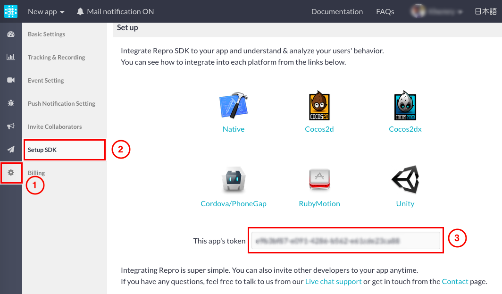

Repro ( iOS 専用 )
==================

[Repro](https://repro.io/) は、「 ユーザーのアプリ利用動画 」
を録画して、ユーザーがどのようにアプリを使用しているのか分析できるサービスです。現時点では、iOS
のみサポートしています。

<div class="admonition note">

どのプランをご利用の場合でも、こちらの Repro
サービスをご利用いただけます。最新の Repro プラグインを使用する場合 (
[Github](https://github.com/reproio/repro-ios-sdk) 経由で入手 )
には、こちらの インポート &lt;import\_cordova\_plugin&gt;
機能をご利用ください。なお、プラグインのインポートには、対応するプランへの加入が必要です。プランの詳細は、[こちら](https://ja.monaca.io/pricing.html)
をご確認ください。

</div>

Repro サービスの追加
--------------------

1.  Monaca クラウド IDE から設定する場合、 設定 --&gt; 外部サービス連携
    を選択するか、または、Monaca Localkit から設定する場合、
    ビルド設定 --&gt; 外部サービス連携 ( 左パネル ) を選択します。
2.  Repro サービスの 詳細を見る ボタンをクリックします。
3.  インストール ボタンをクリックします。

> {width="600px"}

4.  インストールを継続するか確認する画面が表示されます。 OK
    をクリックして、インストールを開始します。

Repro サービスの設定
--------------------

Repro の使用には、アプリの 「 トークン 」
が必要です。トークンの確認手順を、次に記します。

1.  Repro のサイトに行き、アカウントを作成します。
2.  Repro の管理画面へ移動して、 設定 --&gt; SDK セットアップ
    を選択して、アプリのトークンを確認します。

> {width="700px"}

3.  アプリのトークンの確認後、次の `onDeviceReady` 関数の 「
    YOUR\_APP\_TOKEN 」
    の箇所に、トークンを挿入します。挿入後、次のコードをプロジェクトに追加します。

``` {.sourceCode .javascript}
document.addEventListener("deviceready",onDeviceReady,false);
function onDeviceReady() {
    Repro.setup("YOUR_APP_TOKEN");
    Repro.startRecording();
}
```

<div class="admonition note">

Repro の使用方法の詳細は、[Repro のドキュメント ( 外部サイト
)](http://docs.repro.io/ja/) をご確認ください。

</div>

設定
----

<div class="admonition note">

Repro
を使用して行動を録画するためには、端末上で、実際に、アプリを実行する必要があります。

</div>

1.  Monaca アプリをビルドします。詳細は、 building\_monaca\_for\_ios
    をご確認ください。
2.  ビルドしたアプリを端末にインストールします。
3.  アプリを起動・操作して、次に、 ホーム
    ボタンを押すと、アプリはバックグランドで実行され、録画されたビデオが
    Repro サーバー側にアップロードされます。

> {width="250px"}

4.  Repro
    側から送信される電子メールを受信して、記載されている、録画ビデオのリンク先を確認します。

Repro サービスの削除
--------------------

1.  Monaca クラウド IDE から行う場合、
    設定 --&gt; Cordova プラグインの管理 を選択するか、または、Monaca
    Localkit から行う場合、 ビルド設定 --&gt; Cordova プラグイン (
    左パネル ) を選択します。
2.  Repro プラグイン上にカーソルを置き、無効 ボタンをクリックします。

> {width="600px"}
