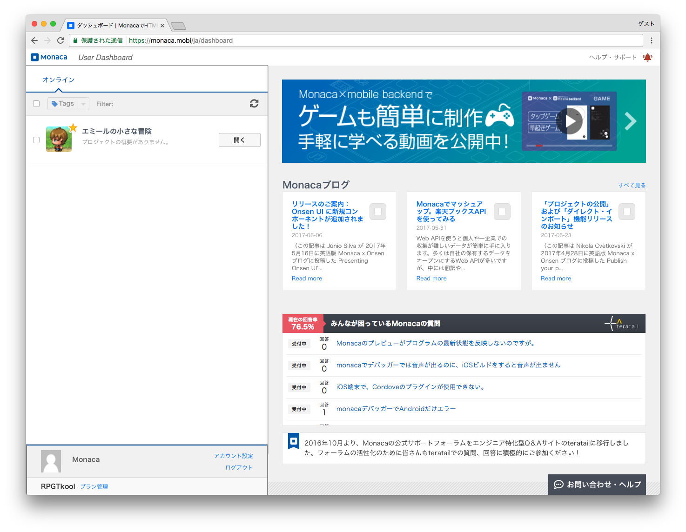
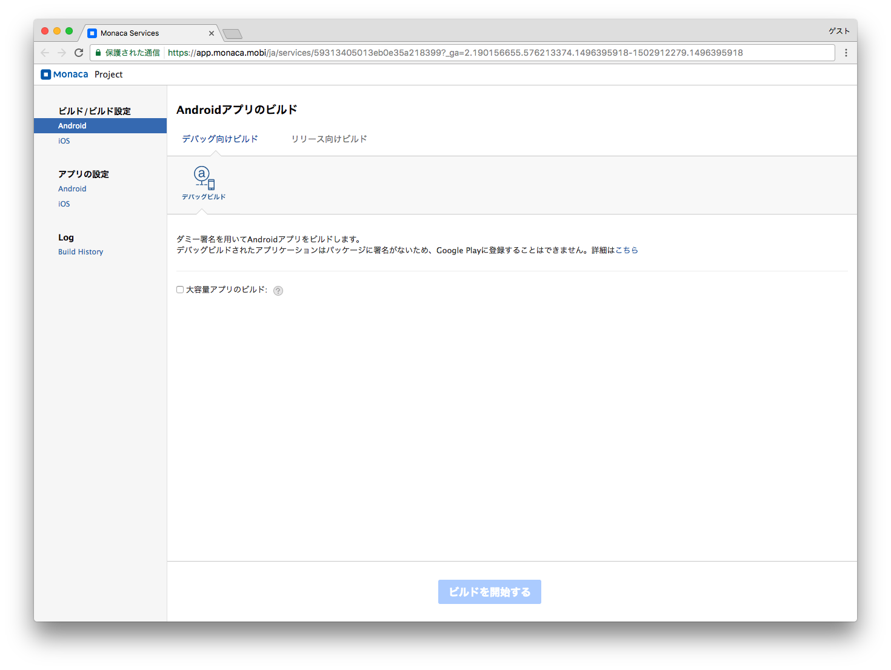
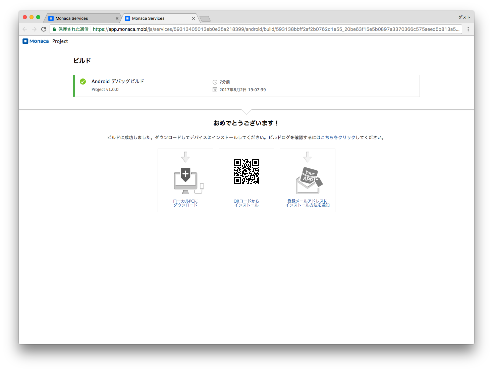

Android アプリの作成 (デバッグ用)
=================================

デバッグ用のAndroid アプリの作成方法について説明します。

1. プロジェクトの選択
---------------------

> ダッシュボード画面からプロジェクトを選択して開きます。
>
> {width="700px"}

2. ビルドの開始
---------------

> 「デバッグ向けビルド」の「デバッグビルド」を選択して、「ビルドを開始する」ボタンをクリックします。
>
> {width="700px"}

3. ビルド
---------

> ビルドが完了するまで、数十分かかりますので、しばらく待ちます。ビルドが完了すると、次の画面が表示されます。
>
> {width="700px"}

4. アプリのインストール
-----------------------

> 次のいずれかの方法で、ビルドしたアプリを端末にインストールすることができます。
>
> 1.  QRコードを利用して、インストール
> 2.  ビルドしたアプリをパソコンに直接ダウンロードし、USB
>     ケーブル経由でインストール
> 3.  ビルドしたアプリのダウンロード元 ( URL )
>     が記載されたメールを、Monaca に登録されているメールアドレスに送信

