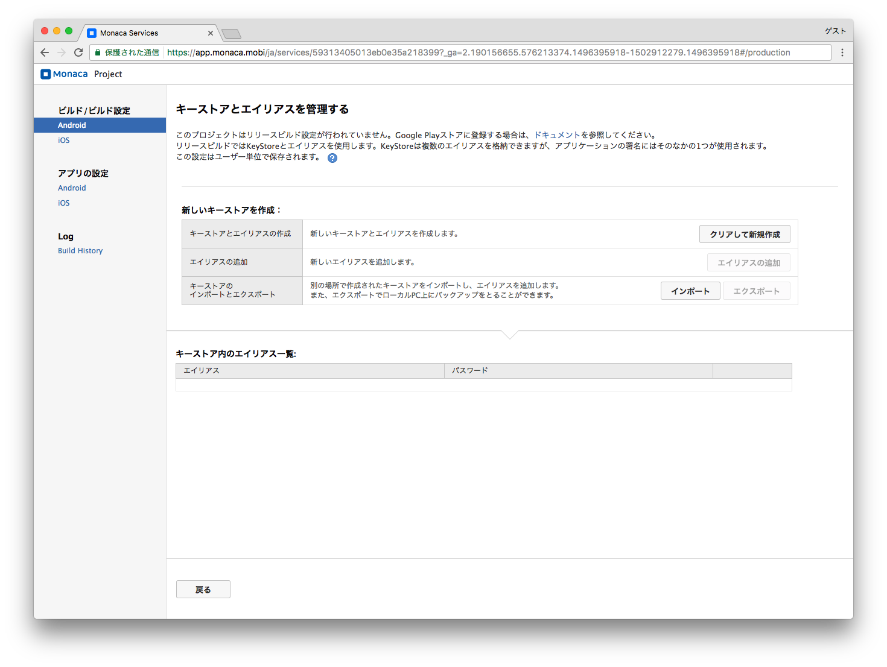
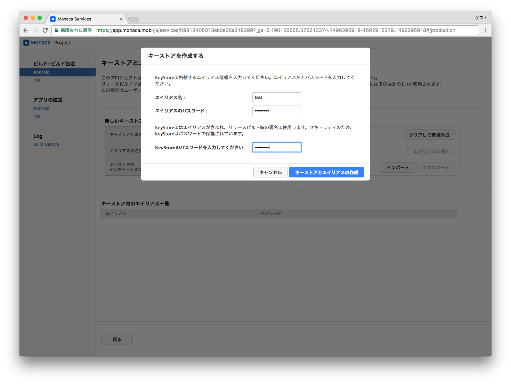
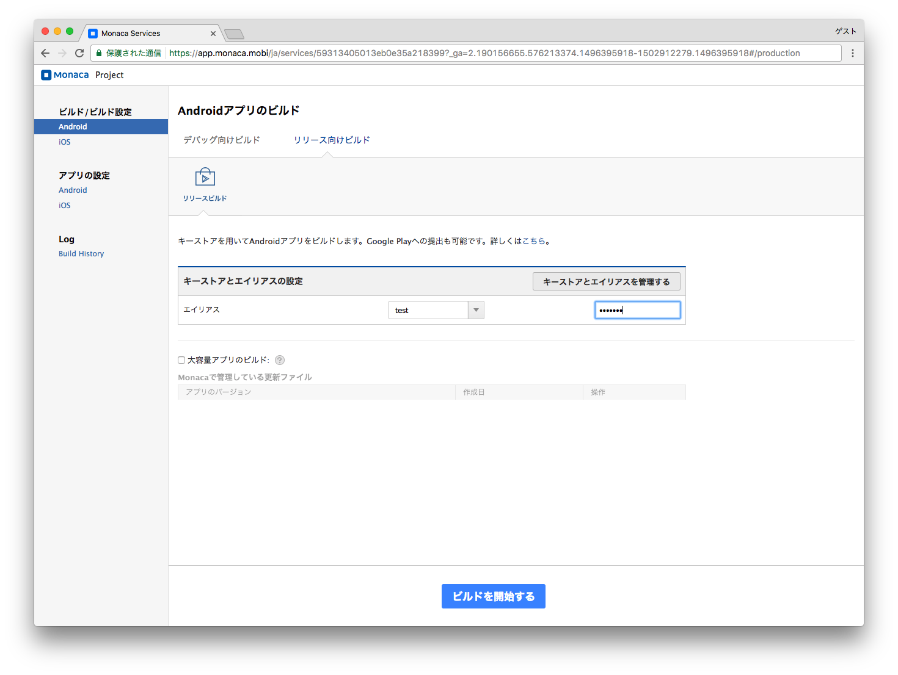

Android アプリの作成 (リリース用)
=================================

リリース用のAndroid アプリの作成方法について説明します。

1. プロジェクトの選択
---------------------

> ダッシュボード画面からプロジェクトを選択して開きます。
>
> {width="700px"}

2. キーストアとエイリアスの作成
-------------------------------

> | リリース用の Android
>   アプリをビルドするには、キーストアが必要となります。
> | Monaca
>   では、新規キーストアを作成するか、または、既存のキーストアをインポートできます。
> | ここでは、新規に作成することを前提に解説します。次の手順に従います。
> | 「キーストアとエイリアスを管理する」をクリックし、キーストアとエイリアスの作成画面に移動します。
>
> {width="700px"}
>
> 次に、「クリアして新規作成」をクリックし、新しいキーストアとエイリアスを作成します。
>
> {width="700px"}

3. ビルドの開始
---------------

> 「リリース向けビルド」の「リリースビルド」を選択し、エイリアスの選択とパスワードの入力を行い、ビルドを開始します。
>
> {width="700px"}

4. ビルド
---------

> ビルドが完了するまで、数十分かかりますので、しばらく待ちます。ビルドが完了すると、次の画面が表示されます。
>
> {width="700px"}

5. アプリのインストール
-----------------------

> 次のいずれかの方法で、ビルドしたアプリを端末にインストールすることができます。
>
> 1.  QRコードを利用して、インストール
> 2.  ビルドしたアプリをパソコンに直接ダウンロードし、USB
>     ケーブル経由でインストール
> 3.  ビルドしたアプリのダウンロード元 ( URL )
>     が記載されたメールを、Monaca に登録されているメールアドレスに送信

