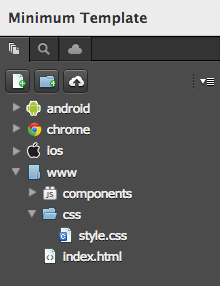
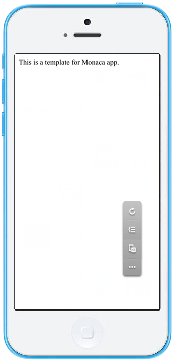

最小限のテンプレート
====================

Monaca プロジェクトで使用する、基本のテンプレートです。

| *テスト環境 :* Android 4.2.2、iOS 7.1.1

<div class="iframe-samples">
  <iframe src="https://monaca.github.io/project-templates/1-minimum/www/index.html" style="max-width: 150%;"></iframe>
</div>
こちらから、このプロジェクトをダウンロードできます。 &lt;download/minimum\_project.zip&gt;

ファイル構成
------------

*最小限のテンプレート*
を使用すると、次のファイルが自動的に作成されます。

{width="200px"}

  ----------------- ---------------------------------------
  `index.html`      スタート画面のページ
  `css/style.css`   プロジェクトのスタイルシート ファイル
  ----------------- ---------------------------------------

HTML の解説
-----------

``` {.sourceCode .html}
<meta name="viewport" content="width=device-width, user-scalable=no">
```

上記の `<meta>` タグを使用して、端末の画面上の表示幅 (
実際の横幅に対して )
を設定します。いくつかの端末では、設定とは若干異なった表示になる場合があります。

``` {.sourceCode .html}
<script src="components/loader.js"></script>
<link rel="stylesheet" href="components/loader.css">
```

`loader.js` と `loader.css`
ファイルを使用して、プロジェクトで使用するコンポーネント側で必要となる、各種ファイルとスタイルシートを読み込みます。

index.html
は、スタート画面のページです。スタート画面のページは、次のスクリーンショットのようになります。

{width="250px"}
