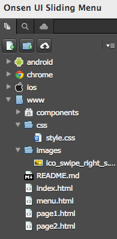
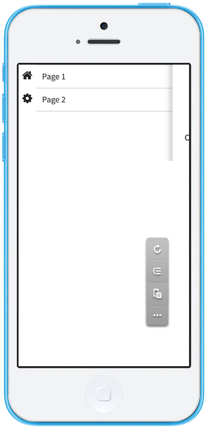
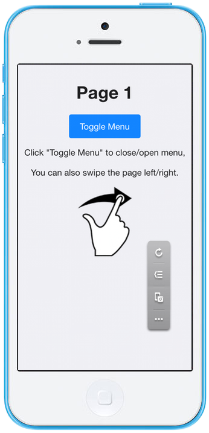
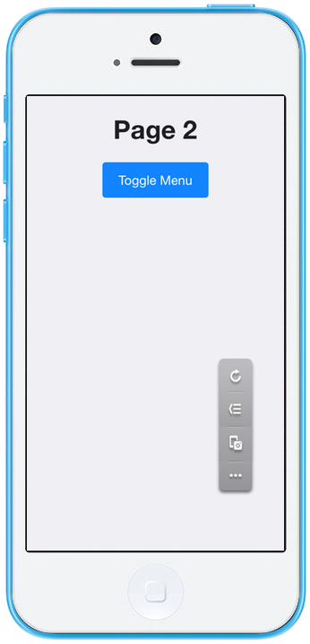

Onsen UI スライディングメニュー
===============================

[Onsen UI
スライディングメニュー](https://ja.onsen.io/v1/reference/ons-sliding-menu.html)
を使用したテンプレートです。

| *テスト環境 :* Android 4.2.2、iOS 7.1.1

  <iframe src="https://monaca.github.io/project-templates/8-ons-sliding-menu-nav/www/index.html" style="max-width: 150%;"></iframe>

ファイル構成
------------

{width="200px"}

  -------------------------------- --------------------------------------------
  `index.html`                     スタート画面のページ
  `menu.html`                      メニュー画面のページ
  `page1.html`                     ページ 1
  `page2.html`                     ページ 2
  `styles/app.css`                 プロジェクトのスタイルシート ファイル
  `images/ico_swipe_right_s.png`   このプロジェクトで使用するイメージファイル
  -------------------------------- --------------------------------------------

必要な JS/CSS コンポーネント
----------------------------

  `Onsen UI`                                       
  ------------------------------------------------ --
  HTML の解説                                      
  \^\^\^\^\^\^\^\^\^\^\^\^\^\^\^\^\^\^\^\^\^\^\^   
  index.html                                       

index.html
は、スタート画面のページです。アプリの開始地点となり、スライディングメニュー用のコンポーネント
「 `<ons-sliding-menu>` タグ 」 が置かれています。 `ons-sliding-menu`
コンポーネントを使用して、メインページ ( page1.html ) とメニュー用ページ
( menu.html ) を指定します。これにより、アプリの起動時には、 index.html
が読み込まれ、 page1.html はメインページとして、 menu.html
はメニュー用ページとして、使用できるようになります。

### menu.html

Toggle Menu ボタンをタップするか、または、右方向へスワイプすると、
menu.html が表示されます。このページには、ページ 1 ( `page1.html` )
とページ 2 ( `page2.html` ) の 2 つのアイテムの一覧が表示されています (
下のスクリーンショット参照のこと ) 。

{width="250px"}

sliding menu 要素の behind-page ( menu.html )
は常に同じですが、above-page に関しては、 Page 1 を選択した場合には
navigator1.html に、 Page 2 を選択した場合には navigator2.html
に遷移します。

### page1.html

page1.html は、複数の文字列、1 個のボタン ( Toggle Menu )
、1つの画像ファイルから構成されています。下のスクリーンショットをご確認ください。

{width="250px"}

### page2.html

page2.html は、1 列の文字列 ( `Page 2` ) と 1 個のボタン ( Toggle Menu )
から構成されています。下のスクリーンショットをご確認ください。

{width="250px"}
