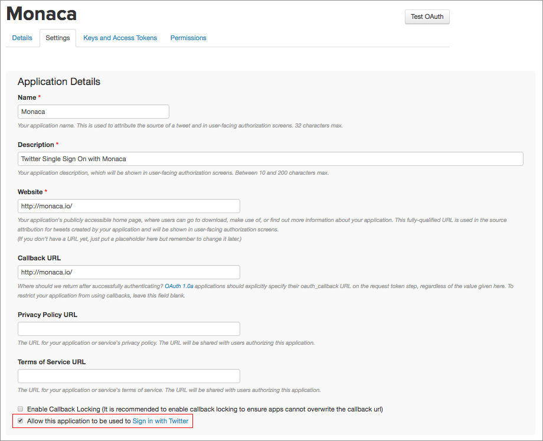
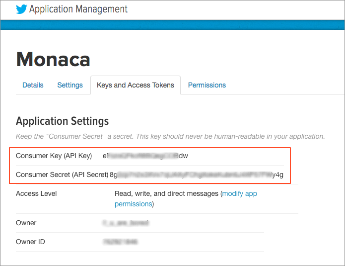
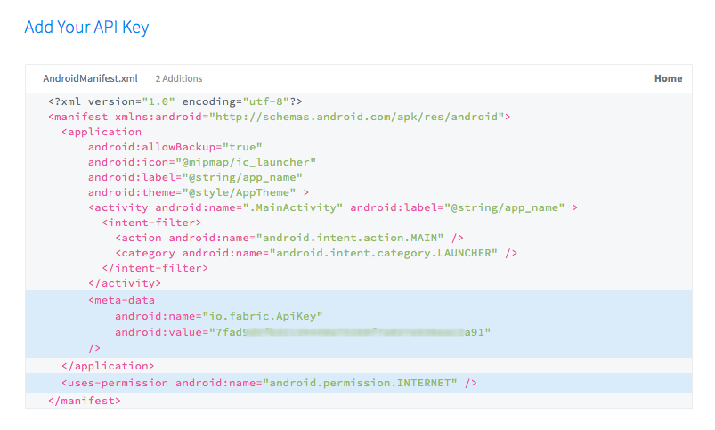
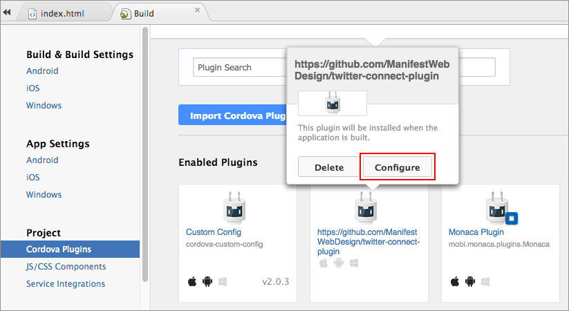
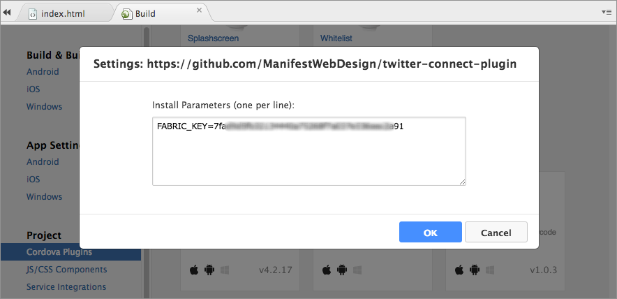
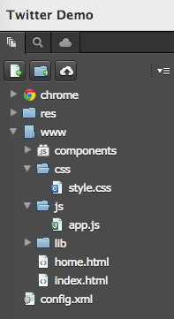
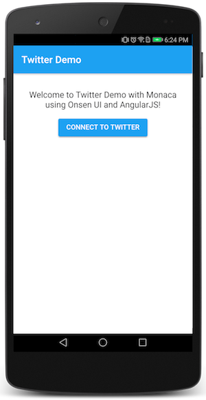
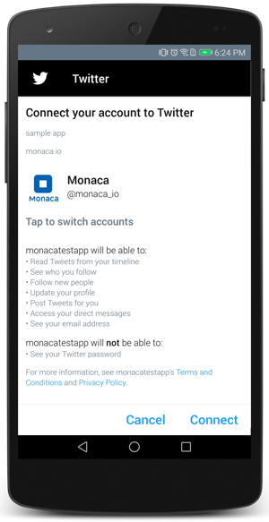
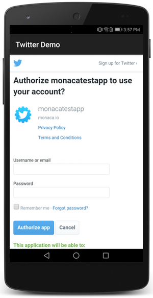
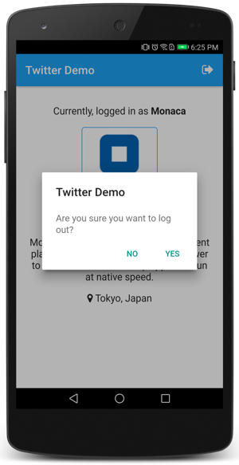

Twitter アプリ ( シングルサインオンを使用 )
===========================================

ここでは、Twitter 上でのシングルサインオン ( Single Sign-On/SSO )
の方法を解説します。Angular 1 と [Onsen UI](https://ja.onsen.io/)
を使用して、Monaca クラウド IDE
上でアプリを構築します。認証処理には、[twitter-connect-plugin](https://github.com/ManifestWebDesign/twitter-connect-plugin)
プラグインを使用します。なお、このプラグインでは、Twitter の
[Fabric](https://fabric.io/) SDK を使用することにより、Android または
iOS アプリ上での SSO
を可能にしています。認証成功後、ユーザーの基本情報がアプリ上に表示されます。

  *テスト環境* Android 7.0                                   iOS 10.1.1                 
  ---------------------------------------------------------- -------------------------- --
  .. image:: images/twitter\_s                               so/cover.png               
  :width: 700px                                                                         
  :align: center                                                                        
  .. rst-class:: clear                                                                  
  1\. 事前準備                                                                          
  \^\^\^\^\^\^\^\^\^\^\^\^\^\^\^\^\^\^\^\^\^\^\^\^\^\^\^\^                              
  Twitter の Consumer Key と Co                              nsumer Secret の確認方法   

『 Twitter Apps 』 ページ上で Monaca アプリを登録すると、`Consumer Key`
と `Consumer Secret` が発行されます。

1.  [Twitter Apps ページ](https://apps.twitter.com/) へ移動して、Twitter
    アカウントを使用してサインインします。
2.  Create New App ボタンをクリックします。
3.  Name ( アプリ名 )、Description ( アプリの説明 )、Website (
    アプリのダウンロード元となる URL )、Callback URL (
    認証成功後に表示されるページ。こちらは任意 )
    を入力します。次に、Yes, I have read and agreed to the Twitter Developer Agreement.
    にチェックを入れ、Create your Twitter application
    ボタンをクリックします。
4.  Settings
    タブを選択して、Allow this application to be used to Sign in with Twitter
    にチェックを入れます。次に、Update Settings ボタンをクリックします。

> {width="700px"}

5.  Keys and Access Tokens タブを選択して、`Consumer Key` と
    `Consumer Secret` を確認します。

> {width="695px"}

Fabric API Key の取得方法
-------------------------

`twitter-connect-plugin` プラグインを使用するときに、`Fabric API key`
が必要となります。`Fabric API key` の取得方法を次に記します。

1.  Fabric アカウントにログインした状態で、[Crashlytics
    のページ](https://fabric.io/kits/android/crashlytics/install)
    を開きます。Fabric
    のアカウントへは、[こちら](https://get.fabric.io/twitter-login)
    からサインアップできます。
2.  AndroidManifest.xml ファイルの `<meta-data>` ブロック内に、API Key
    が表示されます ( 次のスクリーンショットのように表示されます )。

> {width="700px"}

### 2. Monaca クラウド IDE へのプロジェクトのインポート

### 3. プラグインの設定

認証処理には、[twitter-connect-plugin](https://github.com/ManifestWebDesign/twitter-connect-plugin)
プラグインを使用します。このプラグインでは、Twitter の
[Fabric](https://fabric.io/) SDK を使用することにより、Android または
iOS アプリ上での SSO
を可能にしています。認証成功後、ユーザーの基本情報が表示されます。

このプラグインを使用する前に、次のように、\[ Cordova プラグイン \]
画面上で `FABRIC_KEY` 値を設定する必要があります。

1.  Monaca クラウド IDE のメニューから、
    設定 --&gt; Cordova プラグインの管理 を選択します。
2.  *有効なプラグイン* 欄に行きます。`twitter-connect-plugin`
    上にマウスポインターを持っていき、設定 ボタンをクリックします。

> {width="700px"}

3.  `FABRIC_KEY` 値を入力します ( get\_fabric\_key を参照のこと
    )。次のスクリーンショットをご確認ください。

> {width="700px"}

4.  OK ボタンをクリックして、設定を保存します。

### 4. config.xml ファイルの設定

1.  config.xml ファイルを開いて、`<widget>`
    タグ内に次のコードを追加します。`Twitter Consumer Key` と
    `Twitter Consumer Secret` の値は適宜置き換えます。

> ``` {.sourceCode .xml}
> <preference name="TwitterConsumerKey" value="<Twitter Consumer Key>" />
> <preference name="TwitterConsumerSecret" value="<Twitter Consumer Secret>" />
> ```

2.  ファイルを保存します。

### 5. アプリの解説

ファイル構成
------------

{width="197px"}

  ----------------- ----------------------------------------------------------
  `index.html`      スタート画面のページ
  `home.html`       ホームページ
  `css/style.css`   アプリのスタイルシート
  `js/app.js`       アプリの実行時にさまざまな処理を行う JavaScript ファイル
  ----------------- ----------------------------------------------------------

HTML の解説
-----------

**index.html**

``` {.sourceCode .html}
<!DOCTYPE HTML>
<html>
<head>
    <meta charset="utf-8">
    <meta name="viewport" content="width=device-width, initial-scale=1, maximum-scale=1, user-scalable=no">
    <meta http-equiv="Content-Security-Policy" content="default-src * data:; style-src * 'unsafe-inline'; script-src * 'unsafe-inline' 'unsafe-eval'">
    <script src="components/loader.js"></script>
    <script src="lib/angular/angular.min.js"></script>
    <script src="lib/onsenui/js/onsenui.min.js"></script>
    <script src="lib/onsenui/js/angular-onsenui.min.js"></script>
    <script src="js/app.js"></script>

    <link rel="stylesheet" href="components/loader.css">
    <link rel="stylesheet" href="lib/onsenui/css/onsenui.css">
    <link rel="stylesheet" href="lib/onsenui/css/onsen-css-components.css">
    <link rel="stylesheet" href="css/style.css">
</head>

<body >
    <ons-navigator id="myNavigator" page="home.html"></ons-navigator>
</body>
</html>
```

アプリ起動時の開始地点となるページです。[&lt;ons-navigator&gt;
&lt;<https://onsen.io/v2/docs/angular1/ons-navigator.html>&gt;]()
コンポーネントを `<body>`
タグで囲っています。このコンポーネントを使用して、ページ遷移を処理します
(
ページスタックの管理と実際の遷移処理をこのコンポーネントが行ってくれます
)。\`page\`
属性には、スタック内に置く最初のページを指定します。このサンプルアプリで表示用のページとして使用するのは、`home.html`
のみです。`home.html`
ページは、ページスタック内に置かれる最初のページとして指定されています。`index.html`
ファイルの処理完了後、`home.html` ページが直ちに表示されます。

**home.html**

``` {.sourceCode .html}
<ons-page ng-controller="HomeCtrl as home" ng-init="CheckLoginStatus()">
    <ons-toolbar>
        <div class="center">Twitter Demo</div>
        <div class="right" ng-show="login_status">
            <ons-toolbar-button ng-click="Logout()">
                <ons-icon icon="fa-sign-out"></ons-icon>
            </ons-toolbar-button>
        </div>
    </ons-toolbar>
    <div class="page">
        <div ng-hide="login_status">
            <p class="center">
                Welcome to Twitter Demo with Monaca using Onsen UI and AngularJS!
            </p>
            <ons-button ng-click="Login()">
                Connect to Twitter
            </ons-button>
        </div>
        <div ng-show="login_status">
            <p class="center">
                <p>Currently, logged in as <b>{{user.name}}</b></p>
                
                <p>(@{{user.screen_name}})</p>
                <p>{{user.description}}</p>
                <p><ons-icon icon="fa-map-marker"></ons-icon> {{user.location}}</p>
            </p>
        </div>
    </div>
</ons-page>
```

このページには2つのセクションがあります。2つのセクションは変数「login\_status」により表示・非表示を切り替えます。

1.  ログイン セクション:
    このセクションは、ログイン情報が存在しなかった場合に表示されます。

> {width="300px"}

2.  プロフィール セクション:
    このセクションは、ログイン情報が見つかった場合に表示されます。

> {width="300px"}

スタイルシートの解説
--------------------

このCSSは、ナビゲーションバーとツイッタープロフィール画像のCSSです。

``` {.sourceCode .css}
div.page {
   padding: 5%;
   text-align: center;
}

p.center {
    text-align: center;
}

img.profile {
    width: 40%;
    border: solid 1px #1da1f2;
    border-radius: 5px;
}

.navigation-bar {
    background-color: #1da1f2;
}

.button {
    background-color: #1da1f2;
}
```

JavaScript の解説
-----------------

``` {.sourceCode .javascript}
ons.bootstrap()
.service('StorageService', function() {
    var setLoginUser = function(user_info) {
        window.localStorage.login_user = JSON.stringify(user_info);
    };

    var getLoginUser = function(){
        return JSON.parse(window.localStorage.login_user || '{}');
    };

    return {
        getLoginUser: getLoginUser,
        setLoginUser: setLoginUser
    };
})

.controller('HomeCtrl', function($scope, StorageService, $http) {
    $scope.CheckLoginStatus = function(){
        $scope.user = StorageService.getLoginUser();
        console.log(JSON.stringify($scope.user));
        //check if there is any stored information of a login user
        if(JSON.stringify($scope.user) === "{}"){
            console.log('No login info!');
            $scope.login_status = 0;
        } else {
            console.log('Login info is found!');
            $scope.login_status = 1;

        }
    }

    $scope.Login = function(){
        TwitterConnect.login(
            function(result) {
            console.log('Successful login!');

            TwitterConnect.showUser(
                function(user) {
                    //Get larger profile picture
                    user.profile_url = user.profile_image_url.replace("_normal", "");
                    StorageService.setLoginUser({
                        name: user.name,
                        screen_name: user.screen_name,
                        location: user.location,
                        description: user.description,
                        profile_url: user.profile_image_url.replace("_normal", "")
                    });
                    myNavigator.pushPage('home.html');
                }, function(error) {
                    console.log('Error retrieving user profile');
                    console.log(error);
                }
            );

            }, function(error) {
                console.log('Error logging in');
                console.log(error);
            }
        );
    }

    var LogoutFromTwitter = function(){
        TwitterConnect.logout(
            function() {
                console.log('Successful logout!');
                StorageService.setLoginUser({});
                myNavigator.pushPage("home.html");
            },
            function(error) {
                console.log('Error logging out: ' + JSON.stringify(error));
            }
        );
    }

    $scope.Logout = function(){
        ons.notification.confirm({
            message: "Are you sure you want to log out?",
            title: 'Twitter Demo',
            buttonLabels: ["Yes", "No"],
            callback: function(idx) {
            switch (idx) {
                case 0:
                    LogoutFromTwitter();
                case 1:
                    break;
                break;
            }
          }
        });
    }
});
```

このファイル内では、Angular
サービスである`StorageService`を利用しています。ログイン情報を端末のローカルストレージに保存するためです。また、
`Login()`と`Logout()`をもつ「HomeCtrl」を定義しています。ログイン処理の中では、「TwitterConnect.login()」を実行しユーザーにログインすることを求めます。

<div class="admonition note">

同一の端末上で Twitter
に以前にもログインしていた場合、アカウント情報が再利用されます。異なるアカウントを使用する場合には、Twitter
アプリを起動させ、別アカウントを使用してログインします。\[ここも確認必要\]

</div>

{width="300px"}

端末上に Twitter アプリがインストールされていない場合、または、端末上の
Twitter に一度もログインしていなかった場合、次の認証画面が表示されます。

{width="300px"}

ログインが成功したあと、ログイン情報を保存するため `StorageService`
が呼ばれ、ログインしたユーザー情報を表示するため `home.html`
ページに遷移します。n `Logout()`
は、ユーザーが右上にあるログアウトのアイコンをクリックした時に呼ばれます。
`Logout()`
では、確認ダイアログも表示されます。確認ダイアログで「YES」が選択されると
`TwitterConnect.logout()` と `StorageService`
が呼ばれ、ユーザーのログアウトと端末ローカルストレージからのログイン情報削除が行われます。

<div class="admonition note">

`Logout()`
は、ユーザーをこのアプリからのみログアウトさせるだけで、Twitterアプリからのログアウトではありません。

</div>

{width="300px"}
