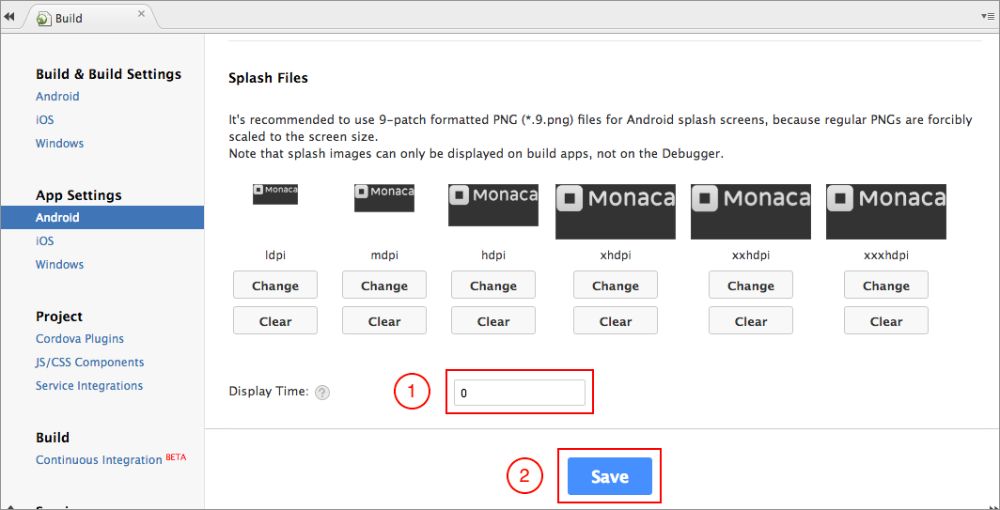
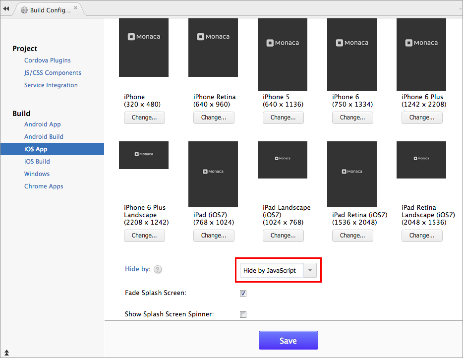

スプラッシュ画像の制御方法
==========================

index.html
ページの読み込み時に、スプラッシュ画像を表示します。スプラッシュ画像を消去する場合は、JavaScript
コード ( `navigator.splashscreen.hide()` ) を使用するか、または、Monaca
クラウド IDE のメニューで設定します。

Monaca クラウド IDE
上のメニューから、スプラッシュ画像を手動で消去する設定を、次に記します。

Android 向けの設定
------------------

1.  Monaca クラウド IDE メニュー上で、 設定 --&gt; Android アプリ設定
    を選択します。
2.  スプラッシュファイルの設定箇所までスクロールします。スプラッシュ画像を非表示（無効）にするには、表示時間を"0"に設定します。
3.  設定を保存します。

> width
>
> :   600px
>
iOS 向けの設定
--------------

1.  Monaca クラウド IDE メニュー上で、 設定 --&gt; iOS アプリ設定
    を選択します。
2.  \[ スプラッシュ画像 \]
    項目まで移動します。スプラッシュ画像の消去方法は、2 通りあります (
    \[ 自動的に閉じる \]、または、\[ JavaScript で閉じる \] )。\[
    JavaScript で閉じる \] を選択した場合、
    `navigator.splashscreen.hide()` 関数を、JavaScript
    ファイル内で使用します。
3.  設定を保存します。

> width
>
> :   600px
>

