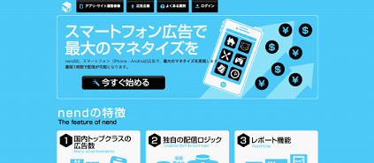
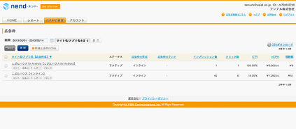
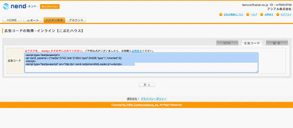
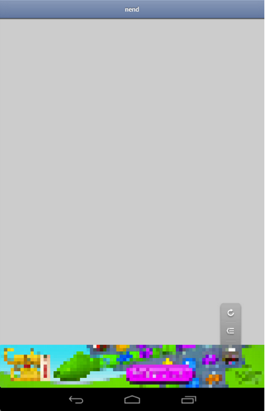

> Attention to English-speaking users: Information on this page is aimed to users in Japan or using Japanese context. Please use [Google Translate](http://translate.google.com/#ja/en/) to read this page in your language.

Monacaで開発したアプリには、WebView上に表示できるものであれば広告ネットワーク各社が提供している広告を掲載することができます。
Monacaの利用規約ではアプリ内広告の表示について特に規制・条件は設けておりませんので、利用に際しては広告ネットワーク各社の規約等を確認の上ご利用ください。

Monacaアプリ上に掲載できる広告ネットワークサービスの例として、株式会社ファンコミュニケーションズ様提供の
[nend](http://nend.net/)
とMonacaアプリへの広告掲載の方法を紹介します。なお、以下の手順は2013年5月現在のものです。

(1) nendへの掲載アプリ審査登録

> [nendのサイト](http://nend.net/)
> から、左上の「アプリ・サイト運営者様」→「今すぐ始める」と進み、メディアパートナーとして登録、サイト/アプリを登録申請します。
>
> 
>
> > class
> >
> > :   leftfit
> >
(2) nendの広告コードの取得

> サイト/アプリの審査後、管理画面から「広告枠の管理」→「広告枠」で登録したサイト/アプリを表示します。
>
> 
>
> > class
> >
> > :   leftfit
> >
> サイト/アプリ名の下にある「広告コード」をクリックすると広告掲載用のコードが表示されますので、そのコードをコピーしておきます。
>
> 
>
> > class
> >
> > :   leftfit
> >
(3) Monacaアプリへの広告コードの埋め込み

> nendの広告コードの例を下記に示します。(xxx...はダミーです。ここには実際のコードが埋め込まれます。)
>
> 広告コードはiOS用とAndroid用で異なります。
> アプリがそれぞれのOS専用の場合は、上記コードをそのままアプリに埋め込んでもかまいせん。iOS/Androidアプリそれぞれに共通のソースコードとする場合は、
> nend\_params
> を設定している部分を、OS毎に切り替えるようにソースを記述する必要があります。
>
> ``` {.sourceCode .html}
> <head>
> <meta name="viewport" content="width=device-width, height=device-height, initial-scale=1, maximum-scale=1, user-scalable=no">
> <script src="components/loader.js"></script>
> <script>
>
>   var nend_params;
>
>   //iOS/Androidアプリそれぞれに共通のコードとする場合は下記のように処理を切り分けます。
>   if( monaca.isIOS ){
>     nend_params = {"media":xxxx,"site":xxxxx,"spot":xxxxx,"type":x,"oriented":x}; // iOS
>   }
>   if( monaca.isAndroid ){
>     nend_params = {"media":xxxx,"site":xxxxx,"spot":xxxxx,"type":x,"oriented":x}; // Android
>   }
>
>
>   //広告をタップするとそのままリンク先を開いてしまうことがありますので、その対策を記述します。
>   window.addEventListener('load', function() {
>     var nend_links = document.querySelectorAll('.nend_wrapper a');
>     for(var i = 0; i < nend_links.length; i+=1){
>       (function() {
>         var href = nend_links[i].href;
>         nend_links[i].href = "#";
>         nend_links[i].onclick = function(){window.open(href); return false;}
>       })();
>     }
>   });
> </script>
> </head>
>
> <!--広告を貼付けたい箇所に下記のコードを記入します-->
> <div class="nend_wrapper"><script src="http://js1.nend.net/js/nendAdLoader.js"></script></div>
> ```
>
> 問題なくアプリに組み込まれた場合、下記例のように広告が表示されます。
>
> 
>
> > class
> >
> > :   leftfit
> >
Onsen UIアプリでのnend広告の表示
--------------------------------

Onsen UIアプリではSPA (シングルページアプリケーション)
というUI構造が採用されているため、通常のようにbodyタグ直下に広告を表示しようとしてもできないことがあります。これを回避するためにはDOM操作を行い、nendの広告をSPAのページ上に表示するコードを記述する必要があります。

具体的には下記のように行います。

### A: (AngularJS1.xを用いる場合)

``` {.sourceCode .html}
<!-- index.html -->
<html ng-app="myApp">
　<head>
```

> 　　 &lt;meta charset="utf-8"&gt; 　　 &lt;meta name="viewport"
> content="width=device-width, initial-scale=1, maximum-scale=1,
> user-scalable=no"&gt; 　　 &lt;script
> src="components/loader.js"&gt;&lt;/script&gt; 　　 &lt;link
> rel="stylesheet" href="components/loader.css"&gt; 　　 &lt;link
> rel="stylesheet" href="css/style.css"&gt; 　　 &lt;script&gt; var
> nend\_params =
> {"media":xxxx,"site":xxxx,"spot":xxxx,"type":xxxx,"oriented":xxxx};
> var app = angular.module('myApp', \['onsen'\]);
>
> > app.directive('nendAdInjector', function () {
> >
> > :   
> >
> >     return {
> >
> >     :   
> >
> >         link : function(scope, element) {
> >
> >         :   var nendOriginalElem =
> >             angular.element(document.querySelector('\#nend\_wrapper'));
> >             element.replaceWith(nendOriginalElem.clone());
> >
> >         }
> >
> >     }
> >
> > });
>
> > &lt;/script&gt;
>
> > &lt;/head&gt; &lt;body&gt; &lt;ons-navigator var="myNavigator"
> > page="page1.html"&gt;&lt;/ons-navigator&gt; &lt;div
> > id="nend\_wrapper"&gt;&lt;script type="text/javascript"
> > src="<http://js1.nend.net/js/nendAdLoader.js>"&gt;&lt;/script&gt;&lt;/div&gt;
> > &lt;/body&gt;
>
> > &lt;/html&gt;
> >
> > &lt;!-- page1.html --&gt; &lt;ons-page&gt;
> > &lt;nend-ad-injector&gt;&lt;/nend-ad-injector&gt; &lt;/ons-page&gt;

### B: (AngularJSを用いない場合)

``` {.sourceCode .html}
<!-- index.html -->
<html>
  <head>
    <meta charset="utf-8">
    <meta name="viewport" content="width=device-width, initial-scale=1, maximum-scale=1, user-scalable=no">
    <script src="components/loader.js"></script>
    <link rel="stylesheet" href="components/loader.css">
    <link rel="stylesheet" href="css/style.css">
    <script>
      ons.bootstrap();
      var nend_params = {"media":xxxx,"site":xxxx,"spot":xxxx,"type":xxxx,"oriented":xxxx};
      ons.ready(function() {
          var nendOriginalElem = angular.element(document.querySelector('#nend_wrapper'));
          var nendInjectElem1 = angular.element(document.querySelector('#new_nend_wrapper'));
          nendInjectElem1.replaceWith(nendOriginalElem.clone());
      });
    </script>
  </head>
  <body>
    <ons-navigator var="myNavigator" page="page1.html"></ons-navigator>
    <div id="nend_wrapper"><script type="text/javascript" src="http://js1.nend.net/js/nendAdLoader.js"></script></div>
  </body>
</html>

<!-- page1.html -->
<ons-page>
  <div id="new_nend_wrapper"></div>
</ons-page>
```
